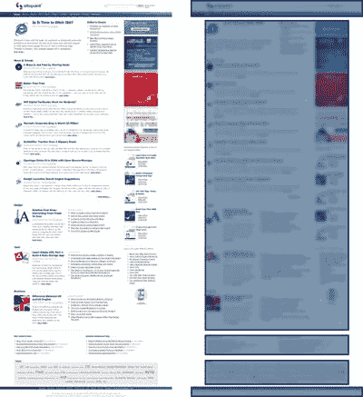
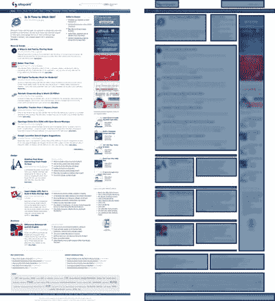
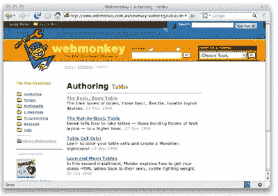
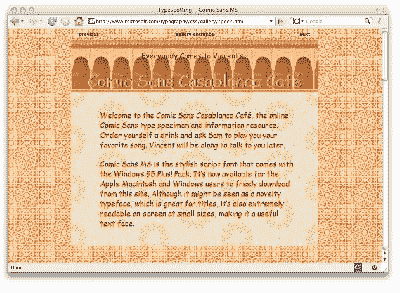
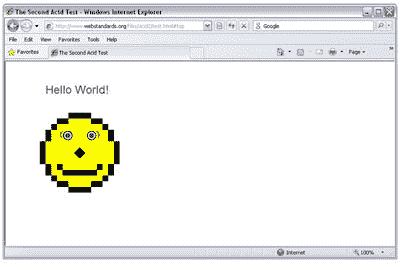

# CSS 的问题是…

> 原文：<https://www.sitepoint.com/the-problem-with-css-is/>

***我是个幻想家。我超越了我的时代。问题是，我只领先一个半小时。*
——乔治·卡林**

CSS 的问题是 CSS 太硬了。

那里。我们很容易就解决了这个问题，不是吗？你可以跳到开创性新标题的第二章，[你所知道的关于 CSS 的一切都是错误的！](https://www.sitepoint.com/books/csswrong1/)

好吧，也许这有点不公平。在大多数情况下，级联样式表(CSS)技术以其优雅和简单而著称。它给了网页设计者一种语言来描述一种一致的视觉处理，这种处理可以应用于一个页面，一个完整的网站，甚至是一堆网站。是的，CSS 在最初被创建的时候是领先于它的时代的，但是它并没有保持很长时间。

由于 CSS 是在大多数网站的设计看起来仍然很简单的时代构思出来的，它的创造者无法预料到它最终被要求描述的设计的丰富性和复杂性。因此，网络无情地前进，而 CSS 奋力追赶。聪明的设计师想出了让 CSS 做他们需要做的事情的方法，但是这些技术太复杂了，以至于我们其他人很快就很难掌握。

这些技术也相当脆弱。由于他们以创造性和意想不到的方式使用 CSS 特性，他们的使用倾向于暴露 CSS 在每个主流浏览器中支持的微妙的不一致性和局限性。今天，即使是最有经验的设计师也经常看到他们的网站由于内容的细微变化或新浏览器的发布而以新的和不可预测的方式崩溃。

对于那些想出这些常常令人难以置信的技术的创意精英来说，CSS 可以提供一个令人激动和不断令人惊讶的工作环境。但是对于初学设计他们的第一个网站的人来说，今天的 CSS 非常难以使用。CSS 就是太难了。

好消息是，这一切都将改变。

无论你认为自己是一个 CSS 布局专家，以前试图学习 CSS 布局技术并在挫折中放弃，或者只是第一次探索 CSS，*你所知道的关于 CSS 的一切都是错误的*。

##### 网格是关键

无论好坏，大多数网页设计都是基于二维(2D)网格的。天才设计师有办法让这些基于网格的设计看起来不那么“四四方方”，但除了极少数例外，网格总是在褶边和毛皮下面。

不幸的是，CSS 不是用来描述 2D 网格的。相反，CSS 假设每个页面都是由垂直堆叠的块组成的，每个块都包含另一个块的堆叠，或者包含适合块的文本(称为内联内容)。

拿图 1.1 来说， [SitePoint 主页](https://www.sitepoint.com/)。该页面分为页眉、页脚和正文内容。这些组件中的每一个都是一个块；如果一个给定的块没有占据浏览器窗口的整个宽度，剩下的空间将在两边显示为空白。这个例子展示了 CSS 被设计来描述的一维布局的种类；如果这就是网站布局的全部内容，那么，CSS 完全可以用来描述它，我也不会写这本书了！

当然，*并不是 sitepoint.com 布局的全部，一堆垂直的方块也不足以描述过去十年设计的任何网页。毫无疑问，当设计一个网站时，你需要并排排列各个区块。*

让我们更仔细地看看 SitePoint 主页的结构。在图 1.2 中，您可以看到描述页面布局的网格。特别是，请注意与另一个块并排放置的块的数量。每一个都代表了页面的一个元素，这需要设计者使用某种程度的技巧来让 CSS 做一些它没有被设计去做的事情。

当许多设计师坐下来设计一个新网站时，他们首先要做的一件事就是画一个网格。试着访问几个你最喜欢的网站——玩一点“定位网格”通常不难看出。

在像 Internet Explorer 3 这样的早期浏览器添加了对 CSS 的支持后不久，设计师们就非常清楚地意识到 CSS 无法胜任构建 2D 网格的任务，而这些网格是实现他们想要的丰富布局所必需的。然而，老式的 HTML 提供了一个显然可以完成这项工作的特性:HTML 表格。

##### 桌子很管用

设计者抓住 HTML 表格元素作为页面布局工具。设计师们发现，他们可以将页面块粘贴到表格单元格中，形成他们渴望的二维网格，而不是将其保留用于指定用途——显示类似电子表格的数据表格。

当 table 元素在 1997 年成为 HTML 3.2 的官方规范时，它已经被广泛地用作页面布局设备，从 Netscape 1.1 和 Internet Explorer 1 开始就包含在 web 浏览器中。参见图 1.3，一个早期表格教程的例子。

HTML 语言最初是为了描述学术文档的结构，现在被用作页面布局语言——这种用法完全不适合它。然而，它奏效了；在那个时候，这比使用 CSS 的页面布局更重要。

当设计师们忙于处理 HTML 表格时，网络上最聪明的头脑明白有些事情必须改变。网络不仅可以在台式电脑的大屏幕上显示和导航，还可以在屏幕更小的便携式设备上、在为视力障碍者设计的非视觉浏览器上，以及由搜索引擎和其他在网络上搜索信息的计算机程序来显示和导航。但是，只要像 table 这样的 HTML 元素被用来实现可视化布局任务，而不是提供可以由非可视化浏览器传达的有意义的信息，这种潜力就永远不会实现。

在设计界，许多聪明的设计师也看到了这种潜力。通过多年的实验，他们找到了让 CSS 超越其有限范围的方法。正如我们将在第 2 章 CSS 表格布局中看到的，绝对定位和浮动块等功能可以用来迫使块与其他块并排放置——这是它的创造者从未想到过的。

这些技术形成了许多关于 CSS 的书籍的基础，包括我自己以前的几本书，如 *[HTML Utopia:使用 CSS 设计无表，第二版](https://www.sitepoint.com/books/css2/)* 。尽管这些功能已经过测试，并在今天大多数专业设计的网站上使用，但我不会将它们描述为稳定、可预测或易于使用。

但是现在在 CSS 的世界中有一个新的到来——它将使那些书籍过时，并将 CSS 布局的神秘艺术转变为几乎任何人都容易采用的简单规则。

##### CSS 和浏览器大战

那么是什么让设计师们这么多年都没有接受 CSS 页面布局呢？嗯，不是 CSS 最初的缺点。这是因为 CSS 无法快速发展以满足网页设计者的需求。

更具体地说，web 浏览器中 CSS *支持*的状态没有跟上。

更具体地说，当其他主流浏览器继续努力改进 CSS 的布局功能时，Internet Explorer 却掉了球，固步自封。

**早期浏览器对 CSS 的支持**

1996 年 8 月 14 日发布的 Internet Explorer 3 是第一款支持新兴 CSS 规范 t 1 的商业浏览器。微软发布了一个 CSS 图库，如图 1.4 所示，目的是展示 CSS 支持的一些新的布局控件。

回想起来，在这一点上进展如此之快真是令人惊讶。微软宣布 CSS 将成为 Internet Explorer 3 的一部分，尽管关于 Web 上应该使用哪种样式表语言的讨论仍在进行中。此外，在万维网联盟(W3C)发布官方推荐标准之前，微软已经在浏览器中实现了这种语言。

起初，微软的主要竞争对手 Netscape 对 CSS 持观望态度，而是专注于扩展 HTML，在浏览器的每个版本中添加新的标签。例如，Netscape 在 1995 年 9 月向 W3C 提交了它对框架的建议，但是在对增加的内容进行任何真正的讨论之前，就在浏览器中实现了这个想法。

这种持续不断的创新和推动浏览器功能的动力刺激了网络的发展，增强了网页作者和设计者的能动性。然而，给网络浏览器添加功能实际上需要改变网络本身的路径，两个浏览器供应商试图以不同的方式实现这一点会带来麻烦。

1997 年见证了第 4 版浏览器的推出……以及浏览器大战的开始。

**第 4 版浏览器**

网景 4 于 1997 年 6 月发布，而 Internet Explorer 4 的发布略晚于 10 月。两种浏览器都提供了对 CSS1 规范的合理支持，至少在设计文本样式方面是如此，开发人员也可以开始使用 CSS 了。开发人员采用 CSS 的最基本部分相对较快，尤其是因为 Netscape 和 Internet Explorer 4 都支持动态 HTML(DHTML)——使用 JavaScript 来操作页面和 CSS 的文档对象模型。

网景作为早期网络浏览器的遗产开始显现。微软已经为 IE4 重建了渲染引擎——使用 Trident 引擎，该引擎继续在 IE8 及 IE8 以下的浏览器中使用——而网景在现有浏览器代码基础上增加了 CSS 和 DHTML 支持。这意味着随着开发人员在版本 4 的浏览器中推进 CSS 的极限，大量奇怪的错误开始出现。

Internet Explorer 开始从 Netscape 那里吸引市场份额；1999 年 IE5 的发布巩固了这一趋势，它对 CSS 的支持有了很大的改进。到 2000 年初，IE 已经占据了超过 50%的浏览器市场份额。

**Internet Explorer 6 和长时间睡眠**

Internet Explorer 6 于 2001 年 8 月发布，随着 IE5 确立的统治地位——以及对基于 Gecko 的新 Netscape 6 的普遍缺乏兴趣——微软在浏览器战争中的最终胜利是有保证的。

Internet Explorer 6 在当时是一款不错的浏览器。它对 CSS 的支持已经足够成熟，对于执着的设计者来说，如果他们把这种支持推到极限，就能够完成大多数页面布局任务。有一些奇怪的错误，但对于我们这些与网景 4 斗争多年的人来说，它们似乎相当微不足道。微软甚至为麦金塔电脑发布了一个版本的 Internet Explorer 5，它拥有一个全新的渲染引擎，比任何以前的微软浏览器都具有更好的 CSS 支持。与此同时，W3C 正致力于定义 CSS 的附加物，承诺使页面布局变得不在话下。未来是光明的。

问题是微软接下来做了什么，或者没做什么。微软开发了一款让网络开发人员相对满意的浏览器，让他们可以做他们当时认为需要做的大部分事情，并有效地赢得了浏览器大战，微软停止了浏览器开发，并将团队成员重新分配到其他项目。Internet Explorer 睡着了。

一旦 IE 的休眠变得明显，我们中的许多人认为普通大众会开始转向其他浏览器。基于 Mozilla 的 Firefox 出现了，比 Netscape 曾经管理过的更轻量级和更健壮。Opera 开发了一款具有出色 CSS 支持和许多其他功能的浏览器，比如第一个选项卡式浏览界面。然而，一般人认为蓝色的“e”是互联网。微软仅仅将 ie 浏览器作为操作系统的一部分——访问互联网的部分——开发出来，以至于即使是现在，许多普通网络用户在得知还有其他浏览器选项时也会感到惊讶。

由于对 Internet Explorer 停滞不前感到失望，web 开发社区采用了 Firefox 等替代浏览器，并很快指出 IE6 的不足之处。随着苹果新开发的 Safari 浏览器 Firefox 和斗志昂扬的新贵 Opera 在每个版本中都改进了浏览器，添加了 CSS2.1 中未实现的部分并修复了有问题的 bug，IE6 没有得到改进以提供同等程度的标准合规性，这让各地的 web 设计师越来越沮丧。

Firefox 开始在市场份额的竞争中接近微软，到 2007 年 7 月达到 11%左右的市场份额，并且没有放缓的迹象。这种增长部分是由于网络社区的宣传和强大的营销活动，但也是因为 Internet Explorer 6 报告的安全问题越来越多。为了获得如此大的市场份额，火狐的流行显然已经超越了网页设计社区。作为回应，微软在 2005 年 2 月宣布将发布新版本的 Internet Explorer。IE7 的第一个测试版于 2005 年 7 月推出——在 IE7 发布近四年后。

##### Internet Explorer 8 改变了游戏规则

微软宣布它已经恢复了 Internet Explorer 的开发，这引起了一个支持 web 标准的草根组织的注意:Web 标准项目。这个标准团体看到了游说微软加入 CSS 特性的机会，这些特性需要让任何人都可以实现页面布局，而不仅仅是坚持不懈的专家。因此，2005 年 4 月 12 日，见证了 T2 酸 2 测试的诞生。

该测试旨在测试浏览器中的 CSS1 兼容性，就像最初的 [Acid 测试](https://www.w3.org/Style/CSS/Test/CSS1/current/test5526c.htm)一样。最初的 Acid 测试成功地展示了当时浏览器的局限性，并展示了如果消除这些局限性会有什么样的结果。这一次，焦点是 CSS2。测试作者(Opera 软件的首席技术官)kon Wium Lie 通过 [ZDNet 文章](http://news.zdnet.com/2100-9588_22-141817.html)挑战微软发布符合测试标准的浏览器 Internet Explorer 7。

当时，没有浏览器完全满足这个测试的要求，但是从结果来看，Internet Explorer 是最差的。到那年年底，Safari、Opera 和 Linux/KDE 浏览器 Konqueror 都发布了支持 Acid2 的版本。

Internet Explorer 7 最终于 2007 年 10 月 18 日发布—*不支持 Acid2 测试的功能。Acid2 支持对于微软来说是一个巨大的飞跃，但它已经取得了显著的进步。一些真正奇怪的错误已经被修复，一些来自 CSS2.1 规范的有用的 CSS 属性现在出现在浏览器中。无论你喜欢还是讨厌浏览器，IE7 的发布意味着微软重返游戏——浏览器试图以有意义的方式支持网络标准。*

与此同时，开发人员正在他们的个人网站上积极推广 Firefox 等浏览器。设计师通常会添加一些只有在非 IE 浏览器中才能看到的小细节。每个人都在问，如果 Internet Explorer 重新休眠——现在 IE7 已经推出，并处理了针对 IE6 的一些最大的批评——我们是否能够享受到更全面地实现 CSS2.1 带来的一些创新，更不用说 CSS3 了？

令人欣慰的是，在 IE7 发布后，网络社区没有等待太长时间，就发现 Internet Explorer 的另一个版本正在开发中。2007 年 12 月，IEBlog 证实了 Internet Explorer 8 的存在。12 月 19 日，[ie blog](http://blogs.msdn.com/ie/archive/2007/12/19/internet-explorer-8-and-acid2-a-milestone.aspx)上的一篇文章证实，IE8 正确地完成了 Acid2 测试，让世界各地的 web 开发人员知道，我们渴望已久的 CSS2 属性最终将成为 Internet Explorer 8 的一部分。

2008 年 3 月，Internet Explorer 8 的第一个测试版发布后，我们就可以亲眼目睹了 Acid2 测试通过的笑脸，如图 1.5 所示！

一个几乎完全支持 CSS2 的 Internet Explorer 提供了巨大的可能性。到目前为止，为主流用户构建网站的设计师不得不避开 CSS2 功能，这些功能可以使页面布局稳定、可预测、更容易，只是因为 Internet Explorer 不支持它们。IE8 完全改变了游戏规则。

##### 我们的交易

多年来，我们在 web 设计社区中一直哀叹 Internet Explorer 中 CSS 支持的状态，以及它提供给我们的有限的(在许多情况下，有缺陷的)工具集。CSS 的页面布局是一种黑色艺术，即使对于最有经验的从业者来说，也很少能完美、可预测或可靠地工作。

在 Internet Explorer 长眠之后，微软终于推出了通过 Acid2 测试的浏览器，为我们提供了所有我们需要的工具。随着 IE8 即将发布，微软已经履行了自己的承诺；现在是时候实现我们的梦想了。

当 Internet Explorer 处于休眠状态时，是时候抛弃我们如此努力开发的晦涩难懂的 CSS 布局技术了。是时候让我们所有人学习并开始使用新的 CSS 了，以免 Internet Explorer 认为是时候再打个盹了。是时候拥抱网页设计实践的新方式了，抓住 IE8 现在加入其他主要浏览器支持的新特性。是时候让那些刚刚开始学习设计网页的初学者知道 CSS *不再是太难了。*

在下一章，我将向你展示 IE8 中一个特殊的 CSS 新特性是如何让最普通的 CSS 页面布局任务变得轻而易举的。你可以通过购买这本书继续阅读[你所知道的关于 CSS 的一切都是错的！](https://www.sitepoint.com/books/csswrong1/)，现已在 sitepoint.com 发售。

*图片来源:[马托克斯](http://www.sxc.hu/profile/Mattox)*

## 分享这篇文章