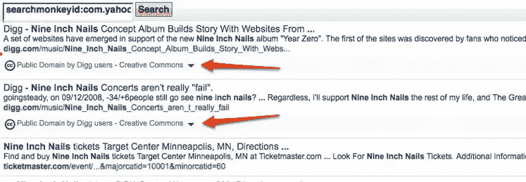

# POWDER——一个更加个性化、值得信赖的网站

> 原文：<https://www.sitepoint.com/powder-more-personal-more-trustworthy-web/>

我一直在关注[粉](https://www.w3.org/2007/powder/)团在做什么，但从来没有花足够的时间*实际*阅读和思考它。

那么，雅虎是什么？这有什么关系？

引起我注意的是最近一篇给粉群的关于雅虎举办的拓展日的博文。。嗯……我想。为什么是雅虎！对粉感兴趣？POWDER 是一种极客的方式，它允许你在元数据之上添加元数据，等等等等…它对一个主要的网络玩家有什么好处？

他们在语义网搜索方面做了很多工作(search monkey——微格式、RDFa、RSS 数据源),他们是一家非常有前瞻性的公司。所以，一定有什么事情正在发生。

**让网络更加相关**

所以，我读了这篇博文，点了几个链接，我恍然大悟。粉不是极客，是让网络更个性化，更相关，更值得信赖。任何搜索引擎都会热衷的东西。就此而言，任何内容提供商；从小网络出版商到大男孩和女孩。

个人网络用户也能从中获益良多。你不再局限于社交网络中的“相关性”。这种相关性可能是可疑的——封闭的社交网络并不完全是开放信息的顶峰。不管他们有多大！

**粉？**

POWDER 是 W3C 的一个倡议，允许你描述在线资源。什么是在线资源……嗯，任何可以在网上引用的东西——网页、文档、视频、音乐，任何东西。一旦描述了内容，就可以根据声明对其进行分组和验证。信任！

**粉能做什么？**

它有许多组件。我认为与 SitePoint 社区高度相关的是:

*   **分组**。与其标记单个项目，不如将它们视为内容组，并作为一个整体进行描述。这使得更新不那么痛苦，并允许基于模式对内容进行分组的强大方法。
*   **仅在相关时下载**。如果不是你想的那样，不要下载整个 PDF 或视频。也许你想打印 PDF，但它不允许打印——忽略这个问题！
*   **轮廓匹配**。这个有手机版吗？可以访问吗？ [NSFW](http://tommorris.org/profiles/nsfw "Not Safe for Work") ？儿童友好型？如果没有，扔掉它！
*   **语义标注**。基于地理位置返回结果，消除标签歧义，你到底是什么意思？等。
*   **信任**。自动验证上述声明，如果它不符合您的要求，扔掉它！:)

那很好，但那又怎样？

好吧好吧。你怎么能真正使用这些东西呢？一个例子是通过 RDFa 将这些信息嵌入到 HTML 中。它使得发布粉信息更加简单，因为它就在实际的 HTML 旁边。

你现在用所有这些可爱的、隐藏的、将要统治世界的 RDFa 标记做什么呢？你有两种工具可以轻松使用这些数据。和 [Sindice](http://sindice.com/developers/microformat#MicroformatSupport-RDFa) —全球索引 RDFa 的搜索引擎。

**正常人怎么用这个？**

好的，你有一个结构化数据的网络。太好了。你在竞争中领先一步——你就是语义网。太好了。你是一个大师。搜索引擎喜欢你，但是你如何让它对浏览者有用呢？

使用雅虎的增强搜索结果！。这里有一个来自知识共享的例子。知识共享最近开始用 RDFa 标记他们的许可证。因此，在雅虎上进行搜索可以很容易地揭示许可证信息。

**进一步的可能性**

想象一下上面的例子，它向用户展示了搜索结果与他们的屏幕阅读器兼容，网站被认证为遵循可访问性指南，或者它遵循 W3C [mobileOK](https://www.w3.org/Mobile/) 标准。

搜索结果不仅可以突出这些东西，用户实际上可以“限制”他们的结果，以确保这些东西都在适当的位置。这是强大的。

哦，如果你想知道的话——POWDER 代表“网络描述资源协议”。

## 分享这篇文章