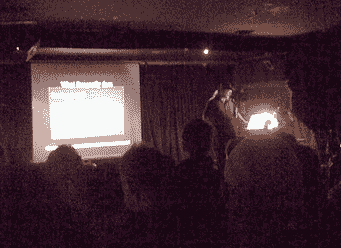

# WebJam 8:闻起来像极客烈酒(和啤酒)

> 原文：<https://www.sitepoint.com/webjam08-smells-like-geek-spirits/>

那么，在 [Web Directions South](http://south08.webdirections.org/) 度过漫长而忙碌的一天后，你会做些什么来放松自己呢？

为什么，你会在酒吧里听更多的极客演讲者，当然，只是这次有更多的酒和更少的注意力持续时间——在百老汇酒吧里，T2·拉克伦·哈迪做着出色的乐队指挥工作。

如果你还不熟悉 Webjam 格式，大概是这样的:

*   15-20 名发言人
*   每人 3 分钟来展示、解释和/或演示你的酷新玩意
*   一个短信投票系统，让投注者选择最佳介绍

总之就是狂热，形式自由，搞笑。一些更酷的东西包括:

**[双熊](http://tweetbeer.com/)**

Tweetbeer 是一个 twitter 界面，用于跟踪谁欠你的啤酒(以及你欠谁的啤酒)。不幸的是，现在还没有能力偿还你的啤酒债务。

**马帕努伊**

Mapanui 是一个地图应用程序，它有两个方面。首先，你可以使用 Mapanui 书签工具在*任何*站点的*任何*地址上生成一个浮动地图(只需将链接拖到你浏览器的书签栏)。

其次，Mapanui 通过创建虚拟地址卡，为您提供了一种简单、无缝的方法来将地图添加到您自己的网站。

如此简单和无缝，事实上，我在大约 25 秒内就在这个页面中嵌入了一个。

还在测试阶段，但是非常好。

拉斐尔

Dmitry Baranovskiy 在 Web vector graphics 上做了一个很棒的第一天演示，Webjam 是他展示自己新的 Web vector 库的机会。

RaphaelJS 是一个 JavaScript 库 include，它使用 canvas、SVG 和 VML 的组合——取决于浏览器——在屏幕上呈现矢量形状。

虽然 RaphaelJS 仍然是新的，还处于测试阶段，但它似乎已经比当前的同类产品(特别是 [ExCanvas](http://excanvas.sourceforge.net/) )有了显著的优势。

极客需求的赢家是…

**turn tublist** 

这太有趣了。议长先生和 T2 展示了一个非常酷的小网络应用程序，它可以让你调出 YouTube 音乐视频播放列表，一次播放两个，并且毫不费力地在它们之间进行交叉渐变——如果你愿意的话，这是一个 musicvid 混搭混搭。

当这些家伙在一扇窗户里的里克·阿斯特利的《永远不会放弃你》和另一扇窗户里的欧洲开创性的《最后倒计时》之间滑行时，人群被迷住了！

尊重。

TurnTubeList 的唯一问题是它完全是客户端的，而且 AFAIK 不能供你下载来享受个人混音乐趣。希望他们能尽快让我们看到这部戏。

距离上一次 Webjam 已经过去了 12 个月，但如果周四晚上的成功是一个指南，那么下一次就不会那么久了。

## 分享这篇文章