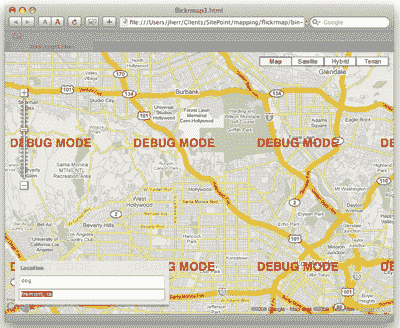
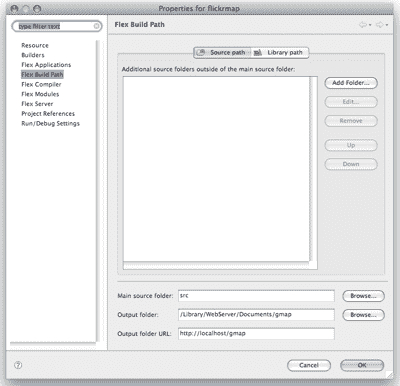
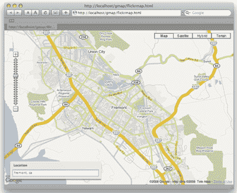
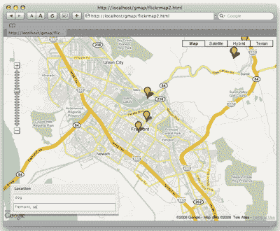
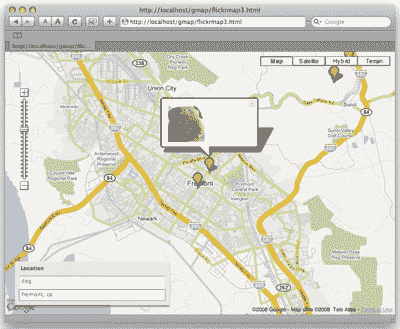
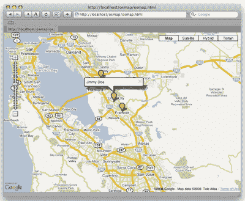

# 使用 Flex 映射 OpenSocial 数据

> 原文：<https://www.sitepoint.com/opensocial-maps-mashup-flex/>

《星际迷航》一直以来都是对未来科技惊人准确的预测。例如，[通信器](http://en.wikipedia.org/wiki/Communicator_(Star_Trek))就是手机的前身。同样，在*星际迷航:下一代*中，星舰*企业号*上的船员佩戴着包含智能位置感知系统的徽章——角色可以向徽章询问他们的位置，并发现他们周围的信息。

今天，执行这种位置感测和绘图的能力正在带来新的应用浪潮，这些应用回答有用的问题，例如:“我在哪里？”，“谁在附近？”，以及“他们在做什么？”

在本文中，我将向您展示如何结合 Flex/Flash、Google Maps、Flickr 和 OpenSocial 来创建一些很酷的示例应用程序，您可以将它们作为自己开发的基础。如果你想在家玩，你可以下载这篇文章的代码档案。

**注意——最后会有一个[测验](https://www.sitepoint.com/quiz/flex3/opensocial-maps-mashup/)！前 100 名完成测验的人将赢得一本我的书，*开始使用 Flex 3* ，由于 Adobe 的帮助，这本书将免费送到他们的门前。您还可以[在限定时间内免费下载 PDF 格式的书籍](https://www.sitepoint.com/quiz/flex3/opensocial-maps-mashup/)。**

##### 入门指南

如果你以前没有玩过 Flex，它是一个使用 MXML(一种基于 XML 的标记语言)和 ActionScript 在 Flash 中构建富互联网应用程序的平台。编译器和框架都是开源的，你可以直接从 Adobe 下载那些 [**。您也可以从 Adobe 下载 Flex Builder 3 IDE**](http://ad.doubleclick.net/clk;207716346;29856642;r#sdk) 进行试用。Flex Builder 绝对是开发 Flex 应用程序最简单的方法，因为它支持语法高亮显示、代码查找以及专业编程编辑器应有的所有现代功能。如果你刚刚开始，我推荐你阅读[这份初学者 Flex 教程](https://www.sitepoint.com/article/beginners-tutorial-flex-3/)。

谷歌地图是一个你可能已经很熟悉的网站，但你可能不知道还有一个谷歌地图的 [Flash 版本，它支持与 JavaScript 版本相同的 API。这是我们将在这些例子中使用的版本。](http://code.google.com/apis/maps/documentation/flash/)

在我们开始之前，你需要获得 [Flickr](http://www.flickr.com/services/api/keys/apply/) 和[谷歌地图](http://code.google.com/apis/maps/signup.html)的 API 密匙，如果你还没有的话。Google Maps API 应用程序流程要求您输入请求地图的站点的 URL。我们将在本地机器上运行这个应用程序——至少最初是这样——所以我建议使用 URL`http://localhost/`。

##### 显示地图

首先，让我们创建一个简单嵌入 Google 地图的小型 Flex 应用程序。该应用程序的代码如下所示:

```
**Listing 1\. Flickrmap.mxml** 

<?xml version="1.0" encoding="utf-8"?> 

<mx:Application xmlns:mx="http://www.adobe.com/2006/mxml" layout="absolute" 

  creationComplete="onStartup()"> 

<mx:Script> 

<![CDATA[ 

import com.google.maps.services.GeocodingEvent; 

import com.google.maps.services.ClientGeocoder; 

import com.google.maps.controls.ZoomControl; 

import com.google.maps.controls.MapTypeControl; 

import com.google.maps.MapEvent; 

import com.google.maps.LatLng; 

import com.google.maps.Map; 

import mx.core.UIComponent; 

private var map:Map = new Map(); 

private function onStartup() : void { 

  var uic:UIComponent = new UIComponent(); 

  uic.setStyle( 'top', 0 ); 

  uic.setStyle( 'left', 0 ); 

  uic.width = width; 

  uic.height = height; 

  addChildAt( uic, 0 ); 

  map.key = 'Your Google Maps Key'; 

  map.width = width; 

  map.height = height; 

  map.addEventListener( MapEvent.MAP_READY, onMapReady ); 

  uic.addChild( map ); 

  locPanel.setStyle( 'top', height - locPanel.height - 20 ); 

} 

private function onMapReady( event:MapEvent ) : void { 

  map.setCenter( new LatLng( 34.101509, -118.32691 ) ); 

  map.setZoom( 12 ); 

  map.addControl( new MapTypeControl() ); 

  map.addControl( new ZoomControl() ); 

} 

private function onGeocodeSuccess( event:GeocodingEvent ) : void { 

  map.setCenter( event.response.placemarks[0].point ); 

} 

private function onKeyDown( event:KeyboardEvent ) : void { 

  if ( event.keyCode == Keyboard.ENTER ) { 

    var cg:ClientGeocoder = new ClientGeocoder( "USA" ); 

    cg.addEventListener( GeocodingEvent.GEOCODING_SUCCESS, onGeocodeSuccess ); 

    cg.geocode( loc.text ); 

  } 

} 

]]> 

</mx:Script> 

<mx:Panel id="locPanel" title="Location" top="500" left="20" borderAlpha="0.95"> 

  <mx:TextInput id="loc" keyDown="onKeyDown( event )" width="300" text="fremont, ca" /> 

</mx:Panel> 

</mx:Application>
```

在`onStartup`方法中，我们创建映射并注册一个事件处理程序来监听`MAP_READY`消息。一旦检测到该消息，我们就调用`onMapReady`方法，向地图添加一些控件。

用户界面由一个文本输入字段组成，用户可以在其中输入街道地址。我们的应用程序通过`keyDown`属性监控这个字段的变化；当用户按下*回车键*(Mac 上的*回车键*)时，我们对输入的地址执行地理编码查找。执行地理编码查找(通常简称为地理编码)需要一个地址并返回纬度和经度。当这个过程成功时，调用`onGeocodeSuccess`方法，Google 已经为我们提供了一个有效的纬度和经度对。然后，我们基于这个地理坐标将地图居中。

让我们看看我们的应用程序是否有效。从 Flex Builder 启动代码，您应该会看到类似于图 1 中的图像。



等等——为什么“调试模式”这个词贴满了我们的地图？谁说调试模式了？

原来 Google Maps 键与一个 URL 相关联，我们给它的 URL 是`http://localhost/`。然而，我们的应用程序当前运行的 URL 是一个指向磁盘上某个位置的文件 URL。

我们需要做的是调整我们的项目设置，以便 Flex Builder 将编译后的 SWF 文件等放在本地 web 服务器目录中。如果您在 Windows 上运行，这可能意味着将它们存储在`c:inetpubwwwroot`(对于 IIS web 服务器)或`c:apachehtdocs`(对于 Apache)中的某个地方。在苹果电脑上，这些文件可以放在`~/Sites`或`/Library/WebServer/Documents`中。

您需要在项目设置中更改的两个设置是输出文件夹和输出文件夹 URL，前者是我们希望 Flex Builder 复制文件的位置，后者是 web 服务器上该文件夹的 URL。这些文本字段如图 2 所示。



完成这些更改后，重新启动应用程序。您应该会看到类似于图 3 所示的图像。



现在，当用户在位置输入字段中键入一个值后按下 *Enter* 时，我们的应用程序运行地理编码，并将地图的中心设置为键入的值——在上面的示例中，是加利福尼亚州的弗里蒙特。

##### 添加 Flickr 结果

下一步是为我们的应用程序添加与 Flickr web 服务器通信的功能。具体来说，我们在寻找与我们地图的当前纬度和经度相对应的图像。Flickr 最酷的一点是它的许多图片都有地理标签。这意味着我们可以向 Flickr 提供纬度、经度和半径，它将返回在这些参数指定的区域内拍摄的精选照片。

Flex 有一个 Flickr 库，但是它目前不支持地理标记 API。在下面的代码中，我使用 Flex HTTP 服务直接查询了 Flickr REST API:

```
**Listing 2\. The Flickr Mapping application**  

<?xml version="1.0" encoding="utf-8"?>  

<mx:Application xmlns:mx="http://www.adobe.com/2006/mxml" layout="absolute"  

  creationComplete="onStartup()">  

<mx:Script>  

<![CDATA[  

import com.google.maps.overlays.MarkerOptions;  

import com.google.maps.overlays.Marker;  

import mx.rpc.events.ResultEvent;  

import com.google.maps.services.GeocodingEvent;  

import com.google.maps.services.ClientGeocoder;  

import com.google.maps.controls.ZoomControl;  

import com.google.maps.controls.MapTypeControl;  

import com.google.maps.MapEvent;  

import com.google.maps.LatLng;  

import com.google.maps.Map;  

import mx.core.UIComponent;  

private const FLICKR_KEY:String = 'Your Flickr Key';  

private var map:Map = new Map();  

private function createFlickrURL( search:String, lat:Number, lng:Number, radius:Number = 20 ) : String {  

  var query:String = 'http://api.flickr.com/services/rest/?api_key='+FLICKR_KEY;   

  query += '&method=flickr.photos.search&text=dog&extras=geo&lat='+lat+'&lon='+lng+'&radius='+radius;  

  query += '&per_page=100&page=1&sort=date-posted-desc';  

  return query;  

}  

private function onStartup() : void {  

  var uic:UIComponent = new UIComponent();  

  uic.setStyle( 'top', 0 );  

  uic.setStyle( 'left', 0 );  

  uic.width = width;  

  uic.height = height;  

  addChildAt( uic, 0 );  

  map.key = 'Your Google Maps Key';  

  map.width = width;  

  map.height = height;  

  map.addEventListener( MapEvent.MAP_READY, onMapReady );  

  uic.addChild( map );  

  locPanel.setStyle( 'top', height - locPanel.height - 20 );  

}    

private function onMapReady( event:MapEvent ) : void {  

  map.setCenter( new LatLng( 34.101509, -118.32691 ) );  

  map.setZoom( 12 );  

  map.addControl( new MapTypeControl() );  

  map.addControl( new ZoomControl() );  

}  

private function onSearch() : void {  

  flickrSearch.url = createFlickrURL( searchText.text, map.getCenter().lat(), map.getCenter().lng() );  

  flickrSearch.send();  

}  

private function onFlickrResult( event:ResultEvent ) : void {  

  map.clearOverlays();  

  for each( var photo:XML in event.result..photo ) {  

    var pMarker:Marker = new Marker( new LatLng( photo.@latitude, photo.@longitude ),  

      new MarkerOptions( {  

        label:photo.@title,  

        hasShadow:true } ) );  

    map.addOverlay( pMarker );  

  }  

}  

private function onGeocodeSuccess( event:GeocodingEvent ) : void {  

  map.setCenter( event.response.placemarks[0].point );  

  onSearch();  

}  

private function onKeyDown( event:KeyboardEvent ) : void {  

  if ( event.keyCode == Keyboard.ENTER ) {  

    var cg:ClientGeocoder = new ClientGeocoder( "USA" );  

    cg.addEventListener( GeocodingEvent.GEOCODING_SUCCESS, onGeocodeSuccess );  

    cg.geocode( loc.text );  

  }  

}  

]]>  

</mx:Script>  

<mx:HTTPService id="flickrSearch" resultFormat="e4x" result="onFlickrResult(event)" />  

<mx:Panel id="locPanel" title="Location" top="500" left="20" borderAlpha="0.95" layout="vertical">  

  <mx:TextInput id="searchText" keyDown="onKeyDown( event )" width="300" text="dog" />  

  <mx:TextInput id="loc" keyDown="onKeyDown( event )" width="300" text="fremont, ca" />  

</mx:Panel>  

</mx:Application>
```

您会注意到在文件的底部，除了 location 字段之外，我还添加了一个`searchText`字段。除了当前地图位置，这个字段还包含我们将发送到 Flickr 的搜索词。

呈现地图的大部分代码与我们刚才看到的简单示例相比没有变化。当`onGeocodeSuccess`方法调用`onSearch`方法启动 Flickr 搜索时，新的事情就发生了。Flickr 搜索使用了`flickrSearch` HTTP 服务和一个我们使用`createFlickrURL`方法动态生成的 URL。

当我们对 Flickr 的查询返回一组结果(用 XML 表示)时，就会调用`onFlickrResult`方法。这个方法获取 XML 并在 XML 树中查找照片元素。然后，它为每张照片创建一个 Google Maps 标记对象，并将该标记添加到地图中。

图 4 显示了运行这段代码的结果。



事情真的开始走到一起了——我们的用户可以找到给定位置的东西的照片。但是如果他或她真的想看照片呢？

让我们调整代码来添加这个特性:

```
**Listing 3\. The updated code**  

private function createMarker( photo:XML ) : void {  

  var reqUrl:String = 'http://static.flickr.com/'+photo.@server+'/'+photo.@id+'_'+photo.@secret+'_s.jpg';  

  var pMarker:Marker = new Marker( new LatLng( photo.@latitude, photo.@longitude ),  

    new MarkerOptions( {  

    label:photo.@title,  

    tooltip:photo.@title,  

    name: reqUrl,  

      hasShadow:true } ) );  

  pMarker.addEventListener( MapMouseEvent.CLICK, function( event:MapMouseEvent ) : void {  

    pMarker.openInfoWindow( new InfoWindowOptions(  

      { contentHTML: '' } ) );  

  } );  

  map.addOverlay( pMarker );  

}  

private function onFlickrResult( event:ResultEvent ) : void {  

  map.clearOverlays();  

  for each( var photo:XML in event.result..photo )  

    createMarker( photo );  

}
```

在上面的代码中，我们修改了`onFlickrResult`函数，这样它只调用`createMarker`。`createMarker`方法反过来创建一个标记，我们添加了一个事件监听器来检测用户何时点击该标记。当这种情况发生时，我们会在标记上方显示一个小的“信息窗口”。这个类似于语音气泡的信息窗口包含 Flickr 图像的缩略图版本。

图 5 显示了这个缩略图显示代码的运行情况。



所以，我们有了它——我们可以在 Flickr 上制作弗里蒙特的大型狮子狗图片。

现在，如果我们想查看人的图像呢？

##### 映射 OpenSocial

绘制人物地图比绘制地理标记图像更复杂。每一个主要的社交网络(脸书、MySpace、LinkedIn 等)都提供了自己的应用程序接口来搜索人。然而，这些网络正通过一个名为 OpenSocial 的标准逐渐统一起来。

OpenSocial 最初被认为是社交网络应用程序的通用 API。然而，0.8 版本的发布提供了一个 [REST API](http://code.google.com/apis/opensocial/docs/0.8/restfulspec.html) ，您可以使用它来执行对社交网络的查询。

唯一的问题是，到目前为止，还没有主要的社交网站实现 0.8，所以不幸的是，我们还不能利用这个功能。

不要灰心！这是一个令人兴奋的空间，目标在不断变化。那么当你碰壁的时候应该怎么做呢？自己造门！对于这个例子，我们将在 PHP 中创建一个虚拟的 OpenSocial REST 响应。虽然这不允许我们实际执行任何 OpenSocial 查询，但这将是一个概念证明，表明一旦社交网络开始实现 0.8 版本，REST API 肯定会准备就绪，这应该不会太远。

开始了。由于 REST 是一个基于 URL 的 API，我们需要执行一些 URL 重写来将 URL 转换成这样…

```
http://localhost/~jherr/people/@me/self
```

…变成这样:

```
http://localhost/~jherr/index.php?q=/people/@me/@self
```

这项工作的最佳工具是**阿帕奇`mod_rewrite`T5。如果你是第一次接触`mod_rewrite`，看看[这篇综合教程](https://www.sitepoint.com/apache-mod-rewrite-examples/)。确保您已经安装了`mod_rewrite`模块，并将以下代码添加到您的`.htaccess`文件中:**

```
Options +FollowSymLinks   

<IfModule mod_rewrite.c>   

  RewriteEngine on   

  RewriteBase /   

  RewriteCond %{REQUEST_FILENAME} !-f   

  RewriteCond %{REQUEST_FILENAME} !-d   

  RewriteRule ^(.*)$ ~jherr/index.php?q=$1 [L,QSA]   

</IfModule>
```

这将 REST 请求 URL 重写为一个类似于调用我们的`index.php`文件的 URL。

我们的`index.php`文件的代码如下所示:

```
**Listing 4\. The index.php file**   

<?php   

header( 'Content-type: text/xml' );   

?>   

<entry >   

 <content type="application/xml">   

  <person >   

   <name>   

    <unstructured>Jane Doe</unstructured>   

   </name>   

   <about_me>Living in Fremont</about_me>   

   <address>   

    <longitude>-121.987259</longitude>   

    <latitude>37.54987</latitude>   

   </address>   

  </person>   

 </content>   

...   

<title/>   

<updated>2003-12-13T18:30:02Z</updated>   

<author/>   

<id>urn:guid:example.org:34KJDCSKJN2HHF0DW20394</id>   

</entry>
```

对于这个演示，我们已经手动创建了一个人，并以 XML OpenSocial 0.8 XML 格式组织了他们的数据。在一个或多个社交网络应用程序支持这个版本之前，您需要自己生成这个 XML 数据。

映射由我们的`index.php`文件返回的 XML 的 Flex 代码如下所示:

```
**Listing 5\. The OpenSocial Flex application**   

<?xml version="1.0" encoding="utf-8"?>   

<mx:Application xmlns:mx="http://www.adobe.com/2006/mxml" layout="absolute"   

  creationComplete="onStartup()">   

<mx:Script>   

<![CDATA[   

import com.google.maps.InfoWindowOptions;   

import com.google.maps.MapMouseEvent;   

import com.google.maps.overlays.MarkerOptions;   

import com.google.maps.overlays.Marker;   

import mx.rpc.events.ResultEvent;   

import com.google.maps.services.GeocodingEvent;   

import com.google.maps.services.ClientGeocoder;   

import com.google.maps.controls.ZoomControl;   

import com.google.maps.controls.MapTypeControl;   

import com.google.maps.MapEvent;   

import com.google.maps.LatLng;   

import com.google.maps.Map;   

import mx.core.UIComponent;   

private var map:Map = new Map();   

private namespace OS='http://ns.opensocial.org/2008/opensocial';   

private namespace Atom='https://www.w3.org/2005/Atom';   

private function onStartup() : void {   

  var uic:UIComponent = new UIComponent();   

  uic.setStyle( 'top', 0 );   

  uic.setStyle( 'left', 0 );   

  uic.width = width;   

  uic.height = height;   

  addChildAt( uic, 0 );   

  map.key = 'Your Google Maps Key';   

  map.width = width;   

  map.height = height;   

  map.addEventListener( MapEvent.MAP_READY, onMapReady );   

  uic.addChild( map );   

}     

private function onMapReady( event:MapEvent ) : void {   

  map.setZoom( 10 );   

  map.addControl( new MapTypeControl() );   

  map.addControl( new ZoomControl() );   

  osSearch.send();   

}   

private function createMarker( person:XML ) : void {   

  use namespace OS;   

  var pMarker:Marker = new Marker( new LatLng( person.address.latitude, person.address.longitude ),   

    new MarkerOptions( {   

    label:person.name.unstructured,   

      tooltip:person.name.unstructured,   

      hasShadow:true } ) );   

  pMarker.addEventListener(MapMouseEvent.CLICK,function( event:MapMouseEvent ) : void {   

    pMarker.openInfoWindow( new InfoWindowOptions( { content: person.name.unstructured.toString() } ) );   

  } );   

  map.addOverlay( pMarker );   

}   

private function onOpenSocialResult( event:ResultEvent ) : void {   

  map.clearOverlays();   

  var first:Boolean = true;   

  use namespace OS;   

  for each ( var person:XML in event.result..person ) {   

    createMarker( person );   

    if ( first ) {   

      map.setCenter( new LatLng( person.address.latitude, person.address.longitude ) );   

      first = false;   

    }   

  }   

}   

]]>   

</mx:Script>   

<mx:HTTPService id="osSearch" url="http://localhost/~jherr/people/@me/@self"   

  resultFormat="e4x" result="onOpenSocialResult(event)" />   

</mx:Application>
```

您可能已经注意到，这段代码与我们在 Flickr 应用程序中使用的代码非常相似。然而，这次我们不是从 Flickr 请求数据，而是从我们的`localhost` URL 请求数据。

上面代码中的`onOpenSocialResult`方法获取由我们的`index.php`文件产生的 XML 数据，为每个`person` XML 对象计算纬度/经度对，并为这个人在地图上添加一个标记。然后，当用户单击标记时，我们的应用程序会显示一个包含该人姓名的信息窗口。

图 6 展示了这种情况。



正如我前面提到的，这篇文章稍微超前了一些——目前支持 OpenSocial 的服务都不支持 0.8 REST 格式。然而，很明显，它们很快就会实现，这段代码将为您开始使用 OpenSocial 0.8 标准从社交网络查询数据提供有用的基础。

##### 从这里去哪里

我们在这篇文章中涉及了很多内容，不是吗？首先，我们演示了如何使用 Flex 构建 Flash 应用程序。然后，我们学习了如何将漂亮的动态谷歌地图嵌入到 Flex 应用程序中。然后我们看了如何从 XML 数据源中检索和处理数据(无论是通过 Flickr API 还是 OpenSocial API)。最后，我演示了如何在地图上将数据绘制为交互式标记。

本例中使用的技术应该为您自己的地理编码/地图应用程序提供一些很好的起点(不要忘记[下载本文的代码档案](https://i2.sitepoint.com/examples/flex3/opensocial-maps-mashup.zip))。我期待看到你创造的东西！

##### 考考自己！

**通过[小测验](https://www.sitepoint.com/quiz/flex3/opensocial-maps-mashup/)测试你对本文的理解，并免费获得我的书《Flex 3 入门》的 PDF 文档。感谢 Adobe Systems，前 100 名完成测验的人还将免费收到一份纸质副本。**

**[参加小测验！](https://www.sitepoint.com/quiz/flex3/opensocial-maps-mashup/)**

## 分享这篇文章