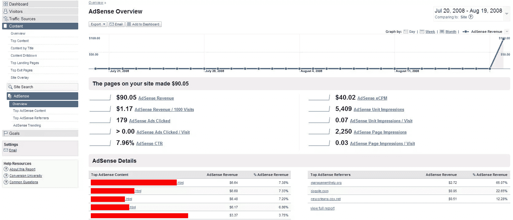

# AdSense 与分析的集成即将推出

> 原文：<https://www.sitepoint.com/adsense-integration-with-analytics-coming-soon/>

眼尖的博主 Amit Agarwal [挖出了一些截图](http://www.labnol.org/internet/google-analytics-adsense-reports-screenshots/4480/)，这显然是谷歌分析即将推出的未发布功能。截屏显示谷歌将在分析中加入 AdSense 账户追踪。

阿加瓦尔说，这些截图无意中发布在了 TheGoogleCache.com 的博客上，并被许多读者保存了下来。他们描绘了一幅相当完整的 AdSense 集成图。用户将能够获得关于他们的访问者如何与他们页面上的广告互动的详细报告，包括 CTR、CPM、印象等。分解到逐页级别。

你可以通过巧妙的使用 AdSense 频道来完成大部分工作，但是这些报告会让分类变得更加容易。此外，它们还包括一些你以前不容易完成的事情，比如趋势，以及——在我看来最酷的报告——推荐人的收入，它显示了你从你网站的不同推荐来源的访问者身上赚了多少钱。

正如 Agarwal 指出的那样，新的报告将使在一个网站的多个贡献者之间分配 AdSense 收入变得更加容易和准确。Agarwal 在他的网站上有更多的全尺寸截图。

## 分享这篇文章