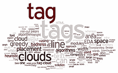

# 标记不只是针对内容

> 原文：<https://www.sitepoint.com/tagging-is-not-just-for-content/>

我们都知道 web 术语中的**标签**是什么，对吧？(如果没有，看看这篇关于这个主题的[维基百科文章](http://en.wikipedia.org/wiki/Tag_(metadata))。)标签几乎专门用于将主题与内容相关联；你可以给照片或博客贴上一些描述它的关键词，这样你就可以建立语义关系——搜索标准、按主题分类的内容列表等等。

但我突然想到，标记也可以用作认证系统的基础。(给道具——我前阵子有这个想法但是我没有从标签的角度考虑；是拉克伦·哈迪为我建立了这种联系。)

这个想法非常简单:你创建一个系统，在这个系统中你定义了许多表示权限组的标签，所以你可能有像<q>来宾</q>、<q>朋友</q>、<q>主持人</q>和<q>我</q>这样的标签。个人用户也有一个或多个与其用户帐户相关联的标签。

然后，对于每一条内容，你分配标签，表明谁可以看到它——如果一个帖子被标记为<q>我，版主</q>，那么只有你和 mods 可以看到它。或者更一般地说，每当一段内容的许可标签和用户的许可标签一致时，该用户被允许观看该内容。

这里真正的要点是它是无限可扩展的。您可以定义任意数量的标签——从适用于每个人的标签，一直到单个用户——并根据您的需要创建一个**粒度的用户/权限系统。( [XFN](http://en.wikipedia.org/wiki/XHTML_Friends_Network) 的一个问题是它太宽泛了——我无法涵盖我所有的私人关系，比如<q>朋友</q>或<q>熟人</q>。)**

你可以把这描述为一种基于角色的认证，从这个角度来说，这并不是一个新的想法；你也可以把它看作是*倒置的*基于角色的认证——我们没有定义具有属性的用户组(比如 vBulletin 中的成员组),而是直接定义属性，因此绕过了定义组的需要。不管怎样，从标签的角度来看，它似乎更有趣，并且与现代 web 开发实践更相关。

这让我想知道——除了目前的用途，我们还能在哪里扩展标记的概念？请在评论中告诉我你的想法。

*图片来源:[juandesant](http://www.flickr.com/photos/juandesant/2641262447/)*

## 分享这篇文章