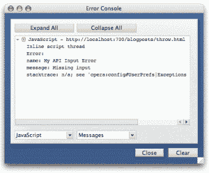
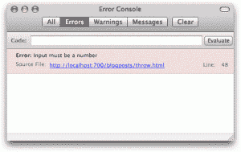

# 调试 JavaScript:扔掉你的警告！

> 原文：<https://www.sitepoint.com/debugging-javascript-throw-away-your-alerts/>

一个很少出现的 JavaScript 语句是`throw()`。`throw`语句允许您抛出一个正式错误——将错误的详细信息发送到浏览器的错误控制台——并停止脚本的进一步执行。

`throw`语句对于<abbr title="Application Programming Interfaces">API</abbr>开发者来说特别有用，作为一种警告用户开发者运行时问题的方式，比如丢失或无效的输入数据。它的使用通常比`alert()`更可取，因为它充分利用了浏览器的原生功能(而且没那么烦人):

```
if(typeof input == 'undefined')
{
	throw('Missing input');
}
else if(parseFloat(input) != input)
{
	throw('Input must be a number');
}
```

使用带有字符串参数的`throw()`会抛出一个一般性错误。然而，您也可以创建并传递一个`Error`对象，使用它您可以指定关于错误的更多细节:

```
var err = new Error();
err.name = 'My API Input Error';
err.message = 'Input must be a number';
throw(err);
```

上面的例子在 Opera 的错误控制台中产生了以下输出:

[](https://www.sitepoint.com/wp-content/uploads/2008/08/throw-opera.gif)

Firefox 的控制台不显示错误名称，只显示消息；但它仍然几乎一样有用:

[](https://www.sitepoint.com/wp-content/uploads/2008/08/throw-firefox.gif)

需要注意的重要一点是，你使用`throw()`的任何地方都将**暂停脚本**的执行(不仅仅是封闭范围)。因此，您应该安排您的代码，以便任何`throw()`语句都出现在执行块的末尾:

```
function err(type, message)
{
	var err = new Error();
	err.name = 'My API ' + type + ' Error';
	err.message = message;
	throw(err);
}

**// the delete in this example won't happen**
if(typeof this.input == 'undefined')
{
	err('Input', 'Missing input');
	delete this.input;
}

**// but this delete will happen fine**
if(typeof this.input == 'undefined')
{
	delete this.input;
	err('Input', 'Missing input');
}
```

当然，一个单一的语言语句——无论多么有用——永远无法取代像 Firebug 这样的全功能调试工具；一个合适的调试器可以让你设置断点、观察点、分步执行……各种各样的好处。Firebug 甚至允许您将消息记录到自己的控制台中。

但是 Firebug 是一个特定于浏览器的工具，这是一个跨浏览器的语言特性，所以它可以安全地集成到脚本的核心，不会有任何不满意的依赖。

## 分享这篇文章