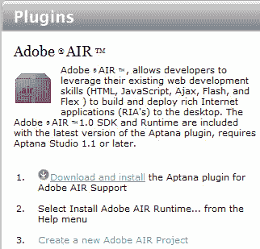
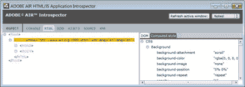
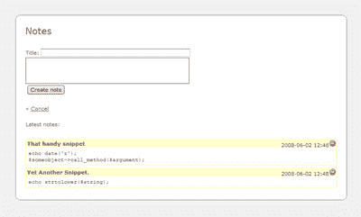
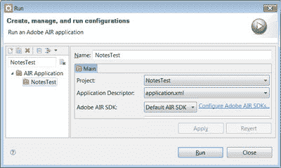
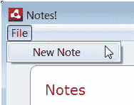
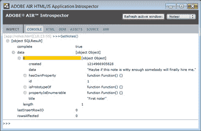

# 了解 Adobe AIR，第一部分:构建笔记存储应用程序

> 原文：<https://www.sitepoint.com/learn-adobe-air-part-1/>

Adobe Integrated Runtime (AIR)平台改变了 web 开发人员的游戏规则，将 HTML、CSS 和 JavaScript 等标准 web 技术引入桌面应用环境。在本教程中，我将向你展示如何用 Adobe AIR 建立一个个人笔记数据库。

在本文中，我们将通过构建一个简单的本地笔记数据库来探索 Adobe AIR 的客户端功能——把它想象成您自己的个人[粘贴箱](https://en.wikipedia.org/wiki/Pastebin)。我们将逐步完成设置 AIR 开发工作流的过程，将一个基本的界面放在一起，然后使用 AIR 的许多前端和后端功能来启用它。

如果你是 Adobe AIR 的新手，可以通读一下我以前的文章，[漫步云端:在五分钟内创建一个待办事项列表](https://www.sitepoint.com/adobe-air-todo-list-5-minutes)——这会给你一个好的开始。对于我们将要构建的应用程序，我假设您至少对 Adobe AIR 平台有所涉猎，并且对 HTML 和 JavaScript 中的面向对象编程也很熟悉。

此外，如果您打算在家独自玩，您会想要获取本文的代码档案。我已经准备好了开始的[框架文件](https://www.sitepoint.com/examples/AdobeAIR/air1-notesdb-base.zip)、[完成的应用](https://www.sitepoint.com/examples/AdobeAIR/air1-NotesTest-final.zip)和[最终打包的 AIR app](https://www.sitepoint.com/examples/AdobeAIR/NotesTest.air) 。

##### 构建 AIR 应用程序的强大工具

我们将使用 Aptana Studio 来构建我们的应用程序——如果您还没有安装这个工具，在进一步阅读之前，[下载并安装 Aptana Studio](http://www.aptana.com/studio/download) 。

我们还将为 Aptana 安装 AIR 插件。当您第一次启动 Aptana 时，会要求您选择一个工作空间。创建一个新文件夹来存储 AIR 项目(如果需要，以后可以随时更改)。当 Aptana 加载时，您将看到欢迎屏幕，如下所示。



选择*下载并安装*来安装 AIR 插件，并选择 *Adobe AIR Support* 复选框，如下图所示。


你需要重启 Aptana 来使插件生效。

##### 附加工具

在我的上一篇文章中，我介绍了 Adobe 作为 **[AIR 软件开发工具包(SDK)](https://www.adobe.com/devnet/air/air-sdk-download.html?sdid=DKAPU)** 的一部分提供的命令行工具。为了提醒你，有两个主要的工具:

1.  **AIR Debug Launcher (ADL)** ，它允许我们即时运行 AIR 应用程序，并监视调试输出。

3.  **AIR Developer Tool (ADT** )，它提供了一组工具来打包应用程序以供分发。

如果您不喜欢使用 Aptana，请随意探索这些替代方案。官方 Adobe AIR 文档包含更多详细信息。

Aptana 方便地为我们抽象了 ADL 和 ADT 工具。我们还将利用 SDK 中的一些附加实用程序——AIR 自省器和 AIR Source Viewer。当我们开始一个新的 AIR 项目时，Aptana 在我们的 HTML:

```
<!-- Uncomment the following line to add introspection.  When running the application hit F12 to bring up the introspector --> 

<script type="text/javascript" src="AIRIntrospector.js"></script> 

<!-- Uncomment the following line to use the AIR source viewer --> 

<script type="text/javascript" src="AIRSourceViewer.js"></script>
```

有了`AIRIntrospector.js`引用，您可以在运行 AIR 应用程序时按 F12 显示 Adobe AIR HTML/JS 应用程序内省程序，如下所示:



眼熟吗？可以把它想象成 Adobe AIR 的 Firebug 它有一个 JavaScript 控制台，一个带有点击式元素选择的页面检查器，一个 DOM 检查器，以及所有你能想到的常用工具。如果你用过 Firebug，你会很快学会这个工具；如果没有，你可能想看看内省文档。

下面是该工具的运行演示——使用内省器中的 JS 控制台检查源代码查看器——只需调用`air.SourceViewer.getDefault().viewSource():`


该工具使用 JavaScript 高度可配置——查看官方文档页面了解更多详细信息。

##### 使用数据库

我们将在示例应用程序中使用 SQLite 数据库，幸运的是，AIR 附带了一个内置的 SQLite 驱动程序。虽然我们可以动态地构建我们的数据库，但更实际(也更有效)的是[分发一个预填充的数据库](http://help.adobe.com/en_US/AIR/1.1/devappshtml/WS5b3ccc516d4fbf351e63e3d118666ade46-7d3c.html)。我推荐使用开源的 [SQLite 数据库浏览器](http://sqlitebrowser.sourceforge.net/index.html)来快速启动和运行(也可以作为 [Firefox 的扩展](http://code.google.com/p/sqlite-manager/))。它可以在 Windows、OS X 和 GNU/Linux 上运行，二进制包开箱即可运行。从 SourceForge 下载页面获取一份副本。

如果您以前没有使用过 SQLite，它的功能与大多数关系数据库相似——除了一些例外；特别是，它将数据类型应用于值(单元格)，而不是容器(列)——在 SQLite 网站上阅读关于 SQLite 和数据类型的更多信息。

##### 构建个人 Notes 数据库应用程序

好，我们开始吧！对于个人笔记数据库，我们需要能够查看我们的笔记，创建新的笔记，并删除现有的笔记。当我们构建这个应用程序时，我们将利用 AIR 中强大的 UI 功能的许多客户端特性。我们将使用 [jQuery](http://jquery.com/) 库进行一些基本的界面工作，但是我们也可以使用 Prototype、MooTools，甚至是 [Adobe Spry](http://labs.adobe.com/technologies/spry/) 。大多数 JavaScript 框架[可以在 AIR](http://www.adobe.com/products/air/tools/ajax/community/) 中可靠地使用。

就我们应用程序的功能而言，我们将涉及以下各个方面:

*   本地菜单
*   文件系统管理
*   本地 SQLite 数据库
*   剪贴板操作，本机复制和粘贴
*   用户界面细节

我们将首先为我们的用户界面创建一个模板，然后我们将逐步添加上述每个功能。

##### 定义用户界面

AIR 的内置浏览器使用 WebKit 渲染引擎，该引擎在遵守网络标准方面做得非常出色。我发现用 HTML 构建我的界面原型，然后在 Firefox 中测试它是可行的。这样做意味着我可以依靠永远有用的 Firebug 工具来解决任何问题。我已经用 HTML 为我们的 Notes 应用程序模拟了一个基本界面，如下所示。它包括一个*新笔记*表单，我们会在不需要的时候隐藏它。



如您所见，这是一个相当简单的布局；每张便笺包含:

*   一个标题
*   盒子里的清单
*   创建时的时间戳
*   一个显示减号的红色*删除*按钮(由[丝绸图标组](http://famfamfam.com/)提供)

对于我们这些编写大量代码的开发人员来说，存储等宽文本注释的能力将会非常方便，所以我们将用`<pre>`标记包围我们实际的注释内容。

我已经在 Firefox 中实现了这个原型，但是我已经在 AIR 窗口中获得了实际的截图。注意 AIR 是如何给一些元素(边缘周围的灰色区域)添加默认的 chrome 的，这是可选的(更多细节见 [AIR 文档](http://www.adobe.com/support/documentation/en/air/))。我们还在应用程序中显示圆角容器；因为我们知道我们的应用程序将始终在 AIR 窗口中运行，所以我们没有在 Web 上遇到的跨浏览器兼容性问题。因此，我们可以利用 WebKit 的许多特殊 CSS 属性——在本例中，就是`–webkit-border-radius`属性。

##### 创建数据库

我们将使用一个简单的单表 SQLite 数据库来存储我们的笔记。我们的表中需要四个字段:

*   `id`
*   `title`
*   `created`
*   `data`

`created`字段指的是笔记创建的时间，以秒为单位存储(在 [UNIX 时间](http://en.wikipedia.org/wiki/Unix_time)中，这是自 1970 年 1 月 1 日以来经过的秒数)。`data`字段将是一个 **BLOB(二进制大对象)**，这样我们就可以适应任何东西。我们将使我们的`id`字段成为一个整数主键，我们的`title`将是一个文本，`created`字段将是一个整数(SQLite 数据库浏览器中的“数字”)。

在 AIR 应用程序中使用 SQL 数据库背后的理论超出了本文的范围，但是 Adobe 提供了一些关于使用 SQL 数据库的[策略的好文档，绝对值得一读。](http://help.adobe.com/en_US/AIR/1.1/devappshtml/WS5b3ccc516d4fbf351e63e3d118666ade46-7d25.html)

##### 在空气中运行

一旦我们有了一个基本接口和一个数据库，我们就可以开始为我们的应用程序添加实际的功能了。

**如果您还没有这样做，下载并解压缩包含本文框架文件的代码档案( [air1-notesdb-base.zip](https://www.sitepoint.com/examples/AdobeAIR/air1-notesdb-base.zip) )。**

在*中。zip* 文件你会看到以下文件:

*   *notes.html*
*   *notes_base.db*
*   *styles.css*
*   *icons/delete.png*
*   *lib/notes.js*

接下来，在 Aptana 中创建新的 AIR 项目，并将其命名为 *NotesTest* 。将您从代码档案中提取文件的文件夹指定为*位置*。当您点击下一个的*时，您将看到一个对话框来输入应用描述符属性。选择一个合适的 ID(我用的是 com . site point . example . notes test)，再次点击 *Next* ，然后设置你的默认窗口大小为 800 x 600 像素。再次点击*下一步*，从*导入 JavaScript 库*对话框中选择 jQuery，最后点击*完成*。*

Aptana 将为您创建几个示例文件，以便在您的环境中进行试验；不过你可以安全地删除其中的一些，包括*NotesTest.html*、 *sample.css* 、 *LocalFile.txt* 、 *jquery_sample.html* 和 *jquery_sample.js* 。我们确实需要告诉 Aptana，我们的 AIR 应用程序的根应该是我们新的*notes.html*文件。打开 *application.xml* 文件，找到以下内容(应该在第 36 行左右):

```
<!-- The main HTML file of the application. Required. -->  

<content>NotesTest.html</content>
```

将*NotesTest.html*更改为*notes.html*并保存文件。从**运行**菜单中，选择**运行…** 。在左侧窗格中选择您的 *NotesTest* 项目，并点击 *Run* 按钮:



您的 AIR 应用程序将显示在自己的窗口中，包括我们之前创建的原型 HTML。它应该是这样的:


这是一个好的开始！让我们让这个应用程序更有用一点。

##### 菜单

我们将首先把接口放在适当的位置。我们将把 JavaScript 代码存储在 *lib/notes.js* 中。这是我们的模板目前的样子:

```
// Bootstrap  

$(document).ready(function(){  

  BindEvents();  

});  

function BindEvents() {  

  $("#new_note_form").hide();  

  $("a.notes_list").click(HideNewNote);  

}  

function HideNewNote() {  

  $("#new_note_form").hide();  

}  

function ShowNewNote() {  

  $("#new_note_form").show();  

}
```

这个 jQuery 代码片段等待 DOM 准备好被操作，然后隐藏注释创建表单，并绑定到同一个表单中的*取消*链接的 click 事件。如果你需要一本关于 jQuery 的入门书，请查阅[这篇文章](https://www.sitepoint.com/ajax-jquery/)的“jQuery 101”部分。

AIR 提供了一个扩展的 API，用于从复杂的数据结构生成菜单。然而，我们真正想要的是一个基本菜单，当某些菜单项被选中时，它会触发 JavaScript 事件。有了 AIR 1.1，我们可以利用 *AIR 菜单构建器*框架，它允许我们用 XML 定义菜单，只需将它们加载到菜单构建器中，就可以神奇地生成它们。在您的 *NotesTest* 项目中创建一个名为 *notes_menus.xml* 的新文件，如下所示:

```
<?xml version="1.0" encoding="utf-8"?>  

<root>   

  <menuitem label="File">  

    <menuitem label="_New Note" onSelect="ShowNewNote" />  

  </menuitem>  

</root>
```

使用 XML，我们可以将每个菜单项定义为一个`menuitem`节点。如果一个节点包含子节点(附加的`menuitems`)，那么父节点就变成了子菜单。

保存 *notes_menus.xml* ，打开文件 *lib/notes.js* 。让我们创建一个新函数`CreateMenus`，它包含以下代码:

```
// UI  

function CreateMenus() {  

  var menu = air.ui.Menu.createFromXML("notes_menus.xml");  

  air.ui.Menu.setAsMenu(menu);  

}
```

将该函数放在我们的`$(document)`之后。就绪功能。然后，我们将在该函数结束时调用它，就像我在这里做的那样:

```
// Bootstrap  

$(document).ready(function(){  

  BindEvents();  

  CreateMenus();  

});
```

现在，当我们再次运行 AIR 应用程序时，我们的菜单会出现在应用程序的窗口中(或者在 Mac 上的 OS X 菜单栏中)。

***注:Aptana 的省时键盘快捷键* s**

*按 Ctrl+F11(在 Mac 上按 Cmd-Shift-F11 ),使用与上次运行时相同的配置运行 AIR 应用程序。*



我们的每个菜单节点都有许多可能的属性，但是我们唯一关心的是`onSelect`。当选择一个菜单项时，该属性定义应该触发哪个 JavaScript 函数:

```
<menuitem label="_New Note" onSelect="ShowNewNote" />  

function ShowNewNote() { ... 
```

上面的 XML 片段定义了，当选择了*新注释*(通过鼠标点击或键盘输入)时，应该调用`ShowNewNote` JavaScript 函数。

我们还可以在菜单中添加辅助功能——例如，我们可以添加键盘快捷键，键盘快捷键是使用下划线字符指定的，正如我在*标签*属性中所做的:

```
<menuitem label="_New Note" onSelect="ShowNewNote" />
```

##### 探索文件系统

现在让我们看看如何存储和操作我们的数据。我们将一起研究数据库和文件系统 API，因为 AIR 的本地 SQL 数据库实现严重依赖于这两者。SQLite 数据库是独立的文件，它们不是通过数据库服务器访问，而是由应用程序直接操作。在这种情况下，AIR 为我们扮演了数据库服务器的角色。然而，要开始，我们首先需要通过指定一个*来告诉 AIR 在哪里可以找到数据库文件。db* 文件。

所有文件系统 API 都存在于`air.File`名称空间下。我们的 AIR 应用程序有两个重要的预定义路径:应用程序目录和应用程序存储目录。

*   应用程序目录是存储应用程序本身的文件夹。
*   应用程序存储目录是 AIR 为该特定应用程序(且仅该应用程序)创建的用于存储数据的文件夹。

应用程序目录实际上是只读的，所以如果我们想要编辑数据库，我们需要将数据库文件放在存储目录中。由于我们将我们的框架数据库作为应用程序的一部分进行分发，我们需要将我们的数据库模板( *notes_base.db* )即时复制到存储目录中。

##### 连接到数据库

为了打开到数据库的连接，我们使用以下代码:

```
var db = new air.SQLConnection();  

try  

{  

  db.open(air.File.applicationStorageDirectory.resolvePath("notes.db"));  

}  

catch (error)  

{  

  air.trace("DB error:", error.message);  

  air.trace("Details:", error.details);  

}
```

***注:打印空中微量报表***

*要打印到 AIR 调试控制台或 Aptana 中的控制台视图，请使用函数 air.trace()。*

在上面的代码中，我们使用`resolvePath`函数在应用程序存储目录中打开一个名为 *notes.db* 的文件。然而，在我们访问这个文件之前，我们首先需要复制我们的模板 SQLite 数据库，它包含在我们的应用程序目录中的 *notes_base.db* 文件中。以下代码实现了这一点:

```
var dbFile = air.File.applicationStorageDirectory.resolvePath("notes.db");  

//In production, uncomment the if block to maintain the database.  

//if (!dbFile.exists) {  

  var dbTemplate =   

air.File.applicationDirectory.resolvePath("notes_base.db");  

  dbTemplate.copyTo(dbFile, true);    

//}
```

当使用`resolvePath`解析文件系统上的路径时，没有必要首先检查文件是否存在——`exists`属性将指示是否可以找到该文件。正如您在上面看到的，我们在应用程序的生产就绪版本中检查了该属性。在测试模式下，每次应用程序启动时恢复到我们的数据库模板是很有用的——但是在处理真实数据时，我们当然不希望用空白模板替换数据库！

让我们将所有这些部分整合成一个名为`SetupDB`的函数，如下所示:

```
var db = new air.SQLConnection();  

function SetupDB() {  

  var dbFile = air.File.applicationStorageDirectory.resolvePath("notes.db");  

  //In production, uncomment the if block to maintain the database.  

  //if (!dbFile.exists) {  

    var dbTemplate = air.File.applicationDirectory.resolvePath("notes_base.db");  

    dbTemplate.copyTo(dbFile, true);    

  //}  

  try  

  {  

    db.open(dbFile);  

  }  

  catch (error)  

  {  

    air.trace("DB error:", error.message);  

    air.trace("Details:", error.details);  

  }  

}
```

将这个函数放在你的 *notes.js* 文件的末尾，当你在那里时，从我们的`$(document).ready()`函数(位于文件的顶部)中添加对这个新方法的调用。

##### 使用数据库

现在我们已经建立了一个数据库，我们准备开始从数据库中提取现有的笔记。

正如`SQLConnection`对象维护与数据库的连接一样，`SQLStatement`维护对数据库的特定查询。这些`SQLStatement`实例通过它们的`SQLConnection`属性链接到一个特定的连接。`SQLStatement`对象支持准备好的语句，以及一些不同的方法来检索每个查询的结果；它们也可以重复使用。查看 SQLStatement 的[参考页面了解更多详情。](http://help.adobe.com/en_US/AIR/1.1/jslr/index.html?flash/data/SQLStatement.html)

让我们创建一个`GetNotes`函数来获取我们的笔记。下面是代码，它应该被添加到您的 *notes.js* 文件的末尾。

```
function GetNotes() {   

  dbQuery = new air.SQLStatement();   

  dbQuery.sqlConnection = db;   

  dbQuery.text = "SELECT id,title,created,data FROM notes";   

  try {   

    dbQuery.execute();   

  } catch (error) {   

    air.trace("Error retrieving notes from DB:", error);   

    air.trace(error.message);   

    return;   

  }   

  return dbQuery.getResult();   

}
```

这段代码相当简单；我们首先创建一个新的 SQL 语句，并将其`SQLConnection`属性分配给我们现有的数据库连接。然后，我们设置实际的查询文本并运行查询，同时捕捉任何潜在的错误。最后，我们将结果作为一个 [SQLResult](http://help.adobe.com/en_US/AIR/1.1/jslr/index.html?flash/data/SQLResult.html) 对象返回。

让我们使用自省器来检查这个函数返回的数据类型。运行您的 AIR 应用程序(运行>运行…)，然后按 F12 启动内省程序，并从 JavaScript 控制台执行“GetNotes()”。以下是输出结果:



这里对我们很重要的数字是我在上图中突出显示的值“0 ”,它代表数据库表中的第一项。事实上，`data`属性包含了数据库查询返回的所有行，从索引号 0 开始。每个查询还为我们提供了一个`length`属性，它告诉我们返回了多少行。知道了这些信息，我们现在可以构造一个简单的例程来从数据库中检索每一条注释，并将其打印到页面上:

```
var notes = GetNotes();   

$("#notes").empty();   

var numRecords = notes.data.length;   

for (i=0;i<numRecords;i++) {   

  dateObj = new Date(notes.data[i].created);   

  time = dateObj.getFullYear()+"-"+   

       String("0"+dateObj.getMonth()).slice(-2)+"-"+   

       String("0"+dateObj.getDate()).slice(-2)+" "+   

       String("0"+dateObj.getHours()).slice(-2)+":"+   

       String("0"+dateObj.getMinutes()).slice(-2);   

  $("<li/>").append('<span class="note_time">'+time+   

            '<a href="#del/'+notes.data[i].id+'">'+   

            '</a></span>')   

        .append('<span class="note_title">'+notes.data[i].title)    

        .append('<pre>'+notes.data[i].data.'</pre>')   

        .appendTo("#notes");   

}
```

这个例程检查每条记录，检查注释的创建时间，并执行一些基本的格式化操作，为显示注释做准备。我们为每个记录创建一个新的列表项，并将每个注释放在列表的末尾。我们在这里非常依赖 jQuery 来实现这一切，但是这也可以通过标准的 DOM 调用来实现。

##### 删除注释

好了，我们可以显示我们的注释了，但是我们仍然缺少一些功能，即添加和删除注释。让我们启用那个漂亮的红色*删除*按钮！

我们需要为每个*删除*按钮绑定一个新功能。注意，实际的*删除*图像将被链接包围，每个链接都有自己唯一的标识符。我们可以利用这个事实来确定我们想要删除哪个笔记。一旦我们编写了这样做的代码，代码几乎与我们的`GetNotes`函数相同。

是时候将一个新方法`ListNotes`添加到您的 *notes.js* 文件的底部了:

```
function ListNotes() {   

  var notes = GetNotes();   

  $("#notes").empty();   

  var numRecords = notes.data.length;   

  for (i=0;i<numRecords;i++) {   

    dateObj = new Date(notes.data[i].created);   

    time = dateObj.getFullYear()+"-"+   

         String("0"+dateObj.getMonth()).slice(-2)+"-"+   

         String("0"+dateObj.getDate()).slice(-2)+" "+   

         String("0"+dateObj.getHours()).slice(-2)+":"+   

         String("0"+dateObj.getMinutes()).slice(-2);   

    $("<li/>").append('<span class="note_time">'+time+   

              '<a href="#del/'+notes.data[i].id+'">'+   

              '</a></span>')   

          .append('<span class="note_title">'+unescape(notes.data[i].title))   

          .append('<pre>'+unescape(notes.data[i].data)+'</pre>')   

          .appendTo("#notes");   

  }   

  $(".note_time a").click(function(){   

    var currHash = $(this).attr("href").split('/');   

    var id = currHash[1];   

    var dbQuery = new air.SQLStatement();   

    dbQuery.sqlConnection = db;   

    dbQuery.text = "DELETE FROM notes WHERE id=" + id;   

    try {   

      dbQuery.execute();   

    } catch (error) {   

      air.trace("Error deleting note from DB:", error);   

      air.trace(error.message);   

      return;   

    }   

    ListNotes();   

  });   

}
```

我们还需要在 *notes.js* 文件的开头从我们的`$(document).ready`方法中调用`ListNotes`。

##### 添加新注释

我们还有一个数据库操作要充实:允许我们的用户添加新的注释。该功能与前面的两个数据库操作非常相似，但有两个例外:

1.  我们需要从 *New Note* 表单中获取值(并计算出 UNIX 时间中的当前时间)，并且

3.  完成后，我们需要重新生成笔记列表。

下面是准备复制到我们的 *notes.js* 文件末尾的代码:

```
function AddNote() {   

  var title = escape($("#title").val());   

  var now = new Date();   

  var created = Date.parse(now.toString());   

  var data = escape($("#data").val());   

  dbQuery = new air.SQLStatement();   

  dbQuery.sqlConnection = db;   

  dbQuery.text  = "INSERT INTO notes (title,created,data)";   

  dbQuery.text += "VALUES ('"+title+"',"+created+",'"+data+"')";   

  try {   

    dbQuery.execute();   

  } catch (error) {   

    air.trace("Error inserting new record into database:", error);   

    air.trace(error.message);   

  }   

  HideNewNote();   

  ListNotes();   

}
```

这段代码的前几行从每个字段获取值。`Date.parse`(静态日期函数)将日期字符串转换成 UNIX 时间值。当我们构建数据库查询时，我们从这些表单字段中添加用户数据。只有一个小限制——我们需要逃离我们的字符串。如果不这样做，可能会导致错误的查询字符串，因此您会看到这里的`escape`调用。

我们还需要将这个新功能绑定到 *Create Note* 按钮。使用 jQuery 很容易做到这一点——只需在您的`BindEvents`函数中添加下面一行，以粗体显示:

```
function BindEvents() {   

  $("#new_note_form").hide();   

  $("a.notes_list").click(HideNewNote);   

  **$("#new_note_btn").click(AddNote);**   

}
```

##### 使用剪贴板

在创建注释时，用户可能会将内容存储在他们操作系统的剪贴板中，并希望将其作为注释插入到我们的应用程序中。AIR 很容易提供对剪贴板的访问，所以让我们在显示*新注释*表单时检查一下。用下面几行替换您的`ShowNewNote`函数:

```
function ShowNewNote() {    

  if (air.Clipboard.generalClipboard.hasFormat(    

    air.ClipboardFormats.TEXT_FORMAT)){    

      $("#data").val(air.Clipboard.generalClipboard.getData(    

        air.ClipboardFormats.TEXT_FORMAT));    

  }    

  $("#new_note_form").show();    

}
```

在上述代码片段的第 2-4 行中，检查剪贴板上是否有任何明文数据。如果有，我们将该数据复制到我们的*新注释*表单的主要内容区域。也可以扩展该功能以包含其他数据格式，包括富文本和 HTML——如果您想尝试更多，请查看 AIR 文档中的[剪贴板数据格式](http://help.adobe.com/en_US/AIR/1.1/devappshtml/WS5b3ccc516d4fbf351e63e3d118666ade46-7d7e.html)。

如果我们想进一步发展这个应用程序，我们可以为每个单独的笔记提供一个简单的“复制”功能。大多数主流浏览器都支持这一功能，但 AIR 更进一步，允许我们直接操作通用剪贴板的内容。如果您对探索这一功能感兴趣，AIR 官方文档很好地解释了如何从系统剪贴板中读取和向其中写入数据[，并包含了一些很棒的代码示例。](http://help.adobe.com/en_US/AIR/1.1/devappshtml/WS5b3ccc516d4fbf351e63e3d118666ade46-7d60.html)

##### 关闭应用程序

我们可能希望让用户轻松关闭我们的笔记存储应用程序。让我们创建一个**文件>退出**菜单项，给我们的应用程序一点桌面熟悉感。首先，打开 *notes_menus.xml* 并在下面添加一行粗体字:

```
<?xml version="1.0" encoding="utf-8"?>    

<root>     

  <menuitem label="File">    

    <menuitem label="_New Note" onSelect="ShowNewNote" />    

    **<menuitem label="E_xit" onSelect="QuitNotes" />**    

  </menuitem>    

</root>
```

我们将助记符设置在“退出”的 x 上，这是 Windows 桌面应用程序中的常见做法。

我们可以通过调用方法`air.NativeApplication.nativeApplication.exit`来关闭应用程序。但是，AIR 提供了一个复杂的事件系统，用于处理应用程序可能需要执行的更复杂的操作。这些操作之一是防止默认操作。假设我们可能希望暂时禁止用户退出应用程序——例如，在异步删除所有注释数据库操作期间——我们将使用这种方法。

在`air.Event`中有一个`preventDefault`方法，不出所料，它将阻止 AIR 执行事件的默认动作。在我们的例子中，这个事件被称为`air.Event.EXITING`，整个应用程序中的例程都应该采用这种方法。我们可以使用一个简单的过程来检查默认退出操作是否被应用程序的另一个区域阻止:

```
function QuitNotes() {    

  var event = new air.Event(air.Event.EXITING, false, true);    

  air.NativeApplication.nativeApplication.dispatchEvent(event);    

  if (!event.isDefaultPrevented()) {    

    air.NativeApplication.nativeApplication.exit();    

  }    

}
```

将这个函数放在你的 *notes.js* 文件的末尾，当应用程序正在处理重要的事情时，你的用户将不再能够终止它。AIR 文档为[提供了更多关于处理应用终止](http://help.adobe.com/en_US/AIR/1.1/devappshtml/WS5b3ccc516d4fbf351e63e3d118676a5d46-8000.html#WS5b3ccc516d4fbf351e63e3d118666ade46-7cd3)的信息。

##### 收尾工作

这就是我们的笔记存储应用程序！如果您在这个过程中遇到了任何障碍，您可以下载最终的项目文件来与您自己的文件进行比较。要使用这些文件，只需将它们导入 Aptana 中的一个新 AIR 项目(选择**文件>导入>归档文件**)。Aptana 还允许您轻松地将应用程序打包成 AIR 文件进行部署。点击 Aptana 工具栏上的 **air** 按钮。在出现的 *Adobe AIR Package Exporter* 对话框中，确认选择了正确的项目，并且应用程序描述符被称为 *application.xml* 。为了最小化文件大小，您可以随意删除 AIR localizer 和多余的 jQuery 文件，然后单击 *Finish* ，将会为您创建一个 AIR 包。这是你完成的包应该是什么样子。

##### 进一步阅读

AIR 是一个非常强大的平台，通过使用熟悉的 web 技术，它的进入门槛非常低。在本教程中，我们使用现有的 JavaScript 技能和强大的 jQuery 库创建了一个实用的 AIR 应用程序。在这个过程中，我们了解了 AIR 如何实现菜单项、写入数据库、管理事件等等。

如果这篇文章激发了你使用 Adobe AIR 进行更多开发的兴趣，那么你很幸运——下周我们将发布一篇后续文章，这篇文章基于我们在这里学到的原则..然而，如果你等不及了，一定要访问 adobe.com 的官方 AIR 指南，[在 Adobe AIR 上开发 HTML/AJAX 应用](http://help.adobe.com/en_US/AIR/1.1/devappshtml/)。这个资源包含了许多全面的指南，涵盖了 AIR 开发的所有主要领域，以及到其他优秀教程的链接。一旦你看完了所有的文档，去[Adobe AIR HTML 和 Ajax 开发中心](http://www.adobe.com/devnet/air/ajax/)看一些精彩的、有针对性的教程。你还在等什么？开始直播吧！

## 分享这篇文章