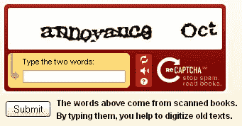

# reCAPTCHA:对浪费时间的有效利用

> 原文：<https://www.sitepoint.com/recaptcha-awesome-use-of-wasted-time-that-works/>

一年多前，卡耐基梅隆大学的一个研究团队推出了 [reCAPTCHA](http://www.recaptcha.net/) ，这是一个为网站提供的插件式验证码服务，它有双重目的:打击垃圾邮件机器人，帮助[互联网档案馆](http://www.archive.org/index.php)和其他客户理解数字化印刷内容。

验证码，那些网站有时会要求你在提交表单数据之前输入的难以阅读的图像，可以是对抗垃圾邮件的有效方法，但它们也是巨大的时间接收器。每天在网上，人们都要面对多达 2 亿张验证码图片，破译这些图片要花费 50 万个小时。reCAPTCHA 系统充分利用这段时间，让人们阅读光学识别软件(OCR)难以理解的扫描文本。

这项服务现在被 40，000 个网站使用，它使用一种简单的技术让人们帮助找出未知的扫描单词。每个 reCAPTCHA 框向用户提供两个单词——一个是系统知道正确的单词(控制单词),另一个是未知单词。如果用户得到正确的控制字，系统可以假设另一个字也有很高的可能性是正确的。如果足够多的用户为该词输入相同的内容，它可以用作控制词。

在这 2 亿个每日验证码中，reCAPTCHA 服务了大约 400 万个，这“相当于 1500 人全职工作，每分钟抄写 60 个单词，”根据本月《科学》杂志的一篇报道。这项服务可供网站免费使用，在过去的一年里，它已经为客户破译了 4.4 亿个单词。

[根据 Ars Technica](http://arstechnica.com/news.ars/post/20080814-captchas-workfor-digitizing-old-damaged-texts-manuscripts.html) 的说法，reCAPTCHA 也是非常准确的。在一项使用不同时期的 250 篇《T2 纽约时报》文章的随机样本的测试中，OCR 软件仅达到 84%的准确率。然而，当与 reCAPTCHA 结合使用时，准确率飙升至 99.1%。Ars 表示，这与专业转录服务相当，在专业转录服务中，他们雇佣两名转录专家，他们的工作由第三方进行验证。

显而易见，reCAPTCHA 对人群的利用更具成本效益。此外，Ars 报告称，旨在破解 CAPTCHA 图像的软件在 reCAPTCHA 上失败，可能是因为扫描图像上的字母失真不是“干净的数学变换”的结果，因此计算机很难纠正。

reCAPTCHA 是对基本上被浪费的时间的一个简单而聪明的利用，我很高兴听到它起作用了。当我去年第一次为读写网写这个项目的时候，我注意到在大学里，我的一门课是旧航海期刊数字化项目的一部分。我们使用昂贵的高架扫描仪和花哨的 OCR 软件，但即使如此，我们的大部分时间还是花在纠正软件所犯的错误上。reCAPTCHA 系统在当时会是我们工作的一个受欢迎的补充。

## 分享这篇文章