# 网站档案的 23 个漂亮例子

> 原文：<https://www.sitepoint.com/beautiful-web-site-archives/>

说到漂亮的网页设计，网站最容易被忽视的元素之一就是网站的存档列表。因此，当我遇到一个设计良好的归档列表时，我真的很欣赏它，并为本文收集了一些我见过的最好的例子。

让我们浏览一下这些网站，这些网站的档案列表都是原创的，设计精美，在某些情况下，非常注重细节。在这个过程中，我们将讨论是什么魔力让一个档案看起来如此之好。

由于归档列表在同一个网站上呈现的多种方式，几个真正突出的网站在这里出现了不止一次。

##### 边栏

站点显示其存档列表最常见的地方之一是侧边栏。这些列表通常按照类别和日期被分解成列表，并且有时可能包括按照新近度、日历视图或标签云的列表。

让我们来看看 Szabolcs Bakos 的网站，[新概念](http://newconcept.hu/)。

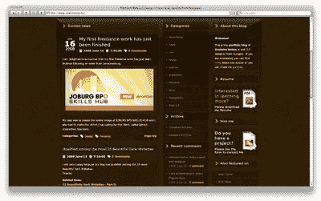

在本例中，归档列表显示在第二列，即页面右侧的两个侧栏之一。

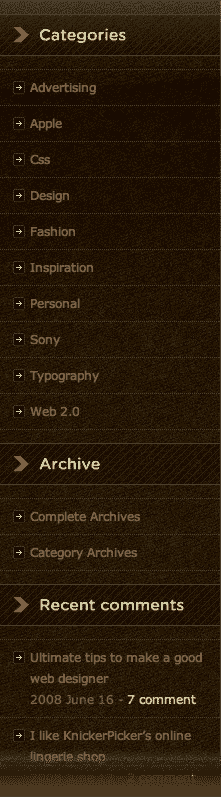

这个档案列表从类别开始，然后有两个链接指向一个完整的档案和一个类别档案，后面是最近的评论。它有一个非常块状的处理，但它很好地与网站设计。

这里是 [Viget 实验室激发](http://www.viget.com/inspire)

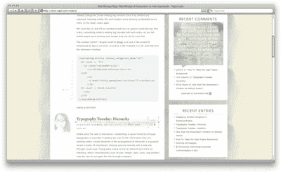

这个侧边栏中的存档处理，显示了最近的评论和最近的条目，虽然很少但很优雅。间距和排版工作得很好，使这个例子非常有吸引力。

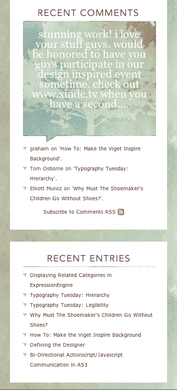

这个侧边栏的标题处理很好。但真正吸引我眼球的是最近的评论，它在一个水彩背景的传记中风格优美。这种字体是低对比度的，所以很难阅读；然而，在这种情况下，因为它不是页面上的主要元素，所以它的效果很好(并且包括一个到评论的链接，可以在更高的对比度下阅读)。

接下来，[语句](http://theoldstate.com/blog/)。

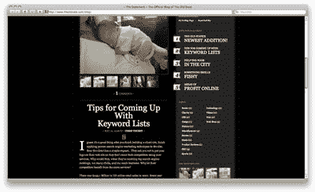

该语句为其归档列表使用了一个加粗的侧边栏，感觉很立体，尽管它只是一个带有规则的实心条纹。

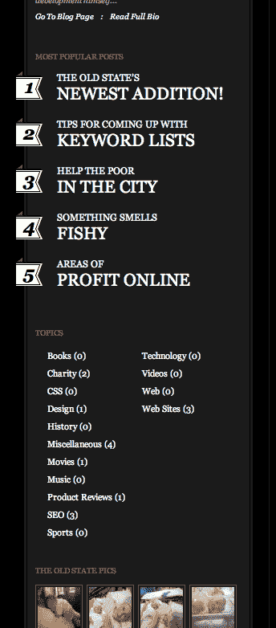

最受欢迎的帖子非常占优势，并使用有趣的编号样式来表示受欢迎的顺序。

##### 日历

我们将看到的下一个侧边栏处理使用了日历，这是一个在早期博客中常见的特性，在新的博客中并不常见。这里是 [Viget Extend](http://www.viget.com/extend) 网页。

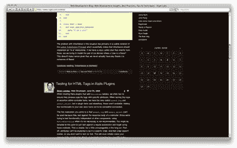

这是日历的特写。

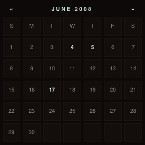

上面日历中的块状日期样式是一个不错的选择。有帖子的日子更突出，您可以使用日历顶部列出的月份和年份的左右分页来查看上个月和下个月。

看一看瑞秋的《Intensify.org》

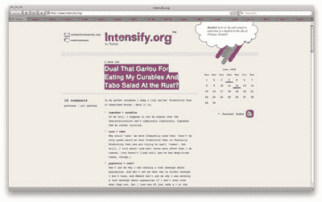

这个网站还在侧边栏中使用了一个日历，除了一个索引链接和一个 RSS feed 链接图标之外，没有什么其他的。

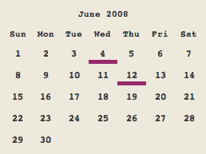

日历比块状的更开放，这与这种布局的空白很好地配合。链接的日子使用大胆而有趣的粉红色下划线。

##### 标签云

对于一些稍微不同的东西，这里是 [coda.coza](http://coda.co.za/blog/) 。

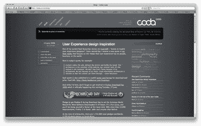

该网站的侧边栏处理使用标签云来显示帖子被标记的关键词的受欢迎程度。它还列出了最近的评论和最受欢迎的帖子，在一个简单但风格优美的列表中。

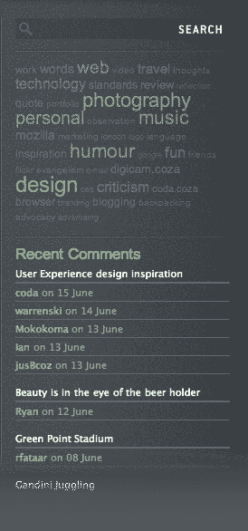

标签与背景的对比度较低，并使用不同的大小来表示受欢迎程度。

##### 其他治疗

这是杰夫·克罗夫特的主页。

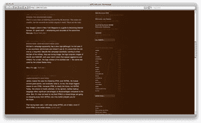

Jeff 的网站非常简洁，但使用了一些非常好的细节，从圆角和阴影到令人难以置信的条形图。

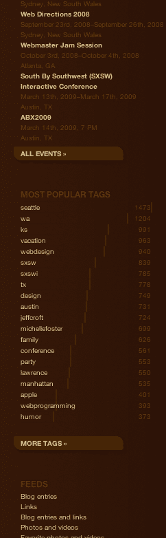

侧边栏中的归档样式侧重于整洁的排版。然而，最吸引人眼球的是他展示流行标签的有趣而独特的方式；他没有使用标签云，而是使用了 CSS 样式的水平条形图信息图。我真的可以偷这个…

##### 相互作用的

接下来，我们有亚历克斯·布加的网页。

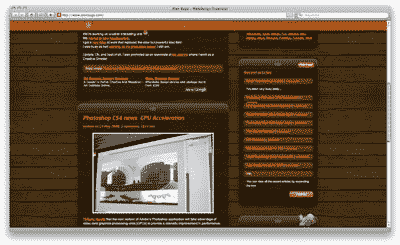

这个侧边栏中的存档处理，显示了最近的评论和最近的条目，虽然很少但很优雅。间距和字体设计使得这个例子非常吸引人。

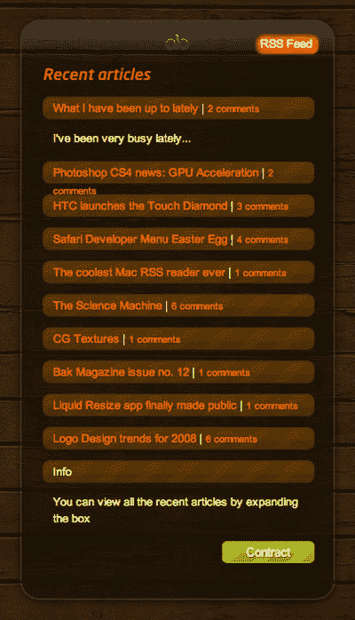

侧边栏中的最近文章模块非常漂亮，有扩展和收缩功能来显示或隐藏内容。虽然不幸的包装问题是不雅观的，其他一切看起来真的很紧。

这里有另一种方法:[达伦·霍伊特网站](http://www.darrenhoyt.com/)

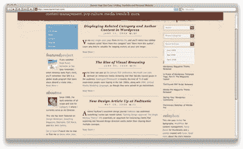

本网站侧边栏中的存档列表避免了过度设计，并且非常简洁。

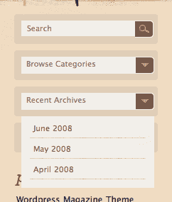

清单的样式很好，我喜欢它的颜色。一个批评是，这个列表看起来与它所属的交互标题非常分离，并且有一些间距问题。

然后是[科莫多传媒](http://www.komodomedia.com/blog/)。

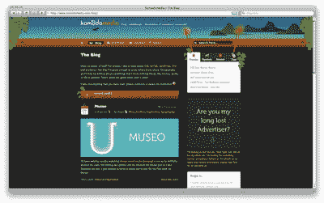

这个侧边栏使用标签切换风格的存档列表，显示不同的存档列表视图，并有助于保持侧边栏在所有视图中的整洁。

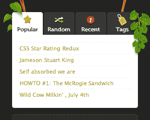

选项卡切换内容有时会妨碍可用性，但选项卡中的图标有助于引起注意。

##### 脚注

网站设计的一个常见趋势是在页脚放置补充信息(如导航、存档列表、照片缩略图等)，而不是使用侧边栏。如果用来代替侧边栏，页脚可以为页面的主要内容提供更多的空间；它还为页面底部创建了一个漂亮的锚点。我们将看到页脚更多的被定义为网站的“地板”;我们还会看到一些“伪页脚”，其中的内容位于内容发布区的底部。

其中一些例子是我们已经看过的边栏网站。这些网站获得双倍积分！

我们来谈谈页脚中的列表:首先， [Viget Labs 激发](http://www.viget.com/inspire)。

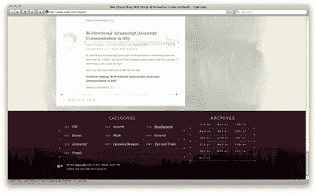

这个网站的页脚处是一个大而暗的区域，主要用于存档。类别列表与内容区域的宽度相同，而月度存档与侧边栏区域的宽度相同。

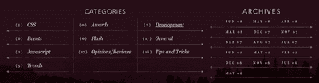

这些档案列表中使用的排版非常华丽，并强调了良好的规则和简单而优雅的图形处理。

接下来，[设计新闻](http://www.designingthenews.com/archive/)。

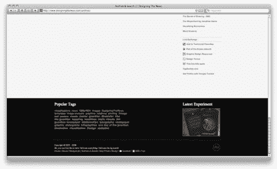

设计新闻也使用页面底部的黑色空间来显示补充信息。

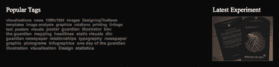

这里的存档处理非常简单:只是一个流行标签和最新实验的列表。

Nimbupani Designs 有一个有趣而有效的解决方案。

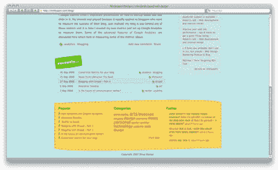

不能错过此页脚部分中的存档列表；亮黄色让人难以忽视！

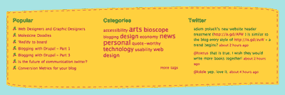

边界周围的缝合外观是好玩的，真正使这个页脚工作。存档列表简单地使用了一个流行文章列表和一个类别标签云。

##### 其他方法

我们再来看看[科莫多传媒](http://www.komodomedia.com/blog/)。

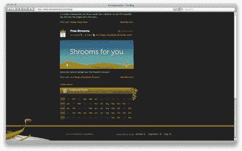

Komodo 在内容区的底部使用了一个非常好看的日历；这就是我所说的“伪页脚”，因为它更像是帖子区的底部，而不是网站的底部。

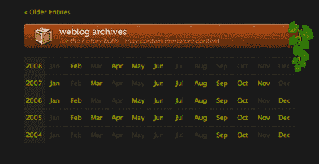

日历使用横排，每一排代表一年的帖子数量；包含帖子的月份比较亮，有联系。木纹标题和树叶细节是一个非常好的触摸。

我们之前看过的另一个网站，瑞秋的[Intensify.org](http://intensify.org/)使用页面的底部来总结电影、书籍和音乐的评论。

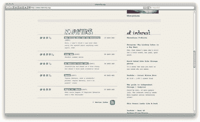

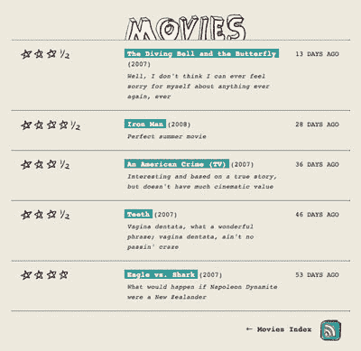

在这个电影页脚部分，打字和手绘看起来很有趣。

***互动***

为了不一样的东西: [Fling Media](http://flingmedia.com/articles) 。

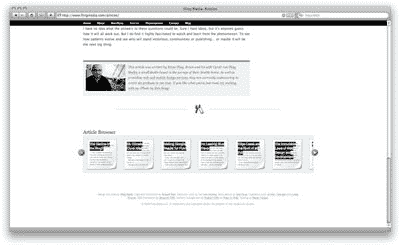

Fling Media 在页面底部使用了一个“swisher”或“slider”(无论你怎么称呼它)。

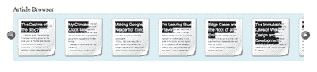

这里展示的每篇文章都被设计成小页面的样子:非常可爱！

##### 存档页面

一些网站有一整页或几页专门用于存档。不幸的是，我所看到的大多数例子都使用了非常乏味的帖子列表。它们似乎是被遗忘的页面，或者是事后想起的。所以，能看到一个引人注目的档案页面真的很好——通常，它能决定网站设计的成败。

我们现在要看的例子展示了设计者选择的几种不同的方式来显示他们的存档页面。同样，这些例子中有一些是我们已经看过的网站。(三倍积分！)

Jason Santa Maria 的档案页面名为 Articles，是一个超级干净的简约设计，而且做得非常好。

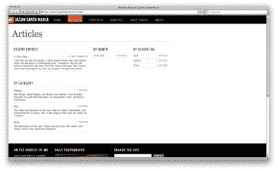

最近的条目、类别列表、每月存档和“设计标签”构成了组件。“设计标签”是一个有趣的概念，Jason 计划根据 post 为网站设计添加额外的样式和图像；这些设计都标有设计的属性，然后可以在这里进行索引。

Boagworld 为存档页面使用了一个简单样式的列表。

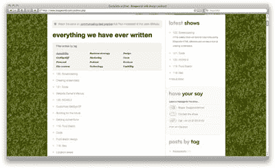

还有一个播客的最新节目列表，它使用了另一个简单的样式列表，但显示了最近节目的更多细节。最后，标签过滤机制使得找到相关的帖子更加容易。

[Orderedlist](http://orderedlist.com/archive) 使用了一个简洁的文章列表，通过巧妙的规则增加了一些维度。

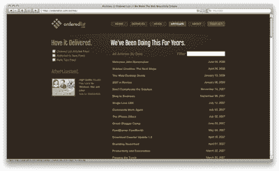

还有一个过滤搜索栏，使用类似“实时搜索”的效果，可以与 Mac OS X 的 Spotlight 搜索相提并论。

[设计新闻](http://www.designingthenews.com/archive/)使用一个简单的存档页面，按月份和类别存档。

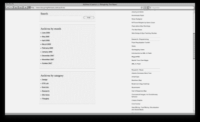

虽然我确实觉得这一页可以推得更远一点，但我喜欢存档与搜索的结合。

这是杰夫·克罗夫特的网站。

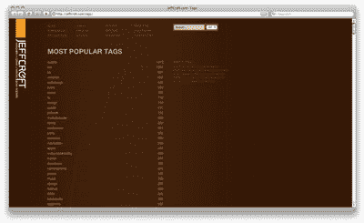

Jeff 在侧边栏实现中使用的条形图样式再次在他的标记归档页面上使用——这是一种直观显示受欢迎程度的令人耳目一新的方式。

还有另一个来自[的出场声明](http://theoldstate.com/blog/?local=archive)！

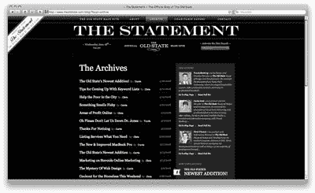

该声明在其存档页面上再次使用了前面提到的侧边栏处理，但也提供了一个时尚、有吸引力的存档页面。

老实说，我不认为我需要说太多关于 AvalonStar 的事情

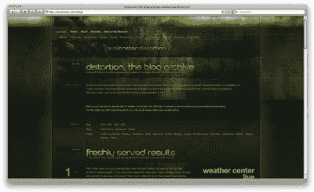

…除了它是华丽的。

##### 结论

我希望你喜欢这次小小的旅行！如您所见，归档列表有多种形式和风格，可以部署多种不同类型的功能。无论你决定在设计一个归档列表时使用什么位置和功能，给它一些额外的爱和关怀。做一些意想不到的美好的事。它就像你家里的那个整理得很好、颜色协调的壁橱。除非你像我一样…

## 分享这篇文章