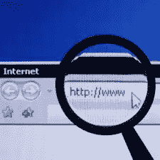

# 你不一定要杀死谷歌才能大赚一笔

> 原文：<https://www.sitepoint.com/you-dont-have-to-kill-google-to-make-a-killing/>

几天前，当 [Cuil](http://www.cuil.com/) 向公众发布时，许多博客和媒体兴奋地谈论这个新的搜索引擎，称其为[谷歌杀手](https://www.sitepoint.com/4-ways-to-beat-google-at-search/)。考虑到该公司描述自己的浮夸方式——抨击谷歌的“肤浅人气指标”,并称自己比谷歌大三倍——这些比较可能是有根据的。但是在尝试了这项服务之后，我们都意识到，至少现在，它们是没有根据的。

由于 Cuil 的搜索结果一直比谷歌的差，一些博客开始想知道为什么他们推出了这样一个 flash。他们当然知道他们的技术还不足以真正与谷歌竞争，对吗？罗伯特·斯考伯写道:“我认为这是为了微软的钱。”。他可能是对的。另一个被过度宣传的搜索引擎 Powerset 在发布时并没有给人留下深刻印象，但很快就被微软套现了，微软在雅虎上坐拥大量现金。成交。

不过话说回来，你不必为了在搜索领域大赚一笔而杀死谷歌。唐·道奇去年做了一些粗略的计算，发现对谷歌来说，搜索市场每 1%的份额就相当于 1 亿美元的收入，每 1 个百分点的市场价值就是 10-30 亿美元的市值。

他总结道:“风投们正在投入巨资，试图找到下一个谷歌。”“像 Powerset 和 Hakia 这样的新进入者会对 2%或 3%的市场份额感到非常满意，尽管他们有更大的抱负。算一算……这太惊人了。”

如果每 1%的市场价值为 1 亿美元的年收入(或者可能更少，因为你的市场份额越小，就越难根据你的搜索结果销售广告)，几个百分点对于这些较小的独立搜索条目来说可能是一笔巨大的交易。“即使是小的搜索引擎公司也能产生巨大的收入，而且非常有价值。道奇在 2007 年 5 月的帖子中评论道:“搜索不是赢家通吃的游戏。

当然，Cuil 或任何其他搜索竞争对手不需要从谷歌那里窃取这些百分点——他们可以从 Ask、AOL 或 Yahoo！在消费者层面上，这些公司可能比谷歌更容易与之竞争。

## 分享这篇文章