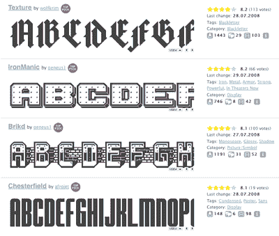

# 使用 FontStruct 创建自己的字体

> 原文：<https://www.sitepoint.com/create-your-own-font-using-fontstruct/>

自从我八岁生日时收到了刻字书 以来，我一直想尝试创作一套具有我自己风格和天赋的字母，但使用专业工具来完成这项任务似乎总是令人望而生畏。

FontShop 的在线 DIY 字体应用程序 [FontStruct](http://fontstruct.fontshop.com) 改变了这一点。FontStruct 使用一个基于 Flash 的界面，是一个完美的“社交软件”的例子——一种为印刷工设计的无线 T2。字体构造工具使用起来直观有趣，图库允许用户分享自己的字体，评论别人的字体，下载别人的创作。

该工具允许您的杰作以 TrueType 格式导出，并提供 IP 限制，因此您可以选择是向全世界开放您的字体，还是将访问权限限制在一组受信任的朋友。

当然，这也有局限性。这个工具永远不会被用来取代像[字体设计师](http://www.fontlab.com/font-editor/fontographer)这样的人。值得注意的是，利用所提供的积木，各种各样的形状都是可能的，但是它们并不允许构建有机的、自由流动的字母形状。

然而，就实现其创建目标而言——(重新)点燃人们对印刷术的兴趣，建立一个崭露头角的字体设计师社区，当然，宣传 FontShop 的专业设计字体目录，FontStruct 以一种非常巧妙的方式做每一件事。

哦，那很有趣。也就是说，直到你到了“K”左右…然后你开始意识到创造一个漂亮的字体是多么困难。

如果你想玩一天字体设计器， [FontStruct](http://fontstruct.fontshop.com) 绝对值得一看。

## 分享这篇文章