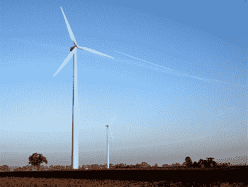
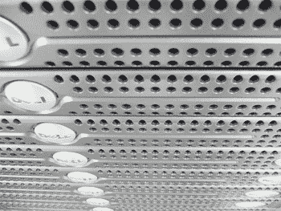
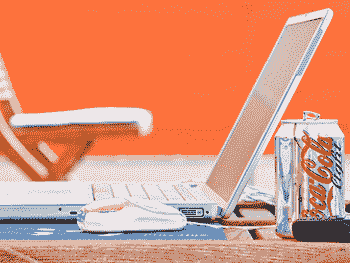
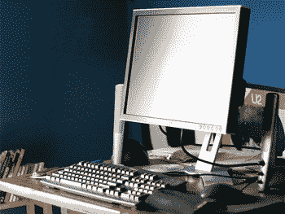
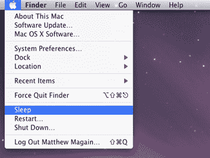
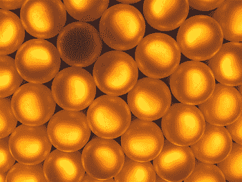
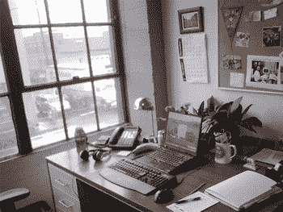

# 成为更环保的网页设计师的 10 个建议

> 原文：<https://www.sitepoint.com/ten-tips-greener-web-designer/>

作为网页设计师，不可否认，电是我们所做的一切背后的原因。没有一种物理替代品——我们工作的任何一部分——完全不消耗能源。

虽然有很多关于气候变化问题的辩论和争议以及不同的统计数据，但有一点是所有人都同意的:减少你消耗的能源对环境和你的钱包都有好处。

当然，我们都知道一些常识性的东西——乘坐公共交通工具或骑自行车而不是开车，穿毛衣而不是开暖气……但我们网络专业人士也可以采取一些具体措施。

作为一名网页设计师，这里有十条建议可以用来减少你的碳足迹。

1.  **Buy green energy.**

    许多电力供应商现在提供购买 100%绿色能源的选择。转向绿色能源是减少排放最有效的方法，而且比自己安装太阳能电池板更便宜。使用绿色能源意味着你可以放心，因为你知道你的企业不会再加剧全球变暖。如果你不是企业主，研究一些绿色能源选项，并把它们展示给你的老板。

    
    *形象功劳:[茉莉](http://www.flickr.com/photos/jasmic/275192902/)*

3.  **Use green hosting.**

    询问你当前的网络主机是否提供绿色主机服务；如果没有，请考虑切换到有此功能的主机。虽然“碳中和”一词是公司营销文案中的标准用语(可能会产生误导，因为它经常与“碳抵消”混淆)，但越来越多的澳大利亚托管公司正在认识到对运行在可再生能源驱动的服务器上的真正绿色的网络托管服务的需求。

    
    *形象功劳:[罗尼加西亚](http://www.flickr.com/photos/ronniegarcia/89655720/)*

5.  **Ditch your desktop machine for a laptop.**

    不可避免的是，笔记本电脑比台式电脑消耗更少的能源。如今，一台笔记本电脑(无论是 Mac 电脑还是 Windows 电脑)都足够快，并且包含足够的内存和硬盘空间，可以作为你的主要机器。此外，当太阳照耀时，你可以在公园里用它工作，在会议上使用它，并在一天结束时把它带回家。

    
    *图片来源:*

7.  **Switch your old CRT monitor for an LCD.**

    如果你想找一个借口扔掉占了你桌子一半的旧 CRT 显示器，用一个可爱的新的、薄的 LCD 显示器取代它，那么现在你有一个了 LCD 显示器，一般来说，比同样大小的 CRT 显示器耗能更少。当然，显示器越大，它消耗的能量就越多，所以如果你决定升级到 30 英寸的宽屏，你可能看不到你的碳排放减少多少。

    
    *形象功劳:[菲尔罗马人](http://www.flickr.com/photos/mdu2boy/150039751/)*

9.  **Turn off your computer and monitor overnight.**

    下班后，办公室里电脑风扇的嗡嗡声太常见了。当然，当我们都在床上时，您的服务器需要整夜运行可能有一个很好的理由，但是如果您决定保留它，您的台式机真的需要全天候运行吗？

    

11.  **Unplug battery chargers overnight.**

    笔记本电脑的充电器、AA 和 AAA 充电电池以及其他电器在插着电源时会产生热量，即使它们没有被使用。让它们插上电源可能很方便，随时可以为你充电，而无需你在桌子下的黑暗中摸索，但只有在你需要使用它们时才插上电源，这将节省一些碳排放，并有助于减少你的电费。

    
    *形象信用:[郊区化](http://www.flickr.com/photos/suburbanbloke/396318113/)*

13.  **Use energy-efficient power boards and light globes.**

    传统的钨丝灯泡效率不是很高——为灯泡提供能量的大量能量以热能的形式流失了。节能荧光灯泡耗电更少，这意味着您的电费将明显下降。电源板也会产生大量的热量，所以多花一点钱买一个高能效的电源板，从长远来看，这是值得的。

    
    *形象信用:[hlkljgk](http://www.flickr.com/photos/hlkljgk/190062167/)*

15.  **Make use of natural light whenever possible.**

    在 SitePoint 总部，我们很幸运有很多窗户，让自然光进入办公室。在夏天，有很多天没有必要打开办公室的大部分灯。自然光不仅免费，还能帮助身体合成维生素 D——打开窗户，吸收掉！

    
    *形象功劳:[史蒂夫伯特](http://www.flickr.com/photos/sburt/2085094950/)*

17.  **Support other green businesses when making a purchase.**

    如果你面临从两个或更多的供应商那里购买商品或服务的选择，并且他们中的任何一个都可能做得很好，那么考虑支持更致力于减少自身碳足迹的供应商。随着“绿色”成为更多企业要求的标准，更多企业将从内部审视如何改变。

    
    *形象信用: [pfly](http://www.flickr.com/photos/pfly/77833615/)*

19.  **Stay informed.**

    如果你关心你和你的企业对环境的影响，但不了解所有的事实，接受教育吧。查看许多关于减少碳足迹的博客([SustainabilityBlog.Org](http://www.sustainabilityblog.org/)和[星球方舟](http://planetark.com/)网站是很好的起点)；研究碳抵消计划是真实的还是有问题的。

你对网页设计师减少碳足迹的方法有什么建议吗？请对本文发表评论，并让我们了解它们！

*特色图片致谢:[阿兹瑞曼](http://flickr.com/photos/azrainman/2047910540/)*

## 分享这篇文章