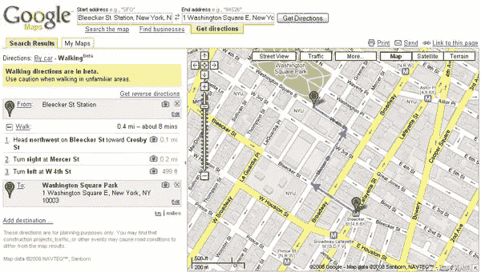

# 谷歌地图推出步行路线

> 原文：<https://www.sitepoint.com/google-maps-launches-walking-directions/>

谷歌地图今天向公众推出了一项新功能:步行导航。本月早些时候，谷歌[测试了步行路线](http://googlesystem.blogspot.com/2008/07/google-maps-tests-walking-directions.html),而[搜索引擎圆桌会议报告](http://searchengineland.com/080722-091323.php)称，今天早上早些时候，这些路线已经在美国各地推广。

步行方向功能还处于测试阶段，它警告用户“在不熟悉的地区行走时要小心”，但它已经知道不要在某些道路上派人。例如，如果从 A 点到 B 点包括在州际公路上跳跃，谷歌甚至不会提供步行方向。

步行和驾车方向的主要区别？我可以看到两个:步行方向会给你提供最短的，大概最安全的(即有人行道的)路线，包括单行道上的交通，时间估计会根据步行的力量进行调整。例如，下图给出了从纽约市布利克街站到华盛顿广场公园的路线。步行路线指引你在三条单行道上走错了路，而驾车路线指引你在另一条路上绕圈子。

随着世界人口的一半现在居住在城市，步行指南将对许多人非常有帮助。此外，步行导航也应该解决类似于 2007 年[悉尼先驱晨报](http://www.smh.com.au/news/web/googles-bum-steer/2007/02/07/1170524144806.html)报道的问题，谷歌地图让人们开车 18 分钟越过一座 3 美元的收费桥，实际上是穿过街道。这似乎是单行道绊倒了地图应用程序，导致了昂贵的路线。

步行指南也让我兴奋，因为我住的地方被最近发布的步行评分给予了“非常适合步行”的评级。自从 Ask 本月早些时候取消地图服务以来，谷歌地图是唯一一个提供步行路线的主要地图产品。

## 分享这篇文章