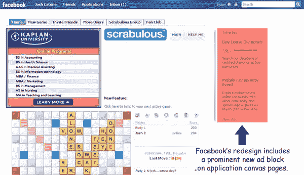

# 脸书的新设计会伤害应用开发者吗？

> 原文：<https://www.sitepoint.com/will-facebooks-new-design-hurt-app-developers/>

关于今天开始推出的[脸书](http://www.techmeme.com/080721/p27#a080721p27)的重新设计，我注意到的第一件事是脸书的社交广告在应用程序页面上的增加。以前，应用程序画布页面在左侧有一个传单，由于在用户可编辑的应用程序导航菜单下方，实际上可能在折叠下方，新的应用程序画布页面有两个脸书广告单元，突出显示在应用程序内容右侧的折叠上方。

AllFacebook 博客的尼克·奥尼尔(Nick O'Neill)也注意到了这些变化，[指出](http://www.allfacebook.com/2008/07/facebook-ads/)脸书现在可以选择在应用画布页面上运行大型半页 300 x 600 广告——传统上是表现较好的广告单元之一。由于目前的限制，应用程序开发者自己不能在他们的应用程序上运行那么大的广告。奥尼尔认为这是对许多脸书广告网络的当头一棒，这些广告网络已经开始支持脸书平台上的应用程序。

“脸书的新销售策略？“当我们可以给你 300 x 250 和 300 x 600 的广告时，为什么还要选择其他脸书应用广告网络呢？””奥尼尔说。

然而，奥尼尔也表示，没有迹象表明脸书计划与应用开发者分享任何应用页面广告收入。脸书试图在应用画布页面上最大限度地增加收入机会是有道理的——这代表着巨大的页面浏览量。但是，如果他们不打算帮助可能受到这一变化伤害的应用程序开发人员，那么他们以外部应用程序广告网络为代价来做这件事是没有意义的。

新的统计数据显示，脸书的申请总数在上升，但日活跃用户数在下降。脸书的重新设计直接着眼于通过阻止“垃圾”应用的传播来减少这种应用疲劳。让应用程序更难赚钱可能会导致那些希望通过“无用”的病毒式应用程序快速赚钱的开发者在开发应用程序时三思而行。但风险在于，通过从脸书应用广告网络抢走客户，并且不与应用开发者分享收入，脸书可能最终也会伤害他们的顶级应用。

我猜测，脸书将在未来的某个时候开始提供对他们内部销售团队的访问，并与顶级应用分享收入，否则他们将冒着破坏整个应用生态系统的风险。

## 分享这篇文章