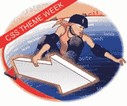

# CSS 主题周:超过你能处理的 CSS 教程！

> 原文：<https://www.sitepoint.com/css-theme-week-more-css-than-you-can-handle/>

 **今天是 SitePoint 的 CSS 主题周！**

亲爱的读者，这对你意味着什么？

这意味着我们已经在[档案](https://www.sitepoint.com/html-css/css/)中搜罗并挑选了我们最喜欢的(也是你最喜欢的)CSS 教程，并将在接下来的五天里每天在 sitepoint.com 的首页上重新发布一篇文章。一定要加入书签(如果你还没有这样做的话，你甚至可以订阅我们文章的 [RSS 源](http://feeds.pheedo.com/sitepoint_recent))。CSS 已经发展了，技术也改变了，但是请放心，这些文章经得起时间的考验。
 **但这还不是全部！**

我们还有一个令人瞠目结舌的新 CSS 技术，我们将在本周中期推出。我们过去发表过一些前沿的东西，但这绝对是超越极限的。我保证你以前没有见过 CSS 这样做…这是很棒的东西。

同时，我想向你介绍我们 CSS 主题周的第一篇文章。请允许我用瑞秋·安德鲁去年的开创性文章来让你重新认识一下…

**[俏皮导航使用 CSS](https://www.sitepoint.com/html-css/)**

这篇文章摘自雷切尔的热门书籍<citetitle>[《CSS 选集》第二版](https://www.sitepoint.com/books/cssant2/)</citetitle> ，是 sitepoint.com 有史以来访问量最高的文章之一。

请务必明天回来查看本系列的下一篇文章。这将是有趣的一周——快乐编码！

## 分享这篇文章