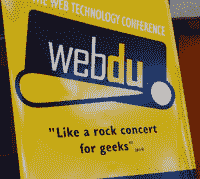

# WebDU 第一天:AIR、Ajax、CS4 和一点可用性

> 原文：<https://www.sitepoint.com/webdu-day-1-air-ajax-cs4-and-a-little-bit-of-usability/>

 悉尼的 [WebDU](http://www.webdu.com.au/) 是澳大利亚基于 Adobe 技术(主要是 Flex 和 ColdFusion)的顶级会议，现已进入第六个年头。2008 年会议的地点是悉尼会议中心——远离过去四年一直举办的星城赌场，尽管没有远离方便但高度以游客为中心的达令港。

WebDU 悠久的传统之一是来自长期合作伙伴和银赞助商设计机构 Nectarine 的开场动画。事实上，当代表们拿起他们的会议包，研究如何使用无线网络并与老面孔见面时，前几年的动画正在主礼堂播放，娱乐着那些等待 Adobe 首席福音传道者迈克·唐尼的开幕主题演讲的人——包括经典的 2005 年的超级英雄(当然，还有可爱的 Sparky)和 2006 年的不要提合并。虽然 2008 年的动画还没有发布，但是之前所有年份的都可以在[油桃的动画作品集](http://animation.nectarine.com.au/)中找到。

**主题演讲:Mike Downey 和 Greg Rewer，Adobe 福音传道者，on AIR，Flash Player 10 和 Creative Suite CS4**

会议组织者杰夫·鲍尔斯致欢迎词后，迈克·唐尼宣布会议开始。开场主题演讲从 Adobe 的最新焦点开始，超越了桌面，概述了 AIR 平台(Adobe 集成运行时)-一种在 Windows、Mac 和 Linux 上运行的桌面客户端，允许 web 开发人员使用 Flash/Flex 或 HTML 和 JavaScript 构建桌面 RIA。Mike 通过在舞台上组装一个简单的 Flash 视频播放器，演示了 AIR 开发的速度有多快。他还演示了 Flash Player 10 的一些新功能，包括 z 轴操作和“像素效果”(视频上的实时渲染效果)，然后转向 beta Flash 创作环境，该环境具有一些非常漂亮的新动画功能和角色动画的反向运动学。和时间线吻别吧，暴露狂们！

创意套件倡导者 Greg Rewis 随后展示了尚未发布的 Fireworks CS4，他厚颜无耻地称之为创意套件产品家族的“私生子”。Fireworks 现在被定位为快速原型制作工具，它可以生成一些非常干净的标记和 CSS——对于网站项目来说，这无疑是一个节省时间的起点。Greg 还运行了 Dreamweaver CS4，该软件可在 Adobe Labs 上作为 CS3 套件所有者的公开测试版获得。Dreamweaver 现在使用 Safari 作为其内部渲染引擎，在设计视图中为其提供了非常好的 web 标准支持。展示的三个新功能是相关文件——快速访问链接的 CSS、JavaScript 和 include 文件——垂直拆分视图，这也允许两个单独的代码视图——和实时视图，我可以最好地描述为在 Dreamweaver 中有一个 Firebug 的交互式版本——对于使用 CSS 和 JavaScript 来说，令人印象深刻。

**第一天会议**

喝完早茶后，代表们分成四个房间进行四个流的会议:Flash/Flex、AIR/JavaScript、ColdFusion 和 Web Essentials。关于 Spry 中的可访问性、CF8 的 PDF 功能、Acrobat 中的 Flex、自定义标签开发和移动 web 的演示以及关于 ActionScript 3 和 AIR 的介绍性会议让与会者忙碌到午餐，之后又回来了解更多内容:cold fusion performance monitoring、CF 中的 Ajax、Google Maps 和 Flash video 等等。

**Stephanie Sullivan:基于 CSS 的 Dreamweaver CS3 布局**

Stephanie Sullivan 是一名资深教师、作家和全面的标准化专家，她在下午的会议上介绍了 Dreamweaver CS3 附带的基于 CSS 的布局，这是她自己为 Adobe 编写的模板。这些模板只是结构性标记，没有图像，没有样式，旨在为不熟悉 CSS 布局的开发人员提供坚实的结构基线，或者为更有经验的 CSS 从业者提供快速入门。Stef 介绍了模板集中包含的五种基本布局类型的原则——固定宽度、流动、弹性、混合和绝对定位(尽管每个人都被敦促远离绝对定位的布局)。然后，她讲述了关于清除和避免“浮动下降”的几点——使用浮动时需要记住的重要事情，许多布局都涉及到浮动。下午晚些时候，Stef 还运行了一个关于解决 CSS 布局问题的配套会议。

Lisa Herrod:为我们其他人进行用户测试

Lisa Herrod 关于用户测试的演讲绝对是我第一天的亮点之一——里面有关于用户测试的非常有用的信息，几乎每个人都可以带走并立即使用。事实上，更多的开发人员没有参加这次会议是一件非常遗憾的事情——澳大利亚的 ColdFusion 和 Flex 项目的质量本可以得到真正的提升！

Lisa 涵盖了通常进行的可用性测试的类型——专家评审、比较评审和用户测试——并为可能被要求开始进行可用性测试的开发人员设计了框架，无论是通过自己学习过程还是通过聘请专业人员。她给出了实际例子，说明每种测试的优势在哪里，如果预算紧张，在哪里可以抄近路(以及在哪里绝对不能抄近路)。她的幻灯片非常有趣。

**使用 ColdFusion 8 进行 Ajax 开发**

印度 Adobe 的工程师 Rakshith N 介绍了 ColdFusion 8 中的新 Ajax 特性。他讲述了 cold fusion Ajax 架构的三个层次——底层 JSON 支持、将服务器端逻辑连接到前端的 Ajax“管道”以及用户界面小部件(YUI 和 ExtJS 组件)—注意到 JSON 支持和“管道”功能可用于连接任何界面库。CFAJAXPROXY 受到了特别的关注，这是一个几乎不可思议的标签，它允许从 JavaScript 直接调用服务器端组件，ColdFusion 的“管道”负责数据类型转换和其他此类讨厌的事情。

Ajax 的内置特性是许多 ColdFusion 开发人员对 Ajax 的第一次体验，所以我不认为他们中的许多人意识到它们是多么强大和省时。听到直接参与这些功能的工程师之一 Rakshith 的意见真是太好了——你不得不假设他比几乎任何人都更了解这些功能！

**金并保龄球馆**

虽然 WebDU 的社交方面一直很重要，但该团队今年通过他们的特别活动绝对超越了自己——整个金并保龄球馆、游泳池、街机游戏和激光标记中心都被预订了一晚，供所有与会者使用。如果这还不够，前三个小时的饮料和小吃是免费的。

从所有的报道来看，每个人都度过了一段美好的时光。有传言说，尽管发现了卡拉 ok 角，大多数代表甚至参加了第二天的主题演讲…但那是另一个帖子。

在 Flickr 上查看来自 WebDU 的照片。

## 分享这篇文章