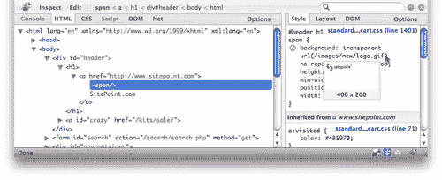

# 浏览器内开发工具:Firebug 仍然是王者

> 原文：<https://www.sitepoint.com/in-browser-development-tools-firebug-still-king/>

今年年初，我坐下来写了[的“错误和调试”一章，简单来说就是 JavaScript](https://www.sitepoint.com/) 。我掰着手指头，一头扎进 JavaScript 调试工具的版图，几个小时后失望而归。当时，Firefox 是唯一一个拥有值得一提的 JavaScript 调试工具的浏览器: [Firebug](http://getfirebug.com/) 。

不到一年后，情况发生了巨大变化。每个主流浏览器都引入了新的开发工具，使得在有问题的浏览器中诊断 HTML、CSS 和 JavaScript 代码的问题变得更加容易。但是，这些工具能与 Firebug 提供的流畅且功能强大的工具相抗衡吗？让我们来看看。

## 微软公司出品的 web 浏览器

Internet Explorer 因动辄出现神秘的渲染行为和无用的 JavaScript 错误消息而臭名昭著，微软显然正在齐心协力地改善浏览器本身，以及开发人员可用于诊断此类问题的工具。

用于 IE6 和 IE7 的 [Internet Explorer 开发者工具栏](http://www.microsoft.com/downloads/details.aspx?familyid=e59c3964-672d-4511-bb3e-2d5e1db91038&displaylang=en)是一个非常有用的工具，当你正在寻找这些浏览器中渲染问题的解决方法时，它可以动态地调整页面样式。它用于诊断 CSS 中实际错误的特性虽然笨拙，但是很有能力。例如，它的“跟踪样式”功能可以让你查看应用于某个元素的规则列表，但它无法与 Firebug 提供的 CSS 层叠一览视图相媲美。

至于 Internet Explorer 中的 JavaScript 调试，情况并不乐观。微软脚本调试器是免费下载的，但是它有太多的错误、不稳定和混乱，你会希望它不是。微软脚本编辑器是一个还过得去的调试器，但它只随微软 Office XP 和 Office 2003 一起发布——你再也找不到它了。

你*能*得到的是 [Visual Web Developer 2008 速成版](http://www.microsoft.com/express/)，它包括一个极其圆滑和强大的 JavaScript 调试器。如果你正在构建一个 ASP。NET 支持的站点，您甚至可能想用它来构建您的站点，在这种情况下，使用它的 JavaScript 调试器是轻而易举的事情。但是，如果您只想将它用作 JavaScript 调试器，那么您可能会遇到麻烦。如果你的页面抛出一个 JavaScript 错误，那么你可以[欺骗 Visual Web Developer 调试你的站点](http://www.berniecode.com/blog/2007/03/08/how-to-debug-javascript-with-visual-web-developer-express/)。如果没有实际的错误，但你只是试图追捕一些奇怪的行为，你可能需要支付数百美元的 Visual Studio 2008，它可以[连接并调试正在运行的 Internet Explorer 进程](http://blogs.msdn.com/kaevans/archive/2007/08/10/javascript-debugging-in-visual-studio-2008.aspx)。

Internet Explorer 8 通过对开发人员工具栏的功能进行一些改进，添加一个可靠的 JavaScript 调试器，并将其内置到浏览器中，使事情变得更加简单。随着 IE8 Beta 1 的发布，微软让我们提前了解了这些改进的工具。尽管 Firebug 看起来很有前途，但它的一些高级功能(如网络监控和分析)仍然缺失。

总之，Internet Explorer 的情况不确定，但正在改善。让我们看看其他主流浏览器的表现…

## 旅行队

Safari 今年已经取得了长足的进步，而且会变得更好！随着 Safari 3 的发布，不仅基于 Windows 的开发人员可以使用这款浏览器的本地版本来测试他们的设计，WebKit 团队还为开发人员提供了一系列新工具。

首先是 Web 检查器，您可以在 Safari 3.1 中通过启用“开发”菜单(在 Safari 偏好设置的“高级”标签上)来访问它。它不仅提供了与 Firebug 中相同的强大的动态 CSS 调整和 CSS 级联一览视图，还包括类似 Firebug 的网络监控。

Safari 3 还为 Safari 引入了优秀的 JavaScript 调试器: [Drosera](http://trac.webkit.org/wiki/Drosera) 。一旦你配置了 Safari 允许调试器连接，你就可以在浏览器旁边启动 Drosera，用它来指出 JavaScript 代码的问题。

尽管 Drosera 工作得很好，但肯定有人认为将 JavaScript 调试器直接构建到 Web Inspector 中会更好。这正是 WebKit 当前开发版本所做的，因此我们可以放心地期待 Safari 3.2 中内置的 JavaScript 调试器，目前预计在 9 月份推出。

仅仅一年的时间，Safari 已经从几乎不提供任何值得一提的开发工具发展成为拥有最灵活(也几乎是最强大)的工具。WebKit 团队显然火了。

## 歌剧

像 Safari 一样，刚刚发布的 [Opera 9.5](http://www.opera.com/) 自上一版本以来获得了一些令人印象深刻的新开发工具。被称为[蜻蜓](http://www.opera.com/products/dragonfly/)的歌剧不仅仅是对萤火虫的回应；这是一个独立于浏览器的 web 调试工具平台。

蜻蜓不仅可以检查 HTML 和 CSS，调试运行在 Opera 9.5 中的页面的 JavaScript，还可以连接到运行在 Windows Mobile 智能手机上的最新版本的 Opera Mobile。由于该平台是开源的，其他浏览器理论上也可以增加对蜻蜓的支持。

就目前而言，蜻蜓仍然是一个早期的努力。Opera 9.5 可能已经出来了，但是它内置的开发者工具还是有点 bug 和不稳定。目前，蜻蜓还是只读的:你不能像使用其他浏览器工具那样动态编辑你的 HTML 或 CSS。然而，Opera 承诺现场编辑正在进行中；这一点，再加上一些小问题，蜻蜓应该会成为浏览器内开发工具竞赛中的有力竞争者。

## 火狐浏览器

…这又让我们回到了 Firefox，在这里， [Web Developer extension](http://chrispederick.com/work/web-developer/) 和 [Firebug](http://getfirebug.com/) (以及其他)的组合已经确保了它作为大多数 Web 开发者的首选浏览器的地位。

Firebug 尤其在这场比赛中处于领先地位，但在过去的一年里，Firebug 的变化主要表现在性能改进和火狐 3 的兼容性更新上。Firebug 的创建者乔·休伊特昨天在 Firefox 3 发布前夕对 Firebug 说了这样的话:

> Firebug 1.2 是与 Firefox 3 兼容的新版本。不要因为新版本而感谢我，因为我没有为它写一行代码。这要归功于去年围绕 Firebug 兴起的开源社区，由 IBM 的 John J. Barton 领导。他们的工作非常出色，让我对让 Firebug 免费开源的决定感觉非常好。

在过去的一年里，人们在 Firebug 上做了大量的工作，但是很少有新的功能或其他改进能让它对开发者更有用。Firefox 的竞争对手有足够的机会用一套与之竞争的开发工具偷走开发人员的心。

尽管如此，Firebug 仍然是 web 开发人员诊断和修复 HTML、CSS 和 JavaScript 代码中的问题的唯一功能最强大的工具。其他浏览器已经取得了很大进步(特别是 Safari，它只缺少几个小功能，用一个非常光滑的用户界面来弥补)，但没有一个浏览器拥有 Firebug 一年多来所拥有的一切。

当然，浏览器特有的 bug 一直都在发生，所以每一个提供一套全面的开发者工具的浏览器都会受益。然而，现在，由于 Firebug，Firefox 仍然是大多数开发者想要称之为家的浏览器。

## 分享这篇文章