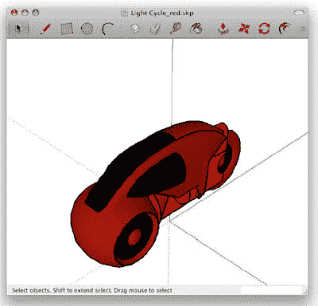
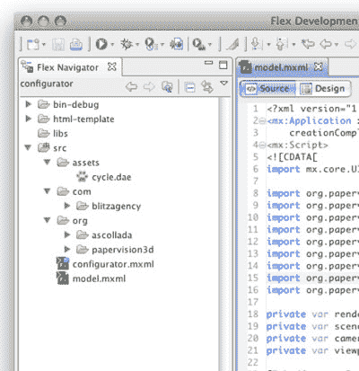
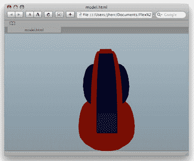
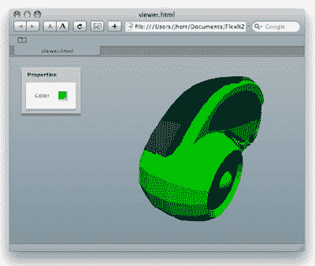

# 在 Flex 3 中创建 3D 产品查看器

> 原文：<https://www.sitepoint.com/create-3d-product-viewer-flex-3/>

***这是我们最近在 sitepoint.com 推广 Flex 文章的[竞赛中的获奖文章。](https://www.sitepoint.com/adobe-flexair-article-competition-and-the-winners-are/)***

我记得我第一次在[迷你美国网站](http://www.miniusa.com)上看到[迷你配置器](http://www.miniusa.com/#/build/configurator/mini_convs-m)。我被震撼了——我喜欢玩色彩和选项——这是一种只有 Flash 应用程序才能提供的真正身临其境的体验，我敢肯定它的销量超过了几台 Minis。

从那时起，我就想创建一个自己的，在这篇文章中，我会告诉你如何做到这一点。对于本例，我将假设您已经掌握了使用 Flex 3 的基础知识——您已经安装了 Flex Builder 3 等编辑器，熟悉 MXML 和 ActionScript 3，并且能够创建基本的应用程序。如果你正在学习初学者教程，或者需要复习，试试里斯·塔格的初学者教程。

##### 入门指南

“配置器”的想法非常简单:提供某个对象的 3D 模型，然后允许用户改变颜色，或者隐藏和显示模型的各个部分。

要构建自己的配置器，您需要三样东西。

1.  3D 建模工具

3.  一个物体的 3D 模型(可以是你下载的，也可以是你自己创建的)

5.  用于在 Flex 应用程序中显示该模型的工具

至于 3D 建模工具，我发现谷歌的 Sketchup 是理想的。这是免费的，这总是好的，但另一个好处是 Sketchup 格式的庞大模型数据库，可在 [Sketchup 3D 仓库](http://sketchup.google.com/3dwarehouse/)中获得。
下载并安装 Sketchup 后，我访问了 3D 仓库，并选择了一个模型用于我的应用程序。对于这篇文章，我选择了迪士尼电影《创》中的一个光周期。我决定使用这个对象，部分是因为文化原因(每个真正的极客都喜欢这部电影)，部分是因为它的形状相当简单，所以允许用户改变它(例如，改变它的颜色)不会太复杂。

我使用的灯光循环模型显示在下图中。



我的模型光周期实际上并不存在于上图的精确格式中。首先，有一对光周期——我删除了第二个，并稍微倾斜了剩下的周期，以便以完全垂直的形状开始。我建议你对自己的模型也这样做。

您还应该重新定位您的模型，使其以原点为中心(该点由 Sketchup 中红色、绿色和蓝色线的交点表示)。这一步非常重要，因为当你加载模型时，你想知道它在场景中的位置。如果模型漂浮在空间的某个地方，它将很难被找到，所以要确保它的方向围绕着点(0，0，0)。

要将灯光循环导入到 Flex 应用程序中，您需要以标准文件格式保存它。3D 任务最流行的格式似乎是 Collada，但不幸的是,*导出为 Collada 格式*功能仅在 Sketchup Pro 中可用。

幸运的是，我有一个锦囊妙计:如果你以 Google Earth 格式导出模型，Google Earth `.kmz`文件中会隐藏一个 Collada 文件。你需要做的就是把谷歌地球文件的扩展名从`.kmz`改成`.zip`，然后解压文件。在解压缩后的文件中，您会发现一个名为`models`的目录，其中包含了 Collada 模型。瞧啊。您已经从 Sketchup 的免费版本中导出了一个 Collada 文件！

##### 安装 PaperVision 3D

有了 Collada 模型，是时候找到一种方法将光周期导入 Flex 应用程序中了。我们的第一个任务是为 Flash 选择一个 3D 渲染引擎来显示它。目前有两个免费的 3D 引擎可供选择；PaperVision 3D 和 [Away3D](http://away3d.com/) 。对于这个例子，我选择 PaperVision 是因为它与 ASCollada 库集成，as Collada 库是一个非常全面的 action script coll ada 解析器。

要下载 PaperVision 3D 的最新版本，请从 PaperVision Subversion 存储库中执行 SVN 签出。如果您不习惯使用 Subversion，您可以从本文的代码档案库下载我用来创建这个例子的文件。

然后创建一个新的 Flex 应用程序项目(使用 Flex Builder 3 或 Flex 3 SDK ),并将`GreatWhite`分支中的`com`和`org`目录复制到您的 Flex 应用程序项目中。

接下来新建一个`assets`文件夹，把我从 Sketchup 导出的模型文件复制到里面；将该文件称为`cycle.dae`。如果您的模型包含纹理文件，那么您也需要将这些文件复制到 Flex 项目中。你还需要编辑`.dae`文件(实际上只是 XML)来确保纹理对象指向正确的纹理路径。谢天谢地，我们在这个例子中使用的小光循环模型没有使用任何纹理。

一切就绪后，您的项目应该类似于下图所示。



目录保存了模型和它需要的任何纹理。而`com`和`org`文件夹来自 PaperVision 大白码。

##### 查看模型

为了尝试一下，我们将首先尝试一些非常简单的事情:查看模型。这个 Flex 应用程序的代码，我称之为`model.mxml`，如下所示:

```
<?xml version="1.0" encoding="utf-8"?>  

<mx:Application xmlns:mx="http://www.adobe.com/2006/mxml" layout="horizontal"  

  creationComplete="onInit(event);">  

<mx:Script>  

<![CDATA[  

import mx.core.UIComponent;  

import org.papervision3d.cameras.FreeCamera3D;  

import org.papervision3d.render.BasicRenderEngine;  

import org.papervision3d.objects.parsers.DAE;  

import org.papervision3d.objects.DisplayObject3D;  

import org.papervision3d.scenes.Scene3D;  

import org.papervision3d.view.Viewport3D;  

private var renderer:BasicRenderEngine = new BasicRenderEngine();  

private var scene:Scene3D = new Scene3D();  

private var camera:FreeCamera3D = new FreeCamera3D();  

private var viewport:Viewport3D = new Viewport3D( 200, 200, true, true );  

[Embed(source="assets/cycle.dae", mimeType="application/octet-stream")] private var  

MyModel:Class;  

protected function onInit( event:Event ) : void {  

  var flexComp:UIComponent = new UIComponent();  

  cnvUnderneath.addChild( flexComp );  

  flexComp.addChild( viewport );  

  var modelCol:DAE = new DAE();  

  modelCol.load( XML( new MyModel() ) );  

  var model:DisplayObject3D = scene.addChild( modelCol );  

  camera.y = -2000;  

  camera.z = 2500;  

  camera.lookAt( model );  

  addEventListener(Event.ENTER_FRAME,onEnterFrame);  

}  

private function onEnterFrame( event : Event ):void  

{  

  renderer.renderScene(scene,camera,viewport);  

}  

]]>  

</mx:Script>  

<mx:Canvas id="cnvUnderneath" width="100%" height="100%" />  

</mx:Application>
```

这就像 3D 一样简单——不可否认，并不特别简单。要以 3D 方式渲染，您需要四条信息:

1.  场景:模型在空间中的布局。

3.  **Viewport**:将接收渲染图像的 Flash sprite。

5.  **摄像机**:这是摄像机，或者更具体地说，摄像机在场景中的位置和旋转。

7.  **渲染器**:获取场景和摄像机并为视口渲染图像的引擎。

在不分解每一行的情况下，我们的`onInit`方法(在应用程序启动时调用)执行以下操作:

1.  加载模型。

3.  将模型添加到场景中。

5.  定位摄像机。

7.  让摄像机看着模特。

由于我们的模型位于位置(0，0，0)，上面的代码通过调整 *y* 和 *z* 坐标将相机从模型上移开。`onEnterFrame`方法通过使用渲染器将场景渲染到视口中来完成任务。

在 Flex Builder 3 中启动这个应用程序，您应该会看到如图 3 所示的视图。



不算太寒酸！事实上，我们在这里取得的成就意义重大——尤其是考虑到 Collada 实际上是一个非常复杂的 XML 标准。您可能会发现，并非所有从 Sketchup 导出的模型都适用于 PaperVision，事实上，您可能需要对 Sketchup 模型(以简化形状)和 Flex 应用程序进行一些调整，才能产生良好的效果。

另一个需要记住的要点是，模型越复杂，加载和渲染的时间就越长。因此，你应该让你的模型*尽可能简单*。例如，如果您的模型是一辆汽车，并且您希望允许您的用户选择底盘的油漆颜色，那么您的模型不应该包括任何有关汽车内部的信息。所有这些内部的东西代表了不必要的复杂性，会导致性能下降和用户加载时间延长。

##### 与模型互动

为了简单起见，我们将把配置器用户可以进行的更改限制为一项，即灯光周期的颜色。这意味着我们要改变模型中使用的“材料”的颜色。所有的 3D 模型都是由覆盖在“材质”上的多边形组成的该材质可以以各种方式着色、着色、纹理化、凹凸贴图和扭曲。在这种情况下，我们将使用着色材料。

我们的光循环颜色配置器的代码如下所示:

```
<?xml version="1.0" encoding="utf-8"?>  

<mx:Application xmlns:mx="http://www.adobe.com/2006/mxml" layout="horizontal"  

creationComplete="onInit(event);">  

<mx:Script>  

<![CDATA[  

import mx.utils.ColorUtil;  

import mx.core.UIComponent;  

import org.papervision3d.materials.utils.MaterialsList;  

â‹®  

import org.papervision3d.lights.PointLight3D;  

private var renderer:BasicRenderEngine = new BasicRenderEngine();  

private var scene:Scene3D = new Scene3D();  

private var camera:FreeCamera3D = new FreeCamera3D();  

private var viewport:Viewport3D = new Viewport3D( 200, 200, true, true );  

private var model:DisplayObject3D = null;  

[Embed(source="assets/cycle.dae", mimeType="application/octet-stream")] private var MyModel:Class;  

protected function onInit( event:Event ) : void {  

  var flexComp:UIComponent = new UIComponent();  

  cnvUnderneath.addChild( flexComp );  

  flexComp.addChild( viewport );  

  loadModel();  

  camera.y = -2700;  

  camera.x = 0;  

  camera.z = 2000;  

  camera.lookAt( model );  

  addEventListener(Event.ENTER_FRAME,onEnterFrame);  

}  

private function loadModel() : void {  

  if ( model != null )  

  scene.removeChild( model );  

  var light:PointLight3D = new PointLight3D( true,true );  

  light.z = -2000;  

  light.x = 500;  

  light.y = 500;  

  var lightColor:uint = 0x111111;  

  var modelCol:DAE = new DAE();  

  modelCol.scale = 1.1;  

  modelCol.load( XML( new MyModel() ), new MaterialsList( {  

    material0:new FlatShadeMaterial( light, 0x000000, lightColor ),  

    ForegroundColor:new FlatShadeMaterial( light, 0x000000, lightColor ),  

    material1:new FlatShadeMaterial( light, clrPicker.selectedColor,  

      lightColor ),  

    material2:new FlatShadeMaterial( light,  

    mx.utils.ColorUtil.adjustBrightness(clrPicker.selectedColor,-20), lightColor ),  

    FrontColor:new FlatShadeMaterial( light, 0xFFFFFF, lightColor ),  

    material3:new FlatShadeMaterial( light, 0x000099, lightColor ),  

    material4:new FlatShadeMaterial( light,  

    mx.utils.ColorUtil.adjustBrightness(clrPicker.selectedColor,-200), lightColor )  

  } ) );  

  modelCol.roll( 28 );  

  model = scene.addChild( modelCol );  

  light.lookAt(model);  

}  

private function onEnterFrame( event : Event ):void  

{  

  renderer.renderScene(scene,camera,viewport);  

}  

]]>  

</mx:Script>  

<mx:Panel title="Properties">  

  <mx:Form>  

    <mx:FormItem label="Color">  

      <mx:ColorPicker id="clrPicker" selectedColor="#8888DD"  

        change="loadModel();" />  

    </mx:FormItem>  

  </mx:Form>  

</mx:Panel>  

<mx:Canvas id="cnvUnderneath" width="100%" height="100%" />  

</mx:Application>
```

如您所见，我已经将加载模型的代码转移到一个名为`loadModel`的新方法中。当 Flex 应用程序启动时，以及用户选择新颜色的任何时候，都会执行该方法。

我们的代码还为加载 Collada 光周期模型的 DAE 解析器提供了一个`MaterialList`对象。这个素材列表对应于 Google Sketchup 导出的素材。我通过自己查看 DAE 文件并试验哪些材料改变了周期的哪些部分，找到了这些名字。

我为颜色部分选择的材料是一种`FlatShadedMaterial`。这种材料需要:

*   光源
*   材料的颜色
*   灯光的颜色

我们使用颜色选择器提供的颜色，并使用`ColorUtil` Flex 类将其调整为更暗或更亮。

在 Flex Builder 中运行我们的配置器应用程序会产生以下结果。



我们的用户现在可以使用标准的`ColorPicker`控件选择一种颜色，灯光循环模式也会随之改变。

提供光源确实给我们的模型增加了一些深度，这在第一次渲染时并不明显。此外，我们的模型显然是由多边形构建的，这实际上增加了整个“Tron”的外观和感觉。

##### 从这里去哪里

你可以从很多方面来理解这个例子。例如，您可以通过调整模型中`DisplayObject3Delements`属性的`visible`参数来隐藏或显示模型的各个部分；您可以通过允许用户使用鼠标改变摄像机的位置来添加一些与模型的直接交互；你甚至可以在模型上使用 Flex 效果，让它在顾客开车兜风时发光、褪色或放大。

无论您选择哪个方向，您都可以从这段代码中获得很多乐趣(不要忘记[下载它](https://www.sitepoint.com/examples/flex3d/flex3dconfigurator.tgz)！).我期待很快在网上商店的橱窗里看到你的作品！

## 分享这篇文章