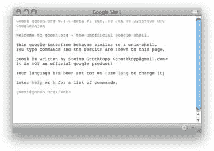

# Goosh:从命令行使用 Google

> 原文：<https://www.sitepoint.com/goosh-google-from-the-command-line/>

 我爱命令行。

当然, [WIMP](http://en.wikipedia.org/wiki/WIMP_(computing)) 范式将个人电脑从默默无闻中带到了不太懂技术的人手中。但是如果你想知道*到底在做什么，答案只有一个——抛开漂亮的图标、下拉菜单、标签和确定/取消按钮，直接进入命令行。*

提示符的威力是无与伦比的，不管你运行的是 Windows、Mac 还是 UNIX/Linux。从命令行，您可以监视系统进程，查看通常隐藏的目录，修复操作系统图形界面搞砸的权限问题。当然，有一个学习曲线。但是一旦你在记忆中记住了合理数量的有用命令，你执行这些任务的速度就会快得多，因为你的手指不需要离开键盘一次。

我怀疑这就是为什么斯特凡·格罗特科普创造了 [Goosh](http://goosh.org/) “非官方的谷歌外壳”

Goosh 是一个基于 Ajax 的 web 应用程序，它为 Google 提供了一个命令行界面，而且它很快。谷歌的命令行界面并不是什么全新的东西( [YubNub](http://yubnub.org/) 和 [Firefox 自己的键盘快捷键](http://lifehacker.com/software/geek-to-live/geek-to-live-fifteen-firefox-quick-searches-129658.php)浮现在脑海中)，但它的功能就像一个命令提示符，甚至为那些忘记他们实际上不是在与真正的 UNIX shell 交互的命令行爱好者提供了一堆 UNIX 命令的别名。我有没有提到它是*快*？其结果是一个了不起的和非常有用的方式来执行快速搜索每个人最喜爱的搜索引擎。

为了更进一步，我花了大约五秒钟为 Goosh 创建了一个 [Mozilla Prism 应用程序](https://www.sitepoint.com/mozilla-prism-stuck-in-the-middle-with-ui/)(如上图所示)。啊……我与谷歌的互动从网络到桌面的迁移完成了。

现在，我想知道如果我输入`rm -rf *`会发生什么？

## 分享这篇文章