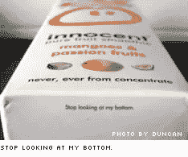
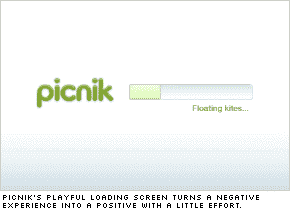

# 你有用户体验吗？

> 原文：<https://www.sitepoint.com/are-you-user-experienced/>

上周五，我很幸运地在一个网络会议上呆了一整天，却没有看到一行 HTML 或一个 CSS 声明。事实上，我甚至不记得曾经听过“Ajax”这个词。

不过我学到了很多！

毫无疑问，网络是一种相对技术性的媒介，所以我们有充分的理由花大量时间思考、讨论和实践网络的技术技能。

然而，当你归结起来，网络实际上只是一个巨大的、过于复杂的管道，人类用它来相互传递信息。

粗略地看一下写在代码、标准和其他技术问题上的数百万页，我们可能花了太多的时间来思考我们的喊叫是如何传递的，而没有足够的时间来思考我们是如何喊叫的。

什么是好的呐喊背后的理论被广泛地称为网络的软技能——如用户体验设计，信息架构，可用性测试和研究设计——这正是《网络方向:用户体验》的全部内容。

安迪·巴德可以说是世界上最知名的“用户体验设计师”，并以对我来说是一天中最好的演示开始了早晨。

安迪的主要想法是认真审视我们在现实世界中的美好体验，看看我们如何将它们应用到网络上。

对于我们大多数人来说，假期是我们最紧张和最难忘的经历，安迪花了很多时间讨论豪华酒店用来给你的经历打上美好感觉的一些技巧。在安迪看来，创造这些良好氛围的最关键时刻是你经历的开始:当你问自己“这将是一个好地方吗？”当你离开时，当你问“这是个好地方吗？”

酒店通过将他们最有经验和最精明的员工——经理、门卫、搬运工和接待员——安排在“体验链”中最敏感的地方来应对这一挑战他们已经发现，如果酒店能够确定开始和结束的时间，那么在这两个时间之间就会发生一场大灾难来破坏顾客的体验。

这也解释了从拉斯维加斯到巴黎到莫斯科，大量的时间、金钱和精力被投入到酒店大堂。我们大多数人都很难摆脱这种异想天开的感觉，因为我们将车停在一个宽敞、豪华的大厅里，穿着时髦的人对我们异常友好。多年后，那段记忆仍然是我们最强烈的记忆之一。

现在，公平地说，是的，很难构建能够真正与豪华酒店的沉浸式超负荷感官竞争的在线应用程序。

但是，对我来说，它确实证明了酒店是如何成功地将可能是必要但情感空虚的体验——毕竟，入住过程是为了酒店的利益，而不是你的利益——重新设计成你旅途中快乐、难忘的亮点。

非常聪明的把戏。

交互设计师认为，体验应该符合“需求层次”——从最基本的功能，到最有意义的体验。

对我们所有人来说，可悲的事实是，绝大多数“网络体验”都属于这个三角形的下半部分。我们都知道网络世界充斥着情感空虚的体验。

例如，你见过多少次下面的内容:

*   禁止进入。请登录以继续。
*   抱歉，找不到页面。请再试一次。
*   正在加载…… 64%…65%…
*   用户错误！关键字 1 的重复条目“24”

我们可能都为设计了在某些时候用这种声音说话的网站而感到内疚——我知道我是这样。我们无畏的用户需要一些反馈，我们没有安抚他们，让他们放心，而是像停车检查员一样热情地拍打他们。

事实是，当我们写这些小通信时，我们可能不会想太多。它们通常功能模糊，所以我们通过死记硬背把它们抽出来，然后转移到更重要和有趣的事情上。

问题是，当我们这样做的时候，我们错过了一个巨大的机会。我会解释的。

在 SitePoint，我们都定期处理客户支持邮件(甚至是首席执行官)。这些年来我们学到的一件事是，一个错误(例如，一个延迟的图书订单)往往是一个创造终身粉丝的难得机会。

一般来说，当这些顾客来找你的时候，他们脾气暴躁(通常都是这样)并且想要打架。当你快速而礼貌地解决他们的问题，让他们觉得自己很特别时，他们通常会非常惊讶和感激。真正具有讽刺意味的是，与订单顺利完成相比，他们往往会更加印象深刻和高兴。如果你处于被动，你实际上会有更多的机会给人留下持久的印象。

[Photo by duncan](http://www.flickr.com/photos/duncan/2084134925/)

同样，当你设法在人们意想不到的地方注入“人情味”时，他们更容易受到影响。

安迪展示了一个很好的例子，说明这个原则在 Innocent Smoothie 盒子上的应用。

任何盒子的底面通常是任何产品包装上最没用的表面。然而，对于少量黑色墨水的成本，无辜的包装设计者为任何碰巧瞥一眼底部的人提供了“Awwwww，..真可爱！”瞬间。盒子底部用小字印着“不要看我的底部”。

有那么一瞬间，一个不起眼的包裹穿过来了，给了你一个眼色，像真人一样和你说话。一周后，当你站在一堵高耸的冷饮墙前时，那些“温暖而模糊”的声音很有可能会回响在你的脑海中。

那么，这一原则到底会如何转移到网络上呢？

 我最近看到的最好的例子之一就是[Picnik.com](http://www.picnik.com/)。

毫无疑问，Picnik 是一个非常好的应用程序。

它非常漂亮，设计巧妙，功能齐全。

但往往是一些小事给人留下最深刻的印象。

当 Picnik 开始非常必要的下载和设置过程时，他们的普通进度条伴随着一些随机的“进度评论”。

*   采摘黑莓…
*   做三明治…
*   漂浮的风筝…
*   铺毯子…
*   温暖的微风…

是的，毛绒绒的，有点傻。不，它没有告诉用户他们需要知道的任何事情。然而，Picnik 设计团队几乎不费吹灰之力就成功地将一种空洞的、完全没有价值的体验(观看进度条)转化为一种体验，同时建立了他们的品牌和用户的期待感。

失败变成了胜利。

那么，现在去哪里？

对我来说，也许第一步只是意识到这些“死角”在哪里——很容易遵循过去没有被质疑的相同模式。学会用真正新鲜的眼光看待进度条和错误信息比听起来要难。

思考一下你最近的网站发展。你能找出任何你可以扭转的“空虚经历”吗？

如果你有兴趣听听 Andy 对用户体验和网络的看法，Matt 很幸运在会议结束后与 Andy 共度了一段美好时光。你可以在 SitePoint 上阅读安迪的采访记录。

###### 从[设计视图#45](https://www.sitepoint.com/the-second-coming-of-the-productivity-tool/) 重新发布

## 分享这篇文章