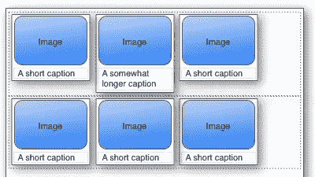

# Firefox 3 中新增的两个隐藏功能

> 原文：<https://www.sitepoint.com/two-hidden-features-new-in-firefox-3/>

上周，Firefox 3 发布候选版本 1 向世界公布，这意味着距离最终版本只有一个月的时间了。如果你还没有检查你的网站在新的浏览器中运行顺畅，现在是时候了！

除了一些(可以理解的)愤怒的 Linux 用户之外，大多数人似乎认为 Firefox 3 代表了终端用户的一个巨大飞跃。这款浏览器比之前的[*快得多*](http://www.mozilla.com/en-US/firefox/3.0rc1/releasenotes/#performance)*，更好看，并且拥有一些令人敬畏的新[终端用户功能](http://developer.mozilla.org/en/docs/Firefox_3_for_developers#New_features_for_end_users)。*

 *对于我们开发者来说，关于火狐 3 的主要改进已经说了很多。像内置支持功能 web 应用程序的[离线工作](http://developer.mozilla.org/en/docs/Online_and_offline_events)与[本地缓存数据](http://developer.mozilla.org/en/docs/Offline_resources_in_Firefox)，以及[整页缩放](http://developer.mozilla.org/en/docs/Full_page_zoom)使得为视障用户设计更容易，这些都是很好的东西，但是在这篇文章中，我将借此机会看看几个可能很容易被忽略的功能。

## 软连字符

隐藏在火狐 3CSS 改进列表中的是这个看起来无害的功能:“现在支持 HTML 软连字符(`&shy;`)

软连字符是 HTML 一直[在*纸张*](https://www.w3.org/TR/REC-html40/struct/text.html#h-9.3.3) 上支持的那些晦涩难懂的宝石之一，但是没有人注意到这一点，因为浏览器的支持一直不稳定。然而，随着 Firefox 3 的即将发布，所有主流浏览器都将支持软连字符**，包括 Internet Explorer、Safari 和 Opera。**

那么，什么是软连字符呢？

软连字符是通常不可见的文本字符。它在文本中(通常在一个长单词的中间)标出了一个可以用连字符换行的地方。

当支持软连字符的浏览器遇到一个没有明显换行点的长单词或其他长文本时，它会在文本中查找软连字符，并将其显示为后跟换行符的普通连字符。

看一下这个代码示例:

```
<div style="width: 10em; border: 1px solid red;">
  Supercalifragilisticexpialidocious
</div>
```

在任何浏览器中显示这个，长字会从`div`的侧面突出来。


这种情况在现实世界的网页设计中时有发生。假设你有一个占据页面宽度 25%的导航菜单。在浏览器窗口足够小的情况下，菜单项中的一个特别长的单词要么会从菜单中杂乱地突出到页面的另一部分，要么会迫使菜单增加宽度，这可能会破坏页面布局。

软连字符来拯救！

```
<div style="width: 10em; border: 1px solid red;">
  Supercalifragilistic&shy;expialidocious
</div>
```


Firefox 3 将是最后一个添加软连字符支持的主流浏览器，但你不必等到它发布就可以开始使用它们！Firefox 2 只是忽略这个字符，让它不可见(并让你的文本从它的框中突出)。作为后备还不错，尤其是与 Safari 相比，Safari 过去常常将其显示为普通的连字符！谢天谢地，Safari 2 或更高版本做对了。

根据您编辑 HTML 的方式，您可能只想插入软连字符本身，而不是 HTML 字符实体引用(`&shy;`)。这将节省几个字节，好的代码编辑器( [jEdit](http://jedit.sourceforge.net/) )将软连字符显示为普通连字符，所以你可以在你的代码中看到它们。有些人甚至聪明到在检查拼写时忽略软连字符！

您可以在 Windows 中键入软连字符，方法是按住 Alt 键，然后在数字键盘上键入 0173，或者在数字键盘上键入加号键，然后在释放 Alt 键之前键入 00AD。如果你不记得了(我肯定不记得了)，或者如果你在 Mac 上，你可以在字符映射表(Mac OS X 的字符调板)中找到软连字符。

如果您决定在代码中使用实际的软连字符，请确保您[了解您的字符编码](https://www.sitepoint.com/do-you-know-your-character-encodings/)，因为与大多数 Latin-1 字符不同，软连字符在 UTF-8 中的编码不同，所以您需要使用正确的编码来保存代码，以便软连字符能够工作。

## 内嵌块

在所有其他主流浏览器(大部分)都支持 Firefox 3 之后，它的另一个晦涩但有用的新特性是内嵌块。当分配给一个元素时，`inline-block`的`display`类型导致该元素被内联定位(就像 [`span`](https://reference.sitepoint.com/html/span) )，但是该元素的*内容*被布局，就像该元素是一个块一样。

这个特性将在许多情况下派上用场，其中 [`float`](https://reference.sitepoint.com/css/float) 属性由于缺少更好的选项而被使用。例如，考虑基于以下 HTML 代码的缩略图画廊布局:

```
<ul class="gallery">
  <li>
    <div class="caption">A short caption</div>
    <div class="thumb"></div>
  </li>
  <li>
    <div class="caption">A short caption</div>
    <div class="thumb"></div>
  </li>
  …
</ul> 
```

使用许多设计者都熟悉的技术，我们可以在网格中布置列表项( [`li`](https://reference.sitepoint.com/html/li) )，方法是给它们一个特定的 [`width`](https://reference.sitepoint.com/css/width) ，并使它们向左浮动:

```
.gallery li {
  float: left;
  width: 100px;
}
```

列表项靠着左边距水平堆叠，当可用页面宽度用完时，浏览器向下移动下一个列表项，直到有空间容纳它。这将产生如下所示的整洁的网格布局:


现在，只要图片标题长度相同，一切都很好。一旦我们考虑到现实世界对不同长度字幕的需求，这种技术就会遇到问题:


如图所示，如果列表项中的一个比其他的高，它会扰乱网格布局。由于浏览器只会将列表项在页面上向下移动到需要的位置，因此列表项可能会与从行底部突出的早期列表项堆叠在一起。

要解决这个问题，同时仍然使用 floats 充其量也是混乱的。您可以在网格的每一行的开头设置列表项的 [`clear`](https://reference.sitepoint.com/css/clear) 属性，以强制它清除前面的列表项。这不仅很难编码，而且还假设您知道每一行的开头是哪个列表项。这种类似网格的布局的一个很好的特性是，它根据可用空间自动将列表项排列成行——这在可伸缩的页面布局中是可以改变的。

这正是我们所需要的。像浮动块一样，内联块在页面上水平堆叠。然而，与浮动不同的是，内联块整齐地排列成水平线——而不是堆叠在它们适合的地方。

下面是代码的样子:

```
.gallery li {
  display: inline-block;
  width: 100px;
}

/* In an IE-only style sheet */
.gallery li {
  display: inline;
} 
```

由于 IE7 和更早版本中的错误，第二条规则是必要的。正确设置`display: inline-block`会使列表项的内容表现得好像列表项是块一样，但是要使列表项表现得像行内元素一样，您必须随后(在不同的规则中)设置`display: inline`。因为这样做会删除其他浏览器中的`inline-block`显示模式，所以第二个规则必须放在一个 [IE 专用的样式表](https://reference.sitepoint.com/css/conditionalcomments)(或者用 [CSS hack](https://reference.sitepoint.com/css/workaroundsfilters) )中。

我们还必须对标记稍作调整。由于列表项现在将被视为行内元素，它们之间的空白将变得很重要，并在页面上的列表项之间添加额外的空间。这可以通过去掉空格来避免:

```
<ul class="gallery">
  <li>
    <div class="caption">A short caption</div>
    <div class="thumb"></div>
  </li><li>
    <div class="caption">A short caption</div>
    <div class="thumb"></div>
  </li><li>
  …
</ul> 
```

这是结果，不可见的线条框显示为虚线轮廓:


不错吧，嗯？一个突出的区别是列表项靠着每个行框的底部对齐，所以它们的底部边缘对齐。在这个例子中，这实际上工作得很好，因为标题在图像的上面，但是如果标题在图像的下面，看起来会很难看。

原来这是一个特性，不是 bug。您可以使用 [`vertical-align`](https://reference.sitepoint.com/css/vertical-align) 属性来控制行内块的对齐。只需在您的列表项上设置`vertical-align: top`,您就可以得到这样的结果:



[自己试试](https://i2.sitepoint.com/examples/inline-block.html)

正如您所看到的，在许多情况下，内联块提供了比浮动更整洁、更灵活的替代方案。随着 Firefox 3 在现有 Firefox 用户中的迅速普及，以及其他主流浏览器对`display: inline-block`的良好支持，你将能够在短短几个月的时间内在生产中使用这样的技术！

## 分享这篇文章*