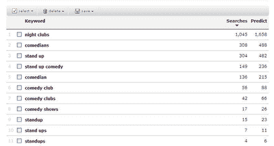
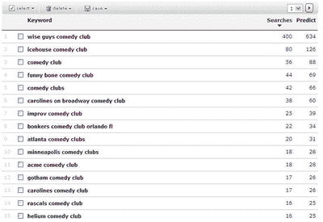

# 掌握关键词，第 2 部分:新网站

> 原文：<https://www.sitepoint.com/new-web-sites-keywords/>

我收到的回复本系列第一部分[的评论和电子邮件表明，关键词研究对许多 web 开发者来说是一个基本问题——这是理所当然的。毫无疑问，在进行关键词研究以塑造你的在线形象时，有许多真正的挑战需要解决。](https://www.sitepoint.com/article/organize-keyword-research)

从 SEO 的角度来看，web 开发人员面临的问题——尤其是在发布新网站时——包括以下内容:

*   你绝对没有历史的基础上，你的关键字决策。
*   你的网站在谷歌的索引中没有历史记录。
*   您的网站没有入站链接。

如果你四处询问(例如，在 [SitePoint 的 SEO 论坛](https://www.sitepoint.com/forums/)上)如何克服这些问题的建议，你可能会得到的标准回答是，除非你有了这些链接，否则你很可能会成为“谷歌沙箱”的受害者

据说，这个沙箱是一个暂存区，位于谷歌服务器的某个地方，尽管对于它是否真的存在还有一些争论。其理论是，新网站被送到沙盒中，直到它们老化一点，那时它们就会被提升到谷歌的常规索引中。如果这是真的，显然沙盒是新网站的真正障碍。

然而，沙盒是否存在并不是真正的重点——重要的是谷歌沙盒的*效应*存在。换句话说，谷歌算法的工作方式导致了许多人归咎于沙盒的障碍。

启动新网站的一个标准方法是发布网站，获得一些低质量的链接，放置一年，然后在它有了既定的历史后再回来。

然而在现实世界中，仅仅离开一个网站一年是不现实的——你必须做一些事情。我相信，通过进行良好的关键字研究，创造良好的内容，并征求高质量的入站链接，有可能开发出迅速证明成功的新网站。

考虑到这一点，以下是我推出新网站的方法:

1.  确定主要关键词(和热点问题)。

3.  查找权威网站。

5.  开始发布网页内容，吸引关键词丰富的链接。

7.  寻找搜索引擎成功的早期证据——不管有多小。

##### 确定主要关键词(和热点问题)

你网站的成败将取决于你所做研究的质量。首先尽可能多地寻找相关或横向关键词。例如，如果你正在为一个喜剧俱乐部做研究，你可以使用 Wordtracker 的横向搜索来建议相关的关键词，如“喜剧演员”、“喜剧表演”、“夜生活”、“夜总会”、“单口相声”、“单口喜剧”等等。

这个过程需要你持之以恒，稍微跳出框框思考。例如，在找到与喜剧俱乐部相关的单词后，您应该将相同的过程应用于关键字，如“夜生活”、“站起来”等。你需要花一些时间，横向和创造性地思考，以建立一个种子关键词集合。

一旦你编制了一个全面的列表，将他们分组并比较他们的相对受欢迎程度。(你可以使用免费的 [Wordtracker](http://freekeywords.wordtracker.com) 工具来完成这项工作)。

下面是这个喜剧俱乐部例子的一些结果的快照。

##### 查找权威网站

权威网站之所以重要，有两个原因:它们可以告诉你很多关于市场的信息，也可以成为未来链接的来源。一旦你确定了你的目标行业的权威网站，寻找你可能会涉及的趋势、争论和主要问题。

然后用那些“大”关键词(最流行的术语)进行一些搜索——不是在谷歌的常规网络搜索引擎上，而是在[谷歌新闻](http://news.google.com/)和[谷歌博客搜索](http://blogsearch.google.com/)上。这个过程会产生一些非常有用的信息。

对于我们的喜剧俱乐部示例，您可以使用此信息来:

*   了解喜剧行业的新闻。
*   找出主要新闻媒体中写喜剧的记者。
*   识别喜剧方面的专业出版物。
*   确定真正了解这个主题的博客作者。

我们在这里试图做的是围绕我们的研究重点绘制在线市场地图——在这种情况下，是喜剧。

当你这样做的时候，打开一个电子表格，这样你可以在阅读的时候做笔记。包括关键字、热点问题、权威网站、名称和内容详细信息等列。

以下是我找到的一些与喜剧相关的网站:

*   [http://comedyspeak.com/](http://comedyspeak.com/)
*   [http://www.punchlinemagazine.com/](http://www.punchlinemagazine.com/)
*   [http://www.chortle.co.uk/](http://www.chortle.co.uk/)
*   [http://www.monstersandcritics.com/](http://www.monstersandcritics.com/)
*   [http://www.stagetimemag.com/](http://www.stagetimemag.com/)
*   [http://www.funny.co.uk/](http://www.funny.co.uk/)
*   [http://www.rooftopcomedy.com/](http://www.rooftopcomedy.com/)

你的下一步是注册这些网站中最好的发布的时事通讯或 RSS 订阅源。我还建议为这些大关键词设置[谷歌提醒](http://www.google.com/alerts)。

在一周左右的时间里，你沉浸在这个世界中，尽可能多地吸收与你的关键词相关的信息，然后把你所有的发现集中起来，提取出最相关的信息。

如果你正在为客户进行这项研究，现在是与他们见面并详细介绍你的研究的好时机。你这次会面的目的是让客户相信你真正了解你所研究的行业，并评估客户对你的方法的反应和想法。这些反馈将引导你进行下一步的研究——开始发表论文。

##### 开始发布网页内容并获得关键词丰富的链接

我总是试图在项目的生命周期中尽可能早地发布，以便开始在 Google 的索引和行业内建立一些历史，我建议你也这样做。当然，你应该将你的站点提交到所有的标准目录中——包括一般目录和行业目录——但是不要期望一开始就有什么好的结果。

要真正启动你的网站，你应该开始深入探讨一两个问题。关注这些问题将为你提供一个平台，开始建立你的网络形象。

再考虑一下我们喜剧俱乐部的客户(实际上是我的一个真实客户)。当我们聊到这个项目时，他顺便提到他刚刚发布了一个很棒的视频剪辑，是他的一个喜剧演员以一种有趣而有效的方式处理一个诘问者。我立刻注意到了——这是那种可以构建成有价值的内容的东西。

我立即在“诘问”、“诘问”、“处理诘问”上做了一些搜索，在 YouTube 上找到了超过 1500 个视频，在谷歌新闻上找到了超过 240 个当前故事，在谷歌博客搜索中找到了超过 10 万个结果。这些结果让我相信，诘问是喜剧界的一个热点问题。

那么，我们该如何运用这一点呢？答案是花大量时间围绕该主题为内容开发创造性的想法——在这种情况下，就是诘问。

自己试试这个练习。像这样的问题:

*   怎样才能创作出有新闻价值的东西？
*   我怎样才能创造一个能像病毒一样传播的想法？
*   我该如何与业内的一些博主和记者建立关系？
*   我如何利用用户生成的内容？

在这个练习中，我用一个简单的公式来指导我的思考:

**关键词+热点问题=内容创意**

对于喜剧俱乐部，你可能会想到一个类似“喜剧俱乐部的经典诘问者奚落”的内容创意，其中的关键词是“喜剧俱乐部”，热点问题是“奚落诘问者”。

你应该投入大量的时间将这个简单的想法发展成有创意和壮观的东西。花时间开发伟大的内容，将带来链接将是值得的；单调乏味的征求链接的工作不太可能有效，而且链接通常质量很低。

一旦你确定了你的内容，就在[PRWeb.com](http://www.prweb.com/)上发布关于它的新闻稿，并联系你在最初研究中确定的博客作者和记者。这需要时间，但绝对值得。

##### 寻找搜索引擎成功的早期证据

你早期的成功可能很小，但不要灰心——你现在会有一些初始的入站链接，一些真正的访问者，和一些搜索引擎流量。

现在需要解决两项重要任务:

1.  看看你的内容吸引了哪些向内的链接。你如何与给你链接的人建立关系？

3.  看看给你带来过流量的关键词。依次查看每个关键词，探索其[长尾](http://en.wikipedia.org/wiki/The_Long_Tail)，寻找更多可以优化的关键词。

以下是短语喜剧俱乐部的一些长尾关键词。

最后，记住，找到关键词，建立链接和流量并不容易。很多人确实放弃了。但是要想成功，你真的必须把自己推得更高。

在我的下一篇文章中，我将着眼于对已经存在的网站进行研究时所面临的挑战。在那之前，祝你的关键词研究好运！

## 分享这篇文章