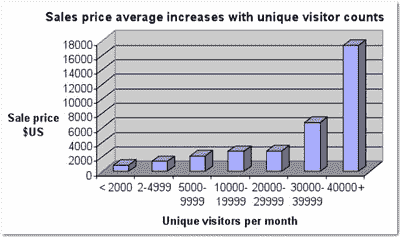
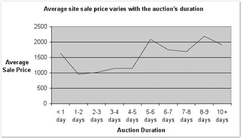

# 你的网站值多少钱？

> 原文：<https://www.sitepoint.com/whats-web-site-worth/>

每天，我们都会听说又一家大公司以更令人难以置信的价格收购了一家网络实体，但从你我的角度来看，这家公司实际上并没有产生多少收入。在过去的几年里，雅虎！收购了 MyBlogLog(据传价值 1000 万至 1200 万美元)、MusicMatch(价值 1.6 亿美元)和 Flickr(价值未披露)；谷歌以 16.5 亿美元的高价收购了 Jaiku 和 MeasureMap，交易金额未披露，YouTube 也是如此。

没错:1.65 *亿*。

像这样的总数可能会让一些权威人士想起网络泡沫时期的糟糕日子——有些人甚至质疑大网站的估值——但是，很自然地，他们会让世界各地的网站所有者问自己，“那么，我的网站*值多少钱？”*

在任何一个论坛上询问你应该如何评估你的网站，无数可能成为网上投资专家的人会给你有趣但往往矛盾的建议。有会计公式，专业评估师，在线工具(只要输入一些关于你的网站的事实，我们会给你一个粗略的估价！)，无休止的叫嚣，“如果我在网站中看到价值，那么其他人说什么都不重要。我会不惜一切代价得到它！”…没有一个是非常有用的。

因此，最近，SitePoint 开始着手寻找网站估值的清晰答案。我们询问了几位专家——这些人多年来一直在网上谋生，并有买卖各种类型网络资产的第一手经验——他们对网络资产市场的见解，以及对网站估值的技巧和建议。我们还搜索了 SitePoint Marketplace 的统计数据，试图更全面、更平衡地了解网站销售市场每天发生的事情。

当然，所有这一切的最终目的并不是产生另一个公式或工具，你可以把一些数字和一个域名插入其中，从而对你的网站进行某种评估。相反，我们希望澄清围绕网站估价的问题，并让网站所有者清楚地了解影响其网站价值的因素。我们还想提供一些起点，让你可以将这些因素转化为美元价值。

但在我们进入复杂的网站评估之前，让我们先来了解一下投资者传统上用来评估企业的技术:财务公式。

##### 使用财务公式评估站点

我们中的许多人都觉得网络实体的估值令人困惑——出售 YouTube 就是一个很好的例子。当然，大公司可能会出大价钱，但是如果 Joe Average 想卖掉他的在线论坛或电子商务网站，他知道他不太可能卖给谷歌。因此，乔需要一个自己的指导方针，而不是依赖他们明显慷慨的估价。

许多人在这种情况下求助于古老的会计公式。这些经验法则的一个常见版本是，在线业务的价值是其每月净收入的五到七倍；另一个国家的价值是大约 50%的业务营业额。

在网上快速搜索会发现无数类似的经验法则。[一位商业经纪人](http://www.hogarthassociates.com.au/Content_Common/pg-Valuing-a-business-the-four-methods.seo)列举了四种常用的商业估价方法:

*   **基于利润的估价**，这显然要求企业拥有可靠的利润数据
*   **基于资产的估价**，通常由对经营企业并不真正感兴趣，但希望获得相关资产的买家使用
*   **可比销售法**，考虑最近出售的类似业务的销售价格，并在此基础上进行比较估价
*   **“经验法则”方法**，将被认为重要的价值(如销售额或毛利)的行业标准数字与企业自己的数字进行比较。因此，举例来说，您可以获得相关行业中企业的销售额与毛利的平均比率，然后将其与相关单个企业的相同比率进行比较。最终，这将业务与其行业平均水平进行比较，但用于特定行业。

ValueOnTheWeb.com*(2022 年更新:不再运行)*是一家开发和销售网站估值系统的公司，该系统允许客户利用大量网络房地产市场数据来洞察自己网站的价值，该公司的所有者罗布·梅对这些公式进行了重要区分，认为“真正重要的是现金流和净利润。”在这种情况下，我们发现了另一个长期以来用于评估投资价值的经验法则:“T2 现金流贴现法”，即网站在给定时间段内的预计收入按照你希望在该时间段内获得的利率进行贴现。这种方法用于确定你现在应该为这项投资支付多少钱——以今天的美元计算。

这听起来不错，但在动荡的在线市场上，像这样基于现金流和利润的公式真的可靠吗？罗布不这么认为。他认为，“就网站而言，这些价值会因所有者不同而有很大差异，因为成本结构会随着新所有者的改变而改变。例如，如果一个网站有编程和内容工作要做，我会外包编程，但有时可能会写内容。另一个所有者可能外包内容并进行编程。另一个所有者可能会将两者都外包出去。”

因此，尽管从纯粹的财务角度来看，一个公式可能会给买家提供网站的现有价值，但它无法考虑新所有者可能增加的价值——这需要远见卓识，以及对潜在买家可能带来的技能和能力的全面评估。这可能是为什么，尽管有许多估价技术，许多专家建议网站所有者忽略所有这些规则，或者至少，把它们看作是一个更大的拼图中的一片。

然而，Awio.com 的丹·格罗斯曼——一个为网站所有者提供工具和信息的网站网络——认为在某些情况下，公式可能值得作为估值的一个方面来考虑。“如果你打算购买一个网站只是为了继续运营它，那么基于预期未来收入的购买价格是公平的，”他评论道。但他再次指出，“事情并不总是那么简单。当我浏览 SitePoint Marketplace 和其他类似的网站时，我会寻找两样东西:一个有很好的内容或技术的网站，如果它暴露在正确的市场中，它会显著增长，或者一个会与我现有的网站很好地集成以增加收入的网站。这种购买的价格并不严格取决于网站目前的收入，而是它可能带来的潜在价值。

这种观点得到了网络出版业的中坚力量、《websitepublisher.net》杂志编辑克里斯·比斯利的回应。“作为买家，重要的是网站对你的价值，”他评论道。“如果你认为你能比现任老板多赚 10 倍，那么根据现任老板的收入限制自己的倍数是愚蠢的。”

这些评论暗示了可能影响网站最终销售价格的各种因素——这些因素我们稍后会谈到。但是除了网站本身的细微差别之外，还有两个更广泛的因素是公式无法考虑的。Yaro Starak 是一位在线商人，他在 [Entrepreneur's Journey](http://www.entrepreneurs-journey.com/) 网站上追踪他的在线冒险经历，他认为这是其中一个考虑因素。他表示:“与所有投资一样，人们愿意花的钱就是某样东西的价值。”“只要我们在与人打交道，操纵价格的可能性就非常真实。”

我们称之为“人为因素”的东西显然会随着每一笔交易和每一个参与方的不同而不同——没有人会轻信或冷酷无情！

当然，在不断变化的网络世界中，网站卖家需要提防的不仅仅是有意操纵。PrimitiveNetwork 的蒂姆·迪金森建议说:“互联网发展迅速，如果一个新网站进入你所在的市场，情况会变化得很快。“支付超过未来一两年预测利润的费用可能会有风险，即使一个网站为你或你的用户提供的不仅仅是利润，你通常也需要在最坏的情况下实现盈亏平衡。”

再说一次，没有公式可以预测社交网站的爆炸性流行——这种预见需要的不仅仅是处理数字的能力。

看起来，虽然公式可以为网站所有者提供一个起点，但基于公式的方法的局限性可能会极大地限制其与当今许多交易的相关性。因此，如果公式和会计等式只能给我们提供一部分信息——充其量——我们在评估我们的网站时还应该考虑什么？

##### 地点价值因素

有多少人购买或出售网络资产，就有多少因素被视为有助于网站的价值。可能影响网站价值的因素包括:

*   在线财产的**性质**(例如，博客、信息内容网站、社交网络、在线社区等。)
*   遗产及其领域的**年龄**
*   品牌的**感知价值**，以及与之相关的商誉
*   房地产产生的利润或收益，以及获得这些利润的收入模式
*   场地及其生态位的**预计寿命**
*   站点收到的**流量**，以及流量来自哪里
*   网站的搜索引擎优化策略和页面排名
*   **的数量和质量反向链接**到资产
*   运营网站的**成本**，包括推广成本、时间成本等等
*   购买所涉及的**风险**——这一因素可能取决于购买者的感知，也可能取决于关于网站运营所在细分市场的可用关键“智慧”或研究
*   酒店或企业在市场中的**位置、其独特性及其面临的竞争水平和类型**
*   买方自己开发网站的相对**成本**
*   如果潜在买家自己进入市场，从头开始建立一个独立的企业，他们将面临的进入市场的障碍
*   现场可获得的**感知机会**的数量和价值
*   该房产在潜在买家经营中的**战略契合度**
*   该房产对潜在买家技能组合的**适当性**
*   买家能够更容易地将网站进一步货币化，包括买家在收购后可能对网站做出的任何改变的费用

是的——这是一大堆考虑因素，计算出每个因素在你自己的站点中的价值将是一项艰巨的任务。此外，这份清单远非包罗万象:不同的因素可能会在网站生命周期的不同时期影响不同网站的估值。

如果你开始认为网站估价是一项极其复杂的任务，那你就对了。幸运的是，我们的专家热衷于浏览列表，找出他们认为对网站估值最重要的因素。

***前 3 位价值因素***

**1。域名和流量**

广受欢迎的[webpublishingblog.com](http://webpublishingblog.com)的所有者安德鲁·约翰逊建议，“域名价值是第一位的。它只适用于少数人，但是……如果你的网站位于一个通用域名上，内容方抛出的金额可能对其销售价格没有影响。”

Yaro 特别关注“流量的长期增长(可持续性)，流量的来源(你是否需要付费来保持流量，或者流量是有机的？)和收入。”他认为，网站购买者渴望知道“一个网站有多少收入，扣除费用后有多少利润，今天有多少流量。”他建议，他们会希望看到“逐月的流量历史，如果可能的话，每个流量和收入来源的细分。”Tim 支持这一观点，他认为“交通人口统计非常重要。例如，广告商倾向于为来自西方国家的游客和可支配收入相对较高的用户支付更多费用。如果像 Tim 一样，你网站的潜在购买者认为“广告定位是游戏的名字”，这一点可能特别贴切。

这些论点反映在市场的网站销售上。在那里，每月独立访问者少于 2000 人的网站(共售出 477 个网站)平均售价为 906 美元，大大低于 1560 美元的总平均售价。相比之下，在每月吸引 20，000 至 30，000 个独特项目的 89 个售出网站中，平均价格为 2，843 美元。每月有超过 40，000 独立访问者的网站——总共 27 个——平均售价为 17，401 美元，尽管该类别的最高售价为 185，000 美元。这是完整的细目分类。

正如你所料，考虑到每月的浏览量，销售价格的细分是相似的。每月浏览量少于 1000 次的网站——包括那些没有提供浏览量数据的网站——平均售价为 903 美元，那些每月浏览量达到四位数的网站也好不到哪里去——平均售价为 959 美元。另一方面，每月页面浏览量达到数十万次的网站平均售价为 5563 美元——尽管只有 289 个，而每月页面浏览量达到 1000 万次或以上的 13 个网站的平均售价为 20186 美元。

你能提供你网站的流量数据和访问者的人口统计数据吗？如果是这样的话，你将会比你所在领域的其他网站拥有者处于更有利的位置。Yaro 预测，在未来的销售中，流量的重要性将继续增长。“我预计，越来越多的大公司将会通过收购网站来获取新的流量来源，而不是像 SEO、PPC 和内容创作这样的传统方式，或者除此之外，再增加新的流量来源。”克里斯也支持这一论点，尽管范围更广…

**2。稳定性和利润**

“我关心的是资产和净利润，”克里斯说。"资产可以是域名、软件、知识产权，甚至是链接权重."如果你认为克里斯更喜欢老网站，而不是交钥匙工程，那你就对了。“对我来说，更重要的因素之一是稳定性和年龄。我会把一个“已建立”的网站描述为三年或更久。"稳定的收入是网站出版的无名英雄."

毫无疑问，大量待售的土地都是近期开发的。在 SitePoint 市场上出售的网站中，超过 85%的网站成立不到两年。在 Chris 的三年多的分类中，我们发现只有 110 个网站，或者说只占售出网站总数的 5%。显然，这样的网站是罕见的，买家会期望转化为溢价。

Tim 揭示了稳定性的一个突出好处。他表示:“广告商倾向于对得到认可的网站和知名品牌感到更安全，因此在自己的细分市场中得到认可和确立的网站可能价值更高，因为他们可以在相同的维护量下获得更大的利润。”

但正如罗布指出的那样，稳定可以在多个方面提高盈利能力。“需要较少工作的网站，如成熟的论坛或文章目录，收取较高的溢价，”他说，“因为买家希望用尽可能少的工作赚尽可能多的钱。正如 Tim 建议的那样，“必须从搜索引擎吸引新客户的网站是有风险的投资，因为[你的客户获取成本会随着时间的推移而大幅波动](https://www.sitepoint.com/changes-to-pagerank)。"

Andrew 总结道，“从长期价值来看，你需要一个拥有多样化流量来源的网站，它不会在一夜之间消失，”Rob 也同意这一点。“总的来说，我认为 PageRank 价值较低，”他说。"稳定的有机流量更有价值，稳定的月收入也很重要."他指出，当然，这些因素之间的平衡随着网站类型及其收入模式而变化。但在某种程度上，这些因素是普遍适用的。

尽管 Andrew 认为 PR 没有其他因素重要，但有趣的是，在 SitePoint Marketplace 中，PageRank 和销售价格之间存在一定的相关性。PR 为零的网站平均售价为 459 美元——这样的网站有将近 300 个。PR 为 2 的 144 个站点的平均销售价格为 1145 美元，而 PR 为 6 的站点的平均销售价格为 12061 美元(超过 47 次销售)。虽然其他因素是每笔销售中固有的，但统计数据确实表明，如果 PR 不直接影响网站的销售价格，销售金额较大的网站往往有更好的 PageRank。尽管我们的专家有不同意见，但在网站销售市场上，公关很可能仍然在网站估值中发挥作用。

**3。潜力**

"网站所有者是否已经将网站推向了最大的收入潜力？"安德鲁问道，他强调了一个被许多网站所有者吹捧为不合理的网站价格标签的理由:网站有巨大的潜力。“在某些情况下，”安德鲁解释道，“30 分钟的工作可以让网站的收入翻倍。这很极端，但却是现实。”

Tim 完全同意对价值的潜在影响。“如果一个网站在用户群定位或技术衍生销售方面对你有额外价值，那么它可能值得购买——即使它本身会产生财务损失。”Yaro 持类似观点。“如果你能把流量直接注入你的业务并获得回报，那么网站本身不赚钱也没关系，”他说，并补充说这降低了网站对其他买家的价值，“意味着你可以买到便宜货。”

“网站购买者需要评估一个网站，就好像他们已经拥有它一样，”克里斯说，“在‘我能用这个做什么？“而不是只担心现有的所有者用它做了什么。”

“如果它能增加你的收入，”丹总结道，“那么一个网站肯定是有价值的，不管它目前的收入如何。”

了解你的买家可能会给你一个机会向他们展示网站未来发展的可能性——照亮有稳定收入潜力的新方向。“作为一个卖家，”安德鲁建议道，“我认为根据买家是谁来给你的网站重新定价是完全公平的。”

***其他价值因素***

**工作量**

对于 Andrew 来说，工作量是网站价值的另一个重要决定因素。"网站运行需要很多工时吗？"他问道。

“我经常会看到在域名价值、流量和潜力方面得分很高的网站，但需要所有者进行大量的日常工作。如果你有一个团队在为你工作，或者可以雇佣一个有收益的人，这并不是什么大不了的事情。但事实是，如果你只是让网站坐以待毙，它的流量和收入将会减少(如果你是为了持有而购买，而不是为了出售而购买，这是需要考虑的事情)。”

Yaro 的结论是，最好的购买往往是那些“不需要所有者进行太多持续工作或投资的模型”对于那些寻求销售高维护性网站的人来说，这是一个重要的考虑因素:你越能自动化流程，就越有可能获得更高的销售价格。

SitePoint Marketplace 中的列表揭示了工作量对购买者的重要性。“通过这个容易赚钱的网站获得稳定的收入”邀请一个卖家，他的财产——一个电影下载评论网站——第二天就被卖掉了。另一个卖家用“不需要工作——轻松的 AdSense 收入”来推销他的产品，而另一个卖家邀请买家“让网站为你工作”。还有一个网站提供了一个脚本，可以在许可的情况下抓取其他网站，并将内容反馈给主网站——这绝对是一件低维护的事情。该网站在市场上上市仅 24 小时后，就被出售了。这个小样本表明低维护是一个大卖点！

**协同作用**

“买家会带来什么？”安德鲁问道。“如果你研究企业收购，那些成功的收购是在它们与收购公司关系密切的时候。这就是所谓的“相邻空间”。“如果你已经在潜在收购的利基市场运营了一个网站，你可能拥有其他人没有的额外市场知识和资产。”

显然，对于任何一个买家来说，协同效应都与网站的潜力有着密切的联系，并对其有着巨大的影响。并且协同的程度将随着调查待售网站的每个不同的卖方而变化。

那么，当安德鲁谈到一个买家可能带来其他买家无法带来的资产时，他到底是什么意思？这个问题的答案包含许多因素。“市场知识可以更好地理解如何构建一个网站，使其更有利可图；资产可以是与财大气粗的广告商的关系。这些都是给收购带来杠杆效应的东西。”

罗布指出，在对一个网站进行估价时，卖家必须“考虑这是一项财务收购还是一项战略收购。后者通常会获得更高的价格”——这是卖家在准备和定价一个待售网站时应该记住的一点。通过观察潜在买家对你的网站的其他操作和可能的计划，你可以更清楚地了解你的网站对他们的价值。

**技术**

Tim 指出了网站销售中固有的潜在负担，他说“网站背后的技术和你的许可也非常重要。如果网站使用商业脚本，那么你必须继续支付许可费来运行网站。如果网站使用众所周知的开源脚本，那么它必须做得更多才能脱颖而出。如果网站使用专有脚本，那么它制作得好吗？你对它有专有权吗？你对它有什么保证？”

如果你能回答这些关于你的网站的问题，更重要的是，确保它们不会对潜在的买家造成障碍，那么你就能为你的网站争取到一个更好的价格。

当然，技术上的考虑并不都是坏消息，蒂姆很快解释道。“如果专有脚本是高质量的，并且与网站独家销售，那么将脚本授权给其他网站，甚至将其开源，这样开发成本就不会完全由你承担，这可能会有货币价值，”他建议道。精明的买家可能会在评估销售时审查这些可能性，所以准备好回答关于你网站的技术和许可问题。

通过 SitePoint Marketplace 查看技术(脚本、脚本站点等等)的销售是一件有趣的事情。基于 PHP 的网站和脚本似乎很受欢迎，(一个在 7 天内卖了 2200 美元，另一个在 3 天内卖了 3000 美元)，使用 WordPress 和 VBulletin 等标准的知名技术的网站也是如此。

**比较成本**

我们提到了比较成本分析作为估算场地价值的公式，事实上 Dan Grossman 说他使用这种分析作为场地评估的起点。“为了得到一个基线，我考虑复制这个网站的成本，”他说。“如果它有大量原创内容或复杂的服务，答案可能是‘很多’。”"

丹认为，这种评估可以帮助潜在买家找到便宜货，因为有价值的网站以低于实际创作成本的价格出售。“很多时候，当个体所有者或创造者不把他们多年的劳动计入价格时，就会发生这种情况，”他透露。"例如，他们可能只使用基本收入乘数来评估网站的价值."

克里斯同意比较成本是评估网站价值的一个重要因素，但这是从建立而非发展的角度来看。“新网站往往只是被模仿，而不是被购买，”他说。“网站可以建立与其他现有网站相同的功能，内容可以涵盖相同的主题，所以所有现有的网站都有自己的流量，客户和链接权重。”正如 Chris 指出的，这些方面需要时间来建立，并使一个网站“永远领先于任何其他竞争对手。”

在评估网站的这些因素时，Chris 不仅考虑了复制网站的成本，还考虑了“将网站推广到与您想要购买的网站一样好的程度”所需的投资和时间。如果你得出的总数低于购买价格，那就说明了一些问题。”

卖家必须警惕低估他们的时间。有经验的买家会希望为开发一个网站和确立其在利基市场的地位所花费的时间买单。如果一个买家的价格考虑到了这个时间，你总是可以给他们一个比较成本分析，显示他们从头开始创建一个相同的网站要花多少钱。当然，如果潜在买家能够以低于交钥匙提案要价的价格设计并建立一个类似的网站——并且他们拥有同样有用的域名和其他资产——那么他们可能很难看到销售的价值。

##### 起作用的价值因素

给定这些买家正在寻找的迹象，你可能会得到一个粗略的价格范围的想法，在这个价格范围内，你的网站的价值可能会下降——向价格范围的较高，较低或中等区域。但是有一个关键因素我们还没有考虑，那就是你要卖的网站的类型。如果我们将网络房地产市场与实体房地产市场进行比较，那么一个网站的类型可能就相当于一栋房子所在的街区。众所周知，这对房产价值有很大影响。

为了了解不同的价值因素对不同类型网站的影响方式，我们请每位专家评论他们对特定类型网站的评价。

 *克里斯·比斯利给了我们两个关键问题，如果他在评估一个待售的内容网站，他会问自己:“这个网站对我有什么价值？我能从网站上赚多少钱？”它们看起来很简单，但和往常一样，答案取决于许多因素。

“如果我有一些特殊的协同效应，如相关的电子商务业务，这样我就可以从交叉推广中获得链接权重和直接客户，那么我可能会为这样的网站支付一笔不错的交易，”克里斯解释道。

一个内容网站的价值可能是该网站与潜在买家当前运营协同作用的一个因素，但这是否意味着对一个内容网站的估价总是带有很大的主观性？如果网站被收购是出于财务原因，而不是纯粹的战略原因，那就不是了。

“如果我与要出售的网站没有协同效应，”克里斯解释道，“那么我必须根据当前收入进行评估，或者如果我控制了网站，我认为当前的收入是多少，减去将网站从当前状态带到我认为的“最佳”状态所花费的时间成本。”

在评估内容网站的财务收购时，Dan 使用了一种混合的方法。在他的比较成本分析之后，他说，“有几个关键指标可以帮助你得出一个合理的价值。”他考虑“内容是否原创，网站从搜索引擎和自然链接获得的流量水平，以及你预计这种流量会持续多久。”

内容的性质显然起了作用。“一些内容是持久的，而另一些内容则不是，从长远来看，保持多年相关性的持久内容可能更有价值，”丹说。克里斯同意高质量的内容具有价值:“如果你的内容很差，买家可能会很容易地以低于他们支付给你的价格复制它。”然而，他认为高质量内容的重要性会随着网站稳定性的提高而降低。“随着网站越来越老、越来越受欢迎、越来越有名气，对原创内容的需求就会越来越小。他说:“如果你的网站每天带来 1000 万的页面浏览量，只要是合法的，没人会在意内容是否原创或独特。”

丹认为，网站的盈利能力是另一个关键因素。“如果网站的流量已经开始赚钱，我会考虑是否能找到更好的赚钱方法，这可能会让它的价值超过当前的收入。”

内容网站所有者在评估这些网站时，需要考虑潜在(或最有可能)购买者的性质。显然，收购的原因会影响价值因素的相对重要性，作为一个内容网站销售者，如果你想为你的网站获得一个公平的价格，你需要考虑战略和财务收购类型。

***估价博客网站***

“博客很难评估，”Yaro Starak 警告这种新兴类型网站的卖家。“这个网站的价值实际上取决于观众对当前作者的忠诚度，以及如果你要收购这个网站，当前的作者是否也会参与进来。”

对于大多数单枪匹马经营的博客来说，对 Yaro 第二个问题的回答将是响亮的“不！”，但这就意味着一个人的博客没有价值吗？绝对不行。“一些博客有一个没有特定个性的品牌，”Yaro 继续说，“在这种情况下，使用我们上面提到的标准衡量标准来评估网站的价值更容易。”

当然，受作者个性驱动的博客——像 Yaro 自己的网站——是完全不同的情况。“如果网站失去了一个或几个特定的作者，”他说，“除非你能留住他们或引入具有同等才华的人，否则随着所有权的改变，你可能会失去一大部分观众。”

对于任何进入这个不断变化的市场的人来说，这都是一个很大的风险因素——博客内容越独特、越个性化，成功的潜力就越大——如果作者不在网站上，销售就可能越困难。那么博客是一个第二十二条军规吗？如果写作团队是交易的一部分，或者如果网站的价值在于博客内容的性质或所涵盖的主题，而不是从事博客工作的个人的个性和写作风格，就不会这样。

然而，对于潜在的博客卖家来说，还有其他潜在的陷阱，最突出的是工作量。“博客需要持续的内容流来保持流量和收入的增长，”Yaro 警告说。“如果你有优秀的作家，这不是问题，但如果你没有，你可以购买更好的网站，这些网站不需要所有者进行太多的持续工作或投资。”

Rob 同意，经营一个博客所涉及的工作量也可能会影响目前网络房地产市场的这一部分。“根据我们的数据，”他说，“在过去的一年里，博客的平均销售额是收入的 11.56 倍。拥有更多静态内容的网站的平均销售收入是 14.37 倍。它们吸引的价格代表了更高的收入倍数，因为它们的工作量更少。但是，如果你看看图表，博客比静态内容网站更容易获得更高的月收入。”

希望卖出最高价格的博客作者最好尽可能实现运营自动化，专注于开发网站的收入潜力，并尽最大努力使其易于货币化。同样重要的是，要追求一种商业战略，这种战略依赖于好的、有针对性的内容，而不是诱人的个性。

***重视一个社区论坛网站***

Tim Dickinson 认为，与任何网站一样，社区论坛的价值既与潜在买家的运营协同有关，也与已经或可能在社区网站上实施的收入战略有关。

现在在一个论坛网站上，会员意味着收入。收入通常是通过广告产生的。特定的社区网站是否比其他网站更能产生广告收入？是的，蒂姆说。“一些利基市场对广告商来说价值更大，因为相关产品可能价值更高，或者用户群是有闲钱可花的富人，”他建议道。

论坛关注的利基或行业内的用户体验也与网站的广告收入潜力密切相关。蒂姆认为，专家(创新者)和缺乏经验的用户的组合提供了最大的潜力，因为“论坛上的广告客户不仅从与提供诚实和高质量讨论的网站相关联中受益，还从访问论坛的临时用户那里获得了‘眼球’。”为此，会员档案是一种资产，可以提高论坛的销售价格。“更好的会员档案通常意味着更多的信息，”蒂姆解释说，“这可以用来更有效地定向广告。”

“访问者的数量是另一个对网站潜在收入至关重要的因素，”Tim 说。这并不是说较小的利基网站不能做得很好，而是一个较大的社区可能更容易赚钱。规模较小的网站要想获得高销售价格，必须克服几个额外的障碍。一个是由于出售而失去关键员工的潜在影响 Tim 认为较大的网站更能经受住这种情况。另一种看法是，正如蒂姆所说，“论坛需要一定数量的访问者来保持所有内容的新鲜和问题的快速回答。”

不管一个论坛的规模有多大，活动总是被考虑在销售中。我们经常会看到一个社区网站的销售列表，它的所有者吹嘘道，“如果我有时间将网站货币化，我可以很快每月赚 x 美元，”尽管该网站很少帖子，会员甚至更少。蒂姆并不认为这种购买有什么价值。“如果一个论坛没有达到临界质量，”他说，“它比一个除了内容之外几乎没有用户的全新论坛更有潜力。就价值而言，还没有达到临界规模的论坛应该被完全视为一个纯粹的内容网站。

这是否意味着大型、成熟论坛的卖家就一定能过上舒适的生活？不完全是！“这个网站当然有潜力，”蒂姆说，“但是一旦交易完成，新的所有者必须非常小心对待他们的用户。出售一个社区往往会失去用户，因为人们会觉得被旧的所有者出卖了。”

过渡策略——新的所有者被介绍到论坛，并与卖家共同运营社区一段时间——可能有助于克服这一障碍。当然，一个精心策划的过渡策略也可以转化为网站销售价格的提高。

***给一个卖产品的网站估价***

销售产品的网站——传统的电子商务网站——看起来相对容易估值。但是他们是吗？Tim 认为“销售实体产品的网站应该像高街零售商一样被估价——根据他们销售的产品数量和他们从每笔销售中获得的利润，与制造或获得、储存和将商品发送给买家的成本相比较。”他认为，最终，评估的财务基础是公正的。“网站应该根据扣除所有成本后的净利润进行估值，由于所有的实体产品处理任务，电子商务网站的成本高于内容或社区网站。”

当然，如果财务状况良好，其他因素也会发挥作用。Dan 列出了许多潜在买家可能会问自己的问题:

*   您是否需要维护库存和存储库存的仓库？
*   购买时是否有任何现有库存？
*   谁提供产品，价格如何？付款条件是什么？成为经销商有任何费用吗？
*   订单是如何履行的？如果在内部完成，需要多少员工？如果外包，继续外包履行需要多少成本？
*   网站销售产品的回报率是多少？
*   该站点的退款率和欺诈率是多少？
*   前任老板会在转变过程中提供帮助吗？

预先解决这些问题——并为买家发现的任何问题提供有用的解决方案——可能会让卖家处于有利地位，为他们的网站争取到一个好价钱。显然，买家以前在电子商务和网站运营领域的经验会对他们希望获得多少帮助产生影响，但卖家会很好地预测和回应买家对企业运营的任何担忧。

对于任何买家来说，网站销售的产品及其服务的市场显然都是至关重要的考虑因素。“如果一个网站在销售书籍之类的东西，”蒂姆说，“它必须与亚马逊、B&N、水石和其他大公司竞争。它必须做得比他们更好——或者通常更便宜——才能竞争。专注于一个利基市场可能会将业务与众不同，但网站必须展示出该领域的专业知识，或许还可以在网站上提供内容，或者提供比其他零售商更广泛的利基图书选择。

接下来，丹说，“你必须弄清楚当前客户群的价值”——他把这项工作描述为“部分是研究，部分是直觉”。他解释道:“现有的店主应该能够告诉你每位顾客的订单数量，以及新顾客成为回头客的比例。”买家可能还想查看客户记录或档案、投诉记录和解决策略等。他们可能会对过去对待客户的方式感兴趣，也会对卖家建立忠诚度和获得新客户的方法以及这些方法所涉及的成本感兴趣。

但从这一点来看，评估客户群变得更加困难。“潜在买家必须看一看产品和客户，感受一下所有权变更后他们是否会继续购买，”他表示。而且，与企业的员工类似，它的客户也会对新老板做出反应。“有时候，网站的运营方式使得客户非常依赖当前的所有者，”丹说——这一点是网站卖家在评估网站时想要考虑的因素，因为这增加了买家的风险。"其他时候，所有权的变更可能在幕后发生."显然，从买方的角度来看，这可能是最好的情况，所以它可能会支付卖方发展业务，以期自己退出。

蒂姆表示，协同效应在电子商务网站估值中也发挥着作用。与购买其他网站一样，如果买家已经拥有一个专门针对某个主题的网站网络，如小工具，那么对他们来说，专注于小工具的电子商务网站将比新领域的电子商务网站更有价值除了更大的商业化潜力，这种安排还将让买家利用他们在该领域的现有专业知识。蒂姆认为，这些技能“可以用来帮助网站扩张，因此实现增长可能更容易，成本更低。”

“最后，网站或公司与其供应商和员工的关系也很重要，”Tim 补充道。他认为，事实上，这对于确保“有人新买下企业后，成本不会大幅上升”至关重要。如果员工关系不好，或者员工觉得自己只是企业出售中的一个棋子，这最终会影响出售价格。当然，如果企业是一个人的事情，那么买方可能希望评估所涉及的任务，以规划他们的业务增长和潜在的员工收购。通过提供所需的细节和帮助，使这种计划变得容易的卖方可能会以更好的销售价格结束。

*对销售服务的网站估价*

 *随着对创新、无形服务的接受和感知需求的增加，这类网站的数量——那些出售图像或视频托管、垃圾邮件防护等的网站——正在持续增长。价格——至少在大减价时——似乎也在飙升。这是否意味着对这类网站的估值比其他网站更复杂？安德鲁·约翰逊不这么认为。

“我会先看看他们的流量来源。可持续吗？”他问道。虽然这听起来很简单，但这是很重要的一点——特别是对于比其他类型更新的网站。“流量可能来自口口相传，”安德鲁建议，“这为广告和免费有机搜索流量留下了很大的增长空间。然而，如果这些利润的大部分来自不太稳定的来源，它可能值得打一点折扣。”

“同样重要的是，”安德鲁继续说道，“新主人需要投入多少时间？你在给自己买工作吗？如果卖方目前在做所有的工作，买方还能有利润地外包吗？”这个问题经常出现在更具创新性的网站的销售中，这些网站作为其所有者的大脑孩子，需要大量的照顾和喂养。如果你的网站需要你大量的时间，也许你应该在出售前考虑自动化的方法，作为增加价值和获得更高销售价格的一种手段。毕竟，正如丹·格罗斯曼很快补充的那样，“对于订阅或产品网站来说，更多的是关于收入和运营业务的成本。”降低这些成本，你的销售价格可能会增加。

当然，创新常常证明更高的价格是合理的。“如果服务是真正革命性的或市场领导者，你可能会增加它的价值，”安德鲁评论说，表明一点研究，比较成本分析，并抓住任何机会明确区分你的网站和其他网站，可以在你与潜在买家的谈判中获得回报。

对此，丹坚决同意，但除了技术的独特性，以及复制的容易程度，他认为“你还必须看它是否会随着增长而扩展，以及买家是否能够在没有原作者帮助的情况下维护它？还有一个忠诚度问题，”丹建议道，他认为所有权变更后，稳定的销售额可能会下降，特别是在提供脚本、软件或工具的网站上，对于这些网站来说，直接响应客户社区——通过通信和产品增强——是成功的关键。

对于出售无形产品和服务的网站所有者来说，好消息或坏消息是，买家可以对创新网站的潜在售价产生重大影响。正如安德鲁很快指出的，“鲁珀特·默多克因支付 6 亿美元收购 Myspace 而被嘲笑。在与谷歌达成 10 亿美元的广告交易后，他看起来像个天才。正如安德鲁所说，尽管这些数字有悖于价值投资者的逻辑，但它们确实让独特的服务网站细分市场对创新者来说非常有利可图。

也就是说，卖家必须认识到买家进行此类购买的风险。“技术发展非常非常快，”Andrew 总结道。“这可能是双向的——也许 5 年后你的公司价值 10 亿美元，或者你的整个商业模式可能会消失。”丹同意了。“许多服务行业目前正在扩张，因此考虑服务市场的发展方向非常重要。如果它在增长，并且该网站为该市场提供了一些独特的价值，它的价值可能会大大超过目前的收入。”

最终，风险是这些类型的购买所固有的，但是市场方向和技术可能是网站购买者面临的最大问题。希望为自己的服务网站获得最佳价格的网站所有者需要确保网站是以未来的愿景构建的，他们可以确定网站及其提供的服务的潜在方向，当然，技术是健壮的和可扩展的。验证流量来源和可靠性，并确保网站有一个最小的维护负担也应该是目标的潜在卖家希望得到最好的价格为他们的网站。

##### 使用现场评估工具和服务

许多网站所有者认为他们是网站价值的最佳评判者——他们的预测大错特错。也许他们的研究很差，或者他们对网站潜力或收入潜力的看法是错误的(毕竟，很难对一个你投入了一生的网站保持客观)。不管怎样，自我评估都可能以失败告终。

由于在线房地产市场的普遍不确定性和可预见的不可预测性，出现了许多工具和评估服务来满足网站所有者的需求，他们希望客观地了解网站的价值。

这些工具，包括 [dnScoop](http://www.dnscoop.com/) 和 Tidget.com 的 [Tidgulator](http://tidget.com/tools/tidgulator) ，倾向于根据一些有形的因素来评估一个网站——流量、页面排名、反向链接、网站上线的年数、域名注册的时间、将被转让给新所有者的财产价值等等——这些因素可能与你网站的销售有关系，也可能没有关系。这些计算器式工具的另一个潜在问题是，它们在很大程度上依赖于你自己的感知(例如，在评估销售中涉及的财产时)，这可能导致不切实际的期望。也就是说，这些工具可以提醒卖家他们在评估网站价值时可能会考虑的许多因素，而且这些工具也比评估更实惠——这里提供的网站免费提供价值评估。

评估服务，其中[buysellwebsite.com](http://www.buysellwebsite.com/)和[风险规划协会](http://www.ventureplan.com/web.valuations.html)只是一对夫妇，通常促进他们的产品为卖方提供增值，可以提高最终销售价格。他们考虑了一系列不太有形的因素，如网站的稳定性、易用性、内容提供和潜在的收入来源，以及独立访客、页面浏览量等具体指标，但这项调查是有代价的——从大约 450 美元起。

这些选项可能会让人不知所措——尤其是对于第一次在网站上销售的人，或者是在对他们来说很陌生的房地产市场中经营的卖家。那么，这些产品值得吗？

蒂姆很快概述了他的担忧。“这些工具使用一个简单的公式。这很好，但他们不是人，他们不会检查内容或设计的原创性或质量，而这两者都非常重要。”Chris 进一步阐述了这一观点，他说“任何类型的客观算法评估将永远是二流的，因为统计数据最终只是给出网站价值的一部分。”丹认为，“只有勤于自己的研究，才能告诉你网站吸引的流量和链接是短暂的还是可能会持续下去，用户在收购后是否会保持忠诚，以及网站提供的内容或服务是否有不断增长的市场。”

Rob 发现了评估工具的另一个问题，他评论道“我过去经常使用它们，但是它们中的大部分已经过时了。他们给网站所有者一个很高的价格，因为这让网站所有者感觉良好，并再次回来使用他们的工具。但是，当没有人愿意以“评估”价格购买时，卖方就抓狂了

但是 Yaro 看到了这类产品的作用。“我不使用试图告诉我一个网站价值的工具，”他说，“但是，我确实使用给我一个网站价值相关数据的工具。”他使用 SEOMoz Pagestrength 工具、Yahoo Site Explorer、FireFox 的搜索状态扩展和 Way Back Machine 等工具来获取网站的重要统计数据——Alexa rank 和 PageRank、网站上线时间、域名年龄、页面数量以及权威网站的反向链接数量。他使用所有这些因素来构建一个网站的清晰图片，但随后依赖于他自己的评估，包括“在我评估的网站上花一些时间”，来开发一个网站价值的可靠想法。

克里斯也相信我们所谓的“人的因素”。“在我看来，最好的工具是一个专家小组，也就是一个论坛，他们可以给你一个人的意见。”这是否意味着他提倡使用评估服务？“不，”他说。“我从未见过专业的网站评估服务机构给出我认为是现实的评估。”丹更愿意接受这个想法。“有真人支持的评估服务可能很有价值，”他建议道。“不幸的是，许多商业评估服务都面向线下世界，侧重于会计和实物资产。”

那些可能考虑使用评估服务的人面临的另一个潜在障碍是成本。“对于较小的采购，雇用这些人的成本可能会超过网站的价值，或者肯定会从第一年的潜在利润中扣除很大一部分，”蒂姆说。不过，对于更大的网站，他看到了专业评估的价值。“如果一个网站的运营成本高达数百万，或者声称盈利数百万，那么专业的网站评估师可以帮助买家更安心地决定该网站是否值得购买。”

当然，随着市场的成熟，这些服务可能会发挥更大的作用。“我预计，随着行业的扩张，越来越多的人将使用专业评估服务作为评估任何潜在购买的过程的一部分，”Yaro 预测。他补充道:“一两项服务能够提供出色的产出，并具有业内的历史和知识，这可能会成为顶级服务，成为任何认真的网站交易者的必用服务。”

目前看来，评估工具和专业服务的价值对于较小的网站卖家来说可能非常有限——而且一个经过评估的网站会卖更多的论点可能很难得到证实。毕竟，正如克里斯所说，出售网站的决定最终归结为机会成本:“口袋里没有销售所得的机会成本是多少？”同样，人为因素会大大削弱理论和基于统计的评估。

##### 你的网站值多少钱？

最后，在确定你自己网站的价值时，你需要研究网站销售市场——尤其是你的细分市场。你可以使用我们上面概述的免费工具开始你的评估，使用专有的统计软件包，如 valueontheweb.com，由罗布·梅拥有，我们为这篇文章采访了他，并通过技术媒体在 SitePoint Marketplace 等地方研究类似网站的销售。

在你研究的时候，记下那些似乎影响你的站点所在细分市场销售的因素，以及所达到的高端和低端销售价格。除了这些记录之外，还包括与特定销售相关的信息以及影响这些价格的因素。也许一个类似于你的网站获得了很高的价格，因为现有的收入流和详细的会员档案数据提供的未来货币化的潜力。也许一个看似低价出售的网站缺乏你运营的历史和被证明的流量稳定性。

接下来，是时候仔细检查你自己的网站了，尽可能客观。首先，完成网站的优势、劣势、机会和威胁的 SWOT 分析。回顾一下我们之前讨论过的可以影响网站销售价格的价值因素列表，并尝试预测每个与你的销售相关的因素如何影响买家，从而影响销售价格——这在某些情况下会比其他情况更容易。请特别注意我们专家的建议，他们指出决定一个网站价值的最重要因素是:

*   **域名和流量** —考虑你的域名的年龄以及你的流量来源的可持续性和可靠性。你的网站是该领域中最老的网站之一吗？你的流量水平如何变化，为什么？
*   核对**流量水平**的文档和域名注册证明。
*   **稳定性和利润** —你能提供你网站的长期盈利记录以及成本、收入等等的明细吗？
*   核对财务文件、付款收据、债权人名单以及已付和欠款。
*   **潜力** —确定潜力可能很困难，但如果你能看到你的网站可以发展得更好的场景，那么在你的网站销售列表中列出这些想法可能是值得的(如果你是通过市场销售的话)。当你确定潜力时，也要考虑改造网站以实现这一目标所涉及的成本，因为任何潜在买家都会考虑这些成本。
*   制作一个**列表，列出该网站可能的发展方向**，并概述这些转变的难易程度。
*   **工作量** —除了考虑购买者需要返工网站以实现其潜力的工作之外，还要评估将网站维持在当前标准所需的工作水平。考虑到你的时间，以及在网站上工作的其他人的时间。
*   列出运营站点所涉及的**项任务，并针对每项任务，估算所涉及的总时间。计算时间成本可能也是值得的，因为潜在买家可以一眼看出，如果他们的设置允许他们使用现有资源来完成某些工作，他们可能会节省多少运营成本。**
*   协同效应(Synergy)——考虑你的网站可能适合的业务类型。这些信息可能有助于你通过在线广告或市场列表锁定潜在买家。
*   **技术** —审查你的网站所基于的技术，以及将随出售而转让的任何财产所涉及的技术(例如，脚本、软件产品等等)。评估技术的成本、可靠性和健壮性，以及随着站点的增长而增加的可伸缩性。
*   整理网站托管的**成本、技术许可成本等记录。虽然这些费用可能会包含在你的财务报表中，但也要在这里列出来，以便买家容易获得这些信息。明智的做法是询问开发人员(可能是您！)来提供系统可伸缩性的评估。这将让潜在买家了解网站及其资产的寿命，并允许他们对业务进行财务预测。**
*   **比较成本** —你的研究将揭示你所在市场中网站的最高和最低销售价格。现在是时候回顾一下你对这些销售所做的笔记，并将你的网站与那些网站进行比较。你的网站勾选了所有的框吗？它是否缺少某些方面，似乎是买家想要的？差距在哪里？

这个评估应该让你清楚地了解潜在买家会如何看待你的网站，以及它的特色和缺陷。你应该有一个合理的价格，你可以期待你的网站收到一些想法。你还应该收集一些有价值的文件来支持你的估价，但有一点:正如罗布·梅所揭示的那样，“人类对社会证明的反应很好，所以通过展示以一定价格出售的类似网站，卖家通常可以为自己的网站获得类似的价格。”

但是，你对这个价格满意吗？

如果没有，下一步是通过与同一细分市场中的其他网站进行比较，仔细看看你的网站缺乏的领域。你能解决这些因素中的任何一个吗，这样做的话，消除了网站销售的潜在障碍。如果，当你考虑网站的潜力时，你列出了一些提高网站收入的想法，你能实施这些想法吗？

最后，克里斯建议所有的网站卖家问问自己“口袋里没钱销售的机会成本是多少？如果你打算以 50，000 美元的价格出售一个网站，你会用这笔钱做什么来赚更多的钱，你会把这笔钱投入什么机会？如果它不超过网站已经给你的收入，那么你要的钱就太少了。你需要提高价格。”

一旦你对价格满意，并准备出售，剩下的唯一事情就是找到买家。选择一个销售论坛——或者接近一个潜在的买家——涉及到一系列的考虑因素，我们在这里没有足够的空间去深入探讨，但是在[这篇网络大师世界的文章](http://www.webmasterworld.com/forum25/3062.htm)和 Yaro 的博客上的一篇名为[如何销售一个网站的文章](http://www.entrepreneurs-journey.com/265/how-to-sell-a-website-how-much-is-your-website-worth/)中可以找到好的建议。

不过，需要考虑的一点是你举行拍卖的持续时间。买家经常被建议在找到他们想买的网站时迅速行动，否则可能会错过销售机会。但有趣的是，我们通过 SitePoint Marketplace 发现，持续时间较长的拍卖比持续时间较短的拍卖平均获得了更好的销售价格。

拍卖期限的问题可能是值得考虑的，因为你列出你的网站出售。

##### 网站销售的未来

这篇文章的目的是提供一个坚实的起点，从这里你可以开始研究如何评估你的网站的价值。虽然他们不能告诉你你的网站值多少钱，但通过这篇文章分享他们想法的专家提供了重要的行业知识和网站交易的第一手经验。

当我们问他们网站销售的前景如何时，他们一致持肯定态度。丹总结得很好，他说:“网站的市场只会越来越大。现在，创建一个杀手级服务所需要的只是一个愿景和一些优秀的程序员。可供买卖的高质量网站只会越来越多。”

## 分享这篇文章**