# 13 个用于 Web 开发的 Firefox 插件

> 原文：<https://www.sitepoint.com/13-firefox-add-ons-for-web-development/>

虽然 Firefox 首先是一个网络浏览器，但由于其巨大的附加开发社区，它可以做任何你能想到的事情。幸运的是，对于网页设计者和开发者来说，有很多非常方便的工具可以用来 FTP、编码、检查你的工作等等。它们工作起来都很轻松，有望让你的工作不那么忙乱，因为你不必频繁地跳到不同的程序上。

对所有这些诱人的插件的一个警告是，记住你运行得越多，你的浏览器运行得越慢，所以在选择你想要添加的插件时，尽量表现出一些克制。

**[【AdBlock Plus】](https://addons.mozilla.org/en-US/firefox/addon/1865)**:虽然这看起来像是一个帮助设计者的工具列表的奇怪选择，但由于它的频繁使用，当用户运行这个特定的附加组件时，看看你的设计会是什么样子也无妨。

[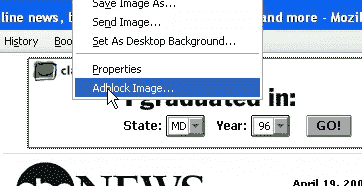](https://www.sitepoint.com/wp-content/uploads/2009/07/adblockplus.png)

**[code burner](https://addons.mozilla.org/en-US/firefox/addon/10273)**:code burner for Firebug 是 web 开发者必不可少的参考工具。它在浏览器底部的一个方便的 dock 中显示语法、代码示例和浏览器兼容性信息，由 JavaScript 大师兼作者詹姆斯·爱德华兹为 SitePoint 创建(在更新版本在 Mozilla 附加组件网站上获得批准之前，你需要从[这里](https://getfirebug.com/)获取与 Firefox 3.5 兼容的最新版本)。

CodeBurner 的新版本已经发布。这个版本不依赖于 Firebug——它是一个独立的扩展，并且在有限的时间内与一本免费的书捆绑在一起！[立即拿起你的。](https://www.sitepoint.com/browser-devtools-secrets-start-up-network-and-performance/)

[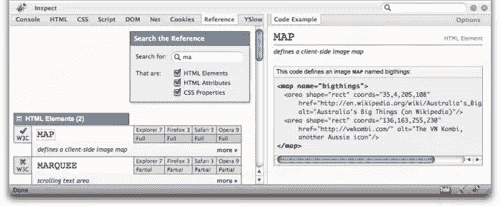](https://www.sitepoint.com/wp-content/uploads/2009/07/codeburner.png)

**[Console](https://addons.mozilla.org/en-US/firefox/addon/1815)** : Console 是 JavaScript console 的替代品，允许你显示按类型(错误、警告、消息)、语言(JavaScript、CSS、XML)和上下文(Chrome、Content)过滤的错误。它还允许你搜索，隐藏重复条目，自定义工具栏等等。

[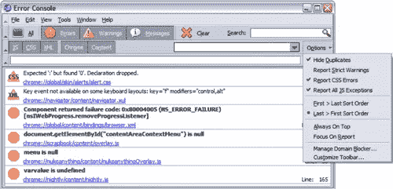](https://www.sitepoint.com/wp-content/uploads/2009/07/console2.png)

**[DOM 检查器](https://addons.mozilla.org/en-US/firefox/addon/6622)** : DOM(文档对象模型)检查器允许您检查、浏览和编辑文档。您可以检查当前打开的窗口，或者输入要检查的附加组件的 URL。

[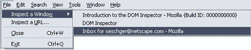](https://www.sitepoint.com/wp-content/uploads/2009/07/di_menu.gif)

**[Firebug](https://addons.mozilla.org/en-US/firefox/addon/1843)** :可能是任何使用 Firefox 的开发者最必备的工具。Firebug 将允许你监控你正在访问的页面的活动，编写新的代码，调试你已经完成的工作等等。

[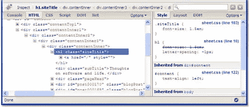](https://www.sitepoint.com/wp-content/uploads/2009/07/firebug.jpg)

:你已经在 Firefox 浏览器中做了很多工作，为什么不用它来与你的服务器进行文件传输呢？除了传输文件，FireFTP 还允许你同步目录、搜索/过滤、运行完整性检查、远程编辑、拖放&、散列文件等等。

[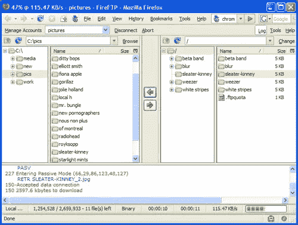](https://www.sitepoint.com/wp-content/uploads/2009/07/fireftp.png)

**[HTML 验证器](https://addons.mozilla.org/en-US/firefox/addon/249)** :正如这个插件的名字所暗示的，HTML 验证器就是要确保你的代码符合标准。您还可以检查您正在访问的页面，由于浏览器角落的一个小指示器，您可以快速查看页面是否符合规定或有错误。单击指示器后，您将看到一个完整版本的代码，该代码将识别问题所在。

[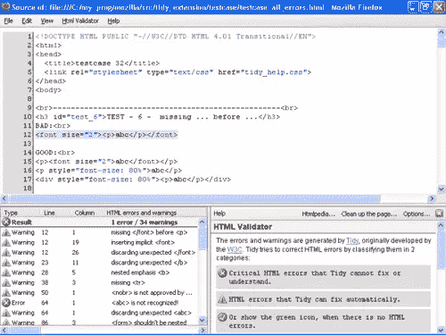](https://www.sitepoint.com/wp-content/uploads/2009/07/html-validator.png)

**[HTTP fox](https://addons.mozilla.org/en-US/firefox/addon/6647)**:HTTP fox 监控浏览器和服务器之间所有进出的 HTTP 流量。报告包括请求和响应头、发送和接收的 cookies、querystring 参数、POST 参数和响应正文。

[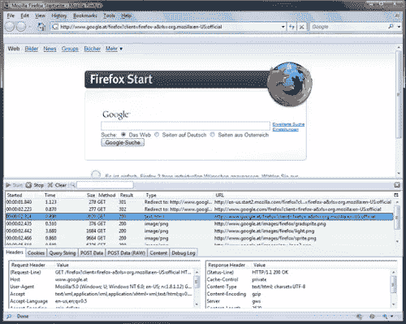](https://www.sitepoint.com/wp-content/uploads/2009/07/httpfox.png)

**[Pixel Perfect](https://addons.mozilla.org/en-US/firefox/addon/7943)**:Pixel Perfect 与 Firebug 一起工作，允许开发人员在他们的 HTML 代码上叠加合成，以查看他们差了多少像素。你可以改变不透明度到任何你喜欢的设置，这样你就可以尽可能完美地排列你的作品。

[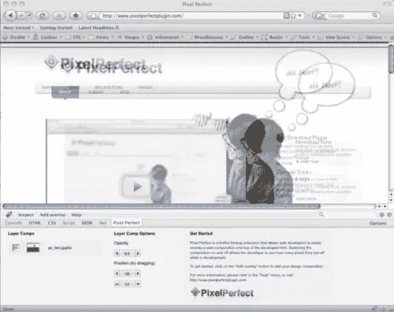](https://www.sitepoint.com/wp-content/uploads/2009/07/pixel-perfect.png)

[**篡改数据**](https://addons.mozilla.org/en-US/firefox/addon/966) :篡改数据允许您查看和修改 HTTP/HTTPS 报头，跟踪和计时您的 HTTP 响应&请求，对 POST 参数进行安全测试等等。

[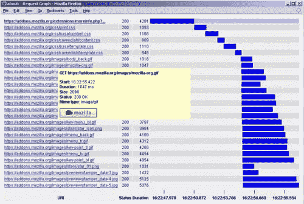](https://www.sitepoint.com/wp-content/uploads/2009/07/tamperdata.jpg)

**[查看依赖关系](https://addons.mozilla.org/en-US/firefox/addon/2214)** :查看依赖关系向页面信息窗口添加一个选项卡，向您显示加载您正在查看的页面时包含的所有文件。这些文件按照加载它们的服务器、每个文件的大小、每台服务器的总负载、页面的总负载等等进行分类。

[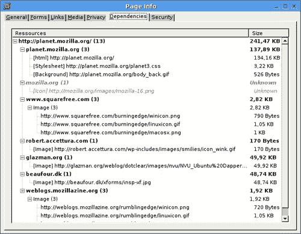](https://www.sitepoint.com/wp-content/uploads/2009/07/viewdep.png)

**[Web Developer](https://addons.mozilla.org/en-US/firefox/addon/60)** :一个简单明了的附加组件，为您提供一些额外的菜单选项，用于使用和禁用不同的级联样式表，以便您可以测试它们。

[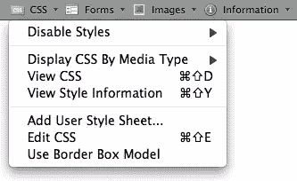](https://www.sitepoint.com/wp-content/uploads/2009/07/web-developer.png)

**[YSlow](https://addons.mozilla.org/en-US/firefox/addon/5369)** : YSlow 是火狐的一个插件，集成了火狐流行的 Firebug 工具。YSlow 应用三个预定义的规则集或一个用户定义的规则集来测试页面的性能。然后，它建议你可以做些什么来改善它。

[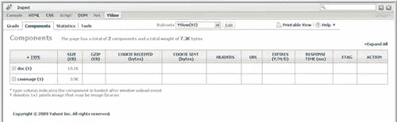](https://www.sitepoint.com/wp-content/uploads/2009/07/yslow.png)

我听说 SitePoint 总部的人很快就要推出另一款非常酷的 Firefox 插件了…本周晚些时候，请关注这篇博客了解更多细节！

## 分享这篇文章