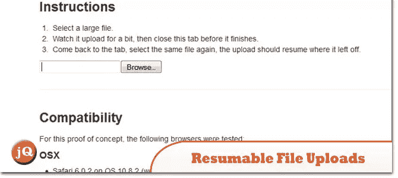
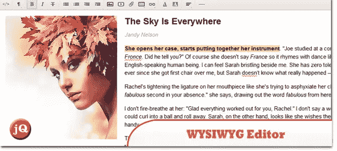
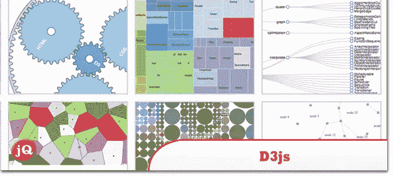
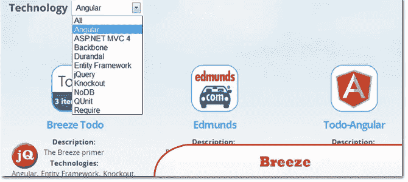
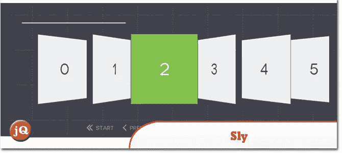
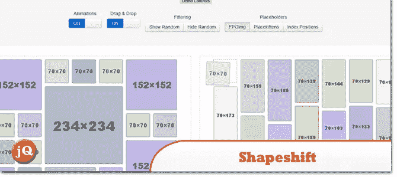
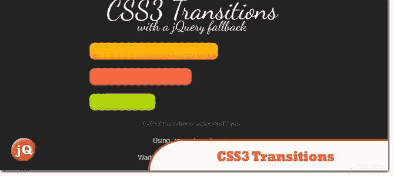
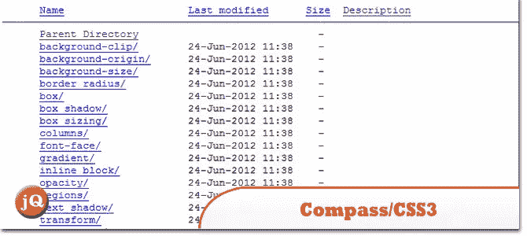

# 13 个有趣的网络发现–2013 年 4 月

> 原文：<https://www.sitepoint.com/13-interesting-web-finds-april-2013/>

上个月发现了一些很酷的网络开发材料，以下是这些发现。享受&留下评论！:)

另请参见:

**[有趣的网络发现–2013 年 3 月](http://www.jquery4u.com/random/interesting-web-finds-march-2013/)**
**[有趣的网络发现–2013 年 2 月](http://www.jquery4u.com/random/interesting-web-finds-feb-2013/)**
**[有趣的网络发现–2013 年 1 月](http://www.jquery4u.com/random/interesting-jsweb-dev-finds-january-2013-22/)**

## jQuery 是瑞士军刀(也没关系！)

最初于 2013 年 4 月 19 日在 jQuery UK 上发表。

 
[来源](http://ajpiano.com/jquery-is-a-swiss-army-knife/#1)

## 可恢复文件上传

一个新的基于 HTTP 的开放可恢复上传协议。简单、便宜、可重复使用的客户端和服务器堆栈。任何语言，任何平台，任何网络。

 
[来源](http://www.tus.io/index.html) [演示](http://www.tus.io/demo.html)

## jsdo.it

这是一个面向前端工程师的编码社区，比如 web 设计师、标记工程师和 JavaScript 工程师。这是一个在线编辑器，在这里你可以一边写一边试着运行你的代码。

 
[源+演示](http://jsdo.it/)

## jQuery 上奇妙的所见即所得编辑器

使用可靠、快速且难以置信的漂亮编辑器在网络上创建文字处理文本。

 
[源+演示](http://imperavi.com/redactor/)

## 伊斯兰教的先知

又一个 CSS/JS 动画测试。移动你的鼠标

 
[源+演示](http://codepen.io/soju22/pen/HDLEe)

## D3.js

这是一个基于数据操作文档的 JavaScript 库。D3 帮助你使用 HTML、SVG 和 CSS 将数据变成现实。

 
[源+演示](http://d3js.org/)

## 微风

JavaScript 应用程序的丰富数据

 
[来源](http://www.breezejs.com/) [演示](http://www.breezejs.com/samples)

## 狡猾的

JavaScript 库，支持基于项目的单向滚动导航

 
[源+演示](http://darsa.in/sly/)

## jquery.shapeshift

具有拖放功能的动态网格系统。

 
[来源](https://github.com/McPants/jquery.shapeshift#readme) [演示](http://mcpants.github.io/jquery.shapeshift/)

## TWITTER 引导资源的大坏蛋列表

315 个有用的 Twitter 引导资源列表。

 
[来源](http://bootstraphero.com/the-big-badass-list-of-twitter-bootstrap-resources)

## javascript masterclass

轶事身体、大脑、软件和代码黑客

 
[来源](http://mkeas.org/javascript-matterclass)

## CSS3 过渡

带有 jQuery 回退的 CSS3 转换。

 
[来源](https://jsfiddle.net/addyosmani/XKrcX/) [演示](https://jsfiddle.net/addyosmani/XKrcX/show/)

## /examples/compass/css3 索引

/examples/compass/css3 索引

 
[来源](http://compass-style.org/examples/compass/css3/)

## 分享这篇文章