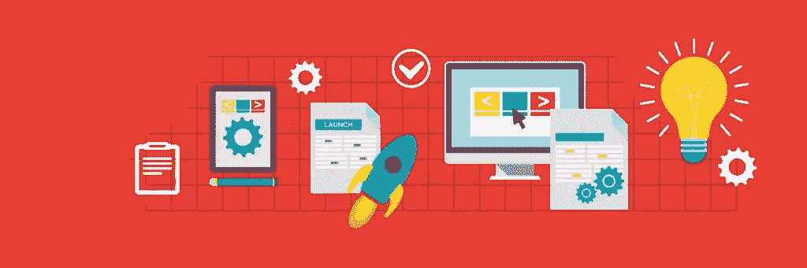

# 更有效地设计和构建应用程序的 13 个技巧

> 原文：<https://www.sitepoint.com/13-tips-on-designing-and-building-apps-more-efficiently/>

我最近一直在思考这些年来我编写的所有小实用程序，以及我如何才能把它们设计得更好。

我粗略地将**实用工具**定义为任何为解决特定情况或业务流程的单一和特定问题而设计的项目。

例如，我构建了一个小型 PHP 应用程序，它接受来自电子商务商店的导出，并将数据解析为特定业务流程所需的另一种格式。

## 我怎样才能设计得更好？

我通常通过有一个要解决的问题的想法来构建一个实用程序，然后直接跳到编辑器中开始输入。

过了一段时间，我发现自己想从旧的实用程序中窃取功能，但是当我重用一些代码时，我发现我编程得有多糟糕！一般来说，我不会在小工具上花太多时间，所以它们不用类、命名空间甚至 OOP 来编程。程序性 FTW！

这让我觉得我应该更有条理，即使是在很小的项目中。

以下是我在开始任何新项目之前考虑的一些问题。

### 1)基础是必须的！

不管这个工具有多小，**练习好的编程**！使用正确的源代码格式、命名约定和注释。另一个开发人员应该很容易就能看到代码中发生了什么。

尽可能避免程序编码。

我不再允许自己写草率的代码，即使项目很小或者用途有限。

### 2)定义项目

如果实用程序只有一个功能要执行，这并不重要:它应该在编码开始之前**被很好地定义。应用程序的定义将包括基本声明，如谁将使用它，它将期望什么数据，以及它应该给出什么输出。**

定义数据源、安全问题，以及应用程序是否会随着时间的推移增加更多功能。

该实用程序将托管在哪里？

定义越详细，在编程时就越容易选择工具并保持在范围内。如果你在为别人编程，这一点尤其正确！

### 3)其他人会致力于此吗？

如果其他程序员会参与进来，增加你的[文档](https://www.sitepoint.com/keeping-php-code-well-documented/)和评论。使用源代码控制，并关注类和方法中的关注点分离。

如果除了你之外，没有程序员需要阅读你的代码或者处理你的代码**，那就坚持最基本的，不要让自己不知所措。只要确保*你*还能理解就行了！**

### 4)源码控制？

根据实用程序的上下文——例如，如果它是一个拥有该工作的组织的内部项目——代码可能被托管在一个公共存储库中。如果有，增加文档；添加一个`readme.md`文件；添加[文档块](https://en.wikipedia.org/wiki/PHPDoc#DocBlock)来定义代码的所有权，使用[语义版本化](http://semver.org/)。

如果有关于知识产权和谁拥有代码的问题，这就需要你在里面放一个[许可证](https://www.sitepoint.com/open-source-licensing-2/)。

### 5)我必须长期维护它吗？

如果你预见未来的发展，假设其他人**将**在这个应用上工作，因此它需要**源代码控制**，改进的**文档**，以及附加的**许可证**。

如果应用程序是组织内部的，您可能不是维护未来版本的人。把额外的时间花在这些琐事上，总比让未来的程序员把你当成一个*差劲的程序员*而不屑一顾要好。

如果你写了文档化很好的代码，你可能会在以后回来得到一封推荐信。(你不能带着公司所有的代码，但至少你会有一封信确认你所有的工作都是好的！)

### 6)我应该创建 API、库，还是两者都不创建？

定义 API 和库超出了本文的范围，但这仍然是一个重要的决定，因为它将改变您的整个编码方法。

这个工具将会是独立的吗？或者你将会把它作为一个库来分发，或者你希望允许其他人通过一个 API 接口来访问这个功能吗？

如果您走 API 路线，您将需要对所有输入和输出、数据验证、数据转换、安全性、HTTP 路由、端点等进行健壮的处理。加密和认证也成为一个问题。

### 7) CMF、后端、配置？

实用程序本身是否需要独立于前端环境的自己的管理界面？

您是否需要一个**后端**来为管理员提供访问权限以控制实用程序？

最大的问题是，任何内容管理框架(CMF)都可能会给你带来大量臃肿的功能，而你并不需要这些功能来运行一个小工具。不过话说回来，CMF 很可能会给你自己的 API 和辅助工具，这可能会派上用场。

或者，您可以将所有配置信息存储在只有管理员有权访问的单个文件中。

在大多数情况下，我只是创建一个`config.php`文件，把所有的配置数据放在那里，然后在没有界面的情况下手动编辑。

### 8)包管理？

包管理是个很酷的孩子，但这并不意味着我们需要出去玩，成为朋友！

不使用包管理很容易包含一些库。

我发现只有当我需要两三个以上的模块，或者那些模块很复杂的时候，我才会使用它。

如果您选择使用 Composer 模块(对于 PHP)，那么我也建议在 Composer 的规则内构建您的实用程序，以便您的项目*本身*可以通过 Composer 管理。使用 [PSR-4 规范](http://www.php-fig.org/psr/psr-4/)，文件夹名，以及类的命名约定等等。

### 9)前端框架？

复杂的前端可能会出现，用户需要执行许多步骤，上传文件，填写表单，查看数据，可视化数据等。随着前端变得更加复杂，您可以考虑使用前端框架。

我所说的<q>框架</q>实际上指的是一个 CSS 框架，比如 Bootstrap、Foundation，或者更大的框架，包括更多的可视化模块和 JavaScript 小部件，比如 jQuery 等等。

我通常发现自己从头开始编写所有的 CSS，但是如果项目变得太大，我可能会在[基础](http://foundation.zurb.com/)上重写。

### 10)我需要记录吗？

您是否需要公用事业公司所采取行动的任何历史记录？您是否需要对谁在何时何地做了什么以及做了多长时间进行审计跟踪？

同样，如果我们在一个公司环境中，并且该实用程序将由多人使用，那么日志可能是跟踪所必需的。

好的日志库在包管理器中可用，所以如果需要，这可能是使用包管理的一个原因。

### 11)我需要强化的错误处理吗？

大多数时候，我创建实用程序时没有考虑错误处理。我倾向于编程时显示所有错误*，一旦一切正常，并且在我的测试中没有错误，我就完全不显示错误。*

 *您应该考虑是否需要复杂的错误处理、前端消息、<q>撤销</q>功能、后退按钮管理、自动保存与保存按钮、弹出窗口和模态窗口，以及这些是否会被绑定到日志记录系统中。

请注意，日志记录、审计、错误管理应该是早期规范的一部分。这将帮助您从一开始就决定使用包管理和框架。

### 12)我需要额外的安全措施吗？

如果您的实用程序执行破坏性的数据管理或需要用户认证，那么额外的安全性是显而易见的。

我倾向于认为，一旦你需要健壮的安全性，那么就使用内置了这些特性的框架。你可以使用一个没有管理接口的框架，比如 Laravel、Kohana、Slim、Silex 等等。或者使用带有 MODX、ProcessWire 或 Bolt 等接口的框架。只要确保框架具有您需要的特性。

没有必要重新发明轮子。不要写自己的日志、安全性、用户认证、数据库抽象等。在这一点上只需要使用一个框架。

### 13)是否面向公众？

要问的一个大问题是，这个工具是只在内部使用，还是允许从普通网站访问。如果是前者，它是否仍然对一个有几十或几百人参与的组织内部开放？

您必须确保您的端点定义良好，并根据需要保护任何辅助文件和脚本。

如果您怀疑高流量，那么您说的是缓存机制，尤其是在生成数据库或高度动态数据的地方。我们还讨论了安全性、日志、认证等等。

我会说，作为一个通用规则，如果你正在创建一个小的实用程序来提供给整个地球，使用所有的公共库、工具、方法、文档，甚至一个框架。

当涉及到分发公共访问时，不要乱来:所有的赌注都是错的，所以只要用现代的、经过良好测试的模块和框架来做每件事就行了！

## 你呢？

这些是我在打开 Sublime 或 Netbeans 开始一个项目之前考虑的一些事情。

也许你已经有了一套用于实用程序的常用工具？我很想知道这些是什么，因为像 Laravel 或完整的 CMF/CMSes 这样的大型框架对公用事业来说可能是多余的。你有没有一些更小的<q>微</q>框架，这些框架有<q>足够的</q>特性来快速完成一个实用程序？

## 分享这篇文章*