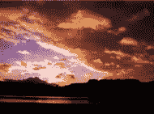
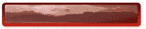

# 烟花中真实世界的光泽效果

> 原文：<https://www.sitepoint.com/real-world-gloss-effects-in-fireworks/>

互联网——尤其是它的 Web 2.0 版本——是一个非常光鲜亮丽的地方。事实上，我认为如果遥远的外星人曾经偷听过我们的无线网络传输，他们会得出结论，人类必须生活在一个由抛光大理石、湿玻璃和高光泽塑料组成的坚硬世界中。

虽然光泽效果可能有点“老掉牙”，但我的主要问题是反射的整体完美性令人厌烦。在网络上，[潮湿的地板](http://en.wikipedia.org/wiki/Wet_floor_effect)总是激光切割的镜子，光滑的按钮似乎总是存在于一个完美的、光照均匀的真空中。

在肮脏、有划痕和污迹的现实世界中，潮湿的地板上有暗淡的斑点和扭曲，光滑的表面扭曲、模糊并反映出它们所居住的斑驳的有机世界。

如果你不想让时尚时钟回到“痛苦的 90 年代”，你可以在不做太多工作的情况下让你的倒影更有个性。

#### 方法

1).让我们从一个圆角矩形开始——它是一个按钮，但也可以是一个导航条、横幅或内容面板——给它一个垂直的、线性的红色渐变。我也给了它一个微妙的窗口。这将是我们按钮的边缘。

2).接下来，我们将复制顶部的形状，并缩小一点。这将是我们按钮的平面。

3).接下来，我们将把上面的形状恢复到一个更基本的白色到黑色的渐变，并给它一个小角度。角度并不重要，只要它偏离了垂线。

4).现在，如果我们把上面的形状通道切换到“屏幕”(在图层面板中)，并把它放在中间，我们只显示图像的亮部，给我们一个干净、高度抛光的表面的印象。我通过降低上方矩形的不透明度来调节光泽。

5).好吧，这没问题，但这正是我之前提到的那种超级完美的光泽。它需要适度的不完美。

 去你最喜欢的股票图片网站，找到一张对比强烈的图片([例如:straymous](http://www.sxc.hu/photo/941295))。图像内容并不重要，但我们需要一个强大的有机的天际线。寻找合适的镜头需要一些反复试验。

6).将地平线图像放入 Fireworks 中，不透明度降低到 50%左右。下一步，把它放在你的按钮中央，然后缩小它，这样按钮的边缘就很好地框住了地平线。

7).我们快到了。接下来，我们需要将上面的矩形复制到剪贴板，但是不要粘贴到任何地方。

8).再次选择您的地平线图像并转到“`**Edit/Paste as Mask**`”。这将掩盖你的地平线形象下降到我们的按钮表面的形状。

9).我们现在有一个可行的反射，但对我来说效果看起来还是有点太强了。我们会低调一点。首先将地平线图像的通道设置为“线性减淡”,只保留图像中自然反射大部分光线的部分。

接下来，我们将添加一个轻微的高斯模糊——大多数反射都不是完美的镜子，一点模糊只会删除照片中我们不需要的细节。

最后，我们将把不透明度降低到 30%左右——但这确实是一个个人偏好的决定。但是请记住，你可能不得不将文本放在顶部，所以易读性是一个考虑因素。

这是最终的图形。地平线图像几乎无法辨认，但它仍然给结果增加了一种真正的有机感。当然，有相当多的变量涉及——层不透明度，通道和过滤器设置——和足够的范围来调整图像到你喜欢的。

我把它保持得简洁明了，但是如果你想尝试使用 PNG 文件，[你可以在这里下载压缩版本](https://www.sitepoint.com/push-making-cta-buttons-clickable/)。

## 分享这篇文章