# 明日 CSS 今日:他们不想让你知道的 8 项技术

> 原文：<https://www.sitepoint.com/tomorrows-css-today/>

随着对新的和即将到来的高级 CSS 功能的浏览器支持的大肆宣传，开发人员可能会对他们今天可以在 web 项目中包含的 CSS 感到困惑。主流浏览器没有广泛支持许多更高级的特性，但是一些非常有用的特性得到了广泛支持——包括来自 CSS3 的新特性。

每天早上，当我浏览我的 RSS 订阅源时，我会浏览新闻文章、教程和博客帖子，这些内容都是关于 web 标准社区取得的巨大进步、即将出现的强大浏览器支持以及 CSS2.1 和 CSS3 中内置的巨大功能。这些都是真的，这对网络来说太棒了，但是我呢？如果 web 开发人员阅读了所有这些好消息，坐下来实现新的 CSS，却发现 90%的用户看不到它，因为他们没有使用最先进的浏览器，那该怎么办？尽管所有的报道都很好，并且最终会导致 CSS、可访问性和整个 Web 的巨大进步，但是开发者很难保持脚踏实地。这就是 CSS 支持现状的现实。

如果你和我一样，一旦你发现 CSS 中的新东西，你会立刻想尝试它，试验它，看看它能做什么。但是很多时候，您会发现对特定 CSS 特性的支持并不广泛，您必须将自己限制在特定的浏览器上才能看到新的效果。那些新知识被束之高阁，你最终会忘记它，因为你不能在日常开发任务中真正大规模地使用它。这种事情经常发生。

##### 哪些浏览器应该引导你关于 CSS 的决定？

现在有很多浏览器可用，有些非常符合标准，有些则不符合。每一个都有一个渲染引擎，将你的代码翻译成你访问网页时看到的内容。那么，你如何知道你的发展策略适合哪一个呢？

目前最流行的网络浏览器是 Internet Explorer 6、Internet Explorer 7、Firefox 和 Safari。我称它们为“四大”——它们是我用来做开发决策的浏览器。我的测试套件还包括一些浏览器，但是我根据四大浏览器来选择 CSS 的使用。

##### 您可以放心使用的高级 CSS

当您选择使用高级 CSS 特性时，您要考虑的因素将超出浏览器支持的可用性，因为您不会对您想使用的所有东西都有默认支持(如果有，也就不用做太多决定)。下面的列表概述了我用来选择下表中显示的每个 CSS 特性的标准。

*   该功能是否有足够的浏览器支持来证明其用途？
*   功能有用吗？
*   如果浏览器不支持会怎么样？如果一个浏览器不支持该功能，它会优雅地降级吗(即降级后不会导致显示问题)？
*   它是否有助于简化语义标记的编写工作？

如果你对这些问题的回答是肯定的、肯定的、肯定的，你可能会有信心去做。下表列出了您现在可以使用的高级 CSS 功能。

<caption>Browser CSS support table</caption>
|  | IE6 | IE7 | 火狐浏览器 | 旅行队 |
| [属性选择器](https://reference.sitepoint.com/css/attributeselector ) | 不 | 是 | 是 | 是 |
| [子选择器](https://reference.sitepoint.com/css/childselector ) | 不 | 是 | 是 | 是 |
| [:第一个子伪类](https://reference.sitepoint.com/css/attributeselector ) | 不 | 是 | 是 | 是 |
| [:第一行伪元素](https://reference.sitepoint.com/css/pseudoelement-firstline ) | 是 | 是 | 是 | 是 |
| [:首字母伪元素](https://reference.sitepoint.com/css/pseudoelement-firstletter ) | 是 | 是 | 是 | 是 |
| 多栏布局 | 不 | 不 | 是 | 是 |
| [边框半径](https://reference.sitepoint.com/css/moz-border-radius ) | 不 | 不 | 是 | 是 |
| [:目标](https://reference.sitepoint.com/css/pseudoclass-target ) | 不 | 不 | 是 | 是 |

让我们浏览这个表，更详细地讨论每个特性。

***[属性选择器](https://reference.sitepoint.com/css/attributeselector)***

一个属性选择器可以使用七种不同的运算符。IE7、Firefox 和 Safari 都以某种形式支持它们(有缺陷或完全支持),可以认为它们可以“安全”使用。属性选择器是高级 CSS 中最有用的组件之一，因为它们允许您使用常见的 HTML 属性有选择地将 CSS 应用于元素，而不必使用额外的 HTML 标记。

**操作员:**无

**描述:**使用不带操作符的属性选择器将选择包含该属性的所有元素。在这个例子中，CSS 规则将把所有具有 rel 属性的链接元素涂成橙色，并删除其下划线。(CSS 2.1)

```
CSS: 
a[rel] { 
  color: orange; 
  text-decoration: none; 
}
```

```
HTML:  
<a href="http://www.example.com" rel="external">dolor</a>
```

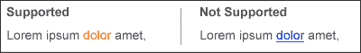

**操作员:** `=`

**描述:**使用等号作为操作符将允许选择器将一个元素与属性的给定值相匹配。在这种情况下，所有带有 rel="external "的链接都将附加一个图标，指示外部链接的网站。(CSS 2.1)

```
CSS:  
a[rel="external"] { 
  padding: 0 20px 0 0; 
  background: #fff url(icon_external-site.gif) no-repeat right center; 
}
```

```
HTML: 
<a href="http://www.example.com" rel="external">dolor</a>
```

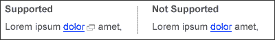

**操作员:** `~=`

**描述:**这个操作符允许选择器将元素与一个属性进行匹配，该属性包含一个以空格分隔的单词列表，该列表中有指定的值。在这种情况下，链接是“外部朋友标签”的 rel 值，我们希望将其显示为外部链接，忽略其他值。当您在元素上使用多个类时，该选择器对于根据类值选择元素也很有用。(CSS 2.1)

```
CSS: 
a[rel~="external"] { 
  padding: 0 20px 0 0; 
  background: #fff url(icon_external-site.gif) no-repeat right center; 
}
```

```
HTML: 
<a href="http://www.example.com" rel="external friend tag">dolor</a>
```


**操作员:** `|=`

**描述:**使用竖线操作符将允许选择器匹配其属性值构成一个带连字符的单词列表的元素，在该列表中存在指定的值。该操作符主要用于`lang`属性。下面的 CSS 将选择一个具有包含`en-`的`lang`属性值的 link 元素，并在它后面放置一面美国国旗。(CSS 2.1)

```
CSS:  
a[lang|="en"] {  
  padding: 0 20px 0 0;  
  background: #fff url(icon_lang-en.gif) no-repeat right center;  
}
```

```
HTML:  
<a href="http://www.example.com" lang="en-US">target link</a>
```

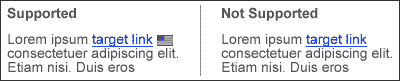

**操作员:** `^=`

**描述:**使用脱字符操作符将允许选择器匹配所有具有以指定值开头的属性的元素。下面的 CSS 将获取任何具有以 http 开头的 href 属性值的链接，并在它后面放置一个图标。这个例子展示了这个选择器对于突出显示你的站点上的外部或者绝对链接是多么的有用。(CSS3)

```
CSS:   
a[href^="http"] {  
  padding: 0 20px 0 0;  
  background: #fff url(icon_external-site.gif) no-repeat right center;  
}
```

```
HTML:  
<a href="http://www.sitepoint.com">SitePoint</a>
```


**操作员:** `$=`

**描述:**当您想要锁定属性的最后几个字符时，使用美元符号运算符非常有用(比如文件扩展名……*提示，提示！*)。本示例将选择`.pdf`文件的任何链接，并在其后放置一个 PDF 图标。(CSS3)

```
CSS:   
a[href$=".pdf"] {  
  padding: 0 20px 0 0;  
  background: #fff url(icon_pdf.gif) no-repeat right center;  
}
```

```
HTML:  
<a href="file.pdf">target link</a>
```

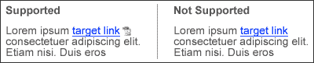

**操作员:** `*=`

**描述:**使用`*=`操作符将允许选择器将任何元素作为目标，该元素的属性包含任意点的值。下面的 CSS 将把这个规则应用到任何标题属性包含模式“home”的链接上。(CSS3)

```
CSS:   
a[title*="Home"] {  
  padding: 0 0 0 20px;  
  background: #fff url(icon_home.gif) no-repeat left center;  
}
```

```
HTML:  
<a href="index.html" title="Home link">Home</a>
```


***[子选择器](https://reference.sitepoint.com/css/childselector)***

**描述:**当指定的第二个元素是第一个元素的直接子元素时，子选择器匹配元素。在本例中，列表项中的所有`<strong>`标签都是红色、粗体(默认行为)和斜体。

```
HTML:  
<li>This is the <strong>example</strong> text</li>
```

```
CSS:   
li > strong {  
  color: red;  
  font-style: italic;  
}
```

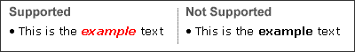

***[`:first-child`伪类](https://reference.sitepoint.com/css/pseudoclass-firstchild)***

**描述:**首子伪类对于突出文章的第一段非常有帮助。

```
HTML:   
<p>Lorem ipsum dolor sit, consectetuer adipiscing.</p>  
<p>Vestibulum non nisl. Duis egestas urna et justo.</p>
```

```
CSS:   
p:first-child {  
  font-weight: 700;   
}
```

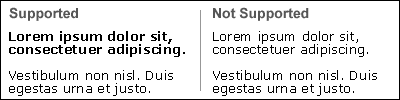

***[`:first-line`伪元素](https://reference.sitepoint.com/css/pseudoelement-firstline)***

**描述:**使用首行伪元素将 CSS 应用于所选元素内的第一行文本。在 EM 单位或基于百分比的布局中，粗体字的数量会随着页面宽度的变化而变化。在这种情况下，段落的第一行的字体粗细为 700(粗体)。

```
HTML:  
<p>Lorem ipsum dolor sit, consectetuer adipiscing.</p>
```

```
CSS:   
p:first-line {  
  font-weight: 700;  
}
```

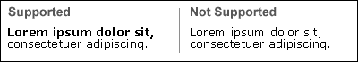

***[`:first-letter`伪元素](https://reference.sitepoint.com/css/pseudoelement-firstletter)***

**描述:**首字母伪元素允许您指定应用于元素首字母的 CSS。在本例中，段落的第一个字母会变大，产生首字下沉的效果。

```
HTML:   
<p>Lorem ipsum dolor sit, consectetuer adipiscing.</p>
```

```
CSS:    
p:first-letter {   
  font-size: 2em;    
}
```

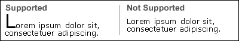

***【多栏布局(内部内容上)***

**描述:**CSS3 多栏布局属性似乎对在线出版物、新闻文章和内部页面内容最有用。因为它们还没有得到广泛的支持，所以不建议在页面的主要布局元素中使用它们。但是，它们可以用来减少标记，并通过缩短列宽和页面长度来提高文本的可读性。对于自动列宽，可以使用列计数声明，对于设置列宽，可以使用列宽声明。

因为这个函数不被完全支持，我们需要使用渲染引擎特有的前缀来定位 Firefox ( `-moz-`)和 Safari ( `-webkit-`)。我们使用不带前缀的第三个声明作为未来浏览器的[渐进增强](http://en.wikipedia.org/wiki/Progressive_enhancement)的一种形式；它被放在列表的底部，这样当完全支持多列时，带前缀的声明将被覆盖。在这种情况下，将有两列，它们之间有 1 米的间隙。

```
XHTML:   
<div id="content">   
  <p>Praesent cursus ultricies uricies uricies urna. Mauris vestibulum neque s urna. Mauris vestibulum neque.</p>   
  <p>Praesent cursus ultricies urna. Maur vestibulum neque at.</p>   
</div>
```

```
CSS:    
#content {   
  /*gecko*/    
  -moz-column-count: 2;   
  -moz-column-gap: 1em;   
  /*webkit*/   
  -webkit-column-count: 2;   
  -webkit-column-gap: 1em;   
  /*future proofing*/   
  column-count: 2;   
  column-gap: 1em;   
}
```

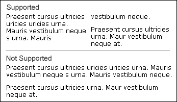

***[边界半径](https://reference.sitepoint.com/css/moz-border-radius)***

**描述:**边框半径属性解决了在不使用图像的情况下显示圆角的老问题。下图是 Firefox 2.00.12 中的渲染，但在最新版本的 Safari 和 Firefox 3 Beta 3 中，半径线渲染得干净多了。边框半径的唯一缺点是，如果你使用背景图片，它会显示在圆角的边界外面，所以你可能需要在设计背景图片时考虑到这一点。有一个多重背景图像 CSS3 属性也可以处理这个问题，但是目前还没有任何浏览器支持它(据我所知)。

特定的角也可以被赋予单独的属性，如:`border-radius-topleft: 1em;`。

```
XHTML:   
<div id="sidebar">Lorem ipsum dolor sit amet, consectetuer adipiscing elit. Suspendisse ut odio eu nisi rutrum euismod.</div>
```

```
CSS:    
#sidebar {   
  padding: 1em;   
  border: 1px solid #333;   
  /*gecko*/   
  -moz-border-radius: 1em;   
  /*webkit*/   
  -webkit-border-radius: 1em;   
  /*future proofing*/   
  border-radius: 1em;   
}
```

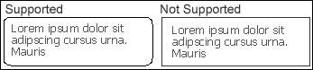

***[`:target`伪类](https://reference.sitepoint.com/css/pseudoclass-target)***

**描述:**当你使用锚的时候，目标伪类在将用户的注意力吸引到页面的特定区域时非常有用。在这个例子中，当用户点击锚链接后，相应的文本将以红色边框突出显示。这类似于黄色渐隐技术。

```
XHTML:   
<a href="#focusarea">Jump to focus area</a>   
<p id="focusarea">Lorem ipsum dolor sit amet, consectetuer adipiscing elit. Suspendisse ut odio eu nisi rutrum euismod.</p>
```

```
CSS:    
p#focusarea:target {   
  border: 1px solid red;   
}
```

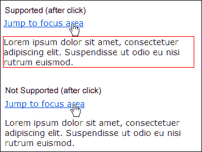

其中一些高级选择器、伪类和元素以及其他漂亮的技巧是 CSS 2.1 规范的一部分，而其他的则是 CSS3。我发现它们都很有用，它们都可以在不隐藏重要内容的情况下使用，同时显著增强用户体验。一般来说，内容是任何网页中最重要的元素——这是人们访问的原因。通过这些简单的 CSS 增强来增加丰富的用户体验将会增加你的网站的可用性，并且会让用户一次又一次的回来。

##### 不兼容浏览器的选项

***渐进性增强***

渐进增强是使用高级 CSS 的一个非常重要的部分。通过采用分层开发方法，您可以避免不兼容浏览器的问题:

1.  第三层是你想添加的任何行为(高级 CSS 和 JavaScript)。

首先，集中精力做好第一层和第二层——确保所有用户都有良好的基础体验，无论他们使用哪种浏览器。一旦核心开发完成，您就可以安全地添加高级 CSS 功能，为使用支持浏览器的访问者增强用户体验，因为他们知道最重要的元素对所有人都是可用的。

***用 JavaScript 填补空白***

有一些很棒的 JavaScript 库可以帮助 IE6 实现更符合标准的行为。在某些情况下，它可能会比它的升级版本 IE7 更加兼容。

早在 ie7 发布之前，狄恩·爱德华兹就创作了一个名为“IE7”的脚本。这是一个 JavaScript 文件包，处理 IE6 中的各种兼容性问题。这些文件可以从[谷歌代码](http://code.google.com/p/ie7-js/)下载，你也可以在[狄恩·爱德华兹 ie7 页面](http://dean.edwards.name/IE7/)找到更多信息。这些文件往往有点重，但工作非常好，您可以根据自己的需要选择想要使用的文件。
另一个可以用来帮助解决不兼容浏览器的脚本是 [jQuery](http://jquery.com/) 。JQuery 的 [prepend 方法](http://docs.jquery.com/Manipulation/prepend)可用于将客户端元素插入到您的标记中，您可以相应地设置它们的样式。这将创建更多的 CSS，但如果您已经在使用 jQuery，这可能是一个好的解决方案。

一个更可靠的选择是阿历克斯·比肖夫的 subject . js，在[的一个列表之外](http://www.alistapart.com/articles/keepelementskidsinlinewithoffspring)。subject . js 通过 DOM 脚本自动添加伪类。它还允许您使用 CSS3 选择器，比如通常不可用的`:nth-child()`。虽然 IE6 从这个脚本中获益最大，但所有当前的浏览器都将从中获益。

##### 相信你自己的经验

我感觉就像[读彩虹](http://en.wikipedia.org/wiki/Reading_Rainbow)的那个家伙说“不要相信我的话”，但是……不要相信我的话！确保你自己做了调查。我在我的个人网站上有浏览器使用的统计数据，SitePoint 有自己的统计数据，你也有；你的大部分前端开发决策应该基于访问你网站的人。每个网站都有不同的趋势和人口统计数据来指导开发策略。你应该跟踪你的访问者，并制定一个定期的计划来回顾你的统计数据(我大概一个月看一次我的)。这些回顾在一段时间内会非常有帮助。你不想知道你的用户何时开始升级他们的浏览器吗？

就我个人而言，我已经使用了谷歌分析和 StatCounter 来分析我的网站流量。任何一个都可以完成任务。Google Analytics 是一个更全面的程序，具有极其深入的数据分析。StatCounter 提供了更多的一般信息，但是非常有用。

##### 享受高级 CSS 的好处

我读过的一些最好的出版物已经回答了这个问题:“为什么？”当我可以通过添加额外的类、ID、span 或 div 或者使用 JavaScript 来实现相同的效果时，我为什么要使用高级 CSS 技术呢？

答案很简单:你可以用更少的代码做更多的事情。随着近年来浏览器的快速发展，CSS 支持也在不断改进。通过使用最少量的标记，您可以保护您的站点免受浏览器更新和更改的影响，并且不费吹灰之力就能极大地提高可访问性。

这些技术将减少你需要用来完成你想要的布局的 HTML 和 CSS 的数量。在网络上，总会有上百种不同的方式去做一些事情；如果你使用高级 CSS，你可以用更少的标记来创建更轻便、更有用、更易访问的网站。

***参考文献***

*   [SitePoint CSS 参考](https://reference.sitepoint.com/css)
*   [W3C.org](https://www.w3.org/)
*   [CSS3.info](http://www.css3.info/)
*   [维基百科](http://en.wikipedia.org/)
*   [狄恩·爱德华兹 ie7](http://dean.edwards.name/IE7/)

## 分享这篇文章