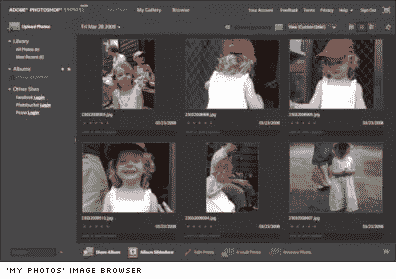
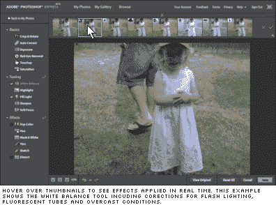

# Adobe Photoshop Express 启动

> 原文：<https://www.sitepoint.com/adobe-photoshop-express-launches/>

嗯，我们知道它已经准备了很长时间，但是 Adobe 的第一个在线应用软件 Photoshop Express 的测试版终于在今天早上登陆了。尽管他们无疑带来了巨大的图形声誉，但他们可能不会完全按照自己的方式行事，因为在这个新的领域已经有了一些成熟和优雅的竞争对手——具体来说就是 [Picnik](http://www.picnik.com/) 、 [Pixer](http://pixer.us/) 、 [Phixer](http://www.phixr.com) 、 [Pixenate](http://pixenate.com/) 和 [Fotoflexer](http://fotoflexer.com/) 。

**第一印象:**

1)注册过程想知道我来自哪个国家——只要是美国。来吧伙计们。你要把应用程序快递给我们吗？在欧洲，计算机使用不同规格的互联网吗？？恐怖分子是不是一直在等着用 Photoshop Express 做出特别有视觉吸引力的邪恶计划？

愚蠢的东西。不要问只有一个答案的问题。

2)该界面基本上是一个在线 Adobe Bridge，大量的黑色和木炭使您的图像看起来更丰富。如果你是一个桥牌迷，Express 会感觉非常熟悉，尽管作为一个消费级产品，你不得不质疑有多少用户可以利用桥牌体验。

即使你不是桥牌迷(像我一样)，你也可能不得不承认这是一个很好的工作环境。

对于一个基于浏览器的应用程序来说，它似乎也非常快，非常巧妙地模仿了 Bridge 的滑动缩略图调整大小器——所有这些都不需要离开浏览器。

3)他们提供的第一部分是 Flickr/Picasa 的等价物，在加入时给你 2Gb 的免费存储空间。几年前，这看起来相当慷慨，但现在有了这么多无限上传服务，可能就不那么慷慨了。然而，该应用程序可以直接与 Picasa 和 Photobucket 中的照片进行交互，它还可以非常容易地在脸书、WordPress 和大多数社交网站上显示您的图像。

4)一旦你上传了你的照片，所提供的编辑工具相对来说很巧妙，但肯定是针对“乔·脸书”的，而不是摄影专业人士或艺术家。虽然每个滤镜都是高度可配置的，但大多数只能应用于整体图像，所以针对小问题区域(如下面曝光不足的面部区域)是不可能的——至少目前是这样。

这些工具分为三个部分。

**基础:**裁剪&旋转、自动校正、曝光、消除红眼、修饰和饱和度。

**调音:**白平衡、高光、补光、锐化和柔焦

**效果:**流行色、色相、黑色&白色、淡色、素描、扭曲

5)虽然将实时效果应用到图像的标准方式似乎是滑块和转盘，但 Photoshop Express 采用了一种稍微非传统但我认为相当有效的方法来应用其滤镜效果。激活任何工具都会在顶部自动生成一系列八个缩略图变体，只需将鼠标悬停在任何一个上面，就会实时更新主图像。

对于经验不足的用户来说，像这样的“智能实时预设”通常比神秘的滑块和转盘更好，即使是经验丰富的用户也能获得足够好的结果。当需要更精确的控制时,“扳手图标”下有可手动配置的控制。

正如您可能会从一家拥有丰富图像处理经验的公司那里期待的那样，Express 生成的成品图像质量非常好，明显优于一些竞争对手。也许 Adobe 产品最令人印象深刻的一点是所有效果都是非破坏性的，让您可以自由地重新打开之前编辑过的图像并删除您的更改。

**什么是 Photoshop Express:**

如果你正在为你的爸爸、姐姐、客户甚至你自己寻找一个有吸引力的、可靠的和易于使用的照片改进剂，Photoshop Express 提供了一个简单有效的选择。

【Photoshop Express 不是什么:

如果你正在寻找桌面版 Photoshop CS3 的在线替代品(即使只是部分替代品)，你可能找错了人。Express 甚至没有试图模仿任何你可能习惯在桌面上使用的手动画笔、钢笔或有针对性的修饰工具。如果你想做的不仅仅是点击调整， [Fotoflexer](http://fotoflexer.com) 可能会提供更多你需要的选项。

## 分享这篇文章