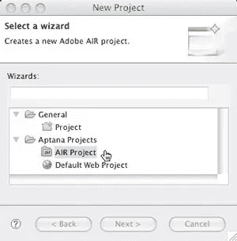
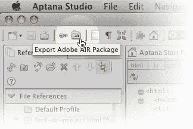

# Adobe 集成运行时:不仅仅是空话

> 原文：<https://www.sitepoint.com/adobe-air-more-than-just-hot-air/>

*转载自[科技时报#187](https://www.sitepoint.com/the-second-coming-of-the-productivity-tool/) 。* 
**我想借此机会带你踏上一次进入*阴阳魔界*的旅程。**

当然，当我说“边缘地带”时，我实际上是指存在于 web 应用程序和桌面应用程序之间的那个奇怪的、未被探索的空间。仅在几年前，这还像是一条宽阔的、无法跨越的鸿沟；两个独立世界之间诡异而短暂的空白。

虽然我最近发布的 Mozilla Prism 包采用了相对低技术的方法，将现有网站打包成一个看起来像桌面应用程序的盒子，但 T2 的 Adobe AIR 平台完全更加复杂。

随着上个月 1.0 版本的发布，Adobe AIR 仍然属于“闪亮和新”的类别，但感觉非常成熟。AIR 不仅仅是一个单一站点的浏览器——它是一个跨平台的运行时环境(T2 ),两者之间的差异是显著的。事实上，AIR 广泛的 API 意味着它与 Java 的共同点比它与 Mozilla Prism 的共同点更多。

然而，AIR 特别有趣的地方在于，您可以使用以下任何一种技术构建一个桌面应用程序，在 AIR 平台上运行:

*   HTML、CSS 和 JavaScript
*   Adobe Flash，或
*   Adobe Flex。

由于这种灵活性，采用 AIR 的最大潜在障碍——开发人员面临的学习曲线——几乎不存在。仅这一点就使 Adobe AIR 成为对 web 开发人员非常有吸引力的平台，不管他们的专业知识在哪里。

但是这有什么大不了的？

虽然像 [Prism](http://labs.mozilla.com/2007/10/prism/) 、 [Bubbles](http://www.3d3r.com/bubbles/) 、 [Fluid](http://fluidapp.com/developer/) 和 [Pyro](http://www.karppinen.fi/pyro/) 这样的 SSB 非常适合打包现有网站，并将其作为独立的桌面应用程序呈现，但 Adobe AIR 与众不同的是其全面的 API 集。

进入 Adobe AIR API，您的桌面应用程序能够检测它当前是否连接到网络，进入原生菜单选项，写入文件系统或其他数据资源，控制窗口，或与操作系统交互-几乎是常规桌面应用程序可以做的任何事情。无论用户使用的是 Windows PC 还是 Mac(运行时的 Linux 版本即将推出)，它都能做到这一点。

因此,“运行在空中”的应用程序看起来和*感觉*像本地桌面应用程序(比 Prism 应用程序更像),它们可以被捆绑成一个包，使得最终用户可以从存储介质(如 CD-ROM)中轻松安装，或者从网页上单击一下。

值得注意的是，用 HTML、CSS 和 JavaScript 构建的 AIR 应用程序是使用 WebKit 渲染引擎显示的，该引擎与苹果的 Safari 浏览器和基于 Linux 的浏览器 Konqueror 是同一引擎。因此，您在使用这些浏览器时遇到的任何渲染问题也可能会在您的 AIR 应用程序中出现。

**开发工具**

有几个工具可以用来开发 AIR 应用程序。如果您使用 Dreamweaver CS3，那么 [Dreamweaver AIR extension](http://labs.adobe.com/wiki/index.php/AIR:Dreamweaver_CS3_Extension) 是一个自然的选择，因为这两款产品都来自 Adobe 家族。

Aptana Studio 也有类似的扩展，我是它的忠实粉丝。Kev 在《技术时报》第 148 期的[中评论了 Aptana。](https://www.sitepoint.com/the-second-coming-of-the-productivity-tool/)

如果您选择的代码编辑工具是其他的，不用担心！您仍然可以使用 [AIR SDK](http://www.adobe.com/products/air/tools/sdk/) 创建 AIR 应用程序，这是一组用于编译、打包和部署 AIR 应用程序的命令行工具。您不会得到这些扩展提供的任何额外好处，比如代码完成、包管理和调试功能。

**构建一个简单的 AIR 应用程序**

让我们来看一些构建最简单的 Adobe AIR 应用程序的示例代码——单站点浏览器。对于这个演示，我们将创建一个桌面版的流行在线服务[谷歌日历](http://calendar.google.com/)。

与 JEE 应用程序非常相似，Adobe AIR 应用程序由一个特定的文件结构组成—例如，有一个定义一组配置信息的`application.xml`文件。如果你愿意，欢迎你探索[优秀的空气文件](http://www.adobe.com/support/documentation/en/air/)来了解所有这些东西。就我个人而言，我宁愿让我的工具集为我处理它…

正如我提到的， [Aptana Studio](http://www.aptana.com/) 是一个优秀的、免费的、跨平台的开发环境。使用 AIR 扩展，创建一个 AIR 项目就像选择**文件** > **新项目** > **AIR 项目**并填充几个字段一样简单。


*Aptana 工作室让创造一个新的空气项目变得轻而易举。*

这样一来，我们就可以开始编写我们的应用程序了，在本例中，我们的应用程序包含了您所见过的最简单的 HTML:

```
 <html>
  <head>
    <title>Google Calendar</title>
    <script type="text/javascript" src="AIRAliases.js">
   </script>
  </head>
  <body>
    <iframe frameborder="0"
         src="http://calendar.google.com"
         sandboxRoot="http://calendar.google.com/"
         documentRoot="/"
         width="100%"
         height="100%">
    </iframe>
 </body>
</html> 
```

在《暮光之城》的任何一集里，结尾总是会有转折——这一集也不例外。问题是**这是您需要编写的所有代码！**只需部署你的 AIR 应用程序(在 Aptana Studio 中，点击 **Export Adobe AIR Package** 按钮即可)，结果将是一个带有`.air`扩展名的漂亮的小安装程序。


*打包来自 Aptana Studio 的全新 AIR 应用程序。*

我们的杰作现在被整齐地打包在这个`.air`文件中，准备安装、分发或廉价出售。

当然，大多数 AIR 应用程序不仅仅由一个简单的`iframe`组成，它充当外部服务的包装器。但是希望看到这个例子能够鼓励你使用现有的 HTML、CSS 和 JavaScript 技能开始尝试更复杂的应用程序——无论是离线还是在线。

在接下来的几个月里，你肯定会在 SitePoint 上看到更多关于 Adobe AIR 的内容。

## 分享这篇文章