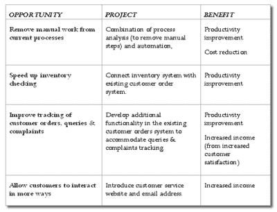
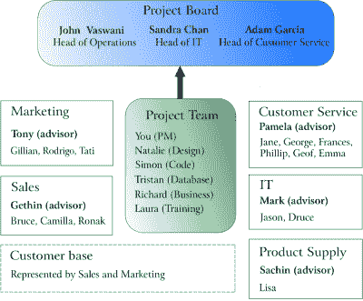
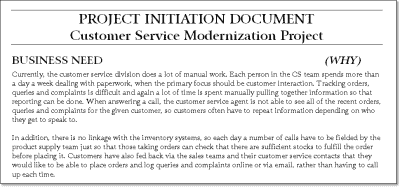

# 项目管理的原则

> 原文：<https://www.sitepoint.com/principles-project-management/>

你已经了解了基本的项目生命周期，我们刚刚讨论了一些项目管理的基本原则。但我打赌你一定很想做点什么。这一章摘自 SitePoint 的新标题*项目管理的原则，我们将讨论项目生命周期之前的工作——寻找可能的项目，确定哪些项目值得追求，以及了解将参与任何项目的不同人群。最后，我们将讨论实际启动项目的过程。*

 *我知道——我们在这里涵盖了很多内容！但和往常一样，你可以[下载 PDF 格式的这一章离线阅读](https://www.sitepoint.com/books/project1/)。

在接下来的每一节中，您将会看到对过程是什么以及它为什么重要的讨论，随后是将帮助您的项目快速起步的工具和最佳实践。

##### 发现:查找项目

项目不会凭空出现。尽管许多项目经理只是在已经决定要开展一个项目以达到某种目的时才参与进来，当然，在此之前还有一个阶段:发现。发现是组织审查可用机会并决定其中哪些将在适当的时候成为项目的过程。

理想情况下，发现过程应该确保最好的机会被追求——而不仅仅是那些最先被提到的，或者那些拥有最多支持者的机会。在进行这个过程的地方，它通常与某种项目组合计划相结合，通过项目组合计划，潜在的项目与组织本身的资源或能力相匹配。最终的结果是一个真正最优先的项目列表。

可悲的现实是，在许多情况下，要么根本没有发现和投资组合规划的过程，要么现有的过程不会导致选择将交付最大价值的项目。同样真实的是，作为一个项目经理，在这个阶段你的影响力可能非常有限——毕竟，在很多情况下，直到有一个潜在的项目分配给你，你才会知道它！

然而，了解已经发现了什么，以及你正在管理的项目是如何开始的，是非常重要的。它可以告诉你这个项目对你工作的组织(无论是雇员、承包商还是服务提供商)是否真的有很高的价值，或者它的潜在价值是否仍然需要被确定。它也可能让你提前洞察到你在项目过程中可能要面对的复杂性。

如果你发现发现工作做得很少或没有做，不要绝望——自己去做！找出为什么组织中的人认为你的项目很重要。了解他们期望项目交付什么——试着关注它对他们意味着什么，而不是要建造什么的具体细节。如果他们的回答表明他们认为这个项目不重要，找出他们认为时间和精力花在哪里会更好。

你的第一反应会是保护你的项目，但是你可能会为另一个项目找到机会，这个项目会带来更多的价值。即使你最终没有放弃原来的项目，而是承担新的项目，让组织内的利益相关者注意到它，也会让你成为一个真正关心公司利益的项目经理，而不仅仅是你自己的项目。

*例 2.1。选择错误的选项*

想象一下，在你工作的公司里有一个处理客户订单的团队。团队成员发现了许多机会:

从当前流程中去除人工工作。
*团队中的许多人觉得他们几乎把所有的时间都花在了整理文件上，而不是真正与客户打交道。*

**加快盘点速度。**
*当顾客下订单时，团队成员要打电话给库存团队，了解货物是否有货。加快这一进程将大大提高他们的效率。*

**改善对客户订单、查询和投诉的跟踪。**
*目前，所有客户互动的跟踪都是手动完成的。实际上，团队中有一个人的全职工作是收集信息并将其放入 Excel 电子表格中！*

允许顾客以更多方式互动。
*许多客户表示，他们希望能够向整个团队发送电子邮件，或者在线输入问题和投诉。*

正如你可能已经猜到的，上面的机会是按照重要性排序的。该团队认为减少他们的手动工作是最重要的，库存跟踪的改进和客户跟踪自动化紧随其后。一旦这些基本问题得到解决，该团队认为可以开始真正有益于客户的工作了——引入网站和电子邮件地址，以便他们可以记录订单、查询等。

然而，当组织中其他部门的人参与进来时，他们会非常关注客户的网站。营销可以看到这将是一个真正的卖点，销售团队认为这将使他们的联系人高兴。他们没有意识到，为了客户网站的成功，团队需要首先处理所有其他的机会。

然而，当你开始建立新的客户网站时，你才知道这些。你开始着手这项工作，但是发现团队中处理订单的人很难共事:他们不会清楚地回答问题，不会参加你组织的会议，也不会回复电子邮件，除非一再提醒他们。你感觉到了敌意，但你不知道为什么——你刚到那里一周。你肯定不会已经冒犯了他们吧？

你联系了一些在你为这家公司工作的上一个项目中认识的 IT 人员，问他们最近怎么样。他们解释了该团队确定的其他项目…并且该团队实际上认为那些其他项目更重要。然而，营销团队中的某个人在听说了开发网站的可能性后，向一个大客户承诺网站将很快准备就绪，因此管理层决定优先考虑该项目，而不是改进系统。

现在你明白为什么团队反应如此迟钝了吧！他们不高兴是因为他们自己的需求被忽视了，而现在你正在做他们被迫过早参与的项目。

此时，很容易变得沮丧或开始恐慌。如果团队继续破坏项目，当项目没有交付时，你受到责备，怎么办？你没有能力回到他们真正想做的项目中去，所以也许你现在就应该放弃…

然而，关键是现在你明白了是什么导致了团队的不合作和不响应。有了这些知识，你就可以做些什么了！

正如我们已经讨论过的，项目经理通常不会参与决定要承担哪些项目。但是，在这种特殊的情况下，您可以尝试减轻网站项目优先于更新现有系统的影响。

首先，你与团队成员 Pamela 进行了讨论，她是到目前为止产生摩擦的主要原因。你解释说，你知道卡片上原本还有其他项目，并请她为你澄清这些项目会包括什么。当她说话时，你意识到现有的手工过程的一些元素对你的项目也是有问题的——例如，如果没有人打电话，就不可能确定一件商品是否有库存。

在这个特殊的例子中，有一条明显的前进路线——帮助识别网站项目真正成功所需的现有系统的现代化。然后推动将这些纳入你自己的项目范围，或者建立一个单独的团队来并行处理这些问题。

*然而，即使你无法影响公司提高生产力和改善网站，仅仅与 Pamela 交谈似乎就能极大地改善关系。她评论说，你是第一个花时间真正理解团队为何如此沮丧的“技术人员”。她已经开始回复你的询问和邮件，甚至似乎已经告诉团队的其他成员，他们也应该帮助你。*

关键是，如果不了解你的项目的根源在哪里，你就是盲目的。通过投入一些时间来进一步了解发现工作是如何完成或未完成的，以及决策是如何做出的，您可以获得对您在项目中每天可能面临的挑战的宝贵见解。这种方法也能给你任何可能让你生活困难的办公室政治的早期警告！

##### 挑选最好的项目

选择最佳项目包括三个步骤:

1.  识别机会。

3.  比较机会。

5.  对它们进行排序并决定进行哪一项。

***识别机会***

识别机会的方法有很多种，其中一些比另一些更复杂，所以让我们从考虑一些你可能已经遇到过的基本工具开始。

最明显的选择是头脑风暴。让组织中的人聚在一起，让他们思考任何让他们烦恼的事情，任何可以做得更好的事情，或者还没有做但可以开始做的事情。

*停止、开始、继续方法*
*你可以用一种叫停止、开始、继续的模式让人们集中注意力。在这里，你实际上是让房间里的人说出他们希望组织停止做的一项任务，一项应该开始做的任务，以及一项应该继续做的任务。*

如果某个特定的业务流程或一组流程显然会给组织带来很多痛苦、手工工作或返工，那么就有必要绘制该流程的图表。您可以使用任何工具来做到这一点——从老式的记号笔和白板，到定制的流程图工具或 UML 图。(UML 代表统一建模语言，并构成一组用于创建流程、数据等的流程图的标准格式。UML 倾向于受可用性专家和软件工程师的欢迎。像往常一样，仔细考虑你选择的工具——它们需要让每个相关人员都能理解和使用。)

一旦你画出了业务流程，看看每一步，问自己，“我们为什么要这样做？”如果没有一个好的理由来采取这个步骤，那就取消它！如果这一步是必要的，但可以做得更聪明，问怎么做。如果什么需要改变的问题不容易回答，一个全面调查选项并创建解决方案的项目可能会从你的分析中产生。

*例 2.2。创新或改进*

一个关于 20 世纪早期一家马车制造商的轶事清楚地说明了创新的必要性。该组织致力于制造更快、更便宜、更好的鞭子(用于拉四轮车和手推车的马)……当时马拉的车正迅速被汽车取代。降低马鞭的价格不会增加销量，因为价格不是问题。

但是，请记住，有时最大的机会——将对业务产生巨大影响的项目——可能是那些不代表增量改进的项目。在许多情况下，真正有所作为的方式可能是意识到有一个全新的方向可以选择，有一个全新的产品可以关注，或者有一个全新的经营方式。

***比较机会***

一旦你有了一个可以抓住的机会列表，你就需要找出哪个是最重要的。您可能希望从确定如果修复了流程、填补了缺口或者创建了新服务，将会产生什么好处开始。这会减少某人的工作量吗？让公司多赚钱？带来新客户？以某种方式降低风险？

通常，公司决定抓住机会的原因是以下一个或多个好处:

*   增加收入(更高的销售额、新市场、新服务)
*   降低成本(使成本更低、更快、库存更低)
*   提高生产率(用更少的时间/成本/人员完成同样的工作)
*   降低风险(提高税收遵从度，提高审计分数)

一旦你确定了每个项目的好处是什么，你需要计算出这个好处有多大。理想情况下，您希望能够以某种方式用数字来衡量收益——无论是某人可以多邮寄 50%的发票，销售额增加 50，000 美元，小配件现在只需 10 美分，还是您的会计在人们的记忆中第一次露出微笑。

*有什么问题？*
*现阶段，你还是在比较机会，而不是项目！在这个阶段考虑问题和差距——我们很快就会看到解决方案(项目)。*

在这一章的后面，我们要看的发现工具之一是价值创造——一种计算项目将交付的价值的方法。

***排名和选择机会追求***

既然你已经知道了可利用的机会，以及抓住这些机会能带来多大的好处，你就需要决定抓住哪一个。你可能发现了一个非常大的机会，以至于你觉得有必要立即着手处理它。然而，更有可能的是，你会有很多选择，并且需要决定哪一个是最重要的。

首先，按照潜在利益对机会进行排序。第二，非常粗略地计算出一个项目可能需要什么——字面上只是一两句话，描述你将如何着手解决这个问题。如果你没有任何线索，这个项目可能会专注于研究和寻找一个最终可以实现的解决方案！

例如，如果我们回想一下之前的案例研究，问题已经按照对客户服务组织最重要的顺序进行了排序。他们的重点是节约成本和提高生产率。当营销人员(他们更专注于增加销售额)参与进来时，等式发生了变化，因为他们对增加的收入感兴趣。

在这种情况下，我们可以根据每个项目可能影响的领域数量来对项目中的机会进行排序。为此，我们可以使用类似于表 2.1 中的矩阵，“对机会和收益进行排序和粗略筛选”。

理想情况下，下一步应该是通过计算数字来量化收益。在明显节约成本的情况下，分配一个数字是很容易的。如果您预测减少文书工作将意味着每月节省目前花费在纸张、打印机、复印机等方面的资金，您可以简单地合计这些数字。然而，当你开始预测销售增长和生产率提高时，计算就变得模糊了。不要纠结于用现金来表示一切；相反，尽可能清楚地表达好处，这样你就可以在合适的人面前得到它，从而对项目做出决定。

接下来，试着根据完成起来更容易或更便宜来排列项目。根据你的情况，容易和负担得起的问题可能更重要或更不重要。如果你组织中的人可以被分配到一个给定的项目中，你可能会更关心他们能多快有所作为。另一方面，如果你不得不付钱给第三方来处理项目，项目的成本可能是一个更大的问题。

在计算出哪里可以以最低的成本获得最大的收益后，你可以与相关的利益相关者合作，选择一两个项目来进行。

*这只是一个经验法则*
*不要忘记，在这一点上，你所拥有的都是初步估计。你没有花大量的时间来确保潜在的利益和预计的成本是真正准确的。*

这是一个“经验法则”类型的工具——在项目启动阶段，你应该确保等式的成本和收益两方面都得到调查和验证。如果您发现项目的某个元素与您预测的有很大不同，您甚至可以回到发现阶段，选择一个不同的项目来工作。

*对组织来说最好的项目对你来说是最好的吗？*
*这个过程的重点是为组织寻找最佳项目。作为外部承包商或服务提供商，您还需要关心您的企业将从您从事的项目中获得的利益。*

你可能还想对你所有客户的项目进行类似的比较，选出最有可能让你的组织受益的项目。流程是一样的，但是一些考虑事项可能会有所不同。例如，你可能选择承担一个利润较低的项目，但很有可能在未来带来更多的工作。你应该投入同样多的精力为自己选择合适的项目，就像你帮助你的客户选择符合他们需求的最佳项目一样。

***发现不良项目***

正如我们已经讨论过的，许多项目经理不参与发现阶段，在这个阶段选择好的项目。因此，对于项目经理来说，发现糟糕项目迹象的能力是一项需要培养的宝贵技能。

首先，我们来思考一下*好的*项目的一些特征:

*   它们提供了巨大的好处，并定义了衡量这些好处大小的标准。
*   他们对组织的未来很重要(或者，用管理的话说，他们是“战略上重要的”)。
*   对它们投入了足够的资源。
*   他们在组织内有支持者。

在这一章的后面，我们会更多地讨论你需要的支持者的类型，以及为你的项目找到一个赞助者的重要性。

一个糟糕项目的特征与上面概述的特征形成了相当可预见的对比:

*   没有人真正认识到商业利益的项目，或者你能得到的最接近成本估算的项目，就是有人以去年夏天我抓到的那条大鲶鱼的姿态挥舞双手的项目，都是危险的。
*   过于关注当前而忽视未来的项目是危险的。想想马鞭制造商投资制造更快更便宜的生产线，而不是意识到需要改变方向。
*   项目中的资源投资不足或者不存在是另一个你应该小心的警告信号。没有预算、人员或设备的项目从一开始就是有风险的。
*   即使组织中只有少数人认为应该完成的项目，也是最危险的。这类项目很快会让你觉得每个人都只是站在一旁看着，等着你犯错并证明他们是对的。

谨防对焦错误
*当今的科技非常先进，因此，我们的选择似乎是无限的。很少有人因为任务被认为不可能而不去尝试。事实上，恰恰相反——组织经常选择最不可能的道路，乐观地认为他们粗略的计划最终都会实现。*

我并不反对乐观，但就我个人而言，我喜欢胜算对我有利！确保你把注意力集中在完成项目的真正原因上，而不是技术上的可能性上，这是非常必要的。以利益为中心的方法通常也能区分出色的项目经理(实现组织需要的东西)和平庸的项目经理(做要求的事情，但不知道那是不是最好的)。

你会问，为什么这些项目会存活下来？好吧，现实是他们不会！他们首先开始的原因是，创建项目的人并不真正确定他们想要实现什么。帮助他们定义商业利益通常是解决这个问题的第一步——一旦他们意识到项目有多重要，将所需的投资投入到资源中是一个显而易见的步骤。支持者也会涌向重要的项目(多到你可能会不知所措)。确保工作与公司的战略目标保持一致是那些高层赞助商擅长的。

***项目，还是逐日改进？***

在发现阶段需要解决的另一个问题是一个项目是否真的需要。尽管一个项目，从最简单的角度来说，只是一次性的工作，但在实践中，大多数组织也有指导方针来描述什么被视为构成了一个项目，什么被视为仅仅是一个小的改变或修正。

举个例子，许多公司的经验法则是，“如果这项工作至少需要一名全职员工工作两周(或相当于两周)，那么它就是一个项目。”这里重要的问题是工作量的大小——如果你要让两个人全职工作一周，或者让四个人以 25%的能力工作两周，那么这些工作时间都反映了相同的工作量。相比之下，一项需要一两天时间的工作不会被视为真正的项目。

例行公事或正在进行的工作从来都不是项目。这种工作的管理层倾向于使用“卓越运营”或“持续改进”这样的词，这两个词实际上都是“在我们每天所做的事情上做得更好”的公司说法有时，项目将引入使日常工作更有效的功能，例如，更新使用的系统，或引入新的业务流程，如问题、变更和事件管理。

非常小的工作，或迷你项目，可能会被吸收到正常的日常工作中。对于许多人来说，这种方法会模糊项目工作和正常操作之间的界限。了解你工作的组织如何区分项目和常规工作，并思考这对你领导的项目的影响是值得的。

如果参与项目的一些人通常只是从事日常的操作任务，他们可能完全不熟悉基于项目的工作方式。你可能需要与他们单独会面，解释项目管理，阐明你作为项目经理的角色，并说明项目将如何运行。

*设定期望和优先级*
*你可能还需要围绕截止日期和优先级更明确地设定期望——个人很难将项目工作优先于日常运营任务，除非他们被告知这是正确的态度。*

同样，这不是一个大问题，但您应该意识到这一点。当你非常习惯于完成基于项目的工作时，很容易忘记另一半是如何生活的！

***发现工具和实践***

在组织内发现项目时有用的全套工具和实践包括:

*   想法启发
*   证券管理
*   组织建设
*   资源规划

就其本身而言，对这些工具的讨论可以很容易地保证一个单独的书，所以我将把重点放在作为项目经理的你最可能需要的工具和实践上，一旦已经做出了承担项目的决定，你就要参与进来:项目提案和价值创造。

**项目建议书**

项目建议书是简单、简短(通常只有一页)的文档，它概述了潜在的项目，提供了简要的背景信息，确定了承担项目的价值，并对交付项目所需的资源(预算、人员、时间)进行了非常粗略的估计。(项目建议书有时被称为项目请求文件(prd)或项目章程，尽管后者更具决定性，更像我们将在本章后面讨论的项目启动文件。)

理想情况下，为每个可能的项目收集一个项目建议书，并从这个库中选择被确定为有可能为组织提供最大利益的项目。项目建议书是说明完成项目的价值并建议为项目提供资源的文件。

现在，这可能听起来不错，但是你已经发现大的警告标志了吗？这些提案首次向管理层表明了项目将会是什么，以及它将会交付什么。它们甚至包括对项目需要多长时间、花费多少以及需要分配多少人的粗略估计。然而，在获得这些正确的估计上投入的精力却很少——项目还不存在，所以没有人真正在做它！当然，期待别的事情是不现实的，所以这只是一个我们都需要注意的警告。

我们已经认识到项目提案从根本上来说是有缺陷的，那么我为什么要提倡它们呢？嗯，还有什么比有缺陷的项目提案更糟糕的呢？什么都没有会更糟！至少，如果你有一个提案，你就有了代表项目团队、客户和管理层之间合同基础的文档。没有它，你不得不猜测每个群体的期望——很明显这是一个不值得羡慕的任务，除非你的心灵感应技能最近有所提高！

但是，如果连一个项目提案都没有，你又能做些什么呢？你面对的是对这个项目应该是什么样子的模糊的、挥舞着手的描述。这就是项目建议书的魅力所在——即使已经做出了继续进行项目的决定，你也可以写一份回顾性的建议书。一些公司和自由职业者使用非常相似的模板来形成报价的基础。

一旦项目建议书写好了——由你或其他人——它能给我们带来什么？项目经理希望从项目建议书获得三条关键信息:

1.  了解项目的背景——问题解决了什么问题？影响什么过程？

3.  获得项目将交付的商业价值的清晰解释——为什么项目对组织很重要？

5.  确定对项目时间、人员和预算的期望——如果从一开始，您就可以看到项目资金严重不足，或者交付日期过于乐观，那么最好提前解决这些问题，而不是以后再来解决，因为您希望改变这些因素可能会被视为试图违背最初的项目协议。

项目建议书还可以帮助我们确定假设和约束。还记得我们之前讨论的四个机会吗，在“发现:寻找项目”部分的例子中？当我们回头为每一个机会编写项目建议书时，很明显，实现一个客户网站而不解决手工处理、库存和电话跟踪问题是不明智的。

项目的范围可以扩展到包括一个完整的客户关系管理(CRM)解决方案。这样，运营团队将只需要使用一个系统来管理*所有的*客户交互，并且优化业务流程的任务可以成为您项目的一部分。

**价值创造**

交付价值是承担项目的唯一真正原因。无论你是通过扩建来增加房子的货币价值，还是通过让计算机系统更容易使用来提高团队的生产力，完成这个项目总会有明显的好处。

导致业务人员和技术人员之间产生误解的最常见问题之一是，他们以不同的方式谈论价值。例如，一名技术团队成员可能正在谈论服务器的负载平衡和推出新的四核处理器，而业务人员则困惑地盯着她。当她被要求解释时，技术人员开始试图解释这一切是如何工作的，这样商务人员就可以理解她所使用的术语，而不是听到问题中固有的呼救声！

对于任何项目经理来说，养成用商业术语谈论价值的习惯既聪明又有用。这有助于减少沟通问题，为客户和项目团队更有效地合作铺平道路。毕竟，如果上面例子中的技术人员解释了这个项目是必需的，以便两倍多的客户可以同时使用这个网站，那么项目经理就会明白所有的事情了。

价值等于金钱。当你谈论价值创造时，你需要能够将项目与金钱联系起来。无论价值是直接的(也就是说，你实际上在削减成本或增加销售额)，还是间接的(你在提高生产率，帮助组织的公众形象，等等)，你至少应该发现解释价值是什么很容易。理想情况下，还应该能够量化该价值，例如，说“该项目将节省 30，000 美元，相当于全职员工的 50%。”(顺便说一句，要知道生产率的提高很少转化为裁员，除非是像合并或工厂搬迁这样的大规模项目。此处使用的方法涉及到测量移除的手动工作量，以说明团队成员将有更多的额外时间投入到他们的日常任务中，否则他们将没有这些时间。)

你可以通过多种方式来判断一个项目是否值得进行。无论您使用哪种方法，最重要的是要确保以下几点:

*   计算价值的方法应该非常清楚(使用组织的标准方法，如果有的话)。
*   任何对时间或成本的估计都应该由最接近问题的人来提供。只有目前每天花两个小时手动核对发票的人才能确切知道他们需要多长时间。
*   您将用来衡量结果是否真正实现的方法应该提前确定。例如，如果你计划每天节省两个小时，你将如何衡量呢？通过询问团队成员？在他们工作的时候计时？

计算项目价值的行业标准方法确实存在，但是它们可能相当复杂，并且肯定比大多数组织中通常使用的方法更复杂。最重要的一点是确定价值正在被创造，这样，如果项目被承担，组织就可以确定地享受到明确的、可测量的利益。

当需要以更复杂的方式衡量收益时，也许是为了证明投资的合理性或比较类似的机会，更多地了解净现值(NPV)、投资回报率(ROI)、内部收益率(IRR)以及类似的方法和衡量标准将会非常有用。附录 A“工具”列出了一些位置，您可以在这些位置找到关于这些正式指标的更多信息。

既然你已经满怀希望地看到或构建了一个关于你将要承担的项目的提案，并且你已经对它将会创造什么样的价值有了更好的想法，那么是时候去看看谁将会受到这个项目的影响并参与其中了。

##### 这些人是谁？

…他们对我的项目做了什么？

即使是最小的项目也会影响很多人。作为项目经理，你处在一个错综复杂的人际网络的中心，这些人因为对你所管理的项目的共同兴趣而联系在一起。让我们认识参与任何项目的各种人，讨论他们扮演的角色，并探索如何管理他们的参与。

 *利益相关者是那些在项目中持有股份的人——他们是关心项目结果的人。“利益相关者”实际上是一个包罗万象的术语，可以用来描述不同的群体，如高级管理人员、系统的最终用户、客户代表、管理员、当地社区成员和工会代表。任何觉得项目可能会影响他们的人都可以将自己视为利益相关者。

那么，你如何着手确定利益相关者呢？为什么你会想这样做呢？

确定你的利益相关者是很重要的，这样你就能理解他们的观点，并了解他们试图对你的项目施加的压力。建筑师可能不会想到要担心当地的两栖动物爱好者群体，直到他们开始向当地政府请愿，要求撤销授予建筑师在某个特定地点建造房屋的许可，这个地点实际上是大冠蝾螈最后剩下的栖息地之一——这是建筑师以前从未听说过的！(你可能觉得我在这里很搞笑，但那是真实世界的例子！我工作的商业园区的一个办公楼不得不延期，因为这个地方是大冠蝾螈仅存的栖息地之一。)

幸运的是，大多数利益相关团体比这更明显，他们通常非常渴望从一开始就听到他们的声音。开始确定利益相关者的方法是考虑项目本身:

*   你在建造什么？
*   您正在改变哪些业务流程？
*   目前执行这些业务流程的人是谁？
*   他们将如何受到变化的影响？

最容易识别的利益相关者是那些直接受项目影响的人。如果我们考虑一下本章的案例研究项目，在这个项目中，您将引入一个网站来处理客户订单、查询和投诉，我们可以很容易地看到，受影响的主要群体将是客户服务团队。该团队的管理也将受到影响，需要帮助现有呼叫跟踪系统与您的新网站集成的 IT 人员也将受到影响。当然，实际客户也会受到影响——他们中的一些人可能喜欢通过网站报告问题的想法，但其他人会担心技术的变化将意味着更慢、更不个性化的服务。

从更广的角度考虑，我们也意识到销售和营销团队是项目的利益相关者。毕竟，一旦他们听说了客户网站的可能性，他们就有影响力让它优先于其他潜在的项目！在项目建议书起草完成后，您意识到四个项目确实需要结合起来以交付真正的商业价值，负责仓库(以及库存系统)的产品供应团队也被确定为利益相关者。你能想到其他可能受影响的人吗？

有时，最需要担心的利益相关者是那些与项目没有明显联系的人。那些承诺对呼叫中心集团的效率进行“阶跃式改变”的高管，或者那些试图证明整个部门可以外包给班加罗尔的高管，可能会把自己的动机藏在心里。同样，来自公司外部的利益团体(无论是政治家、消费者团体还是当地的两栖动物爱好者协会)可能很难找到。

不要太执着于确定每一个可能关心你的项目的人，但是要努力让那些明显感兴趣的人参与进来。与组织中的人谈论谁将受到影响，并积极寻找那些你认为最关心的人。理解他们的顾虑，并考虑如何让他们参与到项目中来。毕竟，采取主动并确定他们将如何参与比忽视他们好，然后让他们强行进入项目会议并对每个人爆发！

我们现在来看看两个特殊的涉众群体——项目委员会和项目团队本身。

**项目板**

项目委员会是一小群人，他们的主要职责是做出真正重大的项目决策。作为项目经理，您扮演着一个非常重要的角色，并且确实将做出许多日常决策，您将始终专注于交付项目。项目委员会在那里做出真正重大的战略决策——即使这意味着可能扼杀项目。

您的项目委员会应包括:

*   项目发起人
*   技术顾问
*   业务顾问或领域专家(如果需要)

*项目发起人*是项目客户的化身，也就是为其交付项目的人。通常，此人将是从项目中受益最多的部门的负责人，尽管在某些情况下，如果公司内的多个团队都将从项目中受益，则发起人可能是组织内甚至更高层的人。这个人通常也是为项目付款的人，所以他或她对确保交付物有所值有明确的兴趣。最终决策权属于项目发起人。

选择合适的项目发起人非常重要。这个人需要有足够的兴趣来参与并认真对待这个项目。他或她同样需要足够高的职位，有权做出非常重大的决定——甚至在必要时决定取消项目。

有时候，你不能选择项目发起人:要么有人已经被选中，要么没有你的参与就被选中了。这可能很好——发起人可能对项目感兴趣，并有足够的权力帮助你取得成果。同样，他们可能看起来对项目不感兴趣，也不参与其中。

与公正无私的赞助人打交道
*如果你发现自己正与一位公正无私的赞助人一起工作，与他/她坐下来讨论这个项目，他/她在其中的角色，以及你的期望。如果这个人是你需要的赞助人，让他或她参与讨论可能会激起赞助人的兴趣，并导致更积极的参与。或者，如果你需要的比担保人能给的更多，他或她可能会悄悄地走开，甚至自愿帮你找一个替代者。*

*技术顾问*和*商业顾问*或*领域专家*在那里向项目发起人提供观点和建议。发起人可能不理解需要通过项目做出的某些决策的全部技术或业务流程含义，他或她可以依靠这些顾问来促进和鼓励可能的最佳决策。

作为项目经理，您应该定期与项目委员会会面，以提供进度更新并讨论任何关键决策。通常，项目经理的角色是列出选项，并推荐您认为最佳的行动方案。然而，重要的是要认识到，项目委员会的工作是做出真正关键的决策，如果项目延迟太久、成本太高，或者有证据表明预期的价值不会或无法实现，甚至可能会停止项目。

通常，项目委员会的最大挑战不是确定三个成员，而是将委员会的规模保持在三个！各种各样的利益相关者都会觉得他们应该在项目委员会中，特别是在决策权被认为是传达地位的组织中。

理想情况下，你想要的是让所有利益相关者感觉他们在董事会中至少由三个成员中的一个代表，而不是他们自己需要在董事会中。这是为什么项目委员会成员通常是组织的高级成员的另一个原因——如果其他利益相关者向他们报告(直接或间接)，委员会成员也将代表他们的观点。

但是让我们回到我们的例子。在我们意识到这四个项目真的需要合并之前，这个项目可能已经有了一个非常不同的项目委员会，因为不同的团队将会参与其中并受到影响。但是，对于合并后的项目，我们发现由于客户服务、销售、营销、IT 和产品供应部门都受到影响，运营主管 John Vaswani(包括所有这些部门)是项目发起人的合适人选。

技术顾问将由 IT 主管 Sandra Chan 担任，他可以就所提议的解决方案如何与公司现有系统相适应，以及如何完成持续维护和支持提出建议。客户服务负责人亚当·加西亚也将作为业务专家加入董事会。当然，他们会得到自己运营团队的建议，但关键是项目委员会将包括三个能够做出重大决策的关键人物！

当她听说项目委员会正在成立时，营销主管也想加入其中。你要做一个艰难的决定。尽可能减少董事会成员的数量。任何扩大董事会的努力都会像滚雪球一样越滚越大，直到有一半的股东想在董事会投票！也就是说，如果项目范围很广，并且您将在广泛的领域中处理业务流程，就像在这种情况下，拥有多个业务专家会很有用。

但是，在这种情况下，您可以与营销主管坐下来，解释仍然会咨询营销部门，您希望项目中有一些营销团队成员作为“顾问”，以确保开发的解决方案不仅仅关注内部客户服务团队的需求。John Vaswani 也将在项目委员会上代表市场部的观点，作为运营总监，他有兴趣确保所有不同领域尽可能高效地合作。

你带着双赢的结果离开了这个会议:满足于提议的安排，营销主管已经指派她的一些团队成员更直接地参与你的项目。你还设法将项目委员会的规模控制在三人以内，这将使决策过程比团队规模更大时更加顺畅。

**项目组**

很明显，对项目的成功非常投入的其他利益相关者是项目团队成员本身。这些人和你一起工作，交付实际的工作，因此，他们是必不可少的！根据您的具体情况，项目团队成员可能来自不同的背景和公司，可能只是为了这个特定的项目而聚集在一起，或者他们可能组成一个现有的团队，负责集中精力应对这一新的挑战。

无论是哪种情况，确保您在项目团队中拥有正确的能力组合是关键。我们将在后面的章节中更多地讨论如何帮助你的团队成员更好地合作，但走向和谐的第一步是确保他们拥有工作所需的技能。

与其他利益相关者一样，您将希望了解项目团队中的人员来自哪里。你可能会发现自己身边有承包商和员工，有些是全职，有些是兼职。他们的个人动机是什么？他们对参与这个项目感觉如何？他们认为这是一生的机会还是一种惩罚？他们觉得自己拥有所需的技能，还是担心自己力所不及？

“等一下！”我听到你抗议。“我不是他们的经理。我为什么要关心他们的感受？”

即使你可能不是他们的直线经理，或对他们的职业生涯负责，你仍然需要关心你的团队成员的感受，因为这将影响你的项目。人永远是任何项目中最复杂的组成部分，所以你要善于理解他们，这一点至关重要。虽然这可能看起来令人生畏，但事实是，只要倾听你的团队并试图了解他们来自哪里，你就能学到几乎所有你需要知道的东西。你无法通过与他们交谈发现的因素，你将通过观察他们一起工作(或者一起工作失败，视情况而定)来了解！).

当你和一个新团队开始一个项目时，我建议你坐下来，一对一地和每个人谈谈。问他们期待什么，担心什么。分享你对项目的愿景，以及你如何看待他们的参与。不过，尽量不要期望太高；相反，专注于倾听他们对项目的感受以及他们可能会有什么顾虑。

如果只有我一个人呢？

有时你会发现自己既是项目经理又是项目团队。在这种情况下，你可能会怀疑项目管理的必要性。你的怀疑是有根据的！如果你是一个团队，专注于团队协作的项目管理的工具和实践就不会那么有用。不需要分享和交流，你可以随心所欲地跟踪你的任务和成果。

实际上，项目管理的真正价值在于与利益相关者和项目委员会沟通，而不是与你的团队沟通。项目的成功取决于利益相关者的参与、信任和贡献。让项目委员会能够做出明智的关键决策也是极其重要的。

如果你是一个自由职业者或类似的人，主要是独自做项目，那么你很可能想要只剩下基本的工具和最佳实践。通过专注于使你与利益相关者和项目委员会的界面平滑的工具，你将从你的项目管理投资中获得最大的回报。有关更多信息，请参见附录 A，工具。

***利益相关者工具和最佳实践***

让我们检查一些工具和最佳实践，它们将帮助您识别涉众并管理他们在您的项目中的参与。

**项目组织结构图**

项目组织结构图是一个简单的图形说明，说明谁参与了项目，以及他们在整个组织或项目计划中的位置。首先你要包括你自己，项目经理，项目团队在下面。你向由项目发起人领导的项目委员会报告。根据项目的具体情况，您可能会将剩余的风险承担者分组到他们各自的领域(例如，最终用户和 IT 人员)。这些小组显示在项目团队的两边，因为随着项目的进展，他们会提供输入，如图 2.1 所示。

要创建项目组织结构图，请按照下列步骤操作:

*   写下参与这个项目的每个人的名字。
*   根据他们的角色将他们分组——项目委员会成员、风险承担者和项目团队成员。在大多数情况下，您需要将涉众团体进一步分成不同的涉众类别。
*   用图表显示结果，项目委员会在顶部，项目团队在中间，利益相关者从上面辐射出来。如果一些利益相关者向项目委员会成员报告，可能值得在图表上指出这一点。

项目组织结构图很有用，因为它向组织中直接参与项目的每个人(即项目团队和董事会)说明了谁扮演了更具咨询性的角色。您可能需要考虑建立一个由直接参与项目的关键利益相关者组成的团队，无论他们是为产品提供现实的测试，还是帮助完成需求收集任务。

外面有人吗？
*如果项目中的人过去没有一起工作过，或者他们分散在不同的办公室甚至不同的时区，那么将他们的照片和联系信息添加到组织结构图中可能是值得的。让团队成员和风险承担者更容易相互联系只会有助于沟通和协作。*

随着项目的进展，更新项目组织结构图变得越来越重要。随着项目的继续，项目往往会变得越来越复杂，越来越多的人参与其中，如果你想了解一个特定的人在更大的图景中的位置，这是非常重要的。一个特定的利益相关者抱怨一切，想要参与每一个决策，并且通常让自己成为一个令人讨厌的人，这是很难处理的。但是，通过查看项目组织结构图，您可能会意识到那个特定的个人实际上是一个次要的风险承担者，但是向项目发起人报告。在这个过程中，你可能还会意识到，此人正试图在年度评估期之前引起注意，这有助于你找到与此人打交道的最佳方式。

也许你会选择和那个人私下谈谈，并寻求他或她的帮助以使项目成功；你也可以让这个人更明显地参与到项目中，这样他或她就能获得想要的知名度。另一方面，如果这个人有积极的破坏性，你可以选择和赞助人谈谈，看看这个人的努力是否能被重新导向更有建设性的地方。

*组织图演变*
*很多时候，你的组织图会演变。在您的项目真正开始之前，您可能不知道团队的全貌，也不知道哪些利益相关者将参与其中。尽管从一开始它就是一个有用的工具，所以总是从在一张纸上画一个粗略的图表开始，即使你只是在项目的启动或规划阶段才进展到一个可共享的电子版本。*

**沟通计划**

沟通计划是一个简单的文档，它概述了您将如何沟通项目流程、沟通的频率、谁将被邀请或参与以及谁将负责确保沟通的进行。

沟通计划应涵盖从每月电子邮件更新(可能会发送给所有相关方)到每日会议(针对项目团队)和两周一次的董事会会议(由您和项目董事会组织)的所有内容。它还可能定义你将向更广泛的公众报告哪些具体信息——例如，对于特别重要的项目，可能值得在公司内部网的主页上发布更新摘要。

因此，任何对项目感兴趣的人，或者觉得他们自己的工作可能与您的团队正在做的事情有所重叠的人，都可以看到正在发生的事情。你应该在这种类型的交流中加入你的联系方式——毕竟，你永远不知道谁会提醒你下一个大项目的问题！

*让他们知道*
*信不信由你，你的沟通计划的一些价值就在于让人们知道他们会被随时告知！不确定性是项目中大量噪音的原因。沟通计划不仅可以让利益相关者放心，他们将被保持在循环中，而且还可以通知他们这将如何以及何时发生。它还可以帮助您确保他们的输入被引导到项目中适当的人和点，并避免他们破坏您的团队会议！*

##### 启动您的项目

现在我们已经准备好真正开始这个项目了！因此，让我们来看看为什么启动你的项目是如此重要，以及你应该如何去做。我们还将研究这样做的一些工具和最佳实践。

***发起*的目的**

启动阶段的目的是为项目的成功做准备。我经常认为这是项目生命周期中最重要的阶段，因为，如果它被忽视，结果可能是灾难性的。毕竟，项目的开始是您与客户签订合同(正式的和非正式的)的时候，合同解释了将交付什么，大致如何完成，以及何时准备好。

正式合同将是你签署的那张纸，但非正式合同是你和其他利益相关方之间心照不宣的谅解。通常非正式合同是两者中更重要的——人们更感兴趣的是他们相信你会交付什么，而不是合同中写的细节。如果合同是由律师或组织的独立部门起草的，这一点尤其如此。如果你在内部工作，没有正式的合同，非正式的合同才是最重要的！

*正确看待项目*
*除非就此达成一致，否则你和客户可能会对你要实现的目标产生完全不同的理解。这些观点上的差异只会悄悄的给你带来麻烦，除非你在项目开始的时候有意识的照亮它们。*

发起也是你定义成功的最好机会。从一开始，您就可以就项目的成功标准达成一致——项目成功需要交付的关键要素。这些标准将有助于指导您完成整个项目。当然，如果从你最初的讨论中可以明显看出成功的标准与项目的商业目的没有明确的联系，那么你已经在项目投入太多精力之前很早就发现了潜在的绊脚石。

***发起*的过程**

项目启动的过程非常简单。收集以下信息:

*   为什么会有这个项目
*   需要交付什么以及如何交付
*   谁将参与其中
*   项目交付的时间

确保获得所有关键利益相关方的意见:

*   将项目的原因、内容、方式、人员和时间总结到项目启动文档中。
*   与项目委员会和主要利益相关者一起审查项目启动文档，以获得他们的同意。
*   召开动员会，宣布项目开始，分享成功标准，并与项目团队、董事会成员和主要利益相关者一起规划未来。

在过程解释中可能会有一些不熟悉的术语，但是现在不要担心。我们将会看到不同的工具和最佳实践，它们将会帮助您的项目取得良好的开端。从启动过程中获得的关键点是，你应该让每个人都在同一页上开始项目，并朝着一个共同的、商定的目标前进。

***初始工具和最佳实践***

以下关键工具和实践将简化项目的初始阶段。

**项目立项文件**

*项目启动文件(PID)* 总结了项目的内容、方式、时间和原因。它代表了各方对项目内容的一致意见，更重要的是，它代表了为什么要进行项目。虽然很明显，在项目过程中，一些方面会发生变化(特别是项目如何实现的细节、项目的时间安排和可用的资源)，但是项目是什么以及它为什么会对组织产生影响的基本原则应该是相当稳定的。

项目启动文件需要总结:

*   项目的目标(你想达到的目标)
*   关键交付成果(你将如何实现目标)
*   项目的总体原理(你为什么要承担它)
*   初始时间(何时实现)
*   项目的初始组织(谁参与其中)

启动文档中应包含的其他元素包括关键假设和约束以及成功标准。您可能还希望包括有关您将使用的风险和质量管理方法的高级信息，尽管这些细节通常包含在项目计划中，而不是 PID 中。

PID 尽可能简洁是很重要的。PID 越短，涉众在一开始就真正阅读它的机会就越大，这可以随着时间的推移平稳项目的进展。

一旦你写好了入会文件，不要只是把它放在架子上，然后忘记它！该文档应事先与项目的主要利益相关方(包括项目发起人和董事会)达成一致，并应在整个项目中参考。无论何时，当你做出关于项目范围或设计的哪些变更应该被接受的困难决定时，参考项目的最初目标和成功标准将被证明是非常宝贵的。

PID 不是合同！
*项目立项文件不是法律合同。首先，它比我见过的任何合同都要短得多！PID 也不能代替合同。如果你是一名自由职业者，或者是一家为客户提供服务的企业，你仍然需要确保你所有的正规合同都到位。您可能希望在合同中引用 PID，但是由于项目的实际执行可能会与 PID 中的描述有所不同，因此您不能像依赖合同一样依赖它。*

如果你受雇于一家机构，并为同一家公司的另一个部门提供项目管理服务，你是否需要签订合同在很大程度上取决于公司文化。许多公司没有正式的内部项目合同。在这种情况下，PID 起着更重要的作用，因为它是记录项目团队和客户对彼此的期望的唯一地方。

让我们考虑一下我们的示例项目的项目启动文档，它将处理最初在发现阶段确定的所有四个机会。

第一部分定义了业务需求——它只是描述项目机会的一两段文字，如图 2.2 所示。

然后是项目目标，如图 2.3 所示。您会注意到，这部分是以特定格式编写的，包括:

*   对项目内容的总体描述
*   对要解决的关键领域的描述
*   项目将实现的具体商业利益的定义

这是一种非常有用的描述目标的格式。不过，您可能会发现您的组织中正在使用另一种标准，通常最好使用人们熟悉和熟悉的格式。

SMAC 你的目标
*你的目标应该是 SMAC:具体的、可衡量的、可操作的、一致的。关键的特点是，在项目结束时，你应该能够说“是的，我们做到了”或“不，我们失败了。”不应该有灰色地带。在整个项目中，你应该能够跟踪团队的进展*

## 分享这篇文章**