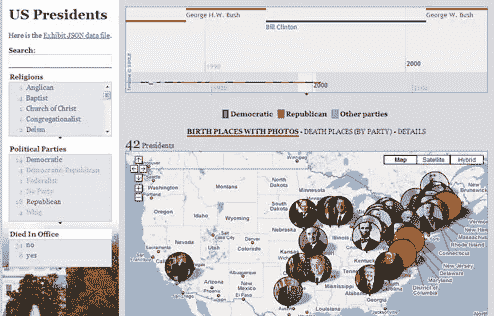
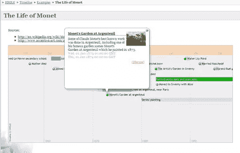
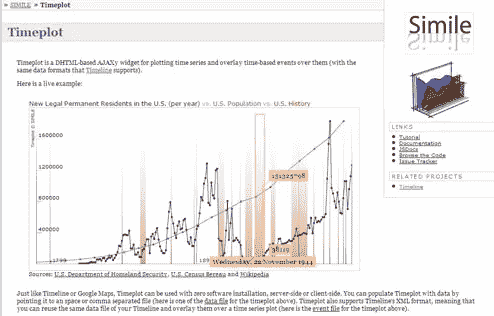

# 用细绳想象世界

> 原文：<https://www.sitepoint.com/visualising-the-world-with-twine/>

我开始使用[麻线](http://twine.com/)已经快一周了。我仍然觉得有必要去探索和发现新事物，这比我在其他社交网站上使用的要多得多。

到目前为止，好的一面是我还没有被信息淹没。有一些高峰期，事情堆积如山，但不会太多。可以把它看作是由一些亲密的朋友和同事手工制作的智能提要。似乎没有信息超载的另一个原因是，人们很在意他们分享的内容。我知道我是。我只是把任何东西扔进去，这就是它存在的目的。有点像我的书桌抽屉，任何需要保存的东西都会被放进去。

有了 Twine，它更像是你的同事和朋友可能看到的桌面。我不想这么乱，我想至少描绘出一些在一起的样子，并且知道我在说什么:)当然，有了 Twine，你可以做任何你想做的事情。在我的私人 Twine 中，我以一种更无序的方式转储东西，大量的电子邮件、书签、文档等等，并让 Twine 理解它们。这就是 Twine 的伟大之处——自动提取标签(我使用系统的时间越长，它就越智能)和自动提取已知的东西(类似于[路透社](http://www.reuters.com/)的 [Open Calais](http://www.opencalais.com/) )。

**视觉改进**

我觉得最需要注意的地方是信息呈现的方式。那里有很多东西，我并不感到失落，但我确实感到有更多的东西在发生。我想经历和探索的事情。随着我与人的联系越来越多，加入的圈子越来越多，这种逆水行舟的感觉开始被理解。我想要更多的视觉化和更直观的浏览方式。

**搜索烂**

目前，浏览这些丰富信息的唯一方式是搜索。*搜索烂*。不要误解我的意思，搜索对某些事情是有好处的，Twine 内置的搜索引擎非常强大。但这也是问题所在，它非常强大。因此，我必须做很多事情才能让*得到我想要的*。

我想立即看到那里有什么，可视化的连接，并能够转动转盘，放大和缩小。这就是下一代网络对我的意义。搜索是 Web 2.0。问雅虎！，他们[得到它](http://www.ysearchblog.com/archives/000527.html)。他们正在迅速拥抱变化和视觉上的。

**辉煌的人脉**

[巨型全球图](http://dig.csail.mit.edu/breadcrumbs/node/215)越来越真实；标签云和搜索不再适用。

思考[展示](http://simile.mit.edu/exhibit/examples/presidents/presidents-2.html) …

想想[时间线](http://simile.mit.edu/timeline/examples/monet/monet.html) …

想想[时间段](http://simile.mit.edu/timeplot/) …

上面的三个例子都来自于[明喻小组](http://simile.mit.edu/ "Semantic Interoperability of Metadata and Information in unLike Environments")的了不起的人。[戴维·哈](http://people.csail.mit.edu/dfhuynh/)尤其是在可视化信息方面是一股不可阻挡的力量。他是上述努力和[许多其他人](http://people.csail.mit.edu/dfhuynh/projects.html)背后的主要贡献者。

展示、时间线和时间片不仅看起来漂亮，而且在浏览器中的功能也非常好，令人惊奇的是它们都可以链接在一起。向左移动一个滑块，所有的视觉效果都会更新。通过一个属性过滤，所有系统都可以运行。这正是数据网络需要的东西。

## 分享这篇文章