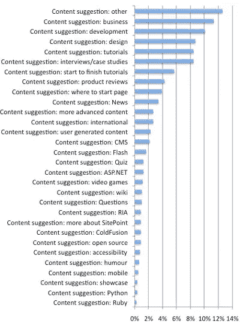

# 解读 SitePoint 读者调查的结果，第 2 部分:内容

> 原文：<https://www.sitepoint.com/interpreting-the-results-of-the-sitepoint-reader-survey-part-2-content/>

在我对读者调查结果分析的第一部分中，我揭示了你的改进建议是如何分布的，但是有些类别有点模糊。例如，“内容建议”涵盖了一切，从[更多关于 PHP 单身族的博客文章](https://www.sitepoint.com/whats-so-bad-about-the-singleton/)到[更多对顶尖设计师的采访](https://www.sitepoint.com/article/jeffrey-zeldman-list-apart)。

在这篇文章中，我将进一步探讨你对我们在文章和博客中涵盖特定类型内容的要求。毕竟，你的绝大多数建议都属于这一类。

以下是您希望阅读更多内容的分类:

正如你所看到的，除了“其他”类别之外，三个最大的请求是关于相同的 — *业务*、*开发*和*设计*相关内容的**(按此顺序)。“商业”类别在针对自由职业者和企业家的内容请求中平分秋色。**

一些其他的建议也在人们的愿望清单上:

*   您正在寻找更多的多部分教程，从最开始开始，一直到交付完整的解决方案。这些显然需要作者花时间来计划和创造，但同时我将宣布一个令人兴奋的倡议(事实上，就在本周！)这应该有助于填补这一空白。
*   我们的首页有很多内容，很多第一次访问网站的人不知道从哪里开始。虽然一个完整的网站重新设计需要时间来做好，但我们会立即寻找一些选项来改进我们首页的这一特定方面。
*   你想采访更多成功的设计师、开发人员和商业人士，对他们的网站/业务进行案例研究，深入了解他们在建立网站/应用/帝国时的思维过程。
*   更多的行业新闻、更高级的教程、产品评论、更多的国际内容(即关于非美国或澳大利亚设计师的内容)和“Ask SitePoint”部分也是受欢迎的请求。

所有这些都没有被忽视。事实上，您提交的许多建议已经是我们网站计划的一部分，但这次调查给了这些任务不同的权重，这将影响我们的优先顺序。

不过，我想说一下“用户生成内容”的请求数量。以下是直接从调查中获得的一些建议(包括拼写错误):

> 更多的作者——也许让用户发送文章并(在审阅后)放到网上。

> 我希望看到在线教程不一定是由你的普通作者开发的，而是由那些在论坛上展示他们对某个主题的掌握的人开发的。

> 也许你已经这样做了，但我认为在博客上公开提交文章或客座博文可能会很酷。论坛是与社区互动的一个很好的方式，但是尝试在 SitePoint 上发表一篇文章会很酷。

虽然我们为我们的作者团队(博客、文章以及我们的书)的高水平感到非常自豪，但他们中的每一个人都以同样的方式开始:提交一篇文章供考虑。基本上我要说的是**这已经发生了——如果你对一篇文章有一个想法，你所要做的就是[提交它](https://www.sitepoint.com/write-for-us/)** 。它在我的收件箱里，我查看它。如果它有潜力，但需要一些工作，我会和你一起工作，让它达到标准，然后我们的专业编辑团队的一名成员会打点我和越过 t，然后*瞧！你是一名出版作家。(当然，我们也有主动委托的其他文章，但基本上就是这个流程。)*

你还在等什么？用户生成的内容使 SitePoint 社区不断学习…

## 分享这篇文章