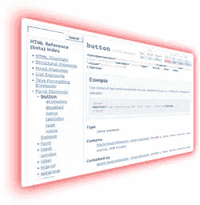

# SitePoint HTML 参考是活的！

> 原文：<https://www.sitepoint.com/the-sitepoint-html-reference-is-live/>

[site point CSS Reference](https://reference.sitepoint.com/css/)上个月大受欢迎，我非常自豪地宣布， [SitePoint HTML Reference](https://reference.sitepoint.com/html/) 也将陆续推出。

我们尊敬的作者，Ian Lloyd 写了一篇只能被称为 HTML 知识权威来源的文章。它是 HTML 中的**帮助，你的标记的主人，实体的百科全书，文档类型的字典……好了，你明白了</俗气的陈词滥调>**

 **无论从哪个角度看，这个网站都很酷，是 CSS 参考的完美补充。

现在它处于公开测试阶段，所以不像你在 CSS 参考中看到的高质量的东西那么完美…但这正是我们需要你帮助的地方！

在每一页的底部，你都可以找到一个地方来反馈你可能发现的任何问题——技术问题、布局问题或其他问题。我们的技术编辑随时准备将您发现的任何问题整合到网站中。

这个测试版没有访问限制，所以请确保让每个人都知道它是可用的。

哦，是的…我肯定你们都在想“这也会成为一本书吗？”

是的，这本书正在路上。** 

## **分享这篇文章**