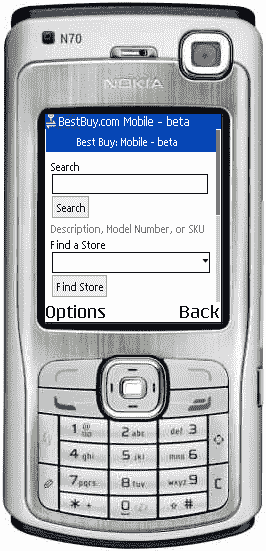
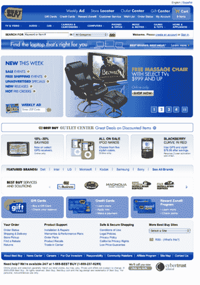

# 手机网络文章设计

> 原文：<https://www.sitepoint.com/designing-for-mobile-web-2/>

***一个偶然的冲浪者***

这些客户的行为方式与传统网站的客户类似。偶尔上网的人对任何一件事都不感兴趣，但在任务间隙会有几分钟的空闲时间四处看看。在台式电脑的世界里，这几分钟可能发生在会议间隙，或者用户短暂休息的时候。对于移动用户来说，这几分钟可能发生在用户坐在外面等着见朋友的时候，在去某个地方的汽车或出租车里，甚至在早上的通勤时间。如果你的网站专注于吸引休闲冲浪爱好者的内容，那么就要注意手机用户的时间和屏幕大小的限制。

目标应该是让你的内容更“有粘性”，这样偶尔上网的人会回来看更多。例如，你不应该提供很长的内容。相反，目标应该是小块的，一口大小的，足以让客户保持兴趣，但不要太长，以至于用户不能在他们有空的时候浏览你的网站。

***b)回头客***

回头客是指那些不断回来购买某种特定新闻或数据的人。如果你的网站是那种提供股票、天气或体育比分信息的网站，你可能会有很多回头客。移动设备的界面是非常有限的，所以如果你知道你的回头客一次又一次回来的原因，让它自然地出现在网站的顶部。避免将客户想要的内容隐藏在 3 到 4 次点击之后。

移动网站定制可能很难，但也不是不可能。传统网站可能会要求您登录，但在移动设备上，数据输入不容易执行，所以最好避免。

一种选择是允许访问者使用他们的台式机来简化他们的移动体验。以苹果 iTunes 音乐商店的一个页面为例。一个回头客可能在台式机上定制他或她的移动站点版本；这可以生成一个特殊的 URL，其中编码了用户的所有偏好。下次用户从移动设备访问您的网站时，他或她可以利用这个特殊的 URL，享受完全根据他或她的偏好定制的体验。

***c)该“急，现在！”访客***

取决于你的业务，你对“紧急，现在！”会有所不同。对于在线商店，客户可能认为以下消息很紧急:

我的书应该昨天就到了。他们迟到了。他们在哪里？”

更严重的紧急情况可能是:

“我迟到了 15 分钟。我能赶上我的航班吗？”

对于一些客户来说，一切都是紧急的！但是，通过识别客户最重要的需求，并使相关信息在一次点击或更少的时间内即可访问，您将极大地增加您的移动网站的有用性。

##### 4.公布最低限度

关于移动网站开发的一个常见误区是，传统网站上的内容可以很容易地被改编成更小的移动版本。从`media="screen"`到`media="handheld"`的一个简单的风格变化就是你需要做的所有事情来神奇地调动你的网站，对吗？

不对。

虽然自由使用 display 确实可以过滤内容:在您的移动样式表中没有，但实际上，这不是一个好主意。事实上，许多 CMS 系统可以输出一个移动的、精简的网站版本，但即使这样也不总是你的客户想要的。

W3C 将一个 Web 的[概念定义如下:](https://www.w3.org/TR/mobile-bp/#OneWeb)

“一个网络”是指在合理的范围内，向用户提供相同的信息和服务，而不管他们使用的是什么设备。然而，这并不意味着在所有设备上完全相同的[表示](https://www.w3.org/TR/di-gloss/#def-http-representation)中可以获得完全相同的信息。移动使用的环境、设备能力变化、带宽问题和移动网络能力都会影响表示。此外，一些服务和信息更适合并针对特定的用户环境。

正如这个定义所暗示的，有些东西在某些设备上是不可用的。此外，一些设备(如手机)在某些活动(如打电话)方面比其他设备好得多。因此，为特定活动设计的设备应该利用其在网络上的独特功能。

虽然只有一个网站，并根据访问者使用的媒体简单地设计不同风格的概念在许多标准化组织中很流行，但为了给移动用户提供优化的体验，需要一个单独的移动网站。在移动设备上冲浪的客户有不同的需求和要求，因此强迫他们接受与传统网站上显示的内容相同的内容是一种灾难。下面的图像显示了这一原则的一个很好的例子。百思买移动网站只显示两个功能(产品搜索和寻找商店)——与传统网站相去甚远。

**Go to page:** [1](/designing-for-mobile-web) | [2](/designing-for-mobile-web-2/) | [3](/designing-for-mobile-web-3/)

## 分享这篇文章