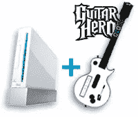

# 市场用户面临落后的风险

> 原文：<https://www.sitepoint.com/marketplace-users-risk-getting-left-behind/>

 我刚刚看了一下 [SitePoint 读者调查](http://www.surveymonkey.com/s.aspx?sm=MqSm8b1JZ99_2ba0Hp1ylIyQ_3d_3d)的一些早期结果。

我们从论坛用户、文章爱好者和博客爱好者那里获得了一些关于网站的宝贵反馈——大量关于我们可以改进的地方的建议。老用户和新用户都提出了一些很棒的想法，这太棒了。不过，有一件事让我有点担心。

有一个用户群似乎特别少，那就是那些经常光顾市场的人。考虑到市场所占流量的巨大比例，这确实令人惊讶。我不知道这些用户是太热衷于购买和销售网站而懒得填写一份 5 分钟的调查，还是他们对赢得 Wii 不感兴趣，因为他们担心这会分散他们的注意力，使他们无法专注于[最近的热门房产](https://www.sitepoint.com/article/flip-a-web-site)。

不过我要说的是——现在你有机会对 sitepoint.com 的所有方面提出改进建议，包括市场。因此，如果你对你希望看到的变化有一些坚定的想法，你知道该怎么做。

谁知道呢，你可能会同时给自己配一台 Wii 和《吉他英雄 3》。

## 分享这篇文章