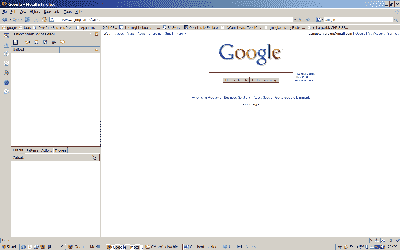
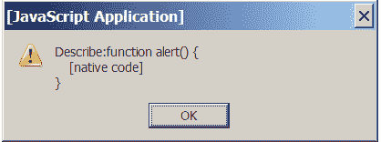
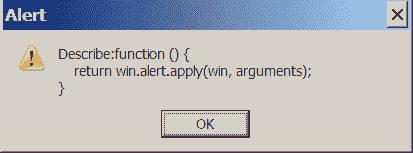

# 用小脚改写网页

> 原文：<https://www.sitepoint.com/rewrite-web-chickenfoot/>

Firefox 浏览器提供了许多插件和扩展，允许开发者与 DOM 和网页的其他公开部分进行交互。诸如[JavaScript Shell Bookmarklet](http://www.squarefree.com/shell/)、 [Firebug](http://www.getfirebug.com/) 、 [Greasemonkey](https://addons.mozilla.org/en-US/firefox/addon/748) 和 [Platypus](http://platypus.mozdev.org/) 之类的工具已经被证明是有用的，允许开发人员向页面添加自定义交互性、调试 DOM 和 CSS 问题以及测试想法。

然而，如果用户想要动态地与多个页面交互，想要自动化 Firefox 界面的不同部分，想要跨多个页面编写活动脚本，或者想要同时处理网页和本地文件系统，这些选项在历史上是有限的。但是最近随着扩展的出现，这种情况已经开始改变，例如 [CoScripter](http://services.alphaworks.ibm.com/coscripter/browse/about) ，以及形成本文主题的扩展:Chickenfoot。

##### 什么是鸡脚？

Chickenfoot 是来自麻省理工学院用户界面组的 Firefox 扩展。它能够:

*   与浏览器的 chrome 交互
*   使用交互式外壳来操作页面，并以各种方式监控页面交互
*   编写在多个站点上运行的脚本，这样就可以编写一个脚本，访问一个 web 页面，从该页面的一部分复制一些文本，到 Google 上搜索该文本，然后将第一个链接附加到本地文件系统上的一个页面

Chickenfoot 是一个非常强大的工具，对于任何希望自动操作或扩展他或她经常使用的网页功能的开发人员来说都是如此。

##### 安装鸡脚

Chickenfoot 的安装方式与其他 Firefox 扩展相同:只需[下载并接受 XPI 文件](http://groups.csail.mit.edu/uid/chickenfoot/chickenfoot.xpi)，该文件可从 [Chickenfoot 安装页面](http://groups.csail.mit.edu/uid/chickenfoot/install.html)获得。

尽管 Firefox 是一个跨平台的浏览器，但这个扩展在 Windows 上运行得最好。如果你在 Mac 上，你仍然可以安装 Chickenfoot 并按照本文中的代码进行操作，但是你可能会看到不一致的行为。不幸的是，在解决这些问题之前，警告`this.docShell has no properties`会频繁出现，您的输出可能与这里描述的不一致。

一旦你安装了扩展并重启了你的浏览器，你可以通过按 F8 或者选择视图>侧边栏>鸡脚菜单选项来访问鸡脚交互外壳。shell 将在侧边栏中打开，看起来类似下图。



当 Chickenfoot 侧边栏第一次启动时，它显示一个拆分视图——顶部面板包含一个标记为“无标题”的文本字段；这是输入区，我们将在这里编写我们的小脚代码。

底部面板包含四个选项卡。默认选择的标签被标记为 Output，并显示应用于浏览器的您的所有操作以及 Chickenfoot 的所有操作的历史记录。首先，我们必须告诉 Chickenfoot 记录我们的动作——单击 actions 选项卡，并确保选中 Record actions 选项。

让我们测试我们的输出是否被捕获。为此，打开一个新的 Firefox 标签并加载[谷歌主页](http://www.google.com)。一旦页面加载完毕，点击页面左上角的图片链接，这将带你进入谷歌的图片搜索。如果您再次选择 Chickenfoot 输出选项卡，您应该会看到以下文本:

```
click("Images")
```

这不仅仅是对所发生的事情的描述——事实上，这是一段微不足道的代码！要测试这段代码，单击返回箭头返回到 Google 主页，然后将我们创建的代码片段复制并粘贴到顶部的 Chickenfoot 面板中。单击面板顶部的绿色箭头，您的代码片段将被执行。该页面将再次导航到谷歌图片搜索页面。

##### 胆小鬼背后的想法

Chickenfoot 与其他工具分享了一些实现可脚本化 web 的想法。

Chickenfoot 背后的主要思想是为用户提供一个工具来创建任何人都可以使用或编写的宏，而不需要程序员的帮助。我应该在这里指出，我认为这个目标不会实现，因为总会有对只能由程序员实现的复杂功能的脚本的需求。然而，这个理想主义的目标是 Chickenfoot 背后的驱动力，这一事实产生了一个非常有用的工具。

这些目标与 CoScripter 的目标相似——事实上，CoScripter 使用了 Chickenfoot 版代码的一部分。在本文中，我不会深入讨论 CoScripter 的任何细节，但是如果您有兴趣阅读更多内容，请参见 Alex Faaborg 的文章。

##### 找到我们的脚

让我们看看如何记录 Chickenfoot 脚本，这很像 MS Word 或 Adobe Photoshop 中的宏。对于这个例子，我们将创建一个脚本，它比我们在上一节中看到的单个命令稍微复杂一些。对于这个演示，我从 CoScripter 入门教程中获得了灵感。

完成后，我们的脚本将使我们的浏览器:

1.  加载页面[www.google.com](http://www.google.com)。

3.  单击图像链接。

5.  将文本“考拉”放入搜索图片文本框。

7.  单击搜索图像按钮。

让我们开始写脚本吧！如果您还没有打开 Chickenfoot 侧边栏，请在顶部面板中键入以下命令:

```
go("google.com")
```

然后单击绿色箭头。正如你所料，你的浏览器会加载谷歌主页。

为了记录脚本的其余部分，我们基本上只需执行我上面描述的步骤。点击图片链接，然后在搜索框中输入文本“考拉”,按 Tab 键退出该字段。最后，单击搜索图像按钮。

您的“输出”选项卡现在应该显示类似如下的内容:

```
go("http://www.google.com/") 

click("Images") 

go("http://images.google.com/imghp?hl=en&tab=wi") 

enter("Sign in", "koalas") 

click("Search Images button") 

go("http://images.google.com/images?hl=en&q=koalas&btnG=Search+Images 

&gbv=2")
```

如果您在登录 Google 帐户时执行了这些步骤，列出的一些文本值可能会有所不同，但操作应该是相同的。

现在我们已经记录了我们的操作，我们可以从这个代码输出中进行挑选，并将所需的行复制到 Chickenfoot 侧边栏的顶部面板。瞧啊。我们有一个工作脚本！

除了初始的 go 操作，我们需要的命令是 click 和 enter 命令。我们还可以简化传入的值，这样我们的脚本看起来就像这样:

```
go("google.com") 

click("Images") 

enter("koalas") 

click("Search Images button")
```

从上面的例子中你可能会注意到，Chickenfoot 语法与许多基于 C 的语言有很多共同之处，比如 JavaScript。实际上，Chickenfoot 命令是 JavaScript。

##### 触及表面

需要理解的一个重要概念是，Chickenfoot 不是在大多数 JavaScript 用户熟悉的普通(X)HTML 环境中运行，而是在 FireFox 的 XUL 环境中运行。这个环境已经为 Chickenfoot 进行了扩展，允许它更容易地与 web 页面的上下文进行交互。

如果您在普通页面的上下文中引用或修改 JavaScript 可以访问的对象，它很可能会像您预期的那样运行。然而，因为 Chickenfoot JavaScript 引擎具有更深层次的访问，所以您可以比平时更加自由，比如访问默认上下文之外的对象。

随着您进一步探索 Chickenfoot，您可能会遇到这两种环境之间的差异以及对象在其中的行为方式。大多数情况下，这些差异的原因是浏览器环境中的本机函数，为了熟悉起见，这些函数在 XUL 鸡脚环境中被重新实现。

一个这样的例子是`alert`函数；考虑以下 JavaScript 代码片段:

```
Object.prototype.describe=function(){alert("Description: " + this);return this;}  

alert("Describe:" + alert);
```

当此代码在 Firefox 的 HTML 环境中运行时，它会显示以下对话框:



但是，当它在 Chickenfoot 环境中运行时，相同的代码会生成以下对话框:



除了许多共享函数之外，还有一些额外的函数在常规的基于浏览器的 JavaScript 实现中是不可用的，但是在 Chickenfoot 环境中是可用的。这些函数的列表可以在 [Chickenfoot API 文档](http://groups.csail.mit.edu/uid/chickenfoot/api.html)中找到。

##### 北京在鸡脚 api

与技术一样，Chickenfoot 的某些部分比其他部分更有用，为了充分利用 Chickenfoot，您绝对需要了解这些部分。

以下是我觉得最有用的部分。

***[模式](http://groups.csail.mit.edu/uid/chickenfoot/api.html#Pattern)数据类型***

大多数 Chickenfoot 函数接受参数模式。模式在 API 文档中被描述为“许多其他数据类型的联合”

最简单的方法是将模式视为访问 HTML 页面上的对象的简写短语。例如，模式“second Chickenfoot”是指单词“Chickenfoot”在页面上的第二次出现。如果您要访问 [Chickenfoot API 页面](http://groups.csail.mit.edu/uid/chickenfoot/api.html)并执行以下代码，页面上第二次出现的单词“Chickenfoot”将被选中:

```
click("second Chickenfoot");
```

这种方法有一些变化，Chickenfoot 使用一些逻辑来试图智能地找出你的短语使用的模式。因此，某些函数(比如 click)不能很好地处理模式，因为如果给它们一个可能返回多个结果的模式，它们会产生错误。

例如，假设我们要将上述代码更改为以下代码:

```
click("2 Chickenfoot");
```

这很可能会在“输出”面板中产生类似以下内容的错误消息:

```
Error: More than one best match for click(2 Chickenfoot)
```

为了有效地使用模式，你需要使你的模式特别精确(例如，通过使用 XPath 语法或 LAPIS 查询语法，如果你已经安装了 [LAPIS 扩展](http://groups.csail.mit.edu/uid/lapis/))或者使用`find`函数，并遍历该函数返回的对象数组。我们接下来将研究这种方法。

模式是以下数据类型的联合:

*   线
*   油槽车(Tank Car)
*   比赛
*   结节
*   范围
*   Xpath

***`find`功能***

`find`函数接受一个模式并返回匹配该模式的对象。将以下代码放在顶部面板中，并在这个页面上执行它:

```
find("Chickenfoot");
```

您会注意到一个对象出现在输出面板中。单击此对象将会突出显示单词“Chickenfoot”的所有实例。

不幸的是，这个函数返回的对象不是 JavaScript 数组。根据经验，您需要将 Chickenfoot 的 find 函数的结果通过管道传输到一个数组中，然后遍历该数组以挑选出您要寻找的单个对象。

***`include`功能***

include 函数允许您在 Chickenfoot 脚本中包含其他 JavaScript 文件。Chickenfoot 附带了一些内置库(大部分名称不言自明):

*   `prototype.js`，原型的修改版 1.5.0_rc0 发布。不幸的是，在撰写本文时，Chickenfoot 的 XUL 环境引发了原型库的错误，导致原型库的新版本不兼容。
*   `facebook.js`，用于查询脸书 API。
*   `fileio.js`，提供与本地文件系统交互的功能。
*   `google-ajax-search.js`，用于从任何网页执行基于 AJAX 的 Google 搜索查询。
*   `google-maps.js`，用于查询谷歌地图 API。
*   `google-search.js`，谷歌网络搜索 API 的包装器。(除非你碰巧有一个 Google API 密匙——它们已经不再发行了——否则这个特殊的库没什么意思。)
*   `greasemonkey.js`，它实现了大部分 Greasemonkey API，允许您重用现有的 Greasemonkey 脚本。
*   `json.js`，用于执行数据的 JSON 序列化和反序列化。
*   `screenshot.js`，可以截图并通过`fileio.js`库保存到本地文件系统。
*   `scriptaculous.js`，流行的基于原型的效果库 1.6.1 版本。
*   `strings.js`，它包含了从字符串中移除尾随和前导空格的函数。
*   用于对美国地址进行地理编码的非商业许可库。
*   沃尔特·左恩的 JavaScript 图形库的一个版本。

当您考虑到每个库带来的功能时，您应该开始欣赏 Chickenfoot 给 Web 带来的潜力。

您可以通过以下四种方式之一将库包含在您的 Chickenfoot 脚本中:

*   通过铬合金 URI
*   通过文件路径
*   通过存储在您的 Chickenfoot 配置文件目录中的文件名(在应用程序 data Mozilla Firefox profiles { profile id } chicken foot 下)
*   通过按名称显式引用库

关于使用新库的一个注意事项:我发现最有效的库通常是那些提供特定功能的库，比如 CssQuery 或类似的库，而不是那些试图包罗万象的库。

include 函数还带有一个可选的 object 参数，这个参数对于检查一个特定的库或一组库中的可用内容非常有用，尽管本文没有讨论这个功能。

Chickenfoot 还有几个其他的语言构造，比如 after、before 和 insert，它们允许您使用 find 检索页面上的元素，然后从该元素导航到您真正想要的元素。这些函数还可以动态地将内容插入到该元素或周围的 HTML 元素中。

##### 有用的任务变成了鸡饲料

任何旨在实现任务自动化的技术都应该让快速做有用的事情变得容易。在这一节中，我将描述 Chickenfoot 真正有用的一些任务。我包含了一些代码片段，虽然它们可能没有说明 JavaScript 的最佳实践，但是它们很好地说明了 Chickenfoot 的各种用法。

我们开始吧！这里有几个方便的小脚脚本。

首先，让我们来看看在你的 FireFox chrome 的顶层绑定了哪些变量:

```
list(chromeWindow);
```

这一行应该能为您提供相当多的信息。您还可以使用以下命令查看有关当前文档的大量信息:

```
list(chromeWindow.document);
```

接下来，让我们将当前网页作为 XHTML 字符串输出到输出窗格:

```
var xhtmldom = Chickenfoot.domToString(document);   

output(xhtmldom);
```

现在，让我们把上面的 XHTML 字符串写到你的桌面上。可以将上面例子中的 XHTML 输出写到桌面上的一个文件中。如果您在 Mac 或 Linux 机器上，将最后一行中的转义文件分隔符“`\`”替换为“`//`”:

```
include("fileio.js");    

//use http://lxr.mozilla.org/mozilla/source/xpcom/io/nsDirectoryService   

Defs.html     

// Firefox directory service to use various built in Windows directories   

var xhtmldom = Chickenfoot.domToString(document);   

var desktop =    

  Components.classes["@mozilla.org/file/directory_service;1"].   

  getService(Components.interfaces.nsIProperties).get("Desk",   

  Components.interfaces.nsILocalFile);   

var fname= "xhtmldom.xml";   

write(desktop.path + "\" + fname,xhtmldom);
```

上述任务实际上可以在即将发布的 Chickenfoot 版本中使用更简单的代码来执行，因为它使用默认的 Firefox 下载目录(通常是桌面)。

现在，让我们与您已经检查过的浏览器 chrome 进行交互。

在 Firefox 中，如果你有相关对象的 ID，就可以访问浏览器窗口的 chrome 部分。这可以使用函数`chromeWindow.document.getElementByID`进行检索。例如，右键单击页面时显示的上下文菜单的 ID 是`contentAreaContextMenu`。如果我们使用上面示例 3 中的脚本，将 DOM 保存到桌面，并将其封装在一个函数中，那么我们可以从上下文菜单中调用这个函数，如下所示:

```
include("fileio.js");    

function saveDom() {   

  var xhtmldom = Chickenfoot.domToString(document);   

  var desktop =    

    Components.classes["@mozilla.org/file/directory_service;1"].   

    getService(Components.interfaces.nsIProperties).   

    get("Desk", Components.interfaces.nsILocalFile);   

  var fname= prompt("What filename would you like to save as?");   

  write(desktop.path + "\" + fname,xhtmldom);   

}   

var chromeDoc = chromeWindow.document;   

var contextMenu = chromeDoc.getElementById("contentAreaContextMenu");   

var menuItem = chromeDoc.createElement("menuitem");   

menuItem.setAttribute("label","Save Dom");   

menuItem.addEventListener("command", saveDom, false);   

contextMenu.appendChild(menuItem);
```

注意，Chickenfoot 函数 append 函数允许您将数据追加到文档中。你像这样使用它:

```
append(desktop.path + "\" + fname, "text to append");
```

希望这些例子能让您对一些简单但功能强大的任务有所了解，这些任务可以由 Chickenfoot 脚本自动完成。

##### 一个更高级的小脚脚本

简单的任务已经做得够多了——让我们用 Chickenfoot 做一些更高级的事情吧！

我使用下面的脚本为 Gmail 添加功能——具体来说，就是从页面中搜索并选择包含匹配特定 Chickenfoot 模式的文本的对话。这是对每个人最喜欢的基于网络的电子邮件客户端的一个有用而强大的增强。

剧本是这样的:

```
var i = 0;   

var wasextracted = "";   

var  searchstring ="";   

var selection = prompt("Select messages with the following text:");   

var found = find(selection);   

var results = new Array();   

for (found;found.hasMatch;found = found.next) {   

  results[i]=found.text   

  i = i + 1;   

}   

var searchnumber;   

for (var x = 0; x <= results.length; x++) {   

  searchnumber = x + 1;   

  try {   

    extracted=results[x];   

    if (wasextracted==extracted) {   

      searchstring = searchnumber + " " + extracted;   

      check (searchstring);   

    } else {   

      searchstring = extracted;   

      check(searchstring);   

      wasextracted=extracted;   

    }   

  }   

  catch(e) {}   

}
```

这个脚本提示用户进行一些输入，然后将输入作为参数传递给 Chickenfoot find 函数。请记住，find 接受 Chickenfoot 模式，因此这种搜索的可能用途几乎是无限的，因为您可以要求它匹配的不仅仅是字符串。

您可能还记得，当我们第一次遇到 find 方法时，它并不返回数组。因此，我们需要将结果读入一个数组。您可能会发现执行此任务的代码片段在您编写的其他 Chickenfoot 脚本中也很有用:

```
for (found;found.hasMatch;found = found.next) {   

  results[i]=found.text   

  i = i + 1;   

}
```

之后，脚本遍历 find 函数返回的数组，并尝试构建一个 Chickenfoot 模式，该模式将与包含我们的搜索字符串的文本完全匹配。然后，我们使用 Chickenfoot check 函数来切换离该文本部分最近的复选框，从而选择该消息。

请记住，check 需要能够确保它有确切的文本，否则它将抛出一个错误，这就是为什么我们不能只对`found.text`进行检查。

上面这个脚本的一个值得注意的方面是，相对于它所实现的功能，它的大小很小。与 DOM 等标准 API 相比，Chickenfoot 的函数提供了更简单的方式来动态地与文档交互。

##### 结论

在本文中，我们研究了使用 Chickenfoot 与浏览器进行交互的多种方式。在这篇文章中，我们仅仅触及了使用 Chickenfoot 可以做的事情的表面——潜力是巨大的，它只受到您的想象力的限制！

如果您有兴趣了解更多信息，请查看以下资源:

*   CSAIL MIT group 的项目页面上对 Chickenfoot 的描述给出了一些关于该项目的想法以及一些学术论文的链接。其中，迈克尔·博林等人的[论文。艾尔。(PDF，0.41MB)](http://uid.csail.mit.edu/projects/chickenfoot/uist05.pdf) 包含了相当多有用的例子。
*   Chickenfoot wiki 提供了一些示例脚本。
*   查看演示了 Chickenfoot 的各种用途的谷歌教育讲座。

如果你创作了一个杀手级的脚本，我鼓励你提交给[小鸡脚维基](http://groups.csail.mit.edu/uid/chickenfoot/scripts/index.php/Main_Page)。快乐脚本！

## 分享这篇文章