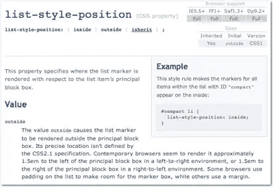

# SitePoint CSS 参考介绍！

> 原文：<https://www.sitepoint.com/introducing-the-ultimate-css-reference/>

我们非常兴奋地宣布 [SitePoint CSS 引用](https://reference.sitepoint.com/css/)现已对公众开放！

由两位世界上最著名的 CSS 专家 Tommy Olsson 和 Paul O'Brien 撰写，该参考包含了一系列使其脱颖而出的功能——如跨浏览器兼容性图表和用户反馈(ala the[PHP manual](http://www.php.net/manual/en/))——以确保它是准确的、最新的和最佳实践。如果你在用 CSS 构建网站，这是一个你会一次又一次回来的参考。

我们想对*和所有参与私人测试阶段的人*致以深深的**感谢**！我们从 SitePoint 社区的许多成员那里收到了一些优秀的、建设性的反馈，其中一些已经得到了实施；我们还为未来的版本添加了许多其他的建议。

我们相信专家评论，内容的彻底性，有用的例子，最新的浏览器图表和动态的用户反馈的独特组合使这成为最好的在线 CSS 参考。句号。

来看看:[https://reference.sitepoint.com/css/]( https://reference.sitepoint.com/css/)

## 分享这篇文章