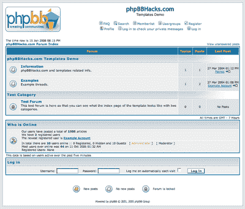
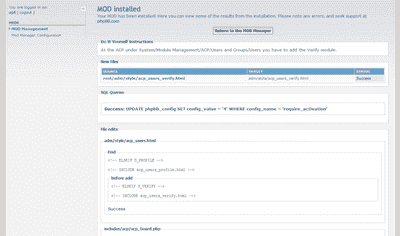
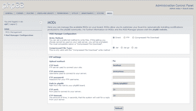

# phpBB3:开源论坛软件的发展

> 原文：<https://www.sitepoint.com/phpbb3-forum-software-evolved/>

随着 phpBB 版本 3 的发布，2007 年 12 月 13 日标志着开源软件成功故事的另一个篇章的开始。phpBB ，一个开源的公告板系统，由詹姆斯·阿特金森在 2000 年创建，作为他妻子的论坛解决方案。phpBB 从其低调的开端，逐渐发展壮大，为自己赢得了 PHP 脚本语言“杀手级应用”的声誉。

公告板的概念可以追溯到 20 世纪 80 年代，当时最早的形式是新闻组和原始的拨号留言板。随着网络的引入，现在通常被称为互联网论坛的公告板已经变得非常用户友好和可定制，并在当前的社交网络趋势中发挥了关键作用。因此，毫不奇怪，今天在互联网上有数百万活跃的论坛，其中很大一部分是 phpBB 安装。

phpBB 于 2002 年 4 月首次发布，并在活跃的开发人员社区中不断发展。2007 年 5 月，八个候选版本中的第一个公布于众。发布候选阶段很长，但确保了官方发布 phpBB v3.0.0 的高标准。

##### phpBB2 和 phpBB3 之间的变化

对于许多人来说，phpBB2 将因其革命性的主题 subSilver 而被记住，它简单而巧妙的结合提供了一个非常有吸引力的默认主题。考虑到它已经有将近五年的历史了，subSilver 主题的设计仍然保持得很好。



然而，变化是不可避免的，也许用户在比较使用 phpBB2 的论坛和使用 phpBB3 的论坛时看到的最明显的差异将是董事会使用的前端代码——特别是如果你深入了解的话。虽然新的 proSilver 主题和 subSilver 之间的配色方案非常相似，但 proSilver 已经明显远离了基于表格的布局。许多人会很高兴地知道新的样式是 CSS 驱动的，并且是 XHTML 1.0 严格兼容的。只有在适当的时候才使用表，例如，在显示统计数据和成员列表等表格数据时。

phpBB3(代号为 Olympus)还包含了 phpBB 社区所要求的许多特性。在 phpBB2 中只作为修改提供的特性现在作为标准功能提供了。

一些较受欢迎的新增内容包括:

*   文件附件
*   用户和主持人控制面板
*   能够添加无限层的论坛(子论坛)

从管理的角度来看，最大的变化来自于权限系统。虽然管理控制面板已经完全改进(它现在使用一个真正的模块化系统)，但让您了解新的权限系统可能是升级中最困难的部分。新的权限系统允许更精细、更细粒度的权限分配，以及管理员能够分配的许多新权限。为了便于管理，还包括了权限角色，以及从其他论坛复制和转移权限的能力。新权限系统的深入[概述构成了 phpBB 文档的一部分。](http://www.phpbb.com/support/documentation/3.0/quickstart/quick_permissions.php)

值得注意的是 phpBB3 中没有内置的修改(MOD)安装程序。然而，与 phpBB2 的情况一样，phpBB MOD 团队将发布一个官方插件来执行自动 MOD 安装。代号为 Blinky 的 MOD 安装程序是管理控制面板的一个模块化附件，它为管理导航添加了一个新的 MODs 选项卡。

当安装一个修改时，MOD 安装程序将读取并解析一个 XML 文件，存储关于想要安装的 MOD 的信息。在这个 XML 文件的基础上执行各种操作，比如添加、替换和删除代码。这个 MOD 安装程序仍在开发中，但是 Blinky [背后的开发团队希望很快发布一些东西](http://area51.phpbb.com/phpBB/viewtopic.php?p=191139#p191139)。

下图显示了 MOD 安装的详细信息，只有在管理员启用或出现错误时才会显示。



下面，我们看到了 MOD 管理器的灵活性。该代码有三种不同的方法来处理文件，包括 FTP 和创建压缩存档。



##### 安全性

安全性一直是 phpBB 的头等大事。在 phpBB3 的开发过程中采取了许多措施，以确保它从一开始就是一个极其安全的产品。来自 http://www.sektioneins.de 的一个团队进行了一次外部安全审计，该团队包括 PHP 安全专家和前 PHP 开发人员斯特凡·埃塞尔。安全审计揭示了 phpBB3 的几个问题，这些问题已经得到了适当的修复，但是没有发现 SQL 注入或远程代码注入漏洞对开发人员来说是一个巨大的荣誉。

phpBB3 被完全重写，并为开发人员制定了严格的新编码指南。用 Esser 自己的话说，这“导致了比 phpBB2 更好的安全架构”，phpBB3 处理所有请求参数(`$_POST`、`$_GET`等)。)通过一个单独的函数`request_var`，对变量进行净化。结合新的数据库抽象层，包括自动处理字符串转义的新`sql_build_array`函数——过去是通过基本的`str_replace`调用来处理的——现在编写数据库查询变得简单而安全。

在 phpBB2 中，一个数据库查询应该如下所示，其中的`$email`和`$icq`变量已经在前面的 POST 数据中定义过了:

```
$sql = "UPDATE " . USERS_TABLE . "   

     SET user_email = '" . str_replace("'", "''", $email) ."',  

      user_icq = '" . str_replace("'", "''", $icq) . "'  

     WHERE user_id = " . $userdata['user_id'];
```

由于 phpBB3 中采用的新技术，查询更加结构化。新功能`$db->sql_escape`取代了使用`str_replace`准备字符串的旧方法:

```
$sql = 'UPDATE ' . USERS_TABLE . "  

     SET user_email = '" . $db->sql_escape($email) . "',  

     user_icq = '" . $db->sql_escape($icq) . "'  

     WHERE user_id = ' . $user->data['user_id'];
```

当有许多列需要更新时，可以使用`$db->sql_build_array`函数。该函数自动对数组中的字符串进行转义。因此，较大的查询可能如下所示:

```
$sql_data = array('user_email' => request_var('email', ''),  

          'user_icq'   => request_var('icq', ''),  

      'user_yahoo' => request_var('yahoo', ''),  

      'user_msn'   => request_var('msn', ''),  

      );  

$sql = 'UPDATE ' . USERS_TABLE . '   

     SET ' . $db->sql_build_array('UPDATE', $sql_data) . '  

        WHERE user_id = ' . $user->data['user_id'];
```

phpBB MOD 团队和开发团队一样认为安全性是最重要的。与 phpBB2 一样，MOD 团队计划继续验证提交到在线数据库的每个 MOD，确保修改符合新的编码指南，并符合团队设定的安全标准。自动检查完成后，MOD 团队成员在测试 MOD 之前逐行审核每个提交的内容，以确保其功能正常。整个验证过程需要时间，但结果是用户获得了 phpBB.com 独有的质量保证。

##### 未来:phpBB v3.2

phpBB 的下一个主要版本是 v3.2，代号为“Ascraeus”。开发团队已经为 3.2 版的开发设定了总共六个里程碑，其中第一个将包含对 phpBB 的一般更改。这些变化将包括放弃对 PHP 4.x 和 MySQL 3.x/4.0.x 的支持。

BBCode 解析器也将被改进。它将与发布页面完全分离，允许在任何文本区域使用 BBCode。还将实现机构群体要求的功能，即编辑现有的 BBCode 功能，这基本上意味着默认的 BBCode 功能与理事会管理员添加的功能没有区别。

第二个里程碑关注于许多激动人心的新特性的实现。用户会话功能将被重新访问，而发布页面和版主控制面板将得到增强。phpBB 将首次在适当的地方使用 Ajax，尽管只是在某些情况下。此外，主题和论坛列表将获得更多的功能，如非永久或“软”删除主题和全球公告系统的一些小调整。

然而，最令人期待的新特性可能是高度可定制的事件系统，这对于董事会管理员和 phpBB MOD 作者来说都是一个极好的补充。在谈到事件系统时，Meik Sievertsen 说:“事件系统是一个基于触发器的系统，管理员可定义的“动作”在特定条件下触发。示例预定义触发器可以是:“发帖、回复或注册”。应用于该触发器的条件可能类似于“有超过 x 个帖子”，操作可能是“将该用户放入 Y 组”。正如您所想象的，这个功能将自动执行许多目前由版主和管理员执行的过程。

除了 v3.2 之外，还有 phpBB v3.4。随着 AJAX、扩展的事件系统和针对董事会管理员的额外数据库控制的使用增加，phpBB 的未来看起来非常光明。

*感谢 Meik Sievertsen ("Acyd Burn ")和 Josh Woody(" A _ Jelly _ donuts ")分别提供关于 phpBB 开发和 phpBB MOD 安装程序的信息。*

## 分享这篇文章