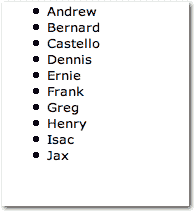
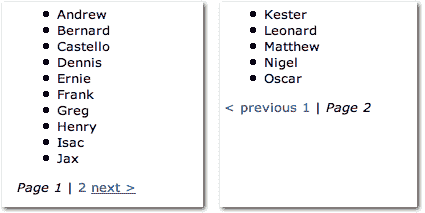
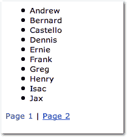

# 完美的 PHP 分页文章

> 原文：<https://www.sitepoint.com/perfect-php-pagination/>

**分页是一个已经被搞得死去活来的话题——可以找到几十篇文章和引用类来管理结果集……然而(而且你知道有一个“然而”要来了，不是吗？)到目前为止，我一直对当前的产品不满意。在这篇文章中，我提供了一个改进的解决方案。**

一些分页类需要将参数(如数据库资源和一两个 SQL 字符串)传递给构造函数。使用这种方法的类缺乏灵活性——例如，如果您需要在页面的顶部和底部使用不同的页码格式，该怎么办？然后，您是否必须修改一些输出函数，或者子类化整个类，仅仅是为了覆盖这一个方法？这些潜在的“解决方案”是限制性的，不鼓励代码重用。

本教程试图进一步抽象一个用于管理结果分页的类，从而消除它对数据库连接和 SQL 查询的依赖。我将讨论的方法提供了一定的灵活性，允许开发人员创建他或她自己的页面布局，并通过使用称为策略设计模式的面向对象设计模式简单地将它们注册到类中。

##### 什么是战略设计模式？

请考虑以下情况:您的站点上有一些网页，查询结果是针对这些网页分页的。您的站点使用一个函数或类来处理结果的检索和页面链接的发布。

这一切都很好，直到您决定更改一个(或所有)页面上的页面链接的布局。在这样做的时候，您很可能不得不修改这个职责被委派的方法。

更好的解决方案是创建尽可能多的布局，并在运行时动态选择您想要的布局。策略设计模式允许您这样做。简而言之，策略设计模式是一种面向对象的设计模式，由希望在运行时交换行为的类使用。

使用 PHP 的多态功能，容器类(比如我们将在本文中构建的分页类)使用实现接口的对象，并为该接口中定义的方法定义具体的实现。

虽然接口不能被实例化，但它可以引用实现类。因此，当我们创建一个新的布局时，我们可以让容器(分页类)中的策略或接口在运行时动态地引用布局。因此，产生分页链接的调用将产生一个用当前引用的布局呈现的页面。

##### 必需的文件

正如我提到的，本教程不是关于结果如何分页的机制，而是如何使用一个接口来实现这个逻辑，同时保持灵活性。作为起点，我提供了一个包含注册基本数组或对象的功能的类——分页类——以及一个所有页面布局都必须实现的接口(`PageLayout`)和一个页面布局的实现(`DoubleBarLayout`)。我们将在文章中使用的所有代码都可以下载。

##### 一个基本例子

以下示例使用字符串数组。这是我的数据集:

*   安德鲁
*   贝尔纳
*   卡斯特洛
*   丹尼斯
*   欧尼电子摇奖机
*   弗兰克
*   格雷格(男子名ˌ等于 Gregory)
*   亨利
*   国际会计准则
*   贾克斯
*   凯斯特
*   伦纳德
*   马太福音(新约第一卷)
*   奈杰尔
*   奥斯卡金像奖

但是，这段代码可以很容易地扩展为使用整数、字符或其他对象的数组，这些对象是从以前的数据库调用中获取的。

下面是我们如何使用`Paginated`类:

```
<?php
require_once "Paginated.php"; 

//create an array of names in alphabetic order 
$names = array("Andrew", "Bernard", "Castello", "Dennis", "Ernie", Frank",   Greg", "Henry", "Isac", "Jax", "Kester", "Leonard", "Matthew", "Nigel", "Oscar"); 

$pagedResults = new Paginated($names, 10, 1); 

echo "<ul>"; 

while($row = $pagedResults->fetchPagedRow()) { 
  echo "<li>{$row}</li>"; 
} 

echo "</ul>"; 
?>
```

首先，我们包含了`Paginated`类，并用构造函数注册了一个数组。构造函数有三个参数，其中最后两个是可选的:

1.  第一个参数是要显示的项目数组——正如我提到的，这些可以是原始数据类型或更复杂的对象。

3.  第二个参数是我们希望在页面上显示的结果数量。默认情况下，该数字设置为 10。

5.  第三个参数是当前页码。

在上面的例子中，我们使用了常量`1`来指定“第 1 页”，但是您可能希望将它作为查询字符串中的一个参数来传递(稍后将详细介绍)。如果向构造函数提供了无效页，则该页将默认为 1。

通过从 while 循环中调用`fetchPagedRow`方法，我们的代码遍历数组，打印出列表中的前十个名字(在本例中，“Kester”、“Leonard”、“Matthew”、“Nigel”和“Oscar”将被省略)。这些项目应该包括在第二页，但是，如下图所示，还没有链接到第二页！虽然`Paginated`将管理对程序员注册的任何对象的访问，但是发布分页链接的责任被委托给实现`PageLayout`接口的类。



让我们添加一些代码来显示页码，然后我们将更深入地研究这个类的内部工作方式和灵活性。

创建一个扩展名为 PHP 的新文件，其中包含以下代码:

```
<?php 
require_once "Paginated.php"; 
require_once "DoubleBarLayout.php"; 

//create an array of names in alphabetic order 
$names = array("Andrew", "Bernard", "Castello", "Dennis", "Ernie", "Frank", "Greg", "Henry", "Isac", "Jax", "Kester", "Leonard", "Matthew", "Nigel", "Oscar"); 

$page = $_GET['page']; 

$pagedResults = new Paginated($names, 10, 1); 

echo "<ul>"; 

while($row = $pagedResults->fetchPagedRow()) { 
  echo "<li>{$row}</li>"; 
} 

echo "</ul>"; 

$pagedResults->setLayout(new DoubleBarLayout()); 
echo $pagedResults->fetchPagedNavigation(); 
?>
```

当我们现在运行上面的脚本时，我们将看到前十个名字的列表，以及一些额外的方向信息，如下图所示。我们的脚本现在显示文本“Page 1”，以及指向第二页的链接“next >”。



在上面的代码片段中，我们使用了一个名为`DoubleBarLayout`的类，它实现了接口`PageLayout`并包含了`fetchPagedLinks`方法的实现。这个方法有两个参数:`Pagination`对象，以及我们想要附加到超链接上的查询参数(如果有的话)。

这个方法的伟大之处在于它利用了 PHP 的多态功能，允许调用当前注册的策略。因此，在调用方法之前，首先设置策略是很重要的。通过调用 setter 方法`setLayout`来设置策略，该方法将实现`PageLayout`接口的对象作为参数。

将鼠标悬停在其中一个链接上，您会注意到参数 page 及其值 2 包含在 URL 页码中。但是，在当前状态下，如果您单击第二个页面的链接，我们期望呈现的名称将不会显示。

我们再来看一下`Paginated`的构造函数为什么会这样。

构造函数有三个参数:

1.  要处理的原始变量或对象的数组

3.  要显示的记录数

5.  页码

因为方法`fetchPagedNavigation`写了一个查询参数，我们可以用保存在`$_GET['page']`中的值替换我们硬编码的值`1`。这样，如果用户手动将 URL 中的值修改为无效值，`Paginated`会将页码默认为`1`。但是，如何选择验证您的`GET`参数取决于您，所以我不会在这个问题上做进一步的阐述。

***页面布局方案的灵活性***

这个类的灵活性是通过`PageLayout`接口实现的，它是分页对象的一部分。`PageLayout`接口可以引用任何实现它的对象，调用`Paginated`方法`fetchPagedNavigation`将导致当前注册的对象被引用。如果您以前没有使用过接口，这可能看起来有点混乱，但基本上最终结果是将调用正确的代码，并且我们的结果将正确地分布在多个页面上。

要实现这种技术，您需要做的就是创建一个实现`PageLayout`接口的布局策略。然后，为方法`fetchPagedLinks`提供一个实现。

这个方法有两个参数:

1.  `$parent`，也就是`Paginated`对象

3.  `$queryVars`，是追加到页码的查询参数列表(可选)

这里有三个要点需要注意:

1.  您将永远无法直接与`fetchPagedLinks`通话。`Paginated`的所有方法都可以通过父对象访问。

3.  如果您想使用自己的页面布局，您必须通过调用`setLayout`来更改分页结果的布局。

记住这些要点，让我们创建自己的页面布局！我们就叫它`TrailingLayout`。代码如下:

```
<?php 
class TrailingLayout implements PageLayout { 

  public function fetchPagedLinks($parent, $queryVars) { 

    $currentPage = $parent->getPageNumber(); 
    $totalPages = $parent->fetchNumberPages(); 
    $str = ""; 

    if($totalPages >= 1) { 

      for($i = 1; $i <= $totalPages; $i++) { 

        $str .= " <a href="?page={$i}$queryVars">Page $i</a>"; 
        $str .= $i != $totalPages ? " | " : ""; 
      } 
    } 

    return $str; 
  } 
} 
?>
```

上面的类`TrailingLayout`实现了`PageLayout`接口，并为`fetchPagedLinks`提供了实现。记住参数`$parent`是`Paginated`对象的一个实例，所以我们可以通过分别调用`getPageNumber`和`fetchNumberPages`来确定当前页面和页面总数。

在这个简单的布局中，一旦有多个页面，脚本将遍历页面数组，并为每个页面创建一个超链接和页码。作为该循环的一部分，`$queryVars`也被写入`href`；当我们对可能包含一些参数的搜索结果进行分页时，参数`$queryVars`就派上了用场。

注意，字符串`"Page"`不是`queryVars`的一部分，而是由将页码附加到字符串的循环写入的。

现在让我们尝试实现我们的新布局:

```
<?php 
require_once "Paginated.php"; 
//include your customized layout 
require_once "TrailingLayout.php"; 

//create an array of names in alphabetic order. A database call could have retrieved these items 
$names = array("Andrew", "Bernard", "Castello", "Dennis", "Ernie", "Frank", "Greg", "Henry", "Isac", "Jax", "Kester", "Leonard", "Matthew", "Nigel", "Oscar"); 

$page = $_GET['page']; 

$pagedResults = new Paginated($names, 10, $page); 

echo "<ul>"; 

while($row = $pagedResults->fetchPagedRow()) { 
  echo "<li>{$row}</li>"; 
} 

echo "</ul>"; 

//$pagedResults->setLayout(new TrailingLayout()); 
echo $pagedResults->fetchPagedNavigation("&firstLetter=l"); 
?>
```

如果我们按原样运行上面的脚本，我们会得到下面的错误消息:

```
"Fatal error: Call to a member function fetchPagedLinks() on a non-object".
```

出现这个错误是因为我们在调用`fetchPagedNavigation`之前还没有注册我们希望使用的策略。为了改变分页链接的布局，我们向`setLayout`方法传递一个参数，这个参数可以是实现`PageLayout`接口的任何对象。在上面我们的`TrailingLayout`示例的代码中，取消 PHP 代码倒数第二行的注释，并刷新页面以查看最终结果，如下所示。



代码中的最后一行演示了`fetchPagedNavigation`方法如何使用可选的参数字符串来定义查询的其余部分(注意在 URL 中的`firstLetter`参数之前包含了&符号，以将其与页面参数区分开来)。

##### 摘要

在本文中，我介绍了策略设计模式，它可以用来在布局页面链接时提供灵活性。

我们通过`Paginated`类看到了这种模式，当您跨多个页面显示数据时，这将有望证明对您有用。类可用于显示包含原始数据类型或更复杂对象的数组。

## 分享这篇文章