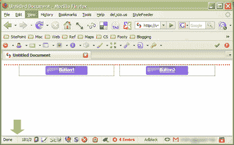

# Firefox Bug:状态栏滑稽

> 原文：<https://www.sitepoint.com/firefox-bug-status-bar-zaniness/>

因为这个问题花了我一点时间才弄明白，所以我认为值得在这里为未来的谷歌员工记录下来。显然这是一个已知的错误，但据我所知，在 web 开发人员中似乎没有普遍意识到这一点。

上周我在开发一些浮动按钮，需要它们在窗口变窄超过一定宽度时，从水平的平面布局变成垂直堆叠的布局。在发现他们一致更喜欢打开我的窗口而不是包裹后，我决定将他们分解成一个简化的测试用例。

什么都没变。虽然按钮仍然有足够的空间浮动，但在某一点上，一些无形的力量支撑着窗口打开——它就像一个长而不可见的像素填充 GIF(还记得它们吗？)被偷偷放进了版面。事实上，甚至当我将布局分解到寂寞 H1 时，我也看到了同样的行为。这些元素是从其他来源继承 CSS 宽度的吗？如果有，在哪里？我被难住了。

出于想法，我心不在焉地坐在那里缩放窗口，当我注意到不良行为似乎正好发生在我的状态栏图标耗尽空间的时候。我做了更多的测试，果然，从状态栏中移除一些图标改变了我的窗口中的页面呈现行为。

很明显，在浏览器 chrome 级别做出的决定不应该影响页面渲染。

现在有充分的理由相信这是火狐从第一天起就存在的问题。问题是在过去的 18 个月里扩展作者越来越倾向于使用状态栏。虽然我必须承认我是一个扩展迷，但是现在即使是一个基本的 web 开发工具包也经常包括:

*   HTML 验证程序
*   萤火虫
*   屏幕截图
*   给我选择器除尘
*   没有脚本

再加上 Adblock、style、Greasemonkey 和 Gmail Manager 等常见的浏览辅助工具，这将成为一个我们可能每天都会看到的问题。

希望这个 bug 能在 Mozilla 的列表中上升，但是在它被修复之前，我确实找到了一个解决方法。AutoHideStausbar 允许你在宽度敏感的布局上工作时将状态栏隐藏起来。

有点讽刺的是，它给你的状态栏增加了一个图标，但至少给了你切换状态栏问题的能力。

## 分享这篇文章