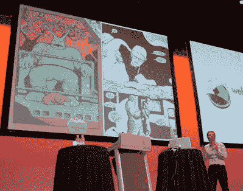

# 网络方向:漫画灵感和 CSS

> 原文：<https://www.sitepoint.com/wds07-think-like-a-mountain/>

 [【安迪·克拉克】](http://stuffandnonsense.co.uk/)今天早上以其真实的说大话风格迷住了观众，他在[网络指南南方](http://webdirections.org/)的主题演讲*像山一样思考*。

根据他童年的爱好之一，漫画书艺术，安迪指出了漫画书和网页设计之间的许多相似之处。

安迪在著名和不知名的漫画家(弗兰克·米勒、保罗·查德威克、戴夫·吉本)的作品和参考资料中强调了漫画中各幅画面之间的进展(有些遵循明显的顺序；其他的需要更多的演绎推理)。就像在电影中一样，这种技术通过不明确地展示每个细节来增加戏剧性。

此外，遵循既定的惯例来建立信任和熟悉，然后偶尔打破惯例，是为故事或用户浏览页面创造时间的有效方式。

安迪还提到了页面的[节奏，这是由其布局决定的。在网页上，类似的节奏可以通过使用边框、背景图片/颜色、对比度(字体粗细)来创造。考虑一下我们希望有人在展示内容时查看我们内容的时间是很有用的。](https://www.sitepoint.com/typography-baseline-rhythm-deciphered/)

虽然在我们的网站上散布夸张的音效标题可能不太合适，但我们仍然可以使用一些惯例来吸引读者的注意力——例如，通过使用对比度、图像、标题或轻微旋转用户通常希望完美对齐的容器。在漫画中，更大的面板意味着缓慢的故事讲述，而小而薄的面板可以创造更快、更疯狂的节奏。想想一个产品页面，很容易看出用户可能会花更多的时间在一张更大的图片上，而不是一堆更小的图片上。

安迪谈到了颜色这个话题，并指出在漫画和网络上，颜色并不总是能增加一些东西。《罪恶之城》大部分是单色的，但是色彩的点缀非常突出。

他通过将网络作为媒介的演变与漫画书的演变进行比较得出结论，漫画书最初对使用的原料有限制，因此可以应用的颜色也有限制。在网络上，我们现在已经从网络安全调色板和最小公分母进化而来，所以这应该给我们更多的自由来利用这种媒介并探索它的全部潜力。

演讲结束后，安迪还介绍了 [CSS Eleven](http://csseleven.com/) ，这是一群基于标准的设计师，他们的目标是帮助 W3C 的 CSS 工作组发展 CSS3 规范。很高兴看到团队中的三位 SitePoint 作者[卡梅隆·亚当斯](https://www.sitepoint.com/books/cssdesign1/about.php#cameron-adams)、[纪娜·波顿](https://www.sitepoint.com/books/cssdesign1/about.php#jina-bolton)和[乔纳森·史努克](https://www.sitepoint.com/books/cssdesign1/about.php#jonathan-snook)！

## 分享这篇文章