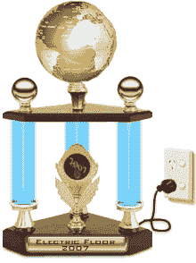

# 首届“电动地板”奖颁给了…

> 原文：<https://www.sitepoint.com/and-the-inaugural-electric-floor-award-goes-to/>

 **啧啧，楼层是不是很棒？它们平整、干净、光滑，完美地防止我们一头扎进它们下面的空隙——这在多层建筑中特别有用。**

有趣的是，尽管电的奇迹已经存在了 100 多年，但从来没有人试图通过完全依靠电力来改善简陋的地板。

断电时消失或倒塌的地板——即使只是偶尔——至少可以说是不方便的！虽然电经常被用来通过加热、冷却或更好地照明来提高我们地板的可用性，但是没有电，任何地板都不会停止其基本操作。

考虑到这一点，成功的大型跨国公司可以在一项技术上建立他们的网上总部的基础——在这里是 JavaScript——这对他们的用户来说可能是也可能不是。禁用 JavaScript 会完全禁用这些网站的基本操作，就像取消公司现实世界大厅的发言权一样。

所以，事不宜迟，我很高兴地宣布，首届电动落地奖将授予……**鼓声请**……(点击前禁用 JavaScript)……[**【Visa.com】**](http://www.visa.com/)！

当你在没有打开 JavaScript 的情况下到达 Visa 的全球网关时，迎接你的可能是你见过的最广泛使用的空白…

…仅此而已。

虽然简单和优雅值得称赞，但这可能有点过头了。

如果你设法通过了第一个重定向页面，你会被放在右边显示的登陆页面。

事情立刻显得更加令人鼓舞。这个页面在没有 JavaScript 的情况下看起来很好……也就是说，除非你想访问 Visa 的消费者和商业网站。如果你这样做，你将被要求从下拉列表中选择你的国家，如果你禁用了 JavaScript，这个下拉列表将是空的。

好吧，我不在乎这种情况，但这是个严肃的问题。我们不是在讨论需要脚本的复杂操作。这不是:

*   多站点混搭
*   高级功能，如 3D 动画、多媒体或交互式地图
*   用 sooper groovy Ajax 刷新部分页面

我们谈论的是无聊的基本操作，如页面渲染和导航——自蒂姆·伯纳斯·李 20 年前首次设想这些操作以来，这些操作一直完美无缺。在 Visa，他们完全失败了。

没有充分的理由不使用 JavaScript 来制作这样的基本页面，电气楼层奖旨在突出一些高调的违规者。如果谷歌可以让 GMail 在没有 JavaScript 的情况下工作，那就没有理由让无限简单的网站失败。

祝贺 Visa.com 获得第一名！

我已经盯上了另外六个有资格获得该奖项的网站，但是如果你知道其他值得提名的网站，我们也很想知道。

如果你在想，真的有多少疯子没有使用 JavaScript？“也许一个同样相关的问题是‘索尼爱立信的‘T3’有多少个‘T2’？".

## 分享这篇文章