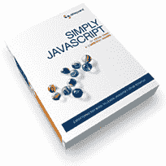
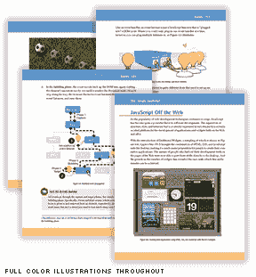

# 简单的 JavaScript

> 原文：<https://www.sitepoint.com/simply-javascript/>

**它活着！由 Cameron Adams 和我共同撰写的 SitePoint 的最新著作《简单 JavaScript T4》的第一批拷贝已经到来！如果你能原谅我明显的偏见，它看起来很棒。**

我为卡梅隆和我在这本书上取得的成就感到骄傲。我们从一开始就知道，除非我们能做出真正特别的东西，否则不值得再写一本初学者的 JavaScript 书，而我们确实做到了。

Simply JavaScript 以前所未有的清晰性教授这项技术，提供了大量彩色插图和在现实世界中如何正确使用 JavaScript 的建议。

这也是一本令人惊讶的有趣的读物，尽管我承认我们的幽默感有时有点奇怪。有一次，当校对员划掉了一个笑话，并在页边空白处注明“不好笑”时，我们不得不努力把它保留下来。尽管如此，我敢说这是 SitePoint 迄今为止出版的最有趣的书，这已经很说明问题了！

这本书的第一章，网络的三层，是目前关于 sitepoint.com 的专题文章。这本书的前*三*章都可以在[免费下载 PDF 格式的](https://www.sitepoint.com/books/javascript1/)。

快乐阅读！期待在 [SitePoint 的新书反馈论坛](https://www.sitepoint.com/forums/forumdisplay.php?f=255)听到大家的看法。

## 分享这篇文章