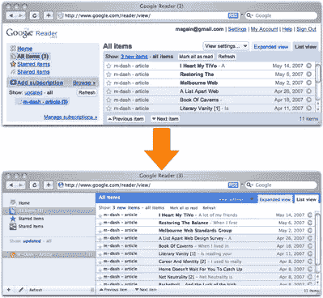
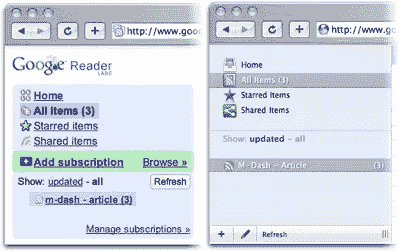

# 用户样式表成熟了

> 原文：<https://www.sitepoint.com/user-style-sheets-come-of-age/>

用户样式表——位于用户桌面机器上并覆盖网站原始样式的 CSS 文件——已经存在很长时间了。不过，就我个人而言，我从未真正看到这种好处。

当然，从可访问性的角度来看，我承认恢复链接下划线、增大字体大小或提高网站对比度的能力对于有视觉障碍的人(或对令人不快的颜色组合容忍度低的人)来说会很方便。但是从来没有任何真正的动机让我花时间去改变别人网站的设计，尤其是当:

1.  没有简单的方法来共享和推广特定站点的用户样式表
2.  添加一个样式表仍然需要相当多的麻烦——文件必须保存到特定的文件夹中，浏览器需要重新启动，样式才会生效
3.  Internet Explorer 仍然不支持每个站点的用户样式表，而且
4.  无论如何，基础(加价)可能会发生巨大的变化。

**给用户供电**

2007 年，时代似乎终于改变了。嗯，在 IE 中不是，它们不是——上面的第三点仍然有效(据我所知，没有任何附加组件来实现这一功能)。但是，如果你使用其他主流浏览器(Firefox、Opera、Safari ),最近有一些新的发展，使得用户样式表的安装和管理比以往任何时候都更容易:

*   userstyles.org: 虽然(有点讽刺意味)不是世界上最有用的网站，但 userstyles.org*做得好的是*为用户样式表提供了一个中央存储库，解决了上面的第一点。
*   用于 Mozilla 浏览器(Firefox、Flock 等)的[风格](https://addons.mozilla.org/en-US/firefox/addon/2108/)扩展允许用户点击一下就可以应用样式表，在大多数情况下，样式会立即应用*。如果火狐是你的主要浏览器，这是第二点的绝佳解决方案。*
**   **Safari stand:**[Safari stand](http://hetima.com/safari/stand-e.html)是 Safari 浏览器的一个附加组件，它增加了用户允许的定制数量——包括但不限于在每个网站的基础上指定用户样式表。虽然添加用户样式表的过程仍然需要将 CSS 文件保存到特定的目录，然后才能在 SafariStand 中加载它，但这比以前简单多了。为 Safari 用户勾掉第 2 点。*

 *当然(我在这里先说 brothercake 和 charmedlover)，像 [Opera](http://opera.com/) 这样的浏览器已经允许每个站点的用户样式表作为核心特性很多年了。

所以我们已经解决了上面的第 1 点和第 2 点。我说过我们被第三点困住了。但是第四点呢——如果网站开发者决定改变他们的页面结构，你必须重做所有的工作。让我们通过一个案例研究来看看这个问题。

**案例研究**

设计师[乔恩·希克斯](http://hicksdesign.co.uk)最近选择给流行的[谷歌阅读器](http://reader.google.com/)，一个阅读供稿的网络应用，一个[的视觉改造](http://www.hicksdesign.co.uk/journal/google-reader-theme-fixed-again)。考虑到以下情况，这是创作用户样式表的绝佳选择:

*   谷歌阅读器非常受欢迎，因此(希望)不太可能大幅改变其标记。
*   从本质上讲，站点的内容是以一致的方式交付的(比如说，与每个页面使用不同样式表的站点相比)。

希克斯的重新设计很微妙，反映出他希望将谷歌阅读器设计成“看起来更像一个 OS X 应用程序”，而不是完全抛弃原来的布局。正如你在下面的截图中所看到的，一些文本链接被优雅地设计成图标，结果是同一个 web 应用程序的一个更干净、更漂亮的版本。

虽然谷歌仍然有可能改变标记，使这个用户样式表变得无用，但至少有一名谷歌工程师知道，不这样做对谷歌最有利，这是基于他对希克斯宣布皮肤更新的回应。一个社区正在围绕 skinning Google Reader 和其他备受瞩目的网站建立，该社区的成员是该网站最忠实的用户。

过去有很多关于页面元素使用标准命名约定的讨论。这很可能推动了[微格式](http://microformats.org/)运动，但仅此而已——在未来的很长一段时间里，我们将被不一致的命名约定所困扰。

**你的标记是一个 API**

随着对 API 和混搭的大肆宣传，很容易忘记你的 HTML 也是一个 API，你的用户现在正在试验它。

随着用户样式表为你的网站提供定制的视觉表现，以及 [Greasemonkey](http://greasemonkey.mozdev.org/) 脚本允许定制的行为，现在比以往任何时候都更应该记住，将你的内容、表现和行为分开，可以让你的用户在你的应用上做更多你做梦也想不到的事情。* 

## *分享这篇文章*