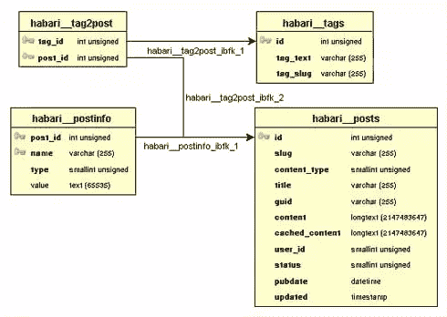
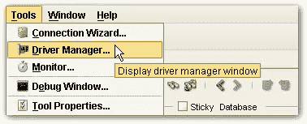
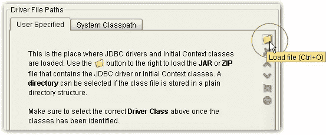
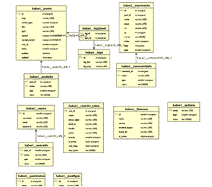

# 使用 DBVisualizer 实现简单的数据库模式图

> 原文：<https://www.sitepoint.com/easy-database-schema-diagrams-with-dbvisualizer/>

我从来没有特别喜欢过数据库。

不要误解我——我喜欢使用它们。你知道，用数据填充它们，看着我的用户用数据填充它们，删除我的用户的数据*……但只要这一切都是从服务器端编程语言的安全性出发——我从来不热衷于与他们直接互动*。所有这些 SQL 让我头疼。*

 *当然，我们已经从 SQL 命令行走了很长一段路。我们有基于网络的工具，比如 phpmyadmin 和 T2 phpPgAdmin。如果你不喜欢在 http 上做繁重的工作，有像 [MySQL 查询浏览器](http://www.mysql.com/products/tools/query-browser/)和 TOAD 这样的桌面工具。像 [Rails](http://rubyonrails.com/) 这样的框架现在已经有了[移植](http://api.rubyonrails.org/classes/ActiveRecord/Migration.html)，所以我们已经得到了我们需要的所有工具，对吗？

好吧，如果你的大脑和我的大脑一样工作，那么你会同意有时对事物有一个“大画面”的观点是很好的——你的数据图表对帮助理解它是如何组合在一起有很大帮助。如果您的应用程序只包含三个或四个表，那么您可能已经在一张纸上画出了其中的一个。但是我上面提到的工具都不能给我们提供我们的数据库实际上是什么样子的图片——哪些表有指向哪里的外键约束。一旦您的数据库模式超过了少数几个表，这可能会成为一个重大问题。如果你曾经不得不在短时间内理解*其他人的*模式，你会知道我在说什么——当然，你可以尝试在脑海中想象这个，或者在使用一系列查询后用笔和纸勾画出来。但现在没必要了。

DBVisualizer 是一个灵活的数据库客户端，可以创建数据库的模式图。它是用 Java 编写的，所以几乎可以在任何平台上运行，而且非常容易设置和使用。在这篇文章中，我将向您展示如何安装 DBVisualizer，并使用它来生成 MySQL 数据库的漂亮的模式图。



为了演示如何创建您的模式图，我将做一些假设:

*   您可以连接到 MySQL 数据库——无论是在本地还是在您的生产服务器上。
*   您在本地机器上安装了一个 Java 运行时虚拟机。如果您还没有安装，也没关系——您可以[下载并手动安装一个](http://java.sun.com/javase/downloads/index.jsp),或者选择一个包含它的 DBVisualizer 安装程序版本。
*   您的数据库中已经有一个要创建图表的模式。
*   您将 InnoDB 引擎用于您的表。如果使用 MyISAM，您仍然可以创建一个模式图，但是它不会反映任何外键约束，因为 MyISAM 会忽略这些约束。如果你不知道，你可能正在使用 MyISAM。

请遵循以下说明:

1.  #### [计] 下载

    DBVisualizer 有几个版本。DBVisualizer Free 执行所有的可视化功能，但包含有限的功能(例如一次只能执行一个 SQL 查询——如果你对其他东西上瘾，可能足以让你想升级到个人许可证)。撰写本文时的版本是 5.1.1。

2.  #### 安装

    安装 DBVisualizer 非常简单。无论您运行的是 Windows、Mac、Linux 还是通用的 Unix 平台，您都可以选择向导式的安装程序，或者只是将压缩的归档文件解压缩到您选择的文件夹中。就是这样！

3.  #### 安装ˌ使成形

    DBVisualizer 没有现成的 MySQL 驱动程序，但是添加一个很容易。下载 [MySQL JDBC 驱动](http://dev.mysql.com/get/Downloads/Connector-J/mysql-connector-java-3.0.17-ga.zip/from/pick)，并将档案文件解压缩到您选择的文件夹中(其中某处会有一个`jar`文件，这就是我们想要的)。

    然后启动 DBVisualizer，从**工具**菜单中选择**驱动管理器**。

    

    在左边选择 **MySQL** ，在**驱动文件路径**表单的**用户指定的**标签中，点击**浏览**图标，选择我们之前提取的`jar`文件。

    

4.  #### 连接

    要连接到您的数据库，选择**数据库** > **创建数据库连接**。您可以按照内置的连接向导建立连接，也可以手动输入。其实没什么大不了的。你只需要:

    1.  运行数据库的服务器名(通常是 T0)和端口号(对于 MySQL 通常是 3306)
    2.  您的数据库用户名和密码

    要手动输入这些信息，请将**数据库类型**设置为 **MySQL** ，从**驱动程序(JDBC)** 下拉列表中选择 *MySQL* ，并输入您的数据库 URL 和用户名/密码。该 URL 将采用以下格式:

    ```
    jdbc:mysql://<host>:<port3306>/<schema>
    ```

    我想我应该看看 Habari 开源项目使用的模式。因此，在本地安装之后，我使用了以下代码。如果您不想在默认情况下指定模式，可以省略该模式。

    ```
    jdbc:mysql://localhost:3306/habari
    ```

    点击**连接**，你的连接应该建立了！

5.  #### 设想

    现在您已经连接好了，双击您想要探索的模式，选择**表**，然后单击**引用**选项卡来查看您的模式图(带有漂亮的动画)。您可以控制图表中包含的内容，包括能够使用各种布局查看模式、放大和缩小，以及包含或排除诸如列细节和外键名之类的内容。
    

这就是全部了！无论您是试图为自己设计的应用程序充实模式，还是试图理解现有的应用程序以编写插件或修复错误，像 DBVisualizer 这样的应用程序肯定可以使您的数据库设计、开发和维护变得容易得多。

当然，我只是开玩笑说要删除我用户的数据。嗯，大部分是。* 

## *分享这篇文章*