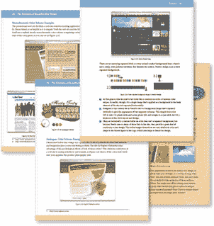

# SitePoint 书籍现为 PDF 格式！

> 原文：<https://www.sitepoint.com/sitepoint-books-now-in-pdf-format/>

这是市场部刚来的(也叫 Shayne，市场部的家伙):

> SitePoint 走向移动
> 不知道有多少人不知道 PDF 代表什么？便携文档格式，就是这样！嗯，我们收集了一整套，它们都在网上，可以打包出售，也可以单独出售。SitePoint 的朋友们，你们的愿望就是我们的命令:SitePoint 图书已经移动化。

没错——[除了流行的 dead tree 格式之外，整个 SitePoint 图书图书馆](https://www.sitepoint.com/books/) *现在还提供口袋大小、即时满足兼容的 PDF 格式。第一次，我们所有的黑白标题现在可以用全彩色截图观看！

现在，无论何时你从 SitePoint 直接购买书籍，你都可以选择

*   送上门的硬拷贝版本，
*   PDF 版本发送到您的收件箱(比封面价格低 10 美元！)，或者
*   两种格式(仅额外 10 美元！).

哦，如果你想升级到你已经拥有的一本书(或几本书)的 PDF 版本，只需[给我们的销售团队打个电话](https://www.sitepoint.com/books/contact.php)，他们会很乐意为你提供我们特殊的 10 美元升级价格。

CSS 选集”现在是个例外，因为我们正忙着清理积压的纸质版本。好消息是，我们目前对这个标题的[折扣价格使得它比 PDF 更便宜！还请注意，这只包括我们的书，不包括我们的工具包。](https://www.sitepoint.com/books/cssant1/)

## 分享这篇文章