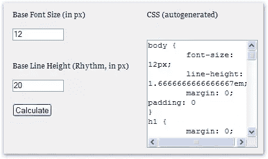

# 印刷术:破译基线节奏

> 原文：<https://www.sitepoint.com/typography-baseline-rhythm-deciphered/>

你的页面有节奏吗？

在之前的一篇文章中，我报道了 Richard Rutter 和 Mark Boulton 在 SXSW 上的[网页排版演示，在那里 Richard 解释了确保网页上的文本保持“垂直节奏”的重要性。](https://www.sitepoint.com/sxsw-interactive-2007-final-wrap-up/)

如果你还没有探索这个概念，请允许我解释一下:如果你要用等距离的水平线覆盖你的文本(就好像你的页面是一个高中的划线笔记本)，那么这些线应该完美地位于页面上的每一行文本之间，不管这些文本是标题、普通段落、侧边栏……等等。当这种情况发生时，你的页面被认为是有垂直节奏的——文本比没有对齐的文本更容易阅读，因为它感觉更有凝聚力，更少脱节。


这是一个简单的方法，可以让你的设计更加统一，而不用花太多心思。所涉及的数学并不难，但是考虑到 CSS 允许我们使用这么多不同的单元，这可能会变得令人困惑。以下是我使用的步骤:

1.  决定主体(段落)文本使用的基本字体大小。我发现在这一点上用像素思考是最容易的，但是稍后转换成 ems，这样 IE 6 用户仍然可以调整他们的文本大小。
2.  决定这个文本应该具有的前导符(`line-height`，用 CSS 的说法)。一个好的选择通常是 **1.5 ×基本字体大小**，但是建议你手动调整直到你觉得合适为止。
3.  将`line-height`应用到页面上的其他文本，以便保持与段落文本相同的节奏。用于`line-height`的值取决于文本的`font-size`，但是可以使用简单的公式**行高(ems) =基线行高/字体大小**来计算。
4.  调整标题、段落和其他元素的边距，以保持页面的垂直节奏。通常这很简单，只需应用一个等于您为该元素设置的`line-height`的较低边距，但这取决于您是否设置了其他边距或填充。好家伙，一个 Firefox 扩展来覆盖页面上等距的水平线肯定会在这一步派上用场…

无论您使用像素、ems 还是任何其他有效单位，该公式都有效。但是很明显，您必须对右边的两个值使用相同的单位。

例如，如果我们选择 12 像素的基本字体大小，我们可以使用下面的样式规则来设置我们的基本字体`font-size`:

```
body {
  font-size: 12px;
  line-height: 1.5em; /* equal to 18px */
  margin: 0; 
  padding: 0;
}
```

这样一来，我们就可以将所有需要调整大小的元素设置为基本字体大小:

```
p, ul, blockquote, pre, td, th, label {
  margin: 0;
  font-size: 1em;
  line-height: 1.5em;
  margin-bottom: 1.5em;
}
```

到目前为止，一切顺利。

假设我们希望一级标题的大小是基本字体大小的 1.67 倍，即 12 × 1.67 = 20 像素。为了确保我们的页面保持垂直节奏，标题的`line-height`需要等于 18 ÷ 20(或 1.5 ÷ 1.67) = 0.9em。

```
h1 {
  margin: 0;
  font-size: 1.67em;  /* equal to 20px */
  line-height: 0.9em; /* equal to ~11px */
  margin-bottom: 0.9em;
}
```

查看理查德和马克的演示文稿中的[幻灯片和音频以了解更多细节，以及](http://webtypography.net/sxsw2007/)[理查德关于垂直节奏的原始文章](http://24ways.org/2006/compose-to-a-vertical-rhythm)以了解一种允许用户使用 IE 6 浏览时仍然调整其文本大小的技术。

虽然数学很简单，但调整可能会不方便。如果您突然决定将基本字体大小从 12px 增加到 13px，那么您必须重新计算这些值，将它们插入到样式表中，然后检查一切是否符合预期。不是一般注意力持续时间短的设计师习惯的即时反馈…

嗯， [Geoffrey Grosenbach](http://nubyonrails.com/) 用他的[基线节奏计算器](http://topfunky.com/baseline-rhythm-calculator/)让计算步骤变得简单多了。只需输入您的基本字体大小和所需的行距，计算器将生成保持页面垂直节奏所需的 CSS！

[](http://topfunky.com/baseline-rhythm-calculator/)

当然，您可能想要手动调整生成的值(例如，毫无疑问，一些读者会对包含 16 个小数位的`font-size`或`line-height`的概念提出异议)，但这无疑是添加到设计者的武器库中的另一个有用的工具。

干得好，杰弗里！

## 分享这篇文章