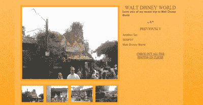
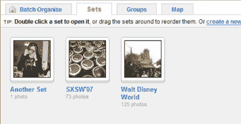
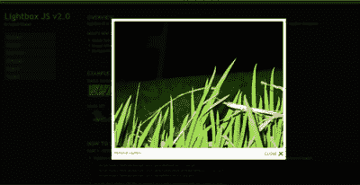

# 使用 CakePHP 和 Flickr 建立一个图片库

> 原文：<https://www.sitepoint.com/photo-gallery-cakephp-flickr/>

想要与全世界分享您的 Flickr photostream，但只有在您对它进行了漂亮的定制处理之后？只要看看 CakePHP——和几行代码——就能变魔术了！在本文中，我们将使用 Flickr API 和 CakePHP 来获取我们加载到 Flickr 上的图像，并使用它们来构建我们自己的非 Flickr 网络画廊。

在烘焙这个美味之前(不，不是 del . icio . us——那完全是另一篇文章！)代码，您需要掌握一些要素:

*   [CakePHP](http://cakephp.org/) ，快速应用开发的 PHP 框架。撰写本文时的当前版本是 1.1.13。
*   [phpFlickr](http://phpflickr.com/) ，一个帮助与 [Flickr API](http://www.flickr.com/services/api/) 交互的 PHP 类。
*   [Flickr 组件](http://rossoft.wordpress.com/2006/06/04/flickr-component/)，Miguel Ros (rossoft)开发的 CakePHP 组件，它将 phpFlickr 类绑定到我们应用程序的控制器和视图中。

如果你不熟悉 CakePHP，可以看看 SitePoint 的文章，[CakePHP 框架:你的第一口](https://www.sitepoint.com/article/application-development-cakephp)。在深入这个例子之前，您需要对框架的工作原理有一个很好的理解。



##### 设置文件

安装 CakePHP 后，你需要在`/app/vendors/phpflickr/`创建一个`phpflickr`文件夹，然后把`phpFlickr`放进去。接下来，将 Flickr 组件放到`/app/controllers/components/`文件夹中。在`flickr.php`组件文件中，您需要在`$_api_key`变量中指定您的 API 键，如下所示:

```
var $_api_key='PLACEKEYHERE';
```

如果你还没有 API 密匙，你需要[申请一个](http://www.flickr.com/services/api/keys/apply/)。

phpFlickr 可以缓存从 Flickr API 接收的数据，以加快后续调用的速度。如果您使用的是文件缓存，您需要确保 Flickr 缓存文件夹已经创建并且具有写权限。要设置或更改缓存文件夹，请更改 Flickr 组件文件顶部声明的常量，如下所示:

```
define('FLICKR_CACHE_DIR', CACHE . 'flickr/');
```

现在，您需要设置控制器来处理画廊。我感觉很疯狂，所以我要调用控制器`GalleryController`，并将其保存到`/app/controllers/gallery_controller.php`:

```
class GalleryController extends AppController{ 

  var $name = 'Gallery'; 

  var $components = array('Flickr'); 

  var $uses = null; 

}
```

如果您使用 PHP4，那么`$name`属性是必需的，但是如果您使用 PHP5，那么可以省略它。组件数组将自动加载我们的 Flickr 组件。最后，我们将`$uses`设置为`null`，以防止控制器自动加载模型。

##### 按指定路线发送

下一件事，我们需要做的是修改我们的路线，以处理画廊调用。将以下内容添加到您的`/app/config/routes.php`文件中:

```
$Route->connect('/gallery/*',  

    array('controller' => 'gallery', 'action'=>'index'));
```

这将路由所有以`/gallery/`开头的 URL 来运行我们的图库控制器的`index`方法。

##### 画廊控制器

振作起来！这并没有什么神奇之处，但是我会一行一行地解释发生了什么。将以下块添加到`gallery_controller.php`文件中:

```
function index($id = null) 

{ 

  $photosets = $this->flickr->photosets_getList('USER_ID'); 

  $this->set('sets', $photosets); 

  $currset = $id == null ? $photosets['photoset'][0]['id'] : $id; 

  $this->set('currset', $this->flickr->photosets_getInfo($currset)); 

  $this->set('thumbs', $this->flickr->photosets_getPhotos($currset)); 

}
```

我们在这里看到的第一件事是`index`函数期待一个`$id`。这是一个图片集 ID，我们可以传入它来提取特定的图片集。



下一行使用 Flickr API 来[检索特定用户的所有照片集](http://www.flickr.com/services/api/flickr.photosets.getList.html)。与 API 的其他方面不同，对于此任务，身份验证不是必需的。您需要知道您的用户 ID，也称为 NSID。如果您不确定它是什么，请尝试使用带有 [`flickr.people.findByEmail`](http://www.flickr.com/services/api/flickr.people.findByEmail.html) 或 [`.findByUsername`](http://www.flickr.com/services/api/flickr.people.findByUsername.html) 调用的 [API explorer](http://www.flickr.com/services/api/explore/) :

```
$photosets = $this->flickr->photosets_getList('USER_ID');
```

记得用您的用户 ID 替换`USER_ID`，这是您从 Flickr 站点检索到的。

接下来，我们将`photosets`数据分配给视图中使用的`sets`变量:

```
$this->set('sets', $photosets);
```

接下来，我们确定哪个是当前的照片集 ID。如果 ID 为空，我们获取列表中第一个照片集的 ID。否则，我们使用传入的 ID:

```
$currset = $id == null ? $photosets['photoset'][0]['id'] : $id;
```

之后，我们获取当前照片集的标题和描述，并将其分配给一个在视图中使用的`currset`变量:

```
$this->set('currset', $this->flickr->photosets_getInfo($currset));
```

最后，我们获取所有照片的列表，并将其分配给在视图中使用的`thumbs`变量:

```
$this->set('thumbs', $this->flickr->photosets_getPhotos($currset));
```

就这样，我们差不多完成了。我们要做的最后一件事是弄清楚如何布置这个画廊。

***查看***

如果还没有的话，您需要在`/app/views/`中创建一个名为`gallery`的新文件夹。在那个文件夹中，你需要创建一个`index.thtml`文件。

我决定把我的画廊分成三个主要部分:

*   当前照片集的标题和描述(很像一篇博客文章)
*   所有可用照片集的链接列表
*   缩略图，其中一个将以更大的尺寸显示

***标题和描述***

为了显示当前照片集的标题和描述，我们点击在图库控制器中声明的`$currset`变量:

```
<div class="post"> 

  <h2><?php echo $currset['title']?></h2> 

  <p><?php echo $currset['description']?></p> 

</div>
```

***照片集***

为了显示图片集的链接列表，我们在`$sets`变量中遍历每个图片集，使用链接文本的标题，并使用图片集 ID 作为参数创建一个到画廊控制器的链接:

```
<ul> 

  <?php foreach($sets['photoset'] AS $item): ?> 

  <li><?php echo $html->link($item['title'], '/gallery/' . $item['id']);?></li>  

  <?php endforeach; ?> 

</ul>
```

点击任何一个链接都会加载那个特定的图片集。

如果你想改变照片在列表中的显示顺序，你需要进入 Flickr 并使用整理功能。

***照片***

我想在进入缩略图之前输出一个相当大的图像。我是这样做的:

`buildPhotoURL($thumbs['photo'][0], 'medium')?>" title="<?php echo
$thumbs['photo'][0]['title']?>"  alt="<?php echo  
$thumbs['photo'][0]['title']?>" />`

这段代码从我们在控制器中设置的`$thumbs`数组中获取第一个缩略图，并使用 phpFlickr 库方法`buildPhotoURL`来构建图像标签的源 URL。在这种情况下，我抓取的是一张中等大小的照片，其最长边为 500 像素，但您可以选择以下图像版本之一:

*   `square`，尺寸为 75x75px
*   `thumbnail`，最长边 100 像素
*   `small`，最长边为 240px
*   `medium`，其最长边为 500 像素
*   `large`，最长边的 1024px
*   `original`，即原始图像文件

最后但同样重要的是，我遍历了`$thumbs`数组中的每张照片来构建缩略图显示。我从图像源 URL 的`buildPhotoURL`方法请求缩略图大小的版本，并将每个缩略图链接到它在 Flickr 服务器上的`medium`版本:

```
<ul id="thumbs"> 

  <?php foreach($thumbs['photo'] as $item): ?> 

  <li><a href="<?php echo $flickr->buildPhotoURL($item, "medium")?>" title="<?php echo $item['title']?>">buildPhotoURL($item, "thumbnail")?>"  

        alt="<?php echo $item['title']?>" /></a></li> 

  <? endforeach; ?> 

</ul>
```

##### 一小段 JavaScript 代码

为了让这个图片库更有趣一点，让我们添加一点 JavaScript:

```
<script type="text/javascript"> 

if (document.getElementById) 

{ 

  window.onload = function() 

  { 

    var imgs = document.getElementById('thumbs').getElementsByTagName('a'); 

    for (var i = 0; i < imgs.length; i++) 

    { 

      imgs[i].onclick = function() 

      { 

        document.getElementById('mainimg').src = this.href; 

        return false; 

      } 

    } 

  } 

} 

</script>
```

这段代码抓取缩略图上的链接，并为每个链接附加`onclick`处理程序。当用户点击一个缩略图时，新的图片将会出现在我的图库页面上的大图片的位置，而不是将用户发送到 Flickr 站点。

考虑使用 JavaScript 的后果很重要。查看 SitePoint 文章[从头开始编写高质量的 JavaScript】以了解更多信息。](https://www.sitepoint.com/article/javascript-from-scratch)

***灯箱***



或者，您可能希望不仅仅添加一小段 JavaScript。如果你是 Lightbox 的粉丝，Lightbox 是一个在页面上性感地覆盖图像的脚本，只需修改每个缩略图链接的输出，并将 Lightbox 脚本包含在布局文件中。下面是缩略图输出的更新代码:

```
<li><a href="<?php echo $flickr->buildPhotoURL($item, 'medium')?>"  

title="<?php echo $item['title']?>" rel="lightbox[]" >buildPhotoURL($item, 'thumbnail')?>" alt="<?php echo $item['title']?>" 

/></a></li>
```

当查看大图时，Lightbox 使用链接的`title`属性来显示描述。需要使用`rel`属性来告诉 Lightbox 将该图像包含在集合中。

就这样——您现在拥有了一个支持 Lightbox 的照片库！

##### 非常有趣

正如我在这里展示的，使用 CakePHP 和 Flickr 可以很容易地建立自己的照片库。玩转 API，尝试一些很酷的方式来处理输出的数据，或者添加新的令人兴奋的 JavaScript 效果——例如一个[转盘](http://billwscott.com/carousel/)。Flickr API 提供了足够的灵活性。

## 分享这篇文章